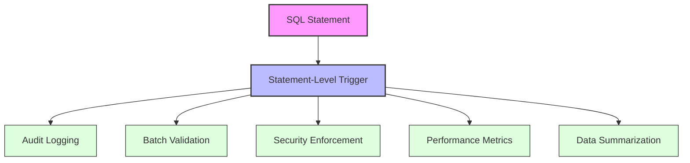
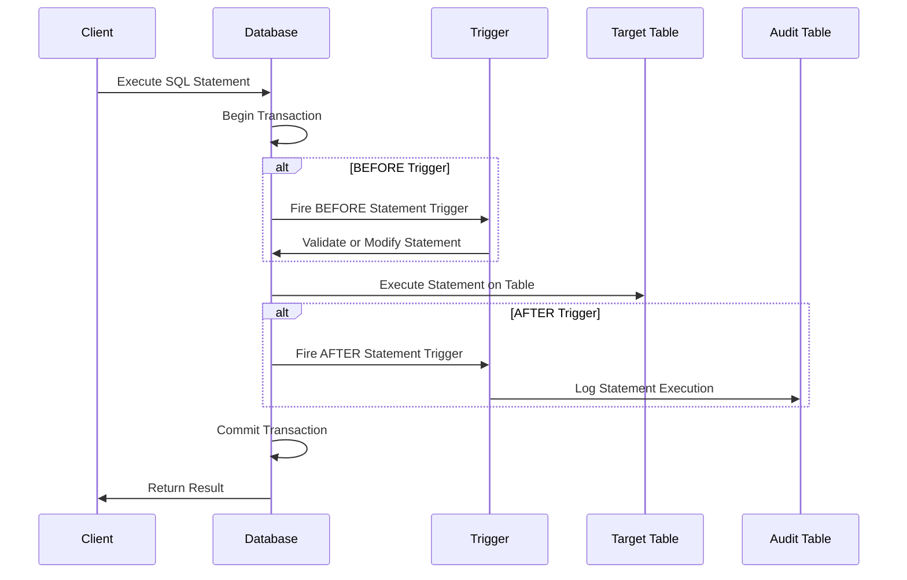

# SQL Statement Level Triggers

## Introduction

SQL triggers are special stored procedures that automatically execute in response to certain events on a particular table or view in a database. They are essential tools for implementing business rules, validating input data, and maintaining data integrity.

In this tutorial, we'll focus specifically on **statement-level triggers** - a particular type of trigger that fires once per triggering SQL statement, regardless of how many rows are affected by that statement. This is in contrast to row-level triggers, which fire once for each row affected by the triggering statement.

## Understanding Statement-Level Triggers

### What Are Statement-Level Triggers?

A statement-level trigger (also known as a "for each statement" trigger) executes **once** when a specified SQL statement (such as INSERT, UPDATE, or DELETE) is executed on a table, regardless of how many rows are affected.

For example, if you run an UPDATE statement that modifies 100 rows:
- A statement-level trigger will fire just once
- A row-level trigger would fire 100 times (once for each affected row)

### When to Use Statement-Level Triggers

Statement-level triggers are particularly useful for:

1. Logging database activities
2. Auditing changes to tables
3. Performing calculations or actions that should happen only once per transaction
4. Enforcing security policies
5. Validating the overall impact of a statement before allowing it to complete

## Syntax for Creating Statement-Level Triggers

The general syntax for creating a statement-level trigger varies slightly between database systems, but here's the standard SQL syntax:

```sql
CREATE TRIGGER trigger_name
{BEFORE | AFTER} {INSERT | UPDATE | DELETE} ON table_name
FOR EACH STATEMENT
[WHEN (condition)]
BEGIN
    -- Trigger logic here
END;
```

Key components:
- `trigger_name`: A unique name for the trigger
- `{BEFORE | AFTER}`: Specifies whether the trigger should fire before or after the event
- `{INSERT | UPDATE | DELETE}`: The event that activates the trigger
- `table_name`: The table the trigger is associated with
- `FOR EACH STATEMENT`: This is what makes it a statement-level trigger
- `WHEN (condition)`: Optional condition that must be true for the trigger to execute
- Trigger logic: The SQL statements that will execute when the trigger fires

## Examples of Statement-Level Triggers

Let's look at some practical examples to understand how statement-level triggers work.

### Example 1: Logging Database Activities

This trigger logs each time a bulk insert operation is performed on the `employees` table:

```sql
CREATE TRIGGER log_employee_bulk_insert
AFTER INSERT ON employees
FOR EACH STATEMENT
BEGIN
    INSERT INTO audit_log (event_date, event_type, user_id, description)
    VALUES (
        CURRENT_TIMESTAMP,
        'BULK_INSERT',
        CURRENT_USER,
        'Bulk insert performed on employees table'
    );
END;
```

### Example 2: Validating Batch Updates

This trigger prevents updates to the `products` table if they would result in negative inventory:

```sql
CREATE TRIGGER check_inventory_batch
BEFORE UPDATE ON products
FOR EACH STATEMENT
WHEN (EXISTS (
    SELECT 1 FROM products p 
    JOIN new_table n ON p.product_id = n.product_id
    WHERE n.quantity < 0
))
BEGIN
    SIGNAL SQLSTATE '45000'
    SET MESSAGE_TEXT = 'Update rejected: Cannot have negative inventory';
END;
```

### Example 3: Auditing Table Changes

This trigger records summary information about DELETE operations:

```sql
CREATE TRIGGER audit_customer_delete
AFTER DELETE ON customers
FOR EACH STATEMENT
BEGIN
    DECLARE row_count INTEGER;
    SET row_count = ROW_COUNT();
    
    INSERT INTO deletion_log (deletion_date, table_name, deleted_rows, deleted_by)
    VALUES (
        CURRENT_TIMESTAMP,
        'customers',
        row_count,
        CURRENT_USER
    );
END;
```

## Statement-Level vs. Row-Level Triggers

To better understand statement-level triggers, let's compare them with row-level triggers:

| Feature | Statement-Level Triggers | Row-Level Triggers |
|---------|--------------------------|-------------------|
| Execution frequency | Once per SQL statement | Once per affected row |
| Performance impact | Lower overhead for multi-row operations | Higher overhead for multi-row operations |
| Access to modified data | Summarized view of changes | Detailed access to each row's before/after values |
| Use cases | Logging, auditing, global validations | Data validation, cascading changes, maintaining calculated fields |
| Syntax | `FOR EACH STATEMENT` | `FOR EACH ROW` |

## When to Choose Statement-Level Triggers

Statement-level triggers are the better choice when:

1. You need to perform an action exactly once, regardless of how many rows are affected
2. You want to optimize performance for operations affecting many rows
3. You're interested in the overall effect of a statement rather than individual row changes
4. You need to log or audit database activities at a transaction level
5. You want to validate or enforce rules based on the aggregate effect of a statement

## Real-World Applications

### Application 1: Financial System Audit Trail

In a banking system, you might use a statement-level trigger to log all batch transactions:

```sql
CREATE TRIGGER batch_transaction_audit
AFTER INSERT ON transactions
FOR EACH STATEMENT
BEGIN
    -- Get the current transaction ID
    DECLARE tx_id VARCHAR(36);
    SET tx_id = UUID();
    
    -- Log the batch operation
    INSERT INTO batch_audit_log (
        batch_id, 
        transaction_date, 
        user_id, 
        operation_type, 
        affected_rows
    )
    VALUES (
        tx_id,
        CURRENT_TIMESTAMP,
        CURRENT_USER,
        'BATCH_INSERT',
        ROW_COUNT()
    );
END;
```

### Application 2: Inventory Management System

A statement-level trigger could enforce business rules about total inventory changes:

```sql
CREATE TRIGGER validate_inventory_adjustment
BEFORE UPDATE ON inventory
FOR EACH STATEMENT
BEGIN
    -- Check if total inventory adjustment exceeds daily limit
    DECLARE total_adjustment DECIMAL(10,2);
    
    SELECT SUM(new.quantity - old.quantity) INTO total_adjustment
    FROM new_table new
    JOIN old_table old ON new.product_id = old.product_id;
    
    IF ABS(total_adjustment) > 10000 THEN
        SIGNAL SQLSTATE '45000'
        SET MESSAGE_TEXT = 'Total inventory adjustment exceeds daily limit';
    END IF;
END;
```

## Implementation Considerations

When implementing statement-level triggers, keep these considerations in mind:

1. **Performance**: While statement-level triggers have less overhead than row-level triggers for multi-row operations, complex logic within the trigger can still impact performance.

2. **Transaction Management**: Triggers operate within the same transaction as the triggering statement. If a trigger encounters an error, it can cause the entire transaction to roll back.

3. **Database Compatibility**: The exact syntax and capabilities of statement-level triggers vary between database systems (Oracle, MySQL, SQL Server, PostgreSQL, etc.).

4. **Nesting and Recursion**: Be careful with triggers that could potentially trigger other triggers, as this can lead to complex execution paths or infinite recursion.

5. **Debugging**: Triggers execute "behind the scenes," which can make debugging more challenging. Include error handling and logging in your triggers.

## Database-Specific Implementations

Different database systems have variations in their statement-level trigger syntax:

### Oracle

```sql
CREATE OR REPLACE TRIGGER statement_level_example
AFTER INSERT ON employees
BEGIN
    -- Oracle doesn't require FOR EACH STATEMENT (it's the default)
    INSERT INTO audit_log VALUES (SYSDATE, 'INSERT', USER, 'Bulk insert on employees');
END;
/
```

### SQL Server

```sql
CREATE TRIGGER statement_level_example
ON employees
AFTER INSERT
AS
BEGIN
    -- SQL Server doesn't have explicit statement-level syntax
    -- but triggers are statement-level by default
    INSERT INTO audit_log VALUES (GETDATE(), 'INSERT', CURRENT_USER, 'Bulk insert on employees');
END;
```

### PostgreSQL

```sql
CREATE FUNCTION log_employee_changes()
RETURNS TRIGGER AS $$
BEGIN
    INSERT INTO audit_log VALUES (NOW(), TG_OP, CURRENT_USER, 'Operation on employees');
    RETURN NULL;
END;
$$ LANGUAGE plpgsql;

CREATE TRIGGER statement_level_example
AFTER INSERT ON employees
FOR EACH STATEMENT
EXECUTE FUNCTION log_employee_changes();
```

### MySQL

```sql
DELIMITER //
CREATE TRIGGER statement_level_example
AFTER INSERT ON employees
FOR EACH STATEMENT
BEGIN
    INSERT INTO audit_log VALUES (NOW(), 'INSERT', CURRENT_USER(), 'Bulk insert on employees');
END;
//
DELIMITER ;
```

## Common Use Cases Diagram

Here's a visual representation of common statement-level trigger use cases:



## Trigger Execution Flow

This diagram shows the execution flow of statement-level triggers:



## Best Practices

1. **Use Meaningful Names**: Name your triggers clearly to indicate their purpose, the table they're associated with, and whether they're statement-level.

2. **Keep Triggers Simple**: Complex logic in triggers can be difficult to debug and may impact performance. Consider moving complex logic to stored procedures.

3. **Document Your Triggers**: Add comments explaining the purpose and behavior of each trigger, especially for complex business rules.

4. **Error Handling**: Include proper error handling in your triggers to prevent unexpected failures.

5. **Test Thoroughly**: Test your triggers with various scenarios, including edge cases and large data sets.

6. **Monitor Performance**: Regularly check the performance impact of your triggers, especially in production environments.

7. **Consider Alternatives**: In some cases, constraints, stored procedures, or application logic might be more appropriate than triggers.

## Summary

Statement-level triggers are powerful database objects that execute once per SQL statement, regardless of how many rows are affected. They're ideal for auditing, logging, and validation tasks where you need a "big picture" view of database operations.

Key points to remember:
- Statement-level triggers fire once per SQL statement
- They're created using the `FOR EACH STATEMENT` syntax (or equivalent in your DBMS)
- They're useful for auditing, logging, and validating the overall effect of a statement
- Different database systems have variations in syntax and capabilities
- They typically have better performance than row-level triggers for operations affecting many rows

By understanding when and how to use statement-level triggers, you can implement efficient database solutions that maintain data integrity and provide valuable insights into database operations.

## Additional Resources

- [Oracle Documentation on Triggers](https://docs.oracle.com/en/database/oracle/oracle-database/19/lnpls/plsql-triggers.html)
- [PostgreSQL Trigger Documentation](https://www.postgresql.org/docs/current/trigger-definition.html)
- [MySQL Trigger Syntax](https://dev.mysql.com/doc/refman/8.0/en/trigger-syntax.html)
- [SQL Server Triggers](https://docs.microsoft.com/en-us/sql/t-sql/statements/create-trigger-transact-sql)

## Exercises

1. Create a statement-level trigger that logs all DELETE operations on a table, recording the number of rows affected and the user who performed the deletion.

2. Implement a statement-level trigger that prevents updates to a `products` table outside of business hours (9 AM to 5 PM).

3. Design a statement-level trigger that enforces a business rule that no more than 1000 rows can be inserted into a table in a single statement.

4. Create a statement-level trigger that automatically updates a `last_modified` timestamp in a metadata table whenever data in another table is changed.

5. Implement a statement-level trigger that sends an alert (by inserting into an `alerts` table) whenever a large batch deletion (more than 100 rows) occurs.