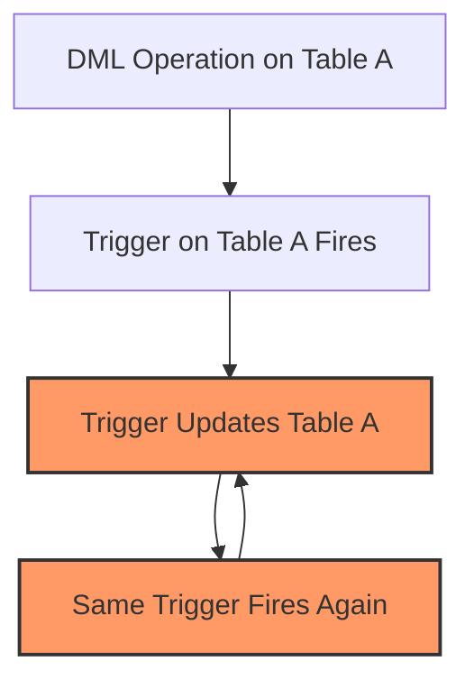

# SQL Trigger Recursion

## Introduction

In the world of SQL databases, triggers are powerful mechanisms that automatically execute code in response to specific events on a table or view. However, this power comes with potential complications, one of which is **trigger recursion**.

Trigger recursion occurs when a trigger activates itself either directly or through a chain of other triggers. While recursion can sometimes be useful, uncontrolled recursion can lead to infinite loops that consume system resources and even crash your database server.

In this tutorial, we'll explore what trigger recursion is, how it happens, how to control it, and best practices for working with recursive triggers.

## What is Trigger Recursion?

Trigger recursion happens when:

1. A trigger on Table A executes
2. The code within that trigger makes changes to Table A (direct recursion)
3. This activates the same trigger again, creating a potentially infinite loop

Or alternatively:

1. A trigger on Table A executes
2. It makes changes to Table B
3. A trigger on Table B makes changes to Table A
4. This activates the original trigger again (indirect recursion)

Let's visualize this with a diagram:



## Direct Recursion Example

Let's look at a practical example of direct recursion:

```sql
CREATE TABLE employees (
    employee_id INT PRIMARY KEY,
    name VARCHAR(100),
    salary DECIMAL(10, 2),
    last_modified TIMESTAMP
);

CREATE TRIGGER update_last_modified
AFTER UPDATE ON employees
FOR EACH ROW
BEGIN
    -- This will cause recursion!
    UPDATE employees 
    SET last_modified = CURRENT_TIMESTAMP
    WHERE employee_id = NEW.employee_id;
END;
```

If we try to update an employee record:

```sql
UPDATE employees SET salary = 60000 WHERE employee_id = 1;
```

Here's what happens:
1. The UPDATE statement changes the salary
2. The `update_last_modified` trigger fires
3. The trigger performs another UPDATE on the same row
4. This fires the trigger again
5. ... and the cycle continues until the database engine intervenes or crashes

## Indirect Recursion Example

Indirect recursion involves multiple tables and triggers:

```sql
CREATE TABLE orders (
    order_id INT PRIMARY KEY,
    customer_id INT,
    total_amount DECIMAL(10, 2),
    order_count INT DEFAULT 1
);

CREATE TABLE customers (
    customer_id INT PRIMARY KEY,
    name VARCHAR(100),
    total_orders INT DEFAULT 0,
    total_spent DECIMAL(10, 2) DEFAULT 0
);

-- Trigger on orders that updates customers
CREATE TRIGGER update_customer_stats
AFTER INSERT ON orders
FOR EACH ROW
BEGIN
    UPDATE customers
    SET total_orders = total_orders + 1,
        total_spent = total_spent + NEW.total_amount
    WHERE customer_id = NEW.customer_id;
END;

-- Trigger on customers that updates orders
CREATE TRIGGER update_order_count
AFTER UPDATE ON customers
FOR EACH ROW
BEGIN
    -- This creates indirect recursion!
    UPDATE orders
    SET order_count = NEW.total_orders
    WHERE customer_id = NEW.customer_id;
END;
```

When a new order is inserted, it creates a loop:
1. Insert into `orders` triggers `update_customer_stats`
2. `update_customer_stats` updates `customers`
3. Update to `customers` triggers `update_order_count`
4. `update_order_count` updates `orders`
5. Update to `orders` triggers `update_customer_stats` again
6. ... and the cycle continues

## Preventing Infinite Trigger Recursion

Different database systems handle trigger recursion differently:

### 1. Using Recursion Controls (PostgreSQL)

PostgreSQL allows setting the `session_replication_role` parameter:

```sql
-- Disable triggers temporarily
SET session_replication_role = 'replica';

-- Perform your update
UPDATE employees SET salary = 60000 WHERE employee_id = 1;

-- Re-enable triggers
SET session_replication_role = 'origin';
```

### 2. SQL Server's RECURSIVE_TRIGGERS Option

SQL Server provides specific control over recursive triggers:

```sql
-- Disable direct recursion at the database level
ALTER DATABASE YourDatabaseName
SET RECURSIVE_TRIGGERS OFF;

-- Or control it at the trigger level using IF statements
CREATE TRIGGER update_last_modified
ON employees
AFTER UPDATE
AS
BEGIN
    -- Check if this is a recursive call
    IF UPDATE(last_modified)
        RETURN;
    
    UPDATE employees 
    SET last_modified = CURRENT_TIMESTAMP
    WHERE employee_id IN (SELECT employee_id FROM inserted);
END;
```

### 3. MySQL's Control with Flags

In MySQL, you can use user-defined variables to prevent recursion:

```sql
CREATE TRIGGER update_last_modified
AFTER UPDATE ON employees
FOR EACH ROW
BEGIN
    -- Check if we're already in this trigger
    IF @trigger_active IS NULL THEN
        SET @trigger_active = 1;
        
        UPDATE employees 
        SET last_modified = CURRENT_TIMESTAMP
        WHERE employee_id = NEW.employee_id;
        
        SET @trigger_active = NULL;
    END IF;
END;
```

### 4. Oracle's Approach

Oracle allows similar control using package variables:

```sql
-- Create a package to track trigger state
CREATE OR REPLACE PACKAGE trigger_control AS
    trigger_active BOOLEAN := FALSE;
END;
/

-- Use the package in your trigger
CREATE OR REPLACE TRIGGER update_last_modified
AFTER UPDATE ON employees
FOR EACH ROW
BEGIN
    IF NOT trigger_control.trigger_active THEN
        trigger_control.trigger_active := TRUE;
        
        UPDATE employees 
        SET last_modified = SYSDATE
        WHERE employee_id = :NEW.employee_id;
        
        trigger_control.trigger_active := FALSE;
    END IF;
END;
/
```

## Practical Applications of Controlled Recursion

When properly managed, recursive triggers can be useful in specific scenarios:

### Audit Trail Implementation

```sql
CREATE TABLE transactions (
    transaction_id INT PRIMARY KEY,
    account_id INT,
    amount DECIMAL(10, 2),
    transaction_date TIMESTAMP,
    is_reconciled CHAR(1) DEFAULT 'N'
);

CREATE TABLE transaction_audit (
    audit_id INT PRIMARY KEY AUTO_INCREMENT,
    transaction_id INT,
    old_status CHAR(1),
    new_status CHAR(1),
    audit_date TIMESTAMP,
    audit_user VARCHAR(50)
);

-- A controlled recursive trigger for auditing
DELIMITER //
CREATE TRIGGER audit_transaction_changes
AFTER UPDATE ON transactions
FOR EACH ROW
BEGIN
    -- Store audit information
    IF OLD.is_reconciled <> NEW.is_reconciled THEN
        -- Set a session variable to prevent infinite recursion
        IF @audit_active IS NULL THEN
            SET @audit_active = 1;
            
            INSERT INTO transaction_audit 
            (transaction_id, old_status, new_status, audit_date, audit_user)
            VALUES 
            (NEW.transaction_id, OLD.is_reconciled, NEW.is_reconciled, 
             CURRENT_TIMESTAMP, CURRENT_USER());
            
            -- Add a timestamp to the original record in a controlled way
            UPDATE transactions 
            SET transaction_date = CURRENT_TIMESTAMP
            WHERE transaction_id = NEW.transaction_id;
            
            SET @audit_active = NULL;
        END IF;
    END IF;
END;
//
DELIMITER ;
```

## Best Practices for Working with Trigger Recursion

1. **Avoid Recursion When Possible**: Design your database to minimize the need for recursive triggers.

2. **Always Implement Controls**: If you need recursion, always include control mechanisms to prevent infinite loops.

3. **Use Conditional Logic**: Place conditions in your triggers to check if the relevant columns have actually changed.

4. **Consider Transaction Boundaries**: In some cases, it's better to use separate transactions.

5. **Test Thoroughly**: Recursive triggers require extensive testing to ensure they work correctly.

6. **Document Clearly**: Always document triggers that could potentially cause recursion.

7. **Monitor Performance**: Watch for performance impacts from complex trigger chains.

8. **Consider Alternatives**: Sometimes stored procedures or application code are better alternatives to complex recursive triggers.

## Common Pitfalls

1. **Forgetting Control Variables**: Always implement recursion control mechanisms.

2. **Not Resetting Control Variables**: Ensure control variables are reset even if an error occurs.

3. **Complex Trigger Chains**: Be careful with triggers that might indirectly trigger each other.

4. **System Resource Usage**: Recursive triggers can consume significant system resources.

## Debugging Recursive Triggers

When debugging issues with recursive triggers, consider these approaches:

1. **Enable Logging**: Most databases allow you to log trigger executions.

2. **Use Transaction Rollback**: During testing, wrap operations in transactions you can roll back.

3. **Add Debug Output**: Add temporary debug output to track trigger execution.

4. **Isolate the Problem**: Test triggers individually to identify problematic ones.

## Summary

SQL trigger recursion is a powerful but potentially dangerous feature of database systems. When uncontrolled, it can lead to infinite loops that crash your database. However, with proper safeguards and careful design, recursive triggers can be safely used to implement complex business logic.

Remember these key points:
- Trigger recursion occurs when a trigger directly or indirectly activates itself
- Different database systems have different mechanisms to control recursion
- Always implement safeguards to prevent infinite loops
- Consider alternatives when trigger recursion becomes too complex

## Exercises

1. Create a simple table and a trigger that would cause direct recursion. Then modify it to prevent the infinite loop.

2. Design a system of two tables with triggers that would cause indirect recursion. Implement controls to prevent infinite loops.

3. Research how your specific database system handles trigger recursion by default and what options it provides for control.

4. Implement an audit system using controlled recursive triggers.

## Additional Resources

- [PostgreSQL Trigger Documentation](https://www.postgresql.org/docs/current/triggers.html)
- [MySQL Trigger Documentation](https://dev.mysql.com/doc/refman/8.0/en/trigger-syntax.html)
- [SQL Server Trigger Documentation](https://docs.microsoft.com/en-us/sql/t-sql/statements/create-trigger-transact-sql)
- [Oracle Trigger Documentation](https://docs.oracle.com/en/database/oracle/oracle-database/19/lnpls/CREATE-TRIGGER-statement.html)