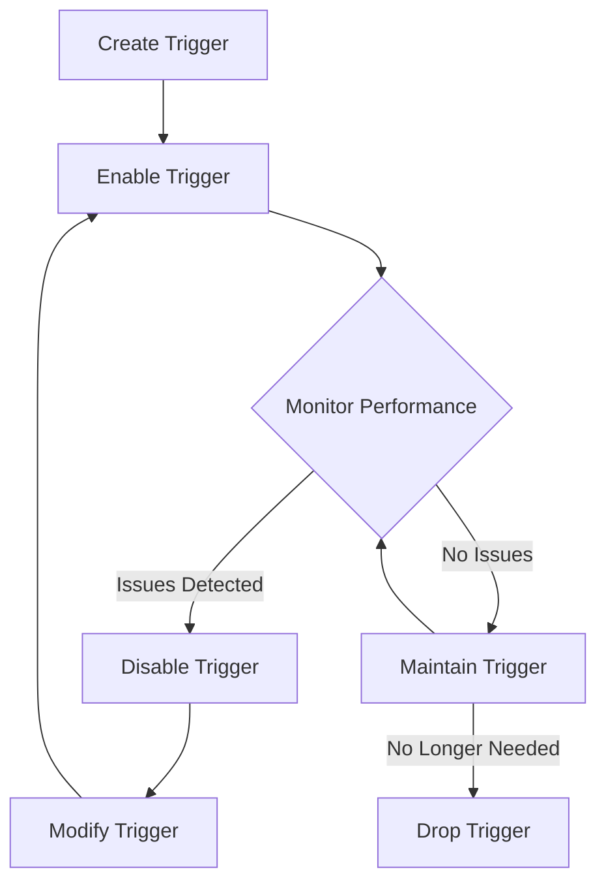

# SQL Trigger Management

## Introduction

SQL triggers are special types of stored procedures that automatically execute in response to specific events in a database. Think of triggers as watchful guardians that spring into action when certain database operations occur. Managing these triggers efficiently is crucial for maintaining database integrity and automating complex business logic.

In this tutorial, we'll explore how to create, modify, disable, enable, and drop triggers in SQL. We'll also cover best practices for trigger management to ensure your database operates smoothly and efficiently.

## Understanding Trigger Lifecycle

Before diving into trigger management, let's understand the typical lifecycle of a trigger:



This lifecycle highlights the key management tasks we'll cover in this tutorial.

## Creating Triggers

The first step in trigger management is creating a well-designed trigger. Let's look at the basic syntax:

```sql
CREATE TRIGGER trigger_name
{BEFORE | AFTER | INSTEAD OF} {INSERT | UPDATE | DELETE}
ON table_name
[FOR EACH ROW]
BEGIN
    -- Trigger logic here
END;
```

### Example: Creating an Audit Trigger

Let's create a trigger that logs changes to an `employees` table:

```sql
CREATE TRIGGER employee_audit_trigger
AFTER UPDATE ON employees
FOR EACH ROW
BEGIN
    INSERT INTO employee_audit_log (
        employee_id,
        changed_at,
        old_salary,
        new_salary,
        action_type
    ) VALUES (
        NEW.employee_id,
        NOW(),
        OLD.salary,
        NEW.salary,
        'UPDATE'
    );
END;
```

When this trigger is in place, any update to the `employees` table will automatically create an entry in the `employee_audit_log` table, recording the change details.

## Viewing Existing Triggers

A crucial aspect of trigger management is being able to view all triggers in your database. Different database systems offer different ways to do this:

### MySQL

```sql
SHOW TRIGGERS;
```

Output:
```
+---------------------+--------+-------------+-------------------------------+-------------+----------------+----------------+-------+
| Trigger             | Event  | Table       | Statement                     | Timing      | Created        | sql_mode       | Definer    |
+---------------------+--------+-------------+-------------------------------+-------------+----------------+----------------+-------+
| employee_audit_trigger | UPDATE | employees   | BEGIN INSERT INTO employee... | AFTER       | 2023-01-15... | ONLY_FULL_G... | root@localhost |
+---------------------+--------+-------------+-------------------------------+-------------+----------------+----------------+-------+
```

### SQL Server

```sql
SELECT * FROM sys.triggers;
```

### PostgreSQL

```sql
SELECT * FROM information_schema.triggers;
```

## Modifying Triggers

Unlike some database objects, triggers cannot be directly altered. Instead, you need to drop and recreate them:

```sql
-- First, drop the existing trigger
DROP TRIGGER employee_audit_trigger ON employees;

-- Then create the new version
CREATE TRIGGER employee_audit_trigger
AFTER UPDATE ON employees
FOR EACH ROW
BEGIN
    INSERT INTO employee_audit_log (
        employee_id,
        changed_at,
        old_salary,
        new_salary,
        action_type,
        changed_by
    ) VALUES (
        NEW.employee_id,
        NOW(),
        OLD.salary,
        NEW.salary,
        'UPDATE',
        CURRENT_USER()  -- Added the user who made the change
    );
END;
```

## Enabling and Disabling Triggers

Sometimes you need to temporarily disable triggers, such as during bulk data operations. The syntax varies by database system:

### MySQL

```sql
-- Disable trigger
ALTER TABLE employees DISABLE TRIGGER employee_audit_trigger;

-- Enable trigger
ALTER TABLE employees ENABLE TRIGGER employee_audit_trigger;
```

### SQL Server

```sql
-- Disable trigger
DISABLE TRIGGER employee_audit_trigger ON employees;

-- Enable trigger
ENABLE TRIGGER employee_audit_trigger ON employees;
```

### PostgreSQL

```sql
-- Disable trigger
ALTER TABLE employees DISABLE TRIGGER employee_audit_trigger;

-- Enable trigger
ALTER TABLE employees ENABLE TRIGGER employee_audit_trigger;
```

## Dropping Triggers

When a trigger is no longer needed, you should remove it:

```sql
DROP TRIGGER employee_audit_trigger ON employees;
```

This completely removes the trigger from the database.

## Trigger Performance Management

Poorly designed triggers can significantly impact database performance. Here are some techniques to manage trigger performance:

### 1. Monitor Trigger Execution Time

In MySQL, you can use the performance schema:

```sql
SELECT * FROM performance_schema.events_statements_history
WHERE sql_text LIKE '%employee_audit_trigger%';
```

### 2. Minimize Trigger Logic

Compare these two approaches:

**Bad Practice (Heavy Trigger):**
```sql
CREATE TRIGGER heavy_product_trigger
AFTER INSERT ON products
FOR EACH ROW
BEGIN
    -- Expensive operation inside a trigger
    UPDATE inventory_summary
    SET total_value = (SELECT SUM(price * quantity) FROM products);
    
    -- Nested queries in trigger
    INSERT INTO product_audit_log
    SELECT 'New product added', NOW(), user, id, name, price
    FROM products
    WHERE id = NEW.id;
END;
```

**Good Practice (Lightweight Trigger):**
```sql
CREATE TRIGGER efficient_product_trigger
AFTER INSERT ON products
FOR EACH ROW
BEGIN
    -- Only update what's necessary with the new data
    UPDATE inventory_summary
    SET total_value = total_value + (NEW.price * NEW.quantity);
    
    -- Direct values without queries
    INSERT INTO product_audit_log
    VALUES ('New product added', NOW(), CURRENT_USER(), NEW.id, NEW.name, NEW.price);
END;
```

## Real-World Trigger Management Examples

### Example 1: Maintaining Data Integrity

This example shows a trigger that ensures order dates are valid:

```sql
CREATE TRIGGER validate_order_date
BEFORE INSERT ON orders
FOR EACH ROW
BEGIN
    IF NEW.order_date > CURRENT_DATE() THEN
        SIGNAL SQLSTATE '45000' 
        SET MESSAGE_TEXT = 'Order date cannot be in the future';
    END IF;
END;
```

To test if it's working:

```sql
-- This will fail due to the trigger
INSERT INTO orders (order_id, customer_id, order_date) 
VALUES (1001, 500, '2025-01-01');
```

Output:
```
Error: Order date cannot be in the future
```

### Example 2: Building a Comprehensive Audit System

Let's create a more complete audit system with multiple triggers:

```sql
-- Create the audit table
CREATE TABLE data_audit_log (
    log_id INT AUTO_INCREMENT PRIMARY KEY,
    table_name VARCHAR(100),
    operation VARCHAR(10),
    record_id INT,
    changed_at TIMESTAMP,
    changed_by VARCHAR(100),
    old_data JSON,
    new_data JSON
);

-- Trigger for customer table inserts
CREATE TRIGGER audit_customer_insert
AFTER INSERT ON customers
FOR EACH ROW
BEGIN
    INSERT INTO data_audit_log (
        table_name, operation, record_id, changed_at, changed_by, old_data, new_data
    ) VALUES (
        'customers', 
        'INSERT', 
        NEW.customer_id, 
        NOW(), 
        CURRENT_USER(),
        NULL,
        JSON_OBJECT(
            'customer_id', NEW.customer_id,
            'name', NEW.name,
            'email', NEW.email,
            'status', NEW.status
        )
    );
END;

-- Trigger for customer table updates
CREATE TRIGGER audit_customer_update
AFTER UPDATE ON customers
FOR EACH ROW
BEGIN
    INSERT INTO data_audit_log (
        table_name, operation, record_id, changed_at, changed_by, old_data, new_data
    ) VALUES (
        'customers', 
        'UPDATE', 
        NEW.customer_id, 
        NOW(), 
        CURRENT_USER(),
        JSON_OBJECT(
            'customer_id', OLD.customer_id,
            'name', OLD.name,
            'email', OLD.email,
            'status', OLD.status
        ),
        JSON_OBJECT(
            'customer_id', NEW.customer_id,
            'name', NEW.name,
            'email', NEW.email,
            'status', NEW.status
        )
    );
END;
```

Managing these triggers as a system requires:

1. Consistent naming conventions (`audit_tablename_operation`)
2. Centralized audit table
3. Standard format for storing audit data (using JSON in this case)

## Trigger Management Best Practices

1. **Documentation**: Always document your triggers with comments that explain their purpose:

```sql
CREATE TRIGGER inventory_update_trigger
AFTER INSERT ON sales
FOR EACH ROW
BEGIN
    /* 
     * Purpose: Automatically reduces inventory quantities when a sale occurs
     * Created: 2023-04-15 by DBA Team
     * Modified: 2023-06-20 - Added error handling
     */
    UPDATE inventory
    SET quantity = quantity - NEW.quantity
    WHERE product_id = NEW.product_id;
END;
```

2. **Testing Strategy**: Create a test plan for each trigger:

```
Test Plan for inventory_update_trigger:
1. Insert a valid sale record → Verify inventory reduced
2. Insert a sale with quantity > available inventory → Verify error handling
3. Insert multiple sales simultaneously → Verify correct total reduction
```

3. **Version Control**: Keep your trigger definitions in version-controlled SQL scripts:

```sql
-- File: triggers/inventory/v1.2/inventory_update_trigger.sql
-- Version: 1.2
-- Date: 2023-06-20
-- Author: DBA Team
-- Changes from v1.1: Added error handling for insufficient inventory

DROP TRIGGER IF EXISTS inventory_update_trigger;

CREATE TRIGGER inventory_update_trigger
AFTER INSERT ON sales
FOR EACH ROW
BEGIN
    -- Trigger logic here
END;
```

4. **Performance Monitoring**: Regularly review trigger performance:

```sql
-- Check trigger execution counts and timing
SELECT trigger_name, execution_count, avg_execution_time
FROM performance_schema.events_triggers_summary_by_account_by_event_name
ORDER BY avg_execution_time DESC
LIMIT 10;
```

## Common Trigger Management Issues and Solutions

| Issue | Symptoms | Solution |
|-------|----------|----------|
| Trigger recursion | Stack overflow errors | Add conditions to prevent recursion |
| Performance degradation | Slow database operations | Optimize trigger logic, consider alternatives |
| Conflicting triggers | Unpredictable behavior | Define trigger execution order |
| Orphaned triggers | Triggers referencing missing objects | Regular audits of trigger dependencies |

### Example: Preventing Trigger Recursion

```sql
CREATE TRIGGER prevent_recursion_example
BEFORE UPDATE ON products
FOR EACH ROW
BEGIN
    -- Use a session variable to prevent recursion
    IF @trigger_active IS NULL THEN
        SET @trigger_active = 1;
        
        -- Your trigger logic here
        
        SET @trigger_active = NULL;
    END IF;
END;
```

## Summary

Effective SQL trigger management involves:

1. Creating well-designed triggers with clear purposes
2. Regularly monitoring trigger performance
3. Properly documenting and versioning your triggers
4. Following best practices for enabling, disabling, and dropping triggers
5. Testing triggers thoroughly before deployment

Triggers are powerful tools for automating database operations, but they require careful management to ensure they enhance rather than hinder your database's performance and reliability.

## Additional Resources

- [MySQL Trigger Documentation](https://dev.mysql.com/doc/refman/8.0/en/trigger-syntax.html)
- [PostgreSQL Trigger Documentation](https://www.postgresql.org/docs/current/trigger-definition.html)
- [SQL Server Trigger Documentation](https://docs.microsoft.com/en-us/sql/t-sql/statements/create-trigger-transact-sql)

## Exercises

1. Create a trigger that prevents deletions from a `customers` table during business hours.
2. Design a system of triggers to maintain a materialized view of product sales summaries.
3. Implement a trigger-based audit system for a table of your choice.
4. Write a script to identify all triggers in your database that might be causing performance issues.
5. Create a trigger that enforces a complex business rule, such as preventing orders from being placed for customers with overdue payments.