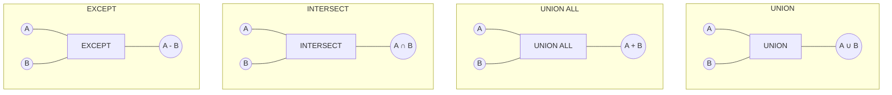

# SQL Set Operations

## Introduction

SQL Set Operations allow you to combine or compare the results of two or more SELECT statements. Much like mathematical set operations, these commands help you manipulate query result sets as unified collections of data. 

Set operations are powerful tools when you need to merge data from different tables, find common records, or identify differences between query results. They're especially useful for reporting, data analysis, and solving complex business problems that require combining or comparing data from multiple sources.

In this tutorial, we'll explore the four main SQL set operations:

- **UNION**: Combines rows from two queries, removing duplicates
- **UNION ALL**: Combines rows from two queries, keeping duplicates
- **INTERSECT**: Returns only rows common to both queries
- **EXCEPT** (also called **MINUS** in some databases): Returns rows from the first query that aren't in the second query

## Prerequisites

Before diving into set operations, you should be familiar with:
- Basic SQL SELECT statements
- WHERE clauses and filtering
- Basic table joins

## Basic Requirements for Set Operations

For set operations to work properly, the queries being combined must:

1. Have the same number of columns
2. Have corresponding columns with compatible data types
3. Return columns in the same order

Now, let's explore each set operation in detail.

## UNION

The UNION operation combines the results of two or more SELECT statements into a single result set, removing any duplicate rows.

### Syntax

```sql
SELECT column1, column2, ... FROM table1
UNION
SELECT column1, column2, ... FROM table2;
```

### Example

Let's say we have two tables: `north_region_sales` and `south_region_sales`, each containing sales data from different regions.

**north_region_sales table:**

| product_name | category    | amount |
|--------------|-------------|--------|
| Laptop       | Electronics | 1200   |
| Smartphone   | Electronics | 800    |
| Desk chair   | Furniture   | 250    |

**south_region_sales table:**

| product_name | category    | amount |
|--------------|-------------|--------|
| Tablet       | Electronics | 600    |
| Laptop       | Electronics | 1200   |
| Coffee table | Furniture   | 350    |

To get a combined list of all products sold across both regions (without duplicates):

```sql
SELECT product_name, category, amount 
FROM north_region_sales
UNION
SELECT product_name, category, amount 
FROM south_region_sales;
```

**Result:**

| product_name | category    | amount |
|--------------|-------------|--------|
| Laptop       | Electronics | 1200   |
| Smartphone   | Electronics | 800    |
| Desk chair   | Furniture   | 250    |
| Tablet       | Electronics | 600    |
| Coffee table | Furniture   | 350    |

Notice that "Laptop" appears only once in the result, even though it exists in both tables. This is because UNION removes duplicate rows.

## UNION ALL

The UNION ALL operation is similar to UNION, but it includes all rows from both queries, including duplicates.

### Syntax

```sql
SELECT column1, column2, ... FROM table1
UNION ALL
SELECT column1, column2, ... FROM table2;
```

### Example

Using the same tables from our previous example:

```sql
SELECT product_name, category, amount 
FROM north_region_sales
UNION ALL
SELECT product_name, category, amount 
FROM south_region_sales;
```

**Result:**

| product_name | category    | amount |
|--------------|-------------|--------|
| Laptop       | Electronics | 1200   |
| Smartphone   | Electronics | 800    |
| Desk chair   | Furniture   | 250    |
| Tablet       | Electronics | 600    |
| Laptop       | Electronics | 1200   |
| Coffee table | Furniture   | 350    |

Note that "Laptop" appears twice in the result because UNION ALL keeps all rows, including duplicates.

### When to use UNION vs. UNION ALL

- Use **UNION** when you want to eliminate duplicates from the combined result set.
- Use **UNION ALL** when:
  - You know there are no duplicates between the queries, or
  - You specifically want to keep duplicates, or
  - Performance is a concern (UNION ALL is faster because it doesn't need to check for duplicates)

## INTERSECT

The INTERSECT operation returns only the rows that appear in the results of both queries.

### Syntax

```sql
SELECT column1, column2, ... FROM table1
INTERSECT
SELECT column1, column2, ... FROM table2;
```

### Example

Using our sales tables:

```sql
SELECT product_name, category, amount 
FROM north_region_sales
INTERSECT
SELECT product_name, category, amount 
FROM south_region_sales;
```

**Result:**

| product_name | category    | amount |
|--------------|-------------|--------|
| Laptop       | Electronics | 1200   |

Only the "Laptop" row appears in the result because it's the only product that exists in both tables with identical values.

## EXCEPT (or MINUS)

The EXCEPT operation (called MINUS in Oracle and some other database systems) returns rows that appear in the first query but not in the second.

### Syntax

```sql
-- Standard SQL and PostgreSQL, SQL Server, etc.
SELECT column1, column2, ... FROM table1
EXCEPT
SELECT column1, column2, ... FROM table2;

-- Oracle syntax
SELECT column1, column2, ... FROM table1
MINUS
SELECT column1, column2, ... FROM table2;
```

### Example

Using our sales tables:

```sql
SELECT product_name, category, amount 
FROM north_region_sales
EXCEPT
SELECT product_name, category, amount 
FROM south_region_sales;
```

**Result:**

| product_name | category    | amount |
|--------------|-------------|--------|
| Smartphone   | Electronics | 800    |
| Desk chair   | Furniture   | 250    |

This returns only the products that are in the north region but not in the south region.

Similarly, we can find products unique to the south region:

```sql
SELECT product_name, category, amount 
FROM south_region_sales
EXCEPT
SELECT product_name, category, amount 
FROM north_region_sales;
```

**Result:**

| product_name | category    | amount |
|--------------|-------------|--------|
| Tablet       | Electronics | 600    |
| Coffee table | Furniture   | 350    |

## Combining Set Operations with Other SQL Features

Set operations can be combined with other SQL features to build more complex queries:

### Sorting Results

You can add an ORDER BY clause at the end of the final query:

```sql
SELECT product_name, category, amount 
FROM north_region_sales
UNION
SELECT product_name, category, amount 
FROM south_region_sales
ORDER BY amount DESC;
```

### Filtering Before Combining

You can use WHERE clauses in each individual query:

```sql
SELECT product_name, category, amount 
FROM north_region_sales
WHERE amount > 500
UNION
SELECT product_name, category, amount 
FROM south_region_sales
WHERE amount > 500;
```

### Multiple Set Operations

You can chain multiple set operations together:

```sql
SELECT product_name, category, amount FROM north_region_sales
UNION
SELECT product_name, category, amount FROM south_region_sales
EXCEPT
SELECT product_name, category, amount FROM discontinued_products;
```

## Real-World Applications of Set Operations

Set operations have many practical uses in business scenarios:

### 1. Finding Missing Data

You can use EXCEPT to find records that should exist in one table but don't appear in another:

```sql
-- Find customers who haven't placed an order in the last year
SELECT customer_id FROM customers
EXCEPT
SELECT customer_id FROM orders 
WHERE order_date >= DATEADD(year, -1, GETDATE());
```

### 2. Combining Data from Different Time Periods

UNION is useful for reports that span different time periods:

```sql
-- Combine current year and previous year sales for comparison
SELECT product_id, amount, 'Current Year' as period
FROM sales
WHERE sale_date BETWEEN '2023-01-01' AND '2023-12-31'
UNION ALL
SELECT product_id, amount, 'Previous Year' as period
FROM sales
WHERE sale_date BETWEEN '2022-01-01' AND '2022-12-31';
```

### 3. Finding Common Elements

INTERSECT helps identify overlap between different data sets:

```sql
-- Find products that were purchased by both premium and regular customers
SELECT product_id
FROM orders o
JOIN customers c ON o.customer_id = c.customer_id
WHERE c.customer_type = 'Premium'
INTERSECT
SELECT product_id
FROM orders o
JOIN customers c ON o.customer_id = c.customer_id
WHERE c.customer_type = 'Regular';
```

### 4. User Access Control

Set operations can help manage permissions:

```sql
-- Find permissions that a user has but shouldn't have
SELECT permission_id
FROM user_permissions
WHERE user_id = 101
EXCEPT
SELECT permission_id
FROM role_permissions
WHERE role_id IN (SELECT role_id FROM user_roles WHERE user_id = 101);
```

## Visualizing Set Operations

Here's a visual representation of how the different set operations work:



## Database Compatibility

Not all database systems implement set operations identically:

| Operation | MySQL      | PostgreSQL | SQL Server | Oracle  | SQLite  |
|-----------|------------|------------|------------|---------|---------|
| UNION     | Supported  | Supported  | Supported  | Supported | Supported |
| UNION ALL | Supported  | Supported  | Supported  | Supported | Supported |
| INTERSECT | Not in older versions | Supported  | Supported  | Supported | Supported |
| EXCEPT    | Not in older versions | Supported  | Supported  | Called MINUS | Supported |

If you're using MySQL 8.0 or later, INTERSECT and EXCEPT are supported.

## Performance Considerations

When working with set operations, keep these performance tips in mind:

1. **UNION ALL vs. UNION**: UNION ALL is faster than UNION because it doesn't need to eliminate duplicates.

2. **Indexing**: Ensure columns used in set operations are properly indexed, especially for large tables.

3. **Order of Operations**: When using multiple set operations, the order can impact performance. Start with operations that reduce the result set size.

4. **Alternative Approaches**: For some INTERSECT or EXCEPT operations, using EXISTS or NOT EXISTS subqueries might be more efficient.

## Summary

SQL Set Operations are powerful tools for combining and comparing query results. They follow the principles of mathematical set theory and are essential for solving complex data problems.

Key takeaways:
- **UNION** combines results and removes duplicates
- **UNION ALL** combines results and keeps duplicates
- **INTERSECT** returns only rows common to both queries
- **EXCEPT/MINUS** returns rows in the first query but not in the second
- All set operations require that the queries have the same number of columns with compatible data types

By mastering set operations, you can write more efficient queries and solve complex business problems that involve combining or comparing data from multiple sources.

## Exercises

Try these exercises to solidify your understanding:

1. Create two tables, `employees_2022` and `employees_2023`, with columns for employee_id, name, and department. Insert sample data and use UNION to list all employees across both years without duplicates.

2. Using the same tables, find employees who were present in 2022 but not in 2023 using EXCEPT.

3. Create a query using INTERSECT to find employees who were present in both 2022 and 2023.

4. Write a query that combines products from three different regional sales tables (north, south, and central) and sorts them by price in descending order.

5. Find all products that are sold in all three regions using multiple INTERSECT operations.

## Additional Resources

- [SQL Set Operations in the SQL Standard](https://en.wikipedia.org/wiki/Set_operations_(SQL))
- [PostgreSQL Set Operations Documentation](https://www.postgresql.org/docs/current/queries-union.html)
- [SQL Server Set Operations](https://docs.microsoft.com/en-us/sql/t-sql/language-elements/set-operators-union-except-and-intersect-transact-sql)
- [Oracle Set Operations](https://docs.oracle.com/en/database/oracle/oracle-database/19/sqlrf/Set-Operations.html)