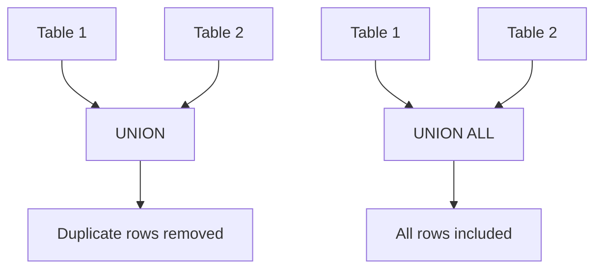

# SQL UNION

## Introduction

When working with databases, you'll often need to combine data from different tables or query results. SQL provides several ways to do this, and one of the most powerful is the `UNION` operator. 

The `UNION` operator allows you to combine the result sets of two or more SELECT statements into a single result set. This is particularly useful when you need to retrieve similar data from different tables, or when you want to combine results that meet different criteria from the same table.

In this tutorial, you'll learn:
- How `UNION` and `UNION ALL` work
- The rules for using these operators
- Practical examples using real-world scenarios
- Common use cases and best practices

## UNION Basics

### What is SQL UNION?

The `UNION` operator combines the results of two or more SELECT statements into a single result set. The basic syntax is:

```sql
SELECT column1, column2, ... FROM table1
UNION
SELECT column1, column2, ... FROM table2;
```

Key characteristics of `UNION`:
- Removes duplicate rows from the combined result set
- Returns only distinct values
- Requires the same number of columns in each SELECT statement
- Column data types must be compatible
- The column names from the first SELECT statement are used as the column names for the result set

### What is SQL UNION ALL?

`UNION ALL` works similarly to `UNION`, but it includes all rows, even duplicates:

```sql
SELECT column1, column2, ... FROM table1
UNION ALL
SELECT column1, column2, ... FROM table2;
```

`UNION ALL` is generally faster than `UNION` because it doesn't need to perform the additional processing to remove duplicates.

## Rules for Using UNION

For `UNION` to work properly, both SELECT statements must follow these rules:

1. Both SELECT statements must have the same number of columns
2. Corresponding columns must have compatible data types
3. The column order matters and should match in both queries
4. Column names from the first SELECT statement are used in the result
5. ORDER BY clause can only appear at the end of the entire query

## UNION vs. UNION ALL: Visual Comparison



## Practical Examples

### Example 1: Combining Customer Lists

Let's say we have two tables: `online_customers` and `store_customers`. We want to create a single list of all customers.

**Database tables:**

```sql
-- online_customers table
CREATE TABLE online_customers (
    customer_id INT,
    name VARCHAR(100),
    email VARCHAR(100),
    signup_date DATE
);

-- store_customers table
CREATE TABLE store_customers (
    customer_id INT,
    name VARCHAR(100),
    email VARCHAR(100),
    first_purchase_date DATE
);

-- Insert sample data
INSERT INTO online_customers VALUES
(1, 'John Doe', 'john@example.com', '2023-01-15'),
(2, 'Jane Smith', 'jane@example.com', '2023-02-20'),
(3, 'Bob Johnson', 'bob@example.com', '2023-03-10');

INSERT INTO store_customers VALUES
(4, 'Alice Brown', 'alice@example.com', '2023-01-05'),
(5, 'Charlie Davis', 'charlie@example.com', '2023-02-10'),
(3, 'Bob Johnson', 'bob@example.com', '2023-03-25');
```

**Using UNION to get a list of all unique customers:**

```sql
SELECT customer_id, name, email FROM online_customers
UNION
SELECT customer_id, name, email FROM store_customers;
```

**Result:**

```
customer_id | name           | email
------------|----------------|------------------
1           | John Doe       | john@example.com
2           | Jane Smith     | jane@example.com
3           | Bob Johnson    | bob@example.com
4           | Alice Brown    | alice@example.com
5           | Charlie Davis  | charlie@example.com
```

Notice that Bob Johnson appears only once in the result, even though he exists in both tables.

**Using UNION ALL to get all customers with possible duplicates:**

```sql
SELECT customer_id, name, email FROM online_customers
UNION ALL
SELECT customer_id, name, email FROM store_customers;
```

**Result:**

```
customer_id | name           | email
------------|----------------|------------------
1           | John Doe       | john@example.com
2           | Jane Smith     | jane@example.com
3           | Bob Johnson    | bob@example.com
4           | Alice Brown    | alice@example.com
5           | Charlie Davis  | charlie@example.com
3           | Bob Johnson    | bob@example.com
```

In this result, Bob Johnson appears twice because he exists in both tables.

### Example 2: Combining Different Report Data

Let's say we want to generate a report showing high-value transactions from different sources:

```sql
-- High-value online orders (over $1000)
SELECT 'Online' AS source, order_id, amount, order_date
FROM online_orders 
WHERE amount > 1000

UNION

-- High-value in-store purchases (over $1000)
SELECT 'In-Store' AS source, transaction_id, amount, purchase_date
FROM store_purchases
WHERE amount > 1000

ORDER BY amount DESC;
```

This query combines high-value transactions from both online and in-store sources, sorts them by amount, and adds a column to identify the source.

### Example 3: Combining Results with Different Criteria

We can also use UNION to combine results from the same table that meet different criteria:

```sql
-- Active products with low inventory (needs restocking)
SELECT product_id, product_name, 'Low Inventory' AS status
FROM products
WHERE active = 1 AND inventory_count < 10

UNION

-- Products with no recent sales (may need promotion)
SELECT product_id, product_name, 'No Recent Sales' AS status
FROM products
WHERE product_id NOT IN (
    SELECT product_id FROM sales WHERE sale_date > DATE_SUB(CURRENT_DATE, INTERVAL 30 DAY)
);
```

This query identifies products that either need restocking or promotion.

## Common Use Cases for UNION

1. **Combining related data from multiple tables**
   - Merging customer data from different systems
   - Consolidating product information from various sources

2. **Creating reports with different categories of data**
   - Financial reports combining revenue from different channels
   - Performance reports showing metrics from multiple departments

3. **Simplifying complex queries**
   - Breaking down a complex query into smaller, more manageable parts
   - Creating views that combine data from multiple sources

4. **Data migration and consolidation**
   - Combining data from legacy and new systems
   - Merging data during system migrations or consolidations

## Performance Considerations

- **Use UNION ALL when possible**: If you don't need to eliminate duplicates, use UNION ALL as it's more efficient.
- **Proper indexing**: Ensure the columns used in your SELECT statements are properly indexed.
- **Query optimization**: Consider optimizing each individual SELECT statement before using UNION.
- **Limit results when appropriate**: If you only need a portion of the combined result, use LIMIT after the UNION operation.

## Advanced Usage: Combining with Other SQL Features

### Using UNION with JOIN

```sql
-- Get all customers and their orders (if any)
SELECT c.customer_id, c.name, o.order_id, o.amount
FROM customers c
LEFT JOIN orders o ON c.customer_id = o.customer_id
WHERE c.region = 'North'

UNION ALL

SELECT c.customer_id, c.name, o.order_id, o.amount
FROM customers c
LEFT JOIN orders o ON c.customer_id = o.customer_id
WHERE c.region = 'South';
```

### Using UNION with GROUP BY

```sql
-- Revenue summary by product category for current year
SELECT category, SUM(amount) as total_revenue, 'Current Year' as period
FROM sales
WHERE sale_date BETWEEN '2023-01-01' AND '2023-12-31'
GROUP BY category

UNION ALL

-- Revenue summary by product category for previous year
SELECT category, SUM(amount) as total_revenue, 'Previous Year' as period
FROM sales
WHERE sale_date BETWEEN '2022-01-01' AND '2022-12-31'
GROUP BY category

ORDER BY category, period;
```

## Common Errors and How to Fix Them

1. **Number of columns doesn't match**
   
   Error: `The used SELECT statements have a different number of columns`
   
   Solution: Ensure both SELECT statements have the same number of columns. You can add NULL or empty columns if needed.

2. **Data type mismatch**
   
   Error: `Illegal mix of collations`
   
   Solution: Convert the data types to ensure compatibility:
   
   ```sql
   SELECT CAST(numeric_column AS CHAR) FROM table1
   UNION
   SELECT text_column FROM table2;
   ```

3. **ORDER BY in the wrong place**
   
   Error: `ORDER BY clause should be placed at the end of the statement`
   
   Solution: Place the ORDER BY clause after the last UNION:
   
   ```sql
   SELECT col1, col2 FROM table1
   UNION
   SELECT col1, col2 FROM table2
   ORDER BY col1;
   ```

## Summary

SQL UNION is a powerful feature that allows you to combine results from multiple SELECT statements:

- Use `UNION` when you need to eliminate duplicates
- Use `UNION ALL` for better performance when duplicates are acceptable
- Ensure column count and data type compatibility
- Consider performance implications for large datasets
- Combine with other SQL features for more sophisticated queries

By mastering SQL UNION, you can create more efficient queries, generate comprehensive reports, and solve complex data consolidation challenges.

## Exercises

1. Create two tables: `employees` and `contractors`. Include columns for ID, name, department, and salary. Write a UNION query to list all people working for the company.

2. Using the `products` table, write a query that uses UNION to create a list showing products that are either low in stock (less than 5 units) or high in stock (more than 100 units).

3. Write a query that uses UNION ALL to list all orders from the current month and the previous month, with a column indicating which month each order is from.

4. Create a query using UNION that shows the top 5 customers by purchase amount and the bottom 5 customers by purchase amount.

## Additional Resources

- [MySQL UNION Documentation](https://dev.mysql.com/doc/refman/8.0/en/union.html)
- [PostgreSQL UNION Documentation](https://www.postgresql.org/docs/current/queries-union.html)
- [SQL Server UNION Documentation](https://learn.microsoft.com/en-us/sql/t-sql/language-elements/set-operators-union-transact-sql)