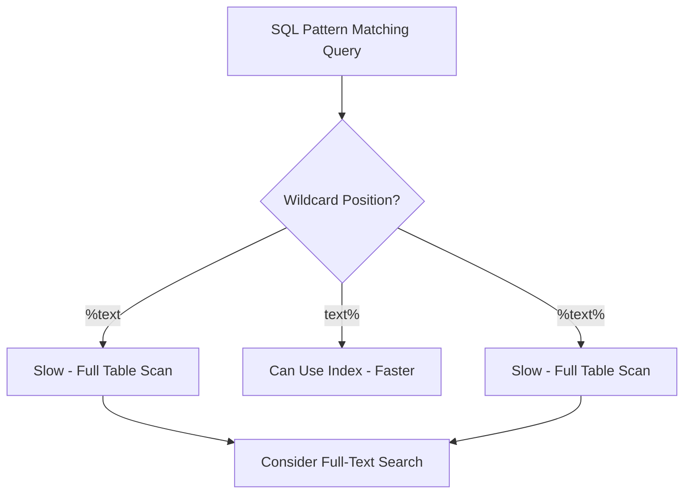

# SQL Pattern Matching

## Introduction

Pattern matching in SQL allows you to search for specific patterns within text data rather than exact matches. This is incredibly useful when you need to find records where data follows certain patterns or contains specific text fragments. Whether you're filtering customer emails from a particular domain, finding products with names containing certain words, or validating data formats, SQL pattern matching provides powerful tools to accomplish these tasks.

In this tutorial, we'll explore several SQL pattern matching techniques:

- The `LIKE` operator with wildcards
- The `SIMILAR TO` operator
- Regular expressions with `REGEXP`/`RLIKE`
- Case sensitivity considerations
- Performance implications

By the end of this guide, you'll be able to confidently use pattern matching in your SQL queries to filter and find data based on complex text patterns.

## Basic Pattern Matching with LIKE

The `LIKE` operator is the most common and widely supported pattern matching tool in SQL. It works with two special wildcard characters:

- `%` - Matches any sequence of zero or more characters
- `_` - Matches exactly one character

### LIKE Syntax

```sql
SELECT column1, column2, ...
FROM table_name
WHERE columnN LIKE pattern;
```

### LIKE Examples

Let's look at some examples using a sample `customers` table:

```sql
-- Find all customers whose names start with 'A'
SELECT customer_id, first_name, last_name
FROM customers
WHERE first_name LIKE 'A%';
```

**Result:**
```
customer_id | first_name | last_name
-----------+------------+----------
1          | Alex       | Johnson
7          | Anna       | Williams
12         | Aaron      | Davis
```

```sql
-- Find all customers whose last names end with 'son'
SELECT customer_id, first_name, last_name
FROM customers
WHERE last_name LIKE '%son';
```

**Result:**
```
customer_id | first_name | last_name
-----------+------------+----------
1          | Alex       | Johnson
15         | Emily      | Anderson
23         | James      | Jackson
```

```sql
-- Find all customers with exactly 5 letters in their first name
SELECT customer_id, first_name, last_name
FROM customers
WHERE first_name LIKE '_____';
```

**Result:**
```
customer_id | first_name | last_name
-----------+------------+----------
1          | Alex       | Johnson
7          | Anna       | Williams
15         | Emily      | Anderson
23         | James      | Jackson
```

```sql
-- Find all customers with 'a' as the second letter in their first name
SELECT customer_id, first_name, last_name
FROM customers
WHERE first_name LIKE '_a%';
```

**Result:**
```
customer_id | first_name | last_name
-----------+------------+----------
23         | James      | Jackson
42         | David      | Smith
```

### Combining Wildcards

You can combine multiple wildcards to create more complex patterns:

```sql
-- Find all customers with 'a' in their first name and 'son' at the end of their last name
SELECT customer_id, first_name, last_name
FROM customers
WHERE first_name LIKE '%a%' AND last_name LIKE '%son';
```

**Result:**
```
customer_id | first_name | last_name
-----------+------------+----------
1          | Alex       | Johnson
23         | James      | Jackson
```

## NOT LIKE Operator

To find records that don't match a pattern, use the `NOT LIKE` operator:

```sql
-- Find all customers whose names don't start with 'A'
SELECT customer_id, first_name, last_name
FROM customers
WHERE first_name NOT LIKE 'A%';
```

## Escaping Special Characters

If you need to match a literal `%` or `_` character in your data, you can use the escape character:

```sql
-- Find products with a '%' in their description (such as "20% more")
SELECT product_id, product_name
FROM products
WHERE description LIKE '%\%%' ESCAPE '\';
```

Different database systems might use different escape characters or syntax. For example:

- In MySQL and PostgreSQL: `LIKE '%\%%' ESCAPE '\'`
- In SQL Server: `LIKE '%[%]%'` or `LIKE '%\%%' ESCAPE '\'`

## SIMILAR TO Operator (PostgreSQL)

PostgreSQL provides the `SIMILAR TO` operator, which combines features from `LIKE` with more advanced pattern matching from regular expressions:

```sql
-- Find all email addresses from gmail.com or yahoo.com domains
SELECT customer_id, email
FROM customers
WHERE email SIMILAR TO '%@(gmail|yahoo).com';
```

**Result:**
```
customer_id | email
-----------+-------------------------
1          | alex.j@gmail.com
7          | anna.w@yahoo.com
15         | emily.a@gmail.com
```

## Regular Expressions

Many SQL databases support regular expressions for more advanced pattern matching:

### MySQL and MariaDB: REGEXP/RLIKE

```sql
-- Find all customers with first names containing at least 2 consecutive vowels
SELECT customer_id, first_name, last_name
FROM customers
WHERE first_name REGEXP '[aeiou]{2,}';
```

**Result:**
```
customer_id | first_name | last_name
-----------+------------+----------
1          | Louis      | Thompson
7          | Aiden      | Brooks
15         | Peoria     | Campbell
```

### PostgreSQL: ~, ~*, !~, !~*

```sql
-- Find all customers with email addresses in valid format
SELECT customer_id, email
FROM customers
WHERE email ~ '^[A-Za-z0-9._%+-]+@[A-Za-z0-9.-]+\.[A-Za-z]{2,}$';
```

### Oracle: REGEXP_LIKE

```sql
-- Find all customers with phone numbers in format XXX-XXX-XXXX
SELECT customer_id, phone_number
FROM customers
WHERE REGEXP_LIKE(phone_number, '^[0-9]{3}-[0-9]{3}-[0-9]{4}$');
```

## Case Sensitivity in Pattern Matching

Pattern matching is typically case-sensitive by default, but many databases provide case-insensitive options:

### Case-insensitive LIKE in different databases:

- MySQL and SQL Server: `LIKE` is case-insensitive by default
- PostgreSQL and Oracle: Use `ILIKE` or `LOWER()`

```sql
-- PostgreSQL example of case-insensitive matching
SELECT product_name, category
FROM products
WHERE product_name ILIKE '%apple%';

-- Alternative using LOWER function (works in all databases)
SELECT product_name, category
FROM products
WHERE LOWER(product_name) LIKE '%apple%';
```

## Common Use Cases for SQL Pattern Matching

### 1. Email Validation

```sql
-- Find potentially invalid email addresses
SELECT customer_id, email
FROM customers
WHERE email NOT LIKE '%_@_%._%';
```

### 2. Searching Product Catalogs

```sql
-- Find all products related to "smartphone" or "phone"
SELECT product_id, product_name, description
FROM products
WHERE product_name LIKE '%phone%' 
   OR description LIKE '%phone%'
   OR category LIKE '%phone%';
```

### 3. Data Cleaning

```sql
-- Find ZIP codes that don't follow the 5-digit U.S. format
SELECT customer_id, zip_code
FROM addresses
WHERE zip_code NOT LIKE '_____' OR zip_code LIKE '%[^0-9]%';
```

### 4. Log Analysis

```sql
-- Find all ERROR log entries from a specific module
SELECT log_id, timestamp, message
FROM system_logs
WHERE level = 'ERROR' AND message LIKE '%database connection%';
```

## Performance Considerations

Pattern matching, especially with wildcards at the beginning of patterns (e.g., `LIKE '%text'`), can be inefficient because it typically can't use indexes effectively. Consider these performance tips:

1. Avoid using wildcards at the beginning of patterns when possible
2. Use full-text search features for complex text searches
3. Consider using computed columns or function-based indexes for frequently used pattern searches
4. Test performance with different pattern matching methods



## Differences Across Database Systems

Pattern matching implementations vary across different database systems:

| Feature | MySQL | PostgreSQL | SQL Server | Oracle |
|---------|-------|------------|------------|--------|
| LIKE | ✓ | ✓ | ✓ | ✓ |
| SIMILAR TO | ✗ | ✓ | ✗ | ✗ |
| REGEXP | ✓ (REGEXP/RLIKE) | ✓ (~, ~*) | ✗ | ✓ (REGEXP_LIKE) |
| Case-sensitive by default | ✗ | ✓ | ✗ | ✓ |
| Case-insensitive option | Default | ILIKE | Default | REGEXP_LIKE with 'i' flag |

## Practical Exercise: Pattern Matching Challenges

Try solving these pattern matching challenges using the concepts we've learned:

1. Write a query to find all customers with phone numbers in the format (XXX) XXX-XXXX
2. Find all products with descriptions containing numbers (digits)
3. Identify email addresses that don't come from business domains (.com, .org, .net)
4. Find all street addresses that include an apartment number (typically containing "Apt", "Unit", or "#")

<details>
<summary>Solutions</summary>

```sql
-- 1. Find phone numbers in format (XXX) XXX-XXXX
SELECT customer_id, phone_number
FROM customers
WHERE phone_number LIKE '(___) ___-____';

-- 2. Find products with descriptions containing numbers
SELECT product_id, product_name, description
FROM products
WHERE description LIKE '%0%' OR description LIKE '%1%' OR description LIKE '%2%'
   OR description LIKE '%3%' OR description LIKE '%4%' OR description LIKE '%5%'
   OR description LIKE '%6%' OR description LIKE '%7%' OR description LIKE '%8%'
   OR description LIKE '%9%';
-- Alternative with REGEXP: WHERE description REGEXP '[0-9]'

-- 3. Find non-business email domains
SELECT customer_id, email
FROM customers
WHERE email NOT LIKE '%.com' AND email NOT LIKE '%.org' AND email NOT LIKE '%.net';

-- 4. Find addresses with apartment numbers
SELECT address_id, street_address
FROM addresses
WHERE street_address LIKE '%Apt%' OR street_address LIKE '%Unit%' OR street_address LIKE '%#%';
```
</details>

## Summary

SQL pattern matching is a powerful feature that allows you to search for specific patterns within your text data. We've covered several key pattern matching techniques:

- The `LIKE` operator with `%` and `_` wildcards for basic pattern matching
- The `NOT LIKE` operator for finding non-matching patterns
- The `SIMILAR TO` operator for more advanced patterns (in PostgreSQL)
- Regular expressions for complex pattern matching
- Case sensitivity considerations and how to handle them
- Performance implications and best practices

By mastering SQL pattern matching, you can write more powerful and flexible queries that can find exactly the data you need based on complex textual patterns.

## Additional Resources

- [SQL Pattern Matching in PostgreSQL Documentation](https://www.postgresql.org/docs/current/functions-matching.html)
- [MySQL Regular Expressions](https://dev.mysql.com/doc/refman/8.0/en/regexp.html)
- [SQL Server Pattern Matching](https://learn.microsoft.com/en-us/sql/t-sql/language-elements/like-transact-sql)
- [Oracle Regular Expression Support](https://docs.oracle.com/en/database/oracle/oracle-database/19/sqlrf/Pattern-matching-Conditions.html)

**Practice**: Try creating a table with text data and experiment with different pattern matching techniques to solidify your understanding. The more you practice, the more comfortable you'll become with these powerful SQL features.