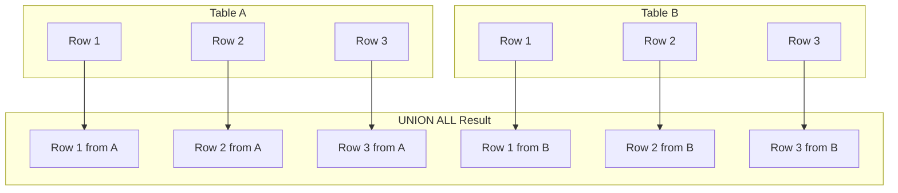

# SQL UNION ALL

## Introduction

When working with databases, you often need to combine data from multiple tables or query results. SQL provides several operators for this purpose, and one of the most useful is the `UNION ALL` operator.

`UNION ALL` is a set operation that allows you to combine the results of two or more SELECT statements into a single result set. Unlike the regular `UNION` operator, `UNION ALL` includes all rows from each query, including duplicates. This makes it both simpler and more efficient in situations where you're certain there are no duplicates or when duplicates are actually desired in the output.

In this tutorial, we'll explore the `UNION ALL` operator in depth, learning how to use it effectively in your SQL queries.

## Basic Syntax

The basic syntax of the `UNION ALL` operator is as follows:

```sql
SELECT column1, column2, ... FROM table1
UNION ALL
SELECT column1, column2, ... FROM table2;
```

**Key requirements:**
- Each SELECT statement must have the same number of columns
- The columns must have compatible data types
- The order of columns in all SELECT statements determines how the data is combined

## UNION ALL vs UNION

Before diving deeper, it's important to understand the difference between `UNION ALL` and `UNION`:

| Feature | UNION | UNION ALL |
| ------- | ----- | --------- |
| Duplicates | Removes duplicate rows | Keeps all rows including duplicates |
| Performance | Slower (needs to check for duplicates) | Faster (no duplicate checking) |
| Result size | Potentially smaller | Always includes all rows from all queries |

## Basic Example

Let's see a simple example of `UNION ALL` in action:

```sql
-- First table: employees in IT department
SELECT employee_id, first_name, last_name, 'IT' as department
FROM employees
WHERE department_id = 10

UNION ALL

-- Second table: employees in HR department
SELECT employee_id, first_name, last_name, 'HR' as department
FROM employees
WHERE department_id = 20;
```

**Output:**
```
employee_id | first_name | last_name | department
------------|------------|-----------|------------
101         | John       | Smith     | IT
102         | Emily      | Johnson   | IT
103         | Michael    | Williams  | IT
201         | Sarah      | Brown     | HR
202         | David      | Jones     | HR
```

In this example, we've combined the results of two queries to get a list of employees from both the IT and HR departments.

## Combining Tables with Different Structures

You can use `UNION ALL` to combine tables with completely different structures as long as you ensure the column count and data types are compatible:

```sql
-- Get products with price > 100
SELECT product_name, price, 'Expensive' as category
FROM products
WHERE price > 100

UNION ALL

-- Get recently added customers
SELECT customer_name, signup_date, 'New Customer' as category
FROM customers
WHERE signup_date > DATEADD(month, -1, GETDATE());
```

**Output:**
```
product_name/customer_name | price/signup_date | category
---------------------------|-------------------|---------------
Premium Laptop             | 1200.00           | Expensive
Smartphone Pro             | 899.99            | Expensive
Designer Watch             | 450.00            | Expensive
John Johnson               | 2023-03-10        | New Customer
Sarah Smith                | 2023-03-12        | New Customer
```

## Real-World Applications

### 1. Combining Data from Related Tables

One common use case is to combine data from tables that have similar structures:

```sql
-- Active orders from current year
SELECT order_id, customer_id, order_date, amount, 'Current' as status
FROM orders_current_year

UNION ALL

-- Historical orders from archive
SELECT order_id, customer_id, order_date, amount, 'Archive' as status
FROM orders_archive;
```

### 2. Creating Reports Across Different Time Periods

```sql
-- Sales for Q1
SELECT product_id, SUM(quantity) as units_sold, 'Q1' as quarter
FROM sales
WHERE sale_date BETWEEN '2023-01-01' AND '2023-03-31'
GROUP BY product_id

UNION ALL

-- Sales for Q2
SELECT product_id, SUM(quantity) as units_sold, 'Q2' as quarter
FROM sales
WHERE sale_date BETWEEN '2023-04-01' AND '2023-06-30'
GROUP BY product_id;
```

### 3. Combining Multiple Types of Activity

```sql
-- Website logins
SELECT user_id, login_time as activity_time, 'Login' as activity_type
FROM user_logins
WHERE login_time > DATEADD(day, -7, GETDATE())

UNION ALL

-- Product purchases
SELECT user_id, purchase_time as activity_time, 'Purchase' as activity_type
FROM purchases
WHERE purchase_time > DATEADD(day, -7, GETDATE())

UNION ALL

-- Support requests
SELECT user_id, request_time as activity_time, 'Support' as activity_type
FROM support_tickets
WHERE request_time > DATEADD(day, -7, GETDATE());
```

## Common Use Cases Visualized

Here's a diagram illustrating how UNION ALL combines result sets:



## Performance Considerations

When working with `UNION ALL`, keep these performance considerations in mind:

1. **Use `UNION ALL` instead of `UNION` when possible**: Since `UNION ALL` doesn't check for duplicates, it's typically faster than `UNION`.

2. **Filter early**: Apply WHERE clauses to each individual SELECT statement rather than filtering the combined result to reduce the amount of data processed.

```sql
-- More efficient
SELECT column1, column2 FROM table1 WHERE condition1
UNION ALL
SELECT column1, column2 FROM table2 WHERE condition2;

-- Less efficient
SELECT * FROM
(
    SELECT column1, column2 FROM table1
    UNION ALL
    SELECT column1, column2 FROM table2
) AS combined_data
WHERE some_condition;
```

3. **Consider indexing**: Ensure that columns used in WHERE clauses are properly indexed.

## Common Errors and How to Fix Them

### Error 1: Column Count Mismatch

```
Error: All queries combined using a UNION, INTERSECT or EXCEPT operator must have an equal number of expressions in their target lists.
```

**Fix**: Ensure all SELECT statements have the same number of columns. You can add NULL or constant values to make them match:

```sql
-- Before (error)
SELECT name, age FROM students
UNION ALL
SELECT name FROM teachers;

-- After (fixed)
SELECT name, age FROM students
UNION ALL
SELECT name, NULL as age FROM teachers;
```

### Error 2: Incompatible Data Types

```
Error: Cannot union all SELECT statements since the data types for column 1 do not match.
```

**Fix**: Use CAST or CONVERT to ensure compatible data types:

```sql
-- Before (error)
SELECT id, created_date FROM orders
UNION ALL
SELECT id, order_number FROM items;

-- After (fixed)
SELECT id, created_date FROM orders
UNION ALL
SELECT id, CAST(order_number AS DATETIME) FROM items;
```

## Practical Exercise

Let's walk through a practical exercise to solidify your understanding:

**Scenario**: You have three tables: `online_sales`, `in_store_sales`, and `phone_sales`. You need to generate a comprehensive sales report that includes all sales channels.

```sql
-- Create and populate sample tables
CREATE TABLE online_sales (
    order_id INT,
    product_id INT,
    sale_amount DECIMAL(10,2),
    sale_date DATE
);

CREATE TABLE in_store_sales (
    transaction_id INT,
    product_id INT,
    amount DECIMAL(10,2),
    transaction_date DATE
);

CREATE TABLE phone_sales (
    call_id INT,
    product_id INT,
    sale_value DECIMAL(10,2),
    call_date DATE
);

-- Insert sample data (not shown for brevity)

-- Comprehensive sales report query
SELECT 
    'Online' as sales_channel,
    product_id,
    sale_amount as amount,
    sale_date as transaction_date
FROM 
    online_sales
WHERE 
    sale_date BETWEEN '2023-01-01' AND '2023-12-31'

UNION ALL

SELECT 
    'In-Store' as sales_channel,
    product_id,
    amount,
    transaction_date
FROM 
    in_store_sales
WHERE 
    transaction_date BETWEEN '2023-01-01' AND '2023-12-31'

UNION ALL

SELECT 
    'Phone' as sales_channel,
    product_id,
    sale_value as amount,
    call_date as transaction_date
FROM 
    phone_sales
WHERE 
    call_date BETWEEN '2023-01-01' AND '2023-12-31'

ORDER BY 
    transaction_date, product_id;
```

## Summary

The `UNION ALL` operator is a powerful tool in SQL that allows you to combine multiple result sets into a single result set without removing duplicates. Key points to remember:

- `UNION ALL` preserves all rows, including duplicates
- It's faster than `UNION` because it doesn't check for duplicates
- All SELECT statements must have the same number of columns
- Column data types must be compatible across all SELECTs
- Order columns appropriately to ensure data alignment

By mastering `UNION ALL`, you can create more efficient queries and generate comprehensive reports that combine data from multiple tables or queries.

## Additional Resources

- Try these exercises to practice your `UNION ALL` skills:
  1. Combine customer data from your main database and your legacy system
  2. Create a report showing both successful and failed transactions
  3. Generate a list of all products across multiple categories

- Further reading:
  - [SQL Set Operations](https://www.w3schools.com/sql/sql_union.asp)
  - [SQL UNION vs UNION ALL Performance](https://www.sqlshack.com/sql-union-vs-union-all-performance-comparison/)
  - [Advanced SQL Techniques for Data Analysis](https://mode.com/sql-tutorial/sql-union/)