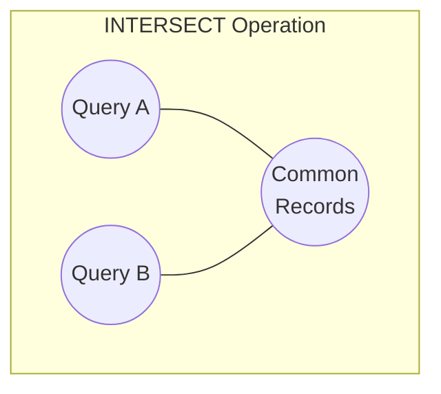
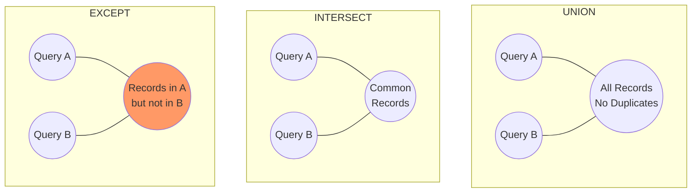

# SQL INTERSECT

## Introduction

The SQL `INTERSECT` operator is a powerful set operation that allows you to find common records between the results of two or more SELECT queries. It returns only the rows that appear in all result sets, effectively finding the intersection between multiple datasets.

Think of `INTERSECT` as finding where two or more circles overlap in a Venn diagram - it extracts only the common elements that exist in all sets.



## Syntax

The basic syntax for using the `INTERSECT` operator is:

```sql
SELECT column1, column2, ... FROM table1
INTERSECT
SELECT column1, column2, ... FROM table2;
```

**Important requirements:**
- Both queries must have the same number of columns
- The data types of corresponding columns must be compatible
- The column names in the result will be taken from the first query
- The order of records in the result is not guaranteed unless you use `ORDER BY`

## Basic Example

Let's start with a simple example. Imagine we have two tables: `students_math` and `students_science`, which contain lists of students enrolled in math and science courses.

Table: `students_math`
```
| student_id | name      |
|------------|-----------|
| 1          | Alice     |
| 2          | Bob       |
| 3          | Charlie   |
| 4          | Diana     |
```

Table: `students_science`
```
| student_id | name      |
|------------|-----------|
| 2          | Bob       |
| 3          | Charlie   |
| 5          | Eve       |
| 6          | Frank     |
```

To find students who are enrolled in both math and science courses, we can use:

```sql
SELECT student_id, name FROM students_math
INTERSECT
SELECT student_id, name FROM students_science;
```

Result:
```
| student_id | name      |
|------------|-----------|
| 2          | Bob       |
| 3          | Charlie   |
```

The result shows only Bob and Charlie, as they are the only students enrolled in both courses.

## Comparing INTERSECT with Other Set Operations

SQL provides three main set operations:

1. **UNION**: Combines and returns all rows from both queries, removing duplicates
2. **INTERSECT**: Returns only the common rows that appear in both queries
3. **EXCEPT** (or **MINUS** in some databases): Returns rows from the first query that don't appear in the second query

Here's a visual comparison:



## Real-World Example: Customer Analysis

Let's explore a more practical example. Imagine an e-commerce business with the following tables:

Table: `customers_2023` (Customers who made purchases in 2023)
```
| customer_id | name           | email                  |
|-------------|----------------|------------------------|
| 101         | John Smith     | john@example.com       |
| 102         | Emma Johnson   | emma@example.com       |
| 103         | Michael Brown  | michael@example.com    |
| 104         | Sophia Davis   | sophia@example.com     |
```

Table: `newsletter_subscribers` (Customers subscribed to the newsletter)
```
| customer_id | name           | email                  |
|-------------|----------------|------------------------|
| 102         | Emma Johnson   | emma@example.com       |
| 103         | Michael Brown  | michael@example.com    |
| 105         | William Wilson | william@example.com    |
| 106         | Olivia Moore   | olivia@example.com     |
```

Table: `loyalty_program_members` (Customers in the loyalty program)
```
| customer_id | name           | email                  |
|-------------|----------------|------------------------|
| 102         | Emma Johnson   | emma@example.com       |
| 103         | Michael Brown  | michael@example.com    |
| 104         | Sophia Davis   | sophia@example.com     |
| 107         | James Taylor   | james@example.com      |
```

### Example 1: Finding customers who purchased in 2023 and are loyalty members

```sql
SELECT customer_id, name, email FROM customers_2023
INTERSECT
SELECT customer_id, name, email FROM loyalty_program_members;
```

Result:
```
| customer_id | name           | email                  |
|-------------|----------------|------------------------|
| 102         | Emma Johnson   | emma@example.com       |
| 103         | Michael Brown  | michael@example.com    |
| 104         | Sophia Davis   | sophia@example.com     |
```

### Example 2: Finding customers who purchased, subscribe to the newsletter, and are loyalty members

```sql
SELECT customer_id, name, email FROM customers_2023
INTERSECT
SELECT customer_id, name, email FROM newsletter_subscribers
INTERSECT
SELECT customer_id, name, email FROM loyalty_program_members;
```

Result:
```
| customer_id | name           | email                  |
|-------------|----------------|------------------------|
| 102         | Emma Johnson   | emma@example.com       |
| 103         | Michael Brown  | michael@example.com    |
```

This helps identify the most engaged customers who interact with your business across all channels.

## Using INTERSECT with WHERE Clauses

You can combine `INTERSECT` with `WHERE` clauses to filter each query before finding the intersection:

```sql
SELECT customer_id, name, email 
FROM customers_2023
WHERE purchase_amount > 1000
INTERSECT
SELECT customer_id, name, email 
FROM loyalty_program_members
WHERE membership_tier = 'Gold';
```

This would find high-value customers (spending over $1000) who are also Gold-tier loyalty members.

## Database Support and Alternatives

Not all database systems support the `INTERSECT` operator. Here's a quick reference:

- **Full support**: PostgreSQL, SQL Server, Oracle, SQLite
- **No direct support**: MySQL, MariaDB

For databases that don't support `INTERSECT`, you can use an alternative approach with `IN` or `JOIN`:

Using `IN`:
```sql
SELECT customer_id, name, email
FROM customers_2023
WHERE (customer_id, name, email) IN (
    SELECT customer_id, name, email
    FROM loyalty_program_members
);
```

Using `JOIN`:
```sql
SELECT a.customer_id, a.name, a.email
FROM customers_2023 a
INNER JOIN loyalty_program_members b 
    ON a.customer_id = b.customer_id
    AND a.name = b.name
    AND a.email = b.email;
```

## INTERSECT ALL Variant

Some database systems (like PostgreSQL) support an `INTERSECT ALL` variant that keeps duplicates. This means if a row appears 3 times in the first query and 2 times in the second query, it will appear 2 times in the result.

```sql
SELECT product_id FROM order_items_2023
INTERSECT ALL
SELECT product_id FROM order_items_2024;
```

This can be useful for finding duplicate occurrences across datasets.

## Best Practices and Performance Considerations

1. **Indexing**: Ensure columns used in the `INTERSECT` operation are properly indexed for better performance.

2. **Column Selection**: Only select the columns you need. Selecting fewer columns improves performance and reduces memory usage.

3. **Pre-filtering**: Apply `WHERE` clauses to filter each query before the `INTERSECT` operation to reduce the size of intermediate results.

4. **Consider JOIN Alternatives**: For large datasets, sometimes a properly indexed JOIN might perform better than INTERSECT.

5. **Order of Queries**: In some database engines, placing the smaller result set first can improve performance.

## Summary

The SQL `INTERSECT` operator is a powerful tool for finding common records between multiple queries. It follows a set-based approach and is particularly useful for:

- Finding overlapping data between different datasets
- Customer segmentation and analysis
- Data validation and comparison
- Identifying common patterns across different time periods or categories

Understanding and using `INTERSECT` effectively can significantly enhance your data analysis capabilities and help you extract valuable insights from your database.

## Exercises

1. Given two tables `employees_department_a` and `employees_department_b`, write a query to find employees who work in both departments.

2. Write a query to find products that were ordered in both 2023 and 2024.

3. Given three tables: `customers_usa`, `customers_premium`, and `customers_active`, find customers who are from the USA, have premium accounts, and are currently active.

4. Compare the performance of an `INTERSECT` query with an equivalent query using `JOIN` or `IN` on your database.

5. If your database doesn't support `INTERSECT`, write an alternative query using other SQL constructs to achieve the same result.

## Additional Resources

- [PostgreSQL Documentation on INTERSECT](https://www.postgresql.org/docs/current/queries-union.html)
- [SQL Server Documentation on Set Operators](https://docs.microsoft.com/en-us/sql/t-sql/language-elements/set-operators-except-and-intersect-transact-sql)
- [Oracle Documentation on INTERSECT](https://docs.oracle.com/en/database/oracle/oracle-database/19/sqlrf/INTERSECT.html)