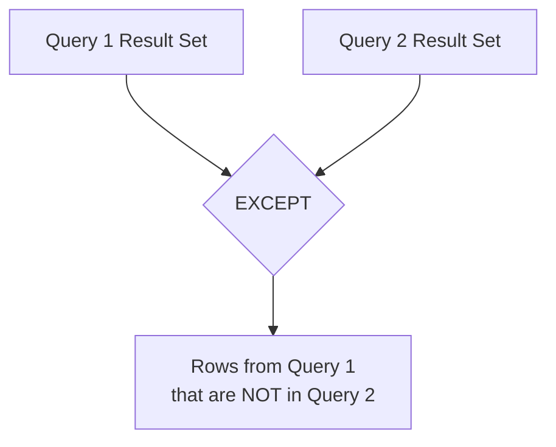

# SQL EXCEPT Operator

## Introduction

The SQL `EXCEPT` operator is a powerful set operation that allows you to compare the results of two queries and return rows that appear in the first query but not in the second. In other words, it subtracts one result set from another, helping you identify unique records or differences between datasets.

Think of `EXCEPT` as similar to subtraction in mathematics or the "difference" operation in set theory. It's especially useful when you need to find records that exist in one table but not in another or to identify exceptions to certain conditions.

## Syntax

The basic syntax of the `EXCEPT` operator is:

```sql
SELECT column1, column2, ...
FROM table1
WHERE condition

EXCEPT

SELECT column1, column2, ...
FROM table2
WHERE condition;
```

**Important rules for using EXCEPT:**

1. The number of columns in both SELECT statements must be the same
2. The corresponding columns must have compatible data types
3. The column names from the first SELECT statement determine the output column names
4. The ORDER BY clause, if used, must appear at the end of the query

## How EXCEPT Works

Let's visualize how the EXCEPT operator works:



## Basic Example

Let's start with a simple example using two tables: `employees` and `managers`.

**Table: employees**

| employee_id | name        | department | salary |
|-------------|-------------|------------|--------|
| 1           | John Smith  | Sales      | 50000  |
| 2           | Mary Jones  | Marketing  | 60000  |
| 3           | Bob Johnson | IT         | 70000  |
| 4           | Alice Brown | HR         | 55000  |
| 5           | Tom Wilson  | Sales      | 52000  |

**Table: managers**

| manager_id | name        | department | salary |
|------------|-------------|------------|--------|
| 101        | Mary Jones  | Marketing  | 90000  |
| 102        | Alice Brown | HR         | 85000  |
| 103        | Steve Davis | Finance    | 95000  |

If we want to find all employees who are not managers, we can use the EXCEPT operator:

```sql
SELECT name
FROM employees

EXCEPT

SELECT name
FROM managers;
```

**Result:**

| name        |
|-------------|
| John Smith  |
| Bob Johnson |
| Tom Wilson  |

The query returns names that exist in the `employees` table but not in the `managers` table.

## EXCEPT with Multiple Columns

You can use EXCEPT with multiple columns to find more specific differences:

```sql
SELECT name, department
FROM employees

EXCEPT

SELECT name, department
FROM managers;
```

**Result:**

| name        | department |
|-------------|------------|
| John Smith  | Sales      |
| Bob Johnson | IT         |
| Tom Wilson  | Sales      |

This returns combinations of name and department that exist in the `employees` table but not in the `managers` table.

## Practical Applications

### 1. Finding Missing Data

EXCEPT is useful for identifying records that should exist in one table but are missing from another. For example, identifying products that are in inventory but not in sales:

```sql
-- Find products in inventory that haven't been sold
SELECT product_id, product_name
FROM inventory

EXCEPT

SELECT product_id, product_name
FROM sales;
```

### 2. Data Validation and Auditing

Use EXCEPT to validate data migration or to audit data consistency between systems:

```sql
-- Check if all customers from the old system were migrated to the new system
SELECT customer_id, email
FROM old_system_customers

EXCEPT

SELECT customer_id, email
FROM new_system_customers;
```

The result would show customers that exist in the old system but not in the new system.

### 3. Finding Changes Between Time Periods

Compare data between different time periods to identify changes:

```sql
-- Find products available last month but not this month
SELECT product_id, product_name
FROM products_april_2024

EXCEPT

SELECT product_id, product_name
FROM products_may_2024;
```

## EXCEPT vs. NOT IN

While EXCEPT and NOT IN can sometimes be used to achieve similar results, they have important differences:

```sql
-- Using EXCEPT
SELECT name FROM employees
EXCEPT
SELECT name FROM managers;

-- Using NOT IN
SELECT name FROM employees
WHERE name NOT IN (SELECT name FROM managers);
```

Key differences:
- EXCEPT handles NULL values differently than NOT IN
- EXCEPT is often more efficient for large datasets
- NOT IN might be more intuitive for simple queries
- EXCEPT is a set operation and follows set operation rules

## EXCEPT vs. NOT EXISTS

NOT EXISTS is another alternative that can be used instead of EXCEPT:

```sql
-- Using NOT EXISTS
SELECT e.name 
FROM employees e
WHERE NOT EXISTS (
    SELECT 1 
    FROM managers m 
    WHERE m.name = e.name
);
```

NOT EXISTS is useful when you need to compare records based on more complex conditions than simple equality.

## EXCEPT ALL Variant

Some database systems support an `EXCEPT ALL` variant, which retains duplicate rows in the result set:

```sql
SELECT department FROM employees
EXCEPT ALL
SELECT department FROM managers;
```

With `EXCEPT ALL`, if a value appears 5 times in the first query result and 2 times in the second query result, it will appear 3 times in the final result.

## Database Compatibility

Not all database systems implement EXCEPT in the same way:

- **Standard SQL**: Uses EXCEPT
- **Microsoft SQL Server**: Uses EXCEPT
- **PostgreSQL**: Uses EXCEPT
- **Oracle**: Uses MINUS instead of EXCEPT
- **MySQL**: Traditionally didn't support EXCEPT directly (using alternative approaches was necessary), but newer versions (8.0+) support it
- **SQLite**: Uses EXCEPT

If you're using Oracle, you would replace EXCEPT with MINUS:

```sql
-- Oracle syntax
SELECT name FROM employees
MINUS
SELECT name FROM managers;
```

## Best Practices

1. **Column compatibility**: Ensure that columns being compared have matching data types
2. **Performance**: For large tables, consider adding appropriate indexes on the columns used in the EXCEPT operation
3. **Readability**: Use column aliases to make your queries more readable, especially with complex operations
4. **Alternatives**: Be aware that NOT EXISTS or LEFT JOIN with NULL checks can sometimes be more efficient
5. **Data quality**: Be cautious with NULL values, as they are handled differently across database systems

## Example with Real-world Data

Let's consider a real-world scenario involving an e-commerce database:

**Table: registered_users**

| user_id | email               | registration_date |
|---------|---------------------|-------------------|
| 1       | john@example.com    | 2023-01-15        |
| 2       | mary@example.com    | 2023-02-10        |
| 3       | bob@example.com     | 2023-03-05        |
| 4       | alice@example.com   | 2023-04-20        |
| 5       | thomas@example.com  | 2023-05-12        |

**Table: paying_customers**

| customer_id | email               | first_purchase_date |
|-------------|---------------------|---------------------|
| 101         | john@example.com    | 2023-02-01          |
| 102         | alice@example.com   | 2023-04-25          |
| 103         | sarah@example.com   | 2023-05-30          |

To find registered users who haven't made any purchases yet (potential leads for marketing):

```sql
-- Find users who registered but haven't made purchases
SELECT user_id, email
FROM registered_users

EXCEPT

SELECT NULL as user_id, email
FROM paying_customers;
```

**Result:**

| user_id | email              |
|---------|-------------------|
| 2       | mary@example.com   |
| 3       | bob@example.com    |
| 5       | thomas@example.com |

This information is valuable for targeting marketing campaigns to convert registered users into paying customers.

## Summary

The SQL EXCEPT operator is a powerful tool for comparing result sets and finding differences between queries. Key points to remember:

- EXCEPT returns rows that appear in the first query but not in the second
- Both queries must have the same number of columns with compatible data types
- EXCEPT is useful for finding missing data, validating migrations, and identifying exceptions
- Different database systems may have slightly different implementations (e.g., Oracle uses MINUS)
- Consider performance implications for large datasets and explore alternatives like NOT EXISTS or LEFT JOIN when appropriate

By mastering the EXCEPT operator, you'll be able to perform more sophisticated data analysis and solve complex business problems more efficiently.

## Exercises

1. Given two tables, `customers` and `premium_customers`, write a query to find all regular customers who are not premium customers.

2. Write a query to find departments that have employees but no managers.

3. Using the `products` and `discontinued_products` tables, find all active products.

4. Create a query that compares sales data between two months and identifies products that sold in January but not in February.

5. Advanced: Write a query using EXCEPT to find customers who placed orders last year but haven't placed any orders this year.

## Additional Resources

- [SQL Set Operations Official Documentation](https://www.postgresql.org/docs/current/queries-union.html)
- [SQL Set Theory for Beginners](https://mode.com/sql-tutorial/sql-set-operations/)
- [Comparing SQL Set Operations: UNION, INTERSECT, and EXCEPT](https://www.essentialsql.com/sql-set-operations-union-intersect-except/)
- [SQL Performance Tuning for Set Operations](https://use-the-index-luke.com/)