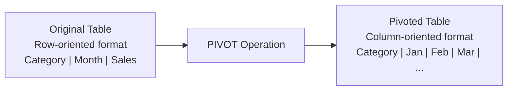

# SQL PIVOT: Transforming Rows into Columns

## Introduction

When analyzing data, you often need to view information from different perspectives. Sometimes data stored in rows would be more meaningful if displayed as columns. This is where SQL's PIVOT operation comes in.

PIVOT is an advanced SQL feature that transforms data from rows into columns, creating a cross-tabular format that's perfect for reporting and data analysis. If you've ever used pivot tables in Excel or other spreadsheet applications, the concept is similar – but now we'll implement it directly in our SQL queries!

## What is SQL PIVOT?

The PIVOT operator rotates a table-valued expression by turning unique values from one column into multiple columns in the output, and performs aggregations on any remaining column values.

Let's visualize what PIVOT does:



## Basic PIVOT Syntax

The syntax for PIVOT varies slightly across different database systems, but here's the general structure in T-SQL (Microsoft SQL Server):

```sql
SELECT [non-pivoted columns], [pivoted columns]
FROM 
    (SELECT [base query columns] FROM [source table]) AS SourceTable
PIVOT
(
    [aggregate function]([column to aggregate])
    FOR [column to pivot] IN ([pivot column values])
) AS PivotTable;
```

Let's break down each component:

- **Base query**: Selects the data you want to pivot from your source table
- **Aggregate function**: Typically SUM, COUNT, AVG, etc.
- **Column to aggregate**: The column whose values you want to aggregate
- **Column to pivot**: The column whose unique values will become columns
- **Pivot column values**: The specific values from the pivot column that will become new columns

## Example 1: Basic PIVOT Operation

Let's start with a simple example. Imagine we have a sales table with product sales by quarter:

```sql
-- Creating a sample table
CREATE TABLE Sales (
    Product VARCHAR(50),
    Quarter VARCHAR(5),
    Amount DECIMAL(10,2)
);

-- Inserting sample data
INSERT INTO Sales (Product, Quarter, Amount) VALUES
('Laptop', 'Q1', 10000),
('Laptop', 'Q2', 12000),
('Laptop', 'Q3', 8000),
('Laptop', 'Q4', 11000),
('Phone', 'Q1', 8000),
('Phone', 'Q2', 9500),
('Phone', 'Q3', 7500),
('Phone', 'Q4', 10500),
('Tablet', 'Q1', 6500),
('Tablet', 'Q2', 7200),
('Tablet', 'Q3', 5800),
('Tablet', 'Q4', 7800);
```

Our table looks like this:

| Product | Quarter | Amount |
|---------|---------|---------|
| Laptop  | Q1      | 10000   |
| Laptop  | Q2      | 12000   |
| Laptop  | Q3      | 8000    |
| Laptop  | Q4      | 11000   |
| Phone   | Q1      | 8000    |
| Phone   | Q2      | 9500    |
| ... and so on |

Now, if we want to transform this data to show products as rows and quarters as columns, we can use PIVOT:

```sql
SELECT Product, Q1, Q2, Q3, Q4
FROM 
    (SELECT Product, Quarter, Amount FROM Sales) AS SourceTable
PIVOT
(
    SUM(Amount)
    FOR Quarter IN (Q1, Q2, Q3, Q4)
) AS PivotTable;
```

The result:

| Product | Q1    | Q2    | Q3    | Q4    |
|---------|-------|-------|-------|-------|
| Laptop  | 10000 | 12000 | 8000  | 11000 |
| Phone   | 8000  | 9500  | 7500  | 10500 |
| Tablet  | 6500  | 7200  | 5800  | 7800  |

Much better! We can now easily compare quarterly performance across products.

## How PIVOT Works Step by Step

Let's break down how the PIVOT operation actually works:

1. **Source data preparation**: First, we select the data we want to pivot
2. **Identifying pivot columns**: We specify which column's values will become new columns (Quarter in our example)
3. **Aggregation**: We specify how to aggregate values when multiple rows match (SUM of Amount in our example)
4. **Transformation**: SQL transforms the data, creating new columns for each value in the pivot column

## Example 2: PIVOT with Multiple Aggregation Columns

Sometimes you need to pivot and aggregate multiple measures. Here's an approach using subqueries:

```sql
-- Creating a sample table with multiple measures
CREATE TABLE SalesDetails (
    Product VARCHAR(50),
    Quarter VARCHAR(5),
    Revenue DECIMAL(10,2),
    Units INT
);

-- Inserting sample data
INSERT INTO SalesDetails (Product, Quarter, Revenue, Units) VALUES
('Laptop', 'Q1', 10000, 20),
('Laptop', 'Q2', 12000, 24),
('Phone', 'Q1', 8000, 40),
('Phone', 'Q2', 9500, 50);
```

Now, let's pivot both Revenue and Units:

```sql
-- Pivot Revenue
SELECT *
FROM
(
    SELECT Product, 
           'Revenue_' + Quarter AS MetricQuarter,
           Revenue AS Value
    FROM SalesDetails
    UNION ALL
    SELECT Product,
           'Units_' + Quarter AS MetricQuarter,
           Units
    FROM SalesDetails
) AS SourceData
PIVOT
(
    SUM(Value)
    FOR MetricQuarter IN (
        [Revenue_Q1], [Revenue_Q2], 
        [Units_Q1], [Units_Q2]
    )
) AS PivotTable;
```

Result:

| Product | Revenue_Q1 | Revenue_Q2 | Units_Q1 | Units_Q2 |
|---------|------------|------------|----------|----------|
| Laptop  | 10000      | 12000      | 20       | 24       |
| Phone   | 8000       | 9500       | 40       | 50       |

## Real-World Applications

### Application 1: Monthly Sales Report

One common use case is generating monthly sales reports:

```sql
-- Sample data: Monthly sales by region
CREATE TABLE RegionalSales (
    Region VARCHAR(50),
    Month VARCHAR(10),
    Sales DECIMAL(10,2)
);

INSERT INTO RegionalSales VALUES
('North', 'January', 45000),
('North', 'February', 42000),
('North', 'March', 50000),
('South', 'January', 38000),
('South', 'February', 35000),
('South', 'March', 40000),
('East', 'January', 62000),
('East', 'February', 58000),
('East', 'March', 63000),
('West', 'January', 54000),
('West', 'February', 52000),
('West', 'March', 58000);

-- Creating a pivot table for monthly regional sales
SELECT Region, [January], [February], [March]
FROM 
    (SELECT Region, Month, Sales FROM RegionalSales) AS SourceTable
PIVOT
(
    SUM(Sales)
    FOR Month IN ([January], [February], [March])
) AS PivotTable;
```

Result:

| Region | January | February | March |
|--------|---------|----------|-------|
| East   | 62000   | 58000    | 63000 |
| North  | 45000   | 42000    | 50000 |
| South  | 38000   | 35000    | 40000 |
| West   | 54000   | 52000    | 58000 |

### Application 2: Survey Results Analysis

PIVOT is excellent for analyzing survey results:

```sql
-- Sample survey data
CREATE TABLE SurveyResponses (
    RespondentID INT,
    Question VARCHAR(50),
    Response INT -- Rating 1-5
);

INSERT INTO SurveyResponses VALUES
(1, 'Ease of Use', 4),
(1, 'Performance', 5),
(1, 'Value', 3),
(2, 'Ease of Use', 3),
(2, 'Performance', 4),
(2, 'Value', 4),
(3, 'Ease of Use', 5),
(3, 'Performance', 5),
(3, 'Value', 5);

-- Pivot to see all responses by respondent
SELECT RespondentID, [Ease of Use], [Performance], [Value]
FROM 
    (SELECT RespondentID, Question, Response FROM SurveyResponses) AS SourceTable
PIVOT
(
    AVG(Response)
    FOR Question IN ([Ease of Use], [Performance], [Value])
) AS PivotTable;
```

Result:

| RespondentID | Ease of Use | Performance | Value |
|--------------|-------------|------------|-------|
| 1            | 4           | 5          | 3     |
| 2            | 3           | 4          | 4     |
| 3            | 5           | 5          | 5     |

## PIVOT in Different Database Systems

### Microsoft SQL Server

SQL Server has a built-in PIVOT operator as shown in our examples.

### MySQL

MySQL doesn't have a direct PIVOT operator but achieves similar results using conditional aggregation:

```sql
SELECT 
    Product,
    SUM(CASE WHEN Quarter = 'Q1' THEN Amount ELSE 0 END) AS Q1,
    SUM(CASE WHEN Quarter = 'Q2' THEN Amount ELSE 0 END) AS Q2,
    SUM(CASE WHEN Quarter = 'Q3' THEN Amount ELSE 0 END) AS Q3,
    SUM(CASE WHEN Quarter = 'Q4' THEN Amount ELSE 0 END) AS Q4
FROM Sales
GROUP BY Product;
```

### PostgreSQL

PostgreSQL uses crosstab functions from the tablefunc extension:

```sql
-- First enable the extension
CREATE EXTENSION IF NOT EXISTS tablefunc;

-- Then use crosstab
SELECT * FROM crosstab(
    'SELECT Product, Quarter, SUM(Amount)
     FROM Sales
     GROUP BY Product, Quarter
     ORDER BY 1,2',
    'SELECT DISTINCT Quarter FROM Sales ORDER BY 1'
) AS ct (Product VARCHAR, Q1 DECIMAL, Q2 DECIMAL, Q3 DECIMAL, Q4 DECIMAL);
```

### Oracle

Oracle uses the PIVOT operator similar to SQL Server:

```sql
SELECT * FROM (
    SELECT Product, Quarter, Amount
    FROM Sales
)
PIVOT (
    SUM(Amount)
    FOR Quarter IN ('Q1' AS Q1, 'Q2' AS Q2, 'Q3' AS Q3, 'Q4' AS Q4)
);
```

## Limitations and Considerations

While PIVOT is powerful, it does have some limitations:

1. **Dynamic Column Names**: The PIVOT operator requires you to explicitly specify the columns to create, which can be problematic if you don't know all possible values in advance.

2. **Performance**: PIVOT operations can be resource-intensive on large datasets.

3. **Complexity**: For more complex pivoting requirements, you might need to use alternative techniques.

## UNPIVOT: The Opposite Operation

Sometimes you need to do the opposite - convert columns to rows. That's where UNPIVOT comes in:

```sql
-- Starting with our pivoted table
SELECT Product, Quarter, Amount
FROM 
(
    SELECT Product, Q1, Q2, Q3, Q4
    FROM PivotedSales
) p
UNPIVOT
(
    Amount FOR Quarter IN (Q1, Q2, Q3, Q4)
) AS UnpivotTable;
```

## Summary

SQL PIVOT is a powerful tool for transforming row-oriented data into column-oriented format, making it easier to analyze and report on your data. Key points to remember:

- PIVOT transforms rows into columns
- It's great for creating cross-tabular reports
- The syntax varies across database systems
- PIVOT requires aggregation functions (SUM, COUNT, AVG, etc.)
- For dynamic pivoting, you may need to use dynamic SQL

With PIVOT, you can present your data in more readable and analyzable formats, making it easier to spot trends and patterns that might otherwise be hidden in row-based data.

## Practice Exercises

1. **Basic Pivot**: Create a PIVOT query that shows total sales by product category for each month of 2023.

2. **Multi-Measure Pivot**: Create a PIVOT that shows both quantity sold and revenue by product for each quarter.

3. **Dynamic Pivot Challenge**: Research how to create a dynamic PIVOT query where you don't know all possible pivot column values in advance.

## Additional Resources

- [SQL Server PIVOT Documentation](https://docs.microsoft.com/en-us/sql/t-sql/queries/from-using-pivot-and-unpivot)
- [MySQL Conditional Aggregation](https://dev.mysql.com/doc/refman/8.0/en/aggregate-functions.html)
- [PostgreSQL tablefunc module](https://www.postgresql.org/docs/current/tablefunc.html)
- [Oracle PIVOT Documentation](https://docs.oracle.com/en/database/oracle/oracle-database/19/sqlrf/PIVOT-Clause.html)