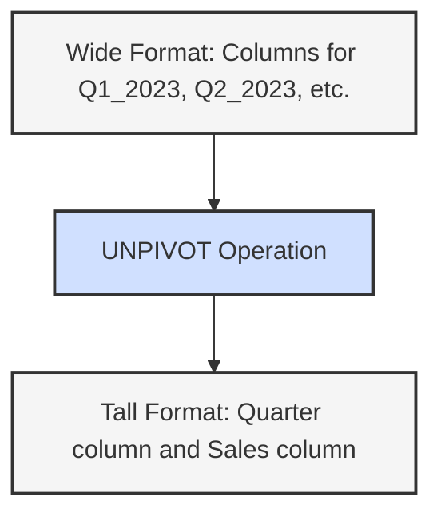

# SQL UNPIVOT

## Introduction

When working with databases, you'll often encounter situations where data is stored in a wide format (many columns) but needs to be analyzed in a tall format (many rows). The SQL `UNPIVOT` operation is a powerful tool that helps you transform columns into rows, effectively reversing what the `PIVOT` operation does.

Think of `UNPIVOT` as a way to normalize denormalized data. It's particularly useful when you need to:

- Convert reports or crosstab data back into a relational format
- Transform spreadsheet-like data into a more database-friendly structure
- Prepare data for certain types of analysis or visualization

## Understanding UNPIVOT

### The Concept

The `UNPIVOT` operation takes multiple columns and converts them into rows with two main components:
1. A column that will contain the former column names
2. A column that will contain the values from those columns

### Basic Syntax

```sql
SELECT column1, column2, ...
FROM table_name
UNPIVOT
(
    value_column      -- The column that will store the values
    FOR name_column   -- The column that will store the original column names
    IN (column_list)  -- The list of columns to be unpivoted
) AS unpivot_alias;
```

## UNPIVOT in Action: Basic Example

Let's start with a simple example. Imagine we have a table of product sales by quarter:

### Original Table: `ProductSales`

```
ProductID | Q1_2023 | Q2_2023 | Q3_2023 | Q4_2023
----------|---------|---------|---------|--------
1         | 10000   | 15000   | 12000   | 18000
2         | 8000    | 9000    | 10000   | 11000
3         | 5000    | 4000    | 4500    | 6000
```

To analyze this data by quarter, we can unpivot it:

```sql
SELECT 
    ProductID,
    Quarter,
    Sales
FROM ProductSales
UNPIVOT
(
    Sales           -- Column to store values
    FOR Quarter     -- Column to store original column names
    IN (Q1_2023, Q2_2023, Q3_2023, Q4_2023)  -- Columns to unpivot
) AS UnpivotedSales;
```

### Result:

```
ProductID | Quarter | Sales
----------|---------|-------
1         | Q1_2023 | 10000
1         | Q2_2023 | 15000
1         | Q3_2023 | 12000
1         | Q4_2023 | 18000
2         | Q1_2023 | 8000
2         | Q2_2023 | 9000
2         | Q3_2023 | 10000
2         | Q4_2023 | 11000
3         | Q1_2023 | 5000
3         | Q2_2023 | 4000
3         | Q3_2023 | 4500
3         | Q4_2023 | 6000
```

The transformation is visualized below:



## Handling NULL Values

By default, `UNPIVOT` excludes rows where the original column values are NULL. If you want to include NULL values, you need to use a different approach. Here's how you can handle it:

```sql
SELECT 
    ProductID,
    Quarter,
    Sales
FROM 
(
    SELECT 
        ProductID, 
        ISNULL(Q1_2023, 0) AS Q1_2023, 
        ISNULL(Q2_2023, 0) AS Q2_2023,
        ISNULL(Q3_2023, 0) AS Q3_2023, 
        ISNULL(Q4_2023, 0) AS Q4_2023
    FROM ProductSales
) p
UNPIVOT
(
    Sales
    FOR Quarter IN (Q1_2023, Q2_2023, Q3_2023, Q4_2023)
) AS UnpivotedSales;
```

## UNPIVOT with Multiple Measure Columns

Sometimes you might need to unpivot multiple measure columns at once. You can do this with a combination of `UNPIVOT` and `CROSS APPLY`.

### Original Table: `ProductMetrics`

```
ProductID | Q1_Sales | Q1_Profit | Q2_Sales | Q2_Profit
----------|----------|-----------|----------|----------
1         | 10000    | 3000      | 15000    | 4500
2         | 8000     | 2400      | 9000     | 2700
```

To unpivot this into a format with Quarter, Metric, and Value columns:

```sql
SELECT 
    ProductID,
    SUBSTRING(Measure, 1, 2) AS Quarter,
    SUBSTRING(Measure, 4, LEN(Measure)) AS Metric,
    Value
FROM ProductMetrics
UNPIVOT
(
    Value
    FOR Measure IN (Q1_Sales, Q1_Profit, Q2_Sales, Q2_Profit)
) AS UnpivotedMetrics;
```

### Result:

```
ProductID | Quarter | Metric | Value
----------|---------|--------|-------
1         | Q1      | Sales  | 10000
1         | Q1      | Profit | 3000
1         | Q2      | Sales  | 15000
1         | Q2      | Profit | 4500
2         | Q1      | Sales  | 8000
2         | Q1      | Profit | 2400
2         | Q2      | Sales  | 9000
2         | Q2      | Profit | 2700
```

## UNPIVOT in Different Database Systems

### Microsoft SQL Server

SQL Server provides native `UNPIVOT` support as shown in the examples above.

### Oracle

Oracle's syntax is slightly different:

```sql
SELECT ProductID, Quarter, Sales
FROM ProductSales
UNPIVOT (Sales FOR Quarter IN (
    Q1_2023 AS 'Q1_2023',
    Q2_2023 AS 'Q2_2023',
    Q3_2023 AS 'Q3_2023',
    Q4_2023 AS 'Q4_2023'
));
```

### PostgreSQL and MySQL

These databases don't have a native `UNPIVOT` operator, but you can achieve the same result using `UNION ALL`:

```sql
SELECT ProductID, 'Q1_2023' AS Quarter, Q1_2023 AS Sales FROM ProductSales
UNION ALL
SELECT ProductID, 'Q2_2023' AS Quarter, Q2_2023 AS Sales FROM ProductSales
UNION ALL
SELECT ProductID, 'Q3_2023' AS Quarter, Q3_2023 AS Sales FROM ProductSales
UNION ALL
SELECT ProductID, 'Q4_2023' AS Quarter, Q4_2023 AS Sales FROM ProductSales;
```

## Real-World Application: Sales Analysis

Let's look at a practical example of how `UNPIVOT` can be used in a real-world scenario.

Imagine you're analyzing sales data for a retail company. You have a table with monthly sales figures for different regions:

### Original Table: `RegionalSales`

```
Region    | Jan_2023 | Feb_2023 | Mar_2023 | Apr_2023 | May_2023 | Jun_2023
----------|----------|----------|----------|----------|----------|--------
North     | 120000   | 115000   | 118000   | 125000   | 130000   | 140000
South     | 95000    | 98000    | 102000   | 105000   | 108000   | 112000
East      | 88000    | 90000    | 92000    | 94000    | 98000    | 105000
West      | 110000   | 112000   | 115000   | 118000   | 122000   | 128000
```

To analyze sales trends over time or compare monthly performance across regions, you need to transform this wide format into a tall format:

```sql
SELECT 
    Region,
    SUBSTRING(Month, 1, 3) AS MonthName,
    SUBSTRING(Month, 5, 4) AS Year,
    Sales
FROM RegionalSales
UNPIVOT
(
    Sales
    FOR Month IN (Jan_2023, Feb_2023, Mar_2023, Apr_2023, May_2023, Jun_2023)
) AS UnpivotedSales
ORDER BY Year, CASE 
             WHEN MonthName = 'Jan' THEN 1
             WHEN MonthName = 'Feb' THEN 2
             WHEN MonthName = 'Mar' THEN 3
             WHEN MonthName = 'Apr' THEN 4
             WHEN MonthName = 'May' THEN 5
             WHEN MonthName = 'Jun' THEN 6
             END, 
         Region;
```

This transformation allows you to:
- Create time series visualizations for each region
- Compare monthly performance across regions
- Calculate month-over-month growth rates
- Apply time-based aggregations (quarterly totals, etc.)

## Using UNPIVOT for Data Cleaning

Another common use for `UNPIVOT` is data cleaning and preparation. Consider a scenario where you have survey data with responses in multiple columns:

### Original Table: `SurveyResponses`

```
RespondentID | Question1 | Question2 | Question3 | Question4
-------------|-----------|-----------|-----------|----------
1            | 5         | 4         | 3         | 5
2            | 4         | NULL      | 5         | 4
3            | 3         | 5         | 4         | 2
```

Unpivoting this data makes it easier to analyze:

```sql
SELECT 
    RespondentID,
    REPLACE(Question, 'Question', '') AS QuestionNumber,
    Response
FROM SurveyResponses
UNPIVOT
(
    Response
    FOR Question IN (Question1, Question2, Question3, Question4)
) AS UnpivotedSurvey
WHERE Response IS NOT NULL;
```

### Result:

```
RespondentID | QuestionNumber | Response
-------------|----------------|--------
1            | 1              | 5
1            | 2              | 4
1            | 3              | 3
1            | 4              | 5
2            | 1              | 4
2            | 3              | 5
2            | 4              | 4
3            | 1              | 3
3            | 2              | 5
3            | 3              | 4
3            | 4              | 2
```

This makes it much easier to perform analyses like:
- Average score per question
- Distribution of responses for each question
- Correlation between different question responses

## Summary

The SQL `UNPIVOT` operation is a powerful tool for transforming wide format data (many columns) into tall format data (many rows). It's essential for data analysis, reporting, and data cleaning tasks.

Key takeaways:
- `UNPIVOT` converts columns into rows with two main components: a column for names and a column for values
- It's the opposite of the `PIVOT` operation
- Different database systems have slightly different syntax
- When `UNPIVOT` isn't available, you can use `UNION ALL` as an alternative
- Real-world applications include sales analysis, survey data analysis, and data cleaning

## Practice Exercises

1. Given a table `EmployeeSkills` with columns `EmployeeID`, `SQL`, `Python`, `Java`, and `JavaScript` with values 1-5 representing skill levels, write a query to unpivot this data.

2. You have a `WeatherData` table with columns `CityID`, `Jan_Temp`, `Feb_Temp`, `Mar_Temp`, etc. Write an unpivot query to analyze temperature trends over months.

3. Challenge: For a table `ProductInventory` with columns `ProductID`, `WarehouseA_Stock`, `WarehouseA_Capacity`, `WarehouseB_Stock`, `WarehouseB_Capacity`, write a query that unpivots the data to show each warehouse's stock and capacity in separate rows.

## Additional Resources

- [Microsoft SQL Server Documentation on UNPIVOT](https://docs.microsoft.com/en-us/sql/t-sql/queries/from-using-pivot-and-unpivot)
- [Oracle Documentation on UNPIVOT](https://docs.oracle.com/en/database/oracle/oracle-database/19/sqlrf/UNPIVOT-Clause.html)
- [Data Transformation Techniques in SQL](https://www.red-gate.com/simple-talk/sql/t-sql-programming/data-transformations-pivot-unpivot-and-reverse-pivot/)
- [Advanced SQL: PIVOT and UNPIVOT Operations](https://www.sqlshack.com/sql-pivot-and-unpivot-operations/)