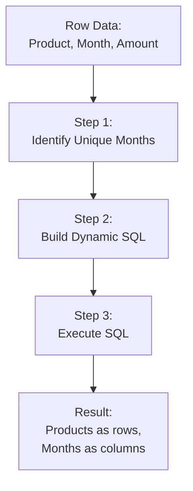

# SQL Dynamic Pivot

## Introduction

When analyzing data, you often need to transform rows into columns to create summary reports or cross-tabular views. While SQL's static `PIVOT` operator works well for known column values, real-world scenarios frequently require **dynamic pivoting** where the column names aren't known in advance.

This tutorial explores SQL Dynamic Pivot - a powerful technique that uses dynamic SQL to create flexible pivot tables that adapt to your data. By the end, you'll be able to transform row-based data into column-based reports automatically, regardless of what values appear in your dataset.

## Prerequisites

Before diving into dynamic pivoting, you should have:
- Basic SQL knowledge (SELECT, JOIN, GROUP BY)
- Understanding of static PIVOT operations
- Familiarity with stored procedures (helpful but not required)

## Understanding the Problem

Let's start with a common scenario. Imagine you have sales data with columns for product, month, and amount:

```sql
CREATE TABLE Sales (
    ProductName VARCHAR(50),
    SaleMonth VARCHAR(10),
    SaleAmount DECIMAL(10,2)
);

INSERT INTO Sales VALUES
('Laptop', 'Jan', 1200.00),
('Laptop', 'Feb', 1500.00),
('Phone', 'Jan', 800.00),
('Phone', 'Feb', 950.00),
('Tablet', 'Jan', 450.00),
('Tablet', 'Mar', 500.00);
```

With this data:

```
| ProductName | SaleMonth | SaleAmount |
|-------------|-----------|------------|
| Laptop      | Jan       | 1200.00    |
| Laptop      | Feb       | 1500.00    |
| Phone       | Jan       | 800.00     |
| Phone       | Feb       | 950.00     |
| Tablet      | Jan       | 450.00     |
| Tablet      | Mar       | 500.00     |
```

You want to create a report with products as rows and months as columns:

```
| ProductName | Jan     | Feb     | Mar    |
|-------------|---------|---------|--------|
| Laptop      | 1200.00 | 1500.00 | NULL   |
| Phone       | 800.00  | 950.00  | NULL   |
| Tablet      | 450.00  | NULL    | 500.00 |
```

With a static PIVOT, you could write:

```sql
SELECT ProductName, [Jan], [Feb], [Mar]
FROM Sales
PIVOT (
    SUM(SaleAmount)
    FOR SaleMonth IN ([Jan], [Feb], [Mar])
) AS PivotTable;
```

But what if your data includes sales for April, May, and other months later? You'd need to constantly update your query. This is where dynamic pivoting comes in.

## Dynamic Pivot: Step by Step

Dynamic pivoting consists of three key steps:

1. Identifying the unique values that will become columns
2. Building a SQL string with those values
3. Executing the dynamically built SQL

Let's break down each step:

### Step 1: Identify Column Values

First, we need to determine what values from our data will become columns:

```sql
DECLARE @ColumnNames NVARCHAR(MAX) = '';

SELECT @ColumnNames = @ColumnNames + QUOTENAME(SaleMonth) + ','
FROM (SELECT DISTINCT SaleMonth FROM Sales) AS Months
ORDER BY SaleMonth;

-- Remove the trailing comma
SET @ColumnNames = LEFT(@ColumnNames, LEN(@ColumnNames) - 1);
```

This code builds a comma-separated list of column names wrapped in square brackets (via the QUOTENAME function), like: `[Jan],[Feb],[Mar]`

### Step 2: Build the Dynamic SQL

Next, we construct the complete SQL statement as a string:

```sql
DECLARE @SQL NVARCHAR(MAX) = '
SELECT ProductName, ' + @ColumnNames + '
FROM Sales
PIVOT (
    SUM(SaleAmount)
    FOR SaleMonth IN (' + @ColumnNames + ')
) AS PivotTable;';
```

### Step 3: Execute the Dynamic SQL

Finally, we execute our dynamically built query:

```sql
EXEC sp_executesql @SQL;
```

## Complete Dynamic Pivot Example

Let's put it all together in a complete example:

```sql
-- Create and populate the sample table
CREATE TABLE Sales (
    ProductName VARCHAR(50),
    SaleMonth VARCHAR(10),
    SaleAmount DECIMAL(10,2)
);

INSERT INTO Sales VALUES
('Laptop', 'Jan', 1200.00),
('Laptop', 'Feb', 1500.00),
('Phone', 'Jan', 800.00),
('Phone', 'Feb', 950.00),
('Tablet', 'Jan', 450.00),
('Tablet', 'Mar', 500.00);

-- Dynamic pivot query
DECLARE @ColumnNames NVARCHAR(MAX) = '';
DECLARE @SQL NVARCHAR(MAX);

-- Get the list of months to pivot (dynamically)
SELECT @ColumnNames = @ColumnNames + QUOTENAME(SaleMonth) + ','
FROM (SELECT DISTINCT SaleMonth FROM Sales) AS Months
ORDER BY SaleMonth;

-- Remove the trailing comma
SET @ColumnNames = LEFT(@ColumnNames, LEN(@ColumnNames) - 1);

-- Build the dynamic SQL statement
SET @SQL = N'
SELECT ProductName, ' + @ColumnNames + '
FROM Sales
PIVOT (
    SUM(SaleAmount)
    FOR SaleMonth IN (' + @ColumnNames + ')
) AS PivotTable;';

-- Execute the dynamic SQL
EXEC sp_executesql @SQL;

-- Clean up
DROP TABLE Sales;
```

The result will be:

```
| ProductName | Jan     | Feb     | Mar    |
|-------------|---------|---------|--------|
| Laptop      | 1200.00 | 1500.00 | NULL   |
| Phone       | 800.00  | 950.00  | NULL   |
| Tablet      | 450.00  | NULL    | 500.00 |
```

Let's visualize the transformation process:



## Advanced Techniques

### Adding Column Totals

You can extend the dynamic pivot query to include totals:

```sql
DECLARE @ColumnNames NVARCHAR(MAX) = '';
DECLARE @ColumnNamesWithTotal NVARCHAR(MAX) = '';
DECLARE @SQL NVARCHAR(MAX);

-- Get the list of months to pivot
SELECT @ColumnNames = @ColumnNames + QUOTENAME(SaleMonth) + ',',
       @ColumnNamesWithTotal = @ColumnNamesWithTotal + 'ISNULL(' + QUOTENAME(SaleMonth) + ', 0) + '
FROM (SELECT DISTINCT SaleMonth FROM Sales) AS Months
ORDER BY SaleMonth;

-- Remove the trailing characters
SET @ColumnNames = LEFT(@ColumnNames, LEN(@ColumnNames) - 1);
SET @ColumnNamesWithTotal = LEFT(@ColumnNamesWithTotal, LEN(@ColumnNamesWithTotal) - 3);

-- Build the dynamic SQL statement with totals
SET @SQL = N'
SELECT ProductName, ' + @ColumnNames + ', ' + @ColumnNamesWithTotal + ' AS Total
FROM Sales
PIVOT (
    SUM(SaleAmount)
    FOR SaleMonth IN (' + @ColumnNames + ')
) AS PivotTable
ORDER BY ProductName;';

-- Execute the dynamic SQL
EXEC sp_executesql @SQL;
```

### Formatting and NULL Handling

For better reporting, you might want to handle NULL values and format numbers:

```sql
DECLARE @ColumnNames NVARCHAR(MAX) = '';
DECLARE @ColumnNamesFormatted NVARCHAR(MAX) = '';
DECLARE @SQL NVARCHAR(MAX);

-- Get columns with NULL handling and formatting
SELECT @ColumnNames = @ColumnNames + QUOTENAME(SaleMonth) + ',',
       @ColumnNamesFormatted = @ColumnNamesFormatted + 'ISNULL(' + QUOTENAME(SaleMonth) + ', 0) AS ' + 
                               QUOTENAME(SaleMonth) + ','
FROM (SELECT DISTINCT SaleMonth FROM Sales) AS Months
ORDER BY SaleMonth;

-- Remove trailing commas
SET @ColumnNames = LEFT(@ColumnNames, LEN(@ColumnNames) - 1);
SET @ColumnNamesFormatted = LEFT(@ColumnNamesFormatted, LEN(@ColumnNamesFormatted) - 1);

-- Build and execute query
SET @SQL = N'
SELECT ProductName, ' + @ColumnNamesFormatted + '
FROM Sales
PIVOT (
    SUM(SaleAmount)
    FOR SaleMonth IN (' + @ColumnNames + ')
) AS PivotTable;';

EXEC sp_executesql @SQL;
```

## Stored Procedure Implementation

In a production environment, you'll want to encapsulate this logic in a reusable stored procedure:

```sql
CREATE PROCEDURE sp_DynamicPivot
    @TableName NVARCHAR(128),
    @RowField NVARCHAR(128),
    @ColumnField NVARCHAR(128),
    @ValueField NVARCHAR(128),
    @AggregateFunction NVARCHAR(20) = 'SUM'
AS
BEGIN
    DECLARE @ColumnNames NVARCHAR(MAX) = '';
    DECLARE @SQL NVARCHAR(MAX);

    -- Build the column list dynamically
    DECLARE @ColumnQuery NVARCHAR(MAX) = N'
    SELECT @ColumnNames = @ColumnNames + QUOTENAME(' + @ColumnField + ') + '',''
    FROM (SELECT DISTINCT ' + @ColumnField + ' FROM ' + @TableName + ') AS DistinctColumns
    ORDER BY ' + @ColumnField;

    -- Execute the column query
    EXEC sp_executesql @ColumnQuery, N'@ColumnNames NVARCHAR(MAX) OUTPUT', @ColumnNames OUTPUT;

    -- Remove the trailing comma
    SET @ColumnNames = LEFT(@ColumnNames, LEN(@ColumnNames) - 1);

    -- Build the pivot query
    SET @SQL = N'
    SELECT ' + @RowField + ', ' + @ColumnNames + '
    FROM ' + @TableName + '
    PIVOT (
        ' + @AggregateFunction + '(' + @ValueField + ')
        FOR ' + @ColumnField + ' IN (' + @ColumnNames + ')
    ) AS PivotTable
    ORDER BY ' + @RowField;

    -- Execute the pivot query
    EXEC sp_executesql @SQL;
END;
```

Usage example:

```sql
EXEC sp_DynamicPivot
    @TableName = 'Sales',
    @RowField = 'ProductName',
    @ColumnField = 'SaleMonth',
    @ValueField = 'SaleAmount',
    @AggregateFunction = 'SUM';
```

## Real-world Application: Sales Dashboard

Let's implement a practical example - a quarterly sales dashboard:

```sql
-- Create more comprehensive sales data
CREATE TABLE SalesData (
    SalesID INT IDENTITY(1,1) PRIMARY KEY,
    ProductCategory VARCHAR(50),
    ProductName VARCHAR(50),
    SaleYear INT,
    SaleQuarter VARCHAR(2),
    SaleAmount DECIMAL(10,2)
);

-- Insert sample data
INSERT INTO SalesData (ProductCategory, ProductName, SaleYear, SaleQuarter, SaleAmount)
VALUES
-- 2023 data
('Electronics', 'Laptop', 2023, 'Q1', 12500.00),
('Electronics', 'Phone', 2023, 'Q1', 8400.00),
('Electronics', 'Tablet', 2023, 'Q1', 4200.00),
('Electronics', 'Laptop', 2023, 'Q2', 13800.00),
('Electronics', 'Phone', 2023, 'Q2', 9200.00),
('Electronics', 'Tablet', 2023, 'Q2', 4800.00),
('Electronics', 'Laptop', 2023, 'Q3', 14200.00),
('Electronics', 'Phone', 2023, 'Q3', 9800.00),
('Electronics', 'Tablet', 2023, 'Q3', 5100.00),
('Electronics', 'Laptop', 2023, 'Q4', 16500.00),
('Electronics', 'Phone', 2023, 'Q4', 11200.00),
('Electronics', 'Tablet', 2023, 'Q4', 6300.00),
-- 2024 data
('Electronics', 'Laptop', 2024, 'Q1', 15800.00),
('Electronics', 'Phone', 2024, 'Q1', 10500.00),
('Electronics', 'Tablet', 2024, 'Q1', 5600.00),
('Electronics', 'Laptop', 2024, 'Q2', 16700.00),
('Electronics', 'Phone', 2024, 'Q2', 11800.00),
('Electronics', 'Tablet', 2024, 'Q2', 6100.00);

-- Dynamic pivot by Year and Quarter
DECLARE @ColumnNames NVARCHAR(MAX) = '';
DECLARE @SQL NVARCHAR(MAX);

-- Build columns as Year_Quarter combinations
SELECT @ColumnNames = @ColumnNames + QUOTENAME(CAST(SaleYear AS VARCHAR) + '_' + SaleQuarter) + ','
FROM (SELECT DISTINCT SaleYear, SaleQuarter FROM SalesData) AS YearQuarters
ORDER BY SaleYear, SaleQuarter;

-- Remove trailing comma
SET @ColumnNames = LEFT(@ColumnNames, LEN(@ColumnNames) - 1);

-- Build the dynamic SQL for a sales dashboard
SET @SQL = N'
SELECT 
    ProductCategory,
    ProductName, 
    ' + @ColumnNames + ',
    (' + REPLACE(@ColumnNames, ',', ' + ') + ') AS GrandTotal
FROM SalesData
PIVOT (
    SUM(SaleAmount)
    FOR (CAST(SaleYear AS VARCHAR) + ''_'' + SaleQuarter) IN (' + @ColumnNames + ')
) AS PivotTable
ORDER BY ProductCategory, ProductName;';

-- Execute the query
EXEC sp_executesql @SQL;

-- Clean up
DROP TABLE SalesData;
```

This produces a comprehensive sales dashboard showing quarterly performance across multiple years:

```
| ProductCategory | ProductName | 2023_Q1  | 2023_Q2  | 2023_Q3  | 2023_Q4  | 2024_Q1  | 2024_Q2  | GrandTotal |
|----------------|------------|----------|----------|----------|----------|----------|----------|------------|
| Electronics    | Laptop     | 12500.00 | 13800.00 | 14200.00 | 16500.00 | 15800.00 | 16700.00 | 89500.00   |
| Electronics    | Phone      | 8400.00  | 9200.00  | 9800.00  | 11200.00 | 10500.00 | 11800.00 | 60900.00   |
| Electronics    | Tablet     | 4200.00  | 4800.00  | 5100.00  | 6300.00  | 5600.00  | 6100.00  | 32100.00   |
```

## Common Challenges and Solutions

### 1. Performance with Large Datasets

For large datasets, consider:
- Adding appropriate indexes
- Using a temporary table for the distinct column values
- Filtering data before pivoting

```sql
-- Using temporary table for better performance
DECLARE @ColumnNames NVARCHAR(MAX) = '';

-- Create temp table with distinct values
SELECT DISTINCT SaleMonth 
INTO #TempMonths
FROM Sales
WHERE SaleYear = 2024; -- Pre-filter to reduce scope

-- Build column names from temp table
SELECT @ColumnNames = @ColumnNames + QUOTENAME(SaleMonth) + ','
FROM #TempMonths
ORDER BY SaleMonth;

-- Continue with the dynamic pivot as before...

-- Clean up
DROP TABLE #TempMonths;
```

### 2. Handling Special Characters

When dealing with column names that contain special characters:

```sql
-- Always use QUOTENAME() to properly escape column names
SELECT @ColumnNames = @ColumnNames + QUOTENAME(ColumnWithSpecialChars) + ','
FROM YourTable;
```

### 3. Ordering Columns Logically

To ensure columns appear in a logical order (e.g., Jan, Feb, Mar instead of alphabetical):

```sql
-- For months
DECLARE @MonthOrder TABLE (MonthName VARCHAR(10), SortOrder INT);
INSERT INTO @MonthOrder VALUES 
('Jan', 1), ('Feb', 2), ('Mar', 3), ('Apr', 4),
('May', 5), ('Jun', 6), ('Jul', 7), ('Aug', 8),
('Sep', 9), ('Oct', 10), ('Nov', 11), ('Dec', 12);

SELECT @ColumnNames = @ColumnNames + QUOTENAME(s.SaleMonth) + ','
FROM (SELECT DISTINCT SaleMonth FROM Sales) AS s
JOIN @MonthOrder m ON s.SaleMonth = m.MonthName
ORDER BY m.SortOrder;
```

## Summary

SQL Dynamic Pivot transforms your data analysis capabilities by allowing you to:

1. Create flexible reports with columns determined at runtime
2. Avoid hard-coding column names in your queries
3. Build dashboards that automatically adapt to new data
4. Generate cross-tabular reports for business intelligence

The technique relies on three core steps:
1. Identifying unique column values from your data
2. Building a dynamic SQL string with those values
3. Executing the SQL using sp_executesql

While it requires more complex code than static pivots, the flexibility and power it provides for reporting make it an essential tool in any SQL developer's toolkit.

## Exercises

1. **Basic Exercise**: Modify the sales example to pivot by product and show months as columns.

2. **Intermediate Exercise**: Create a dynamic pivot that shows employee sales performance by quarter with appropriate formatting.

3. **Advanced Exercise**: Build a stored procedure that generates a dynamic pivot table for any table in your database, allowing the user to specify row fields, column fields, and aggregation methods.

## Additional Resources

- [Microsoft Documentation on PIVOT](https://docs.microsoft.com/en-us/sql/t-sql/queries/from-using-pivot-and-unpivot)
- [SQL Server Dynamic PIVOT Performance Tips](https://www.sqlshack.com/dynamic-pivot-queries-in-sql-server/)
- [Advanced Reporting Techniques with SQL Server](https://www.red-gate.com/simple-talk/sql/t-sql-programming/creating-cross-tab-queries-and-pivot-tables-in-sql/)

Happy coding!