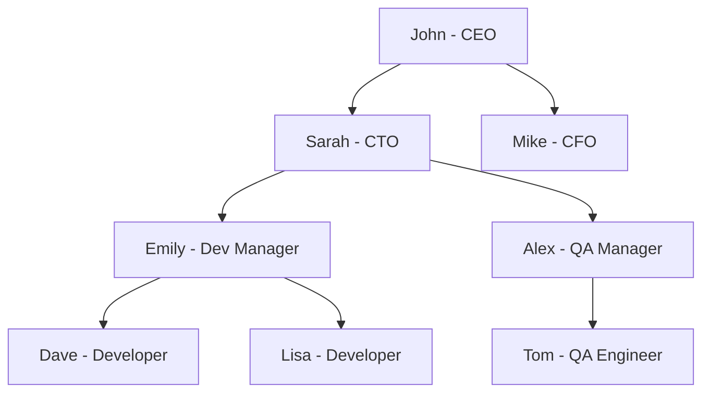

# SQL Hierarchical Queries

## Introduction

In real-world applications, data is often organized in hierarchical relationships. Think of an organizational chart with managers and employees, a file system with folders and subfolders, or a product category system with main categories and subcategories. These structures form parent-child relationships that can be challenging to query with standard SQL.

Hierarchical queries allow you to navigate and analyze these tree-like structures efficiently. In this tutorial, we'll explore various techniques to work with hierarchical data in SQL, from basic approaches to advanced recursive queries.

## Understanding Hierarchical Data

Hierarchical data typically has these characteristics:
- Each record can have one parent
- Each record can have multiple children
- Records form a tree-like structure

Let's consider a simple example of an employee organization chart:



In a database, this hierarchy might be represented in a table like this:

```sql
CREATE TABLE employees (
    employee_id INT PRIMARY KEY,
    name VARCHAR(100),
    position VARCHAR(100),
    manager_id INT,
    FOREIGN KEY (manager_id) REFERENCES employees(employee_id)
);

INSERT INTO employees VALUES
(1, 'John', 'CEO', NULL),
(2, 'Sarah', 'CTO', 1),
(3, 'Mike', 'CFO', 1),
(4, 'Emily', 'Dev Manager', 2),
(5, 'Alex', 'QA Manager', 2),
(6, 'Dave', 'Developer', 4),
(7, 'Lisa', 'Developer', 4),
(8, 'Tom', 'QA Engineer', 5);
```

Notice how the `manager_id` column references the `employee_id` of another row in the same table. This self-referential foreign key creates the parent-child relationship.

## Basic Hierarchical Query Techniques

### 1. Simple Parent-Child Queries

To find all direct reports of a specific manager, you can use a simple WHERE clause:

```sql
SELECT e.employee_id, e.name, e.position
FROM employees e
WHERE e.manager_id = 2;
```

Result:
```
employee_id | name  | position
------------+-------+-------------
4           | Emily | Dev Manager
5           | Alex  | QA Manager
```

This only returns the immediate children (direct reports) of the manager with ID 2 (Sarah).

### 2. Multi-Level Hierarchy with Joins

To go one level deeper and include the "grandchildren" (employees who report to Sarah's direct reports), you can use multiple joins:

```sql
SELECT m.name AS manager, d.name AS direct_report, i.name AS indirect_report
FROM employees m
LEFT JOIN employees d ON d.manager_id = m.employee_id
LEFT JOIN employees i ON i.manager_id = d.employee_id
WHERE m.employee_id = 2;
```

Result:
```
manager | direct_report | indirect_report
--------+---------------+----------------
Sarah   | Emily         | Dave
Sarah   | Emily         | Lisa
Sarah   | Alex          | Tom
```

The problem with this approach is that you need to know the depth of your hierarchy in advance, and you need one join per level. This becomes unwieldy for deep hierarchies.

## Advanced Hierarchical Query Techniques

### 1. Recursive Common Table Expressions (CTEs)

The most powerful and flexible way to handle hierarchical data in modern SQL is with recursive Common Table Expressions (CTEs). Introduced in SQL:1999, this feature is supported by most modern database systems including PostgreSQL, MySQL, SQL Server, and Oracle.

A recursive CTE has two parts:
1. An anchor member (the starting point)
2. A recursive member (the part that references itself)

Let's use a recursive CTE to find all employees under a specific manager at any level of depth:

```sql
WITH RECURSIVE org_hierarchy AS (
    -- Anchor member: starting with employee ID 2 (Sarah)
    SELECT employee_id, name, position, manager_id, 0 AS level
    FROM employees
    WHERE employee_id = 2
    
    UNION ALL
    
    -- Recursive member: get all employees who report to the current employee
    SELECT e.employee_id, e.name, e.position, e.manager_id, h.level + 1
    FROM employees e
    JOIN org_hierarchy h ON e.manager_id = h.employee_id
)
SELECT level, employee_id, name, position
FROM org_hierarchy
ORDER BY level, name;
```

Result:
```
level | employee_id | name  | position
------+-------------+-------+-------------
0     | 2           | Sarah | CTO
1     | 4           | Emily | Dev Manager
1     | 5           | Alex  | QA Manager
2     | 6           | Dave  | Developer
2     | 7           | Lisa  | Developer
2     | 8           | Tom   | QA Engineer
```

How it works:
1. The anchor member selects Sarah (ID 2)
2. The recursive member finds all employees whose manager_id matches the employee_id from the previous iteration
3. The process repeats until no more matching employees are found
4. We track the hierarchy level with the `level` column

### 2. Finding All Ancestors

To go in the opposite direction and find all managers above an employee, we can reverse the recursion:

```sql
WITH RECURSIVE management_chain AS (
    -- Anchor: start with employee ID 7 (Lisa)
    SELECT employee_id, name, position, manager_id, 0 AS level
    FROM employees
    WHERE employee_id = 7
    
    UNION ALL
    
    -- Recursive: get the manager of the current employee
    SELECT e.employee_id, e.name, e.position, e.manager_id, c.level + 1
    FROM employees e
    JOIN management_chain c ON e.employee_id = c.manager_id
)
SELECT level, employee_id, name, position
FROM management_chain
ORDER BY level;
```

Result:
```
level | employee_id | name  | position
------+-------------+-------+-------------
0     | 7           | Lisa  | Developer
1     | 4           | Emily | Dev Manager
2     | 2           | Sarah | CTO
3     | 1           | John  | CEO
```

### 3. Path Generation

To visualize the full path from the root to a node, we can build a path string:

```sql
WITH RECURSIVE emp_paths AS (
    -- Anchor: start with employees who have no manager (CEO)
    SELECT employee_id, name, position, manager_id, CAST(name AS VARCHAR(1000)) AS path
    FROM employees
    WHERE manager_id IS NULL
    
    UNION ALL
    
    -- Recursive: append the current employee name to the path
    SELECT e.employee_id, e.name, e.position, e.manager_id, 
           CONCAT(p.path, ' > ', e.name) AS path
    FROM employees e
    JOIN emp_paths p ON e.manager_id = p.employee_id
)
SELECT employee_id, name, position, path
FROM emp_paths
ORDER BY path;
```

Result:
```
employee_id | name  | position      | path
------------+-------+---------------+-------------------------
1           | John  | CEO           | John
2           | Sarah | CTO           | John > Sarah
4           | Emily | Dev Manager   | John > Sarah > Emily
6           | Dave  | Developer     | John > Sarah > Emily > Dave
7           | Lisa  | Developer     | John > Sarah > Emily > Lisa
5           | Alex  | QA Manager    | John > Sarah > Alex
8           | Tom   | QA Engineer   | John > Sarah > Alex > Tom
3           | Mike  | CFO           | John > Mike
```

## Database-Specific Hierarchical Query Features

Different database systems offer specialized syntax for hierarchical queries:

### Oracle: CONNECT BY

Oracle provides a dedicated CONNECT BY syntax for hierarchical queries:

```sql
-- Finding all employees under Sarah (ID 2)
SELECT LEVEL, employee_id, name, position
FROM employees
START WITH employee_id = 2
CONNECT BY PRIOR employee_id = manager_id
ORDER BY LEVEL, name;
```

### SQL Server: Hierarchyid

SQL Server offers a `hierarchyid` data type to store and manipulate hierarchical data efficiently:

```sql
-- This is a simplified example of using hierarchyid
CREATE TABLE org_hierarchy (
    node hierarchyid PRIMARY KEY,
    employee_id INT,
    name VARCHAR(100),
    position VARCHAR(100)
);

-- Insert the CEO at the root
INSERT INTO org_hierarchy VALUES
('/1/', 1, 'John', 'CEO');

-- Insert direct reports to CEO
INSERT INTO org_hierarchy VALUES
('/1/1/', 2, 'Sarah', 'CTO'),
('/1/2/', 3, 'Mike', 'CFO');

-- Insert employees under Sarah
INSERT INTO org_hierarchy VALUES
('/1/1/1/', 4, 'Emily', 'Dev Manager'),
('/1/1/2/', 5, 'Alex', 'QA Manager');
```

## Real-World Applications

### Example 1: Product Category Management

A common use case for hierarchical queries is managing product categories in an e-commerce system:

```sql
CREATE TABLE product_categories (
    category_id INT PRIMARY KEY,
    name VARCHAR(100),
    parent_id INT,
    FOREIGN KEY (parent_id) REFERENCES product_categories(category_id)
);

INSERT INTO product_categories VALUES
(1, 'Electronics', NULL),
(2, 'Computers', 1),
(3, 'Laptops', 2),
(4, 'Gaming Laptops', 3),
(5, 'Business Laptops', 3),
(6, 'Desktops', 2),
(7, 'Smartphones', 1),
(8, 'Android Phones', 7),
(9, 'iPhones', 7);

-- Find all subcategories of Electronics at any level
WITH RECURSIVE category_tree AS (
    SELECT category_id, name, parent_id, 0 AS level
    FROM product_categories
    WHERE name = 'Electronics'
    
    UNION ALL
    
    SELECT c.category_id, c.name, c.parent_id, t.level + 1
    FROM product_categories c
    JOIN category_tree t ON c.parent_id = t.category_id
)
SELECT level, category_id, name
FROM category_tree
ORDER BY level, name;
```

Result:
```
level | category_id | name
------+-------------+-------------------
0     | 1           | Electronics
1     | 2           | Computers
1     | 7           | Smartphones
2     | 3           | Laptops
2     | 6           | Desktops
2     | 8           | Android Phones
2     | 9           | iPhones
3     | 4           | Gaming Laptops
3     | 5           | Business Laptops
```

### Example 2: Comment Thread System

Another common application is a comment system with replies:

```sql
CREATE TABLE comments (
    comment_id INT PRIMARY KEY,
    content TEXT,
    author VARCHAR(100),
    post_id INT,
    parent_comment_id INT,
    created_at TIMESTAMP,
    FOREIGN KEY (parent_comment_id) REFERENCES comments(comment_id)
);

-- Find all replies to a specific comment, including replies to replies
WITH RECURSIVE comment_thread AS (
    SELECT comment_id, content, author, created_at, 0 AS depth
    FROM comments
    WHERE comment_id = 5
    
    UNION ALL
    
    SELECT c.comment_id, c.content, c.author, c.created_at, t.depth + 1
    FROM comments c
    JOIN comment_thread t ON c.parent_comment_id = t.comment_id
)
SELECT depth, comment_id, author, 
       SUBSTRING(content, 1, 50) || CASE WHEN LENGTH(content) > 50 THEN '...' ELSE '' END AS preview
FROM comment_thread
ORDER BY depth, created_at;
```

## Performance Considerations

Hierarchical queries, especially recursive ones, can be resource-intensive for large datasets. Here are some tips to optimize performance:

1. **Add appropriate indexes**: Ensure the parent/child relationship columns are properly indexed:
   ```sql
   CREATE INDEX idx_employees_manager_id ON employees(manager_id);
   ```

2. **Limit recursion depth**: Some database systems allow you to limit the recursion depth to prevent runaway queries:
   ```sql
   -- PostgreSQL example with depth limit
   WITH RECURSIVE org_hierarchy AS (
       SELECT employee_id, name, 0 AS level
       FROM employees
       WHERE employee_id = 2
       
       UNION ALL
       
       SELECT e.employee_id, e.name, h.level + 1
       FROM employees e
       JOIN org_hierarchy h ON e.manager_id = h.employee_id
       WHERE h.level < 5  -- Limit to 5 levels of hierarchy
   )
   SELECT * FROM org_hierarchy;
   ```

3. **Use materialized path pattern**: For read-heavy applications, consider using the materialized path pattern which stores the full path to each node:
   ```sql
   CREATE TABLE categories (
       category_id INT PRIMARY KEY,
       name VARCHAR(100),
       path VARCHAR(255)  -- e.g., '/1/2/5/'
   );
   ```

## Summary

Hierarchical queries are powerful tools for working with tree-structured data in SQL:

- Basic hierarchical relationships can be queried with simple joins
- Recursive Common Table Expressions (CTEs) provide a flexible way to traverse hierarchies to any depth
- Different database systems offer specialized syntax for hierarchical data
- Real-world applications include organizational charts, product categories, and comment systems
- Performance optimization is important for large hierarchical datasets

By mastering hierarchical queries, you can efficiently navigate and analyze complex data relationships in your database applications.

## Exercises

1. Create a table for a file system with folders and files. Write a query to list all files in a specific folder and its subfolders.

2. Extend the employee hierarchy example to calculate the total number of direct and indirect reports for each manager.

3. Write a query to find the longest path in the product category hierarchy.

4. Implement a "breadcrumb" navigation system for the product categories that shows the full path from the root category to a specific subcategory.

5. Create a query that detects cycles in hierarchical data (when a child incorrectly points back to an ancestor).

## Additional Resources

- [PostgreSQL Recursive Queries Documentation](https://www.postgresql.org/docs/current/queries-with.html)
- [MySQL Recursive Common Table Expressions](https://dev.mysql.com/doc/refman/8.0/en/with.html#common-table-expressions-recursive)
- [SQL Server Hierarchical Data Documentation](https://docs.microsoft.com/en-us/sql/relational-databases/hierarchical-data-sql-server)
- [Oracle Hierarchical Queries Documentation](https://docs.oracle.com/en/database/oracle/oracle-database/19/sqlrf/Hierarchical-Queries.html)