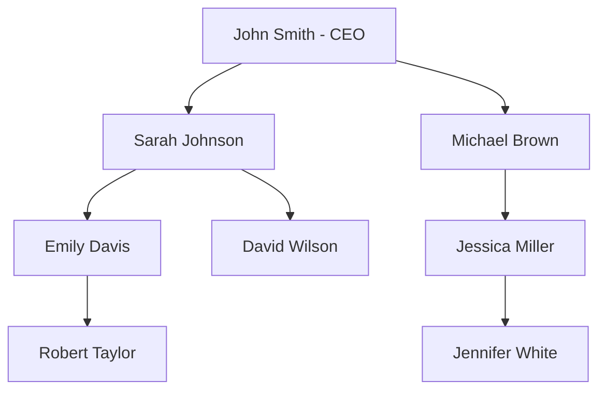

# SQL Recursive Queries

## Introduction

Recursive queries in SQL allow you to solve problems that would otherwise be difficult to express in standard SQL. They're particularly useful when working with hierarchical or graph-structured data, such as:

- Organizational charts
- File systems
- Network paths
- Bill of materials
- Family trees

At the heart of recursive queries is the **Common Table Expression (CTE)** with a special `RECURSIVE` keyword. This powerful feature enables you to reference a query within itself, creating a form of iteration that's otherwise challenging in SQL's set-based paradigm.

## Understanding Recursive CTEs

A recursive CTE consists of two main parts:

1. The **anchor member**: The initial query that forms the base result set
2. The **recursive member**: The part that references the CTE itself

These two parts are combined using a `UNION ALL` operator.

### Basic Syntax

```sql
WITH RECURSIVE cte_name AS (
    -- Anchor member
    SELECT initial_columns
    FROM initial_table
    WHERE initial_condition
    
    UNION ALL
    
    -- Recursive member
    SELECT recursive_columns
    FROM table_name
    JOIN cte_name ON join_condition
    WHERE recursive_condition
)
SELECT * FROM cte_name;
```

## A Simple Example: Generating a Sequence

Let's start with a simple example to understand the concept. We'll create a sequence of numbers from 1 to 10:

```sql
WITH RECURSIVE number_sequence AS (
    -- Anchor member: start with 1
    SELECT 1 AS n
    
    UNION ALL
    
    -- Recursive member: add 1 to previous number if less than 10
    SELECT n + 1
    FROM number_sequence
    WHERE n < 10
)
SELECT * FROM number_sequence;
```

**Output:**
```
 n 
---
 1
 2
 3
 4
 5
 6
 7
 8
 9
10
```

### How It Works:

1. The anchor member creates a single row with the value 1
2. The recursive member takes the previous result, adds 1, and includes it if less than 10
3. This process repeats until no more rows are added (when n reaches 10)

## Working with Hierarchical Data

One of the most common uses of recursive queries is to navigate hierarchical data. Let's consider an employee organizational chart:

First, let's create a sample table:

```sql
CREATE TABLE employees (
    employee_id INT PRIMARY KEY,
    name VARCHAR(100),
    manager_id INT,
    FOREIGN KEY (manager_id) REFERENCES employees(employee_id)
);

INSERT INTO employees VALUES
(1, 'John Smith', NULL),      -- CEO (no manager)
(2, 'Sarah Johnson', 1),     -- Reports to John
(3, 'Michael Brown', 1),     -- Reports to John
(4, 'Emily Davis', 2),       -- Reports to Sarah
(5, 'David Wilson', 2),      -- Reports to Sarah
(6, 'Jessica Miller', 3),    -- Reports to Michael
(7, 'Robert Taylor', 4),     -- Reports to Emily
(8, 'Jennifer White', 6);    -- Reports to Jessica
```

Let's visualize this hierarchy:



Now we can use a recursive query to find all employees under a specific manager and their level in the hierarchy:

```sql
WITH RECURSIVE org_hierarchy AS (
    -- Anchor member: start with employees under manager_id = 1 (John Smith)
    SELECT 
        employee_id, 
        name, 
        manager_id, 
        1 AS level,
        name AS path
    FROM employees
    WHERE manager_id = 1
    
    UNION ALL
    
    -- Recursive member: join with employees table to find next level
    SELECT 
        e.employee_id, 
        e.name, 
        e.manager_id, 
        oh.level + 1,
        oh.path || ' -> ' || e.name
    FROM employees e
    JOIN org_hierarchy oh ON e.manager_id = oh.employee_id
)
SELECT 
    employee_id,
    name,
    level,
    path
FROM org_hierarchy
ORDER BY path;
```

**Output:**
```
 employee_id |      name      | level |                   path                    
-------------+----------------+-------+-------------------------------------------
           3 | Michael Brown  |     1 | Michael Brown
           6 | Jessica Miller |     2 | Michael Brown -> Jessica Miller
           8 | Jennifer White |     3 | Michael Brown -> Jessica Miller -> Jennifer White
           2 | Sarah Johnson  |     1 | Sarah Johnson
           4 | Emily Davis    |     2 | Sarah Johnson -> Emily Davis
           7 | Robert Taylor  |     3 | Sarah Johnson -> Emily Davis -> Robert Taylor
           5 | David Wilson   |     2 | Sarah Johnson -> David Wilson
```

This query:
1. Starts with direct reports to the CEO (level 1)
2. Then recursively finds employees who report to those employees (level 2)
3. Builds a path showing the reporting hierarchy
4. Continues until no more subordinates are found

## Finding All Paths in a Graph

Recursive CTEs are excellent for finding paths in a graph. Let's create a simple flight connections table:

```sql
CREATE TABLE flight_connections (
    departure_city VARCHAR(50),
    arrival_city VARCHAR(50),
    airline VARCHAR(50),
    price DECIMAL(10, 2),
    PRIMARY KEY (departure_city, arrival_city, airline)
);

INSERT INTO flight_connections VALUES
('New York', 'London', 'Delta', 450.00),
('New York', 'Paris', 'Air France', 500.00),
('London', 'Berlin', 'British Airways', 200.00),
('London', 'Dubai', 'Emirates', 350.00),
('Paris', 'Rome', 'Alitalia', 150.00),
('Paris', 'Barcelona', 'Vueling', 120.00),
('Dubai', 'Singapore', 'Emirates', 380.00),
('Rome', 'Athens', 'Aegean', 90.00);
```

Now, let's find all possible routes from New York with up to 3 connections:

```sql
WITH RECURSIVE flight_paths AS (
    -- Anchor member: direct flights from New York
    SELECT 
        departure_city,
        arrival_city,
        ARRAY[departure_city, arrival_city] AS path,
        1 AS stops,
        price AS total_cost
    FROM flight_connections
    WHERE departure_city = 'New York'
    
    UNION ALL
    
    -- Recursive member: add possible connections
    SELECT 
        fp.departure_city,
        fc.arrival_city,
        fp.path || fc.arrival_city,
        fp.stops + 1,
        fp.total_cost + fc.price
    FROM flight_paths fp
    JOIN flight_connections fc ON fp.arrival_city = fc.departure_city
    WHERE fp.stops < 3 
    AND fc.arrival_city != ALL(fp.path) -- Prevent cycles
)
SELECT 
    departure_city AS origin,
    arrival_city AS destination,
    stops,
    total_cost,
    array_to_string(path, ' -> ') AS full_route
FROM flight_paths
ORDER BY stops, total_cost;
```

**Output:**
```
  origin  | destination | stops | total_cost |                full_route                
----------+-------------+-------+------------+------------------------------------------
 New York | London      |     1 |     450.00 | New York -> London
 New York | Paris       |     1 |     500.00 | New York -> Paris
 New York | Berlin      |     2 |     650.00 | New York -> London -> Berlin
 New York | Dubai       |     2 |     800.00 | New York -> London -> Dubai
 New York | Rome        |     2 |     650.00 | New York -> Paris -> Rome
 New York | Barcelona   |     2 |     620.00 | New York -> Paris -> Barcelona
 New York | Athens      |     3 |     740.00 | New York -> Paris -> Rome -> Athens
 New York | Singapore   |     3 |    1180.00 | New York -> London -> Dubai -> Singapore
```

This query:
1. Starts with direct flights from New York
2. For each destination, it looks for further connections
3. Keeps track of the path, number of stops, and total cost
4. Prevents cycles by ensuring we don't visit the same city twice
5. Limits the search to a maximum of 3 stops

## Solving Bill of Materials Problems

A Bill of Materials (BOM) represents the components and sub-components needed to build a product. Recursive queries are perfect for calculating the total quantities needed:

```sql
CREATE TABLE product_components (
    product_id INT,
    component_id INT,
    quantity INT,
    PRIMARY KEY (product_id, component_id)
);

CREATE TABLE products (
    id INT PRIMARY KEY,
    name VARCHAR(100),
    is_raw_material BOOLEAN
);

-- Insert products
INSERT INTO products VALUES
(1, 'Bicycle', FALSE),
(2, 'Frame', FALSE),
(3, 'Wheel', FALSE),
(4, 'Handlebar', FALSE),
(5, 'Steel Tube', TRUE),
(6, 'Tire', TRUE),
(7, 'Rim', TRUE),
(8, 'Spoke', TRUE),
(9, 'Grip', TRUE);

-- Insert product components
INSERT INTO product_components VALUES
(1, 2, 1),    -- Bicycle needs 1 Frame
(1, 3, 2),    -- Bicycle needs 2 Wheels
(1, 4, 1),    -- Bicycle needs 1 Handlebar
(2, 5, 3),    -- Frame needs 3 Steel Tubes
(3, 6, 1),    -- Wheel needs 1 Tire
(3, 7, 1),    -- Wheel needs 1 Rim
(3, 8, 10),   -- Wheel needs 10 Spokes
(4, 5, 1),    -- Handlebar needs 1 Steel Tube
(4, 9, 2);    -- Handlebar needs 2 Grips
```

Now, let's calculate the total quantity of each component needed to build a bicycle:

```sql
WITH RECURSIVE bom_explosion AS (
    -- Anchor member: direct components of the bicycle
    SELECT 
        p.id AS root_product_id,
        c.product_id,
        c.component_id,
        p2.name AS component_name,
        c.quantity,
        p2.is_raw_material
    FROM products p
    JOIN product_components c ON p.id = c.product_id
    JOIN products p2 ON c.component_id = p2.id
    WHERE p.id = 1  -- Bicycle product ID
    
    UNION ALL
    
    -- Recursive member: components of components
    SELECT 
        be.root_product_id,
        c.product_id,
        c.component_id,
        p.name AS component_name,
        be.quantity * c.quantity,
        p.is_raw_material
    FROM bom_explosion be
    JOIN product_components c ON be.component_id = c.product_id
    JOIN products p ON c.component_id = p.id
    WHERE NOT be.is_raw_material
)
SELECT 
    component_name,
    SUM(quantity) AS total_quantity
FROM bom_explosion
WHERE is_raw_material = TRUE
GROUP BY component_name
ORDER BY total_quantity DESC;
```

**Output:**
```
 component_name | total_quantity 
----------------+----------------
 Spoke          |             20
 Steel Tube     |             10
 Grip           |              2
 Tire           |              2
 Rim            |              2
```

This query:
1. Starts with the direct components of a bicycle
2. For each component that's not a raw material, it continues to break it down
3. Multiplies quantities along the way
4. Finally, groups by raw materials and sums up the total quantities needed

## Cycle Detection

Recursive queries can help detect cycles in a graph. Let's create a table with directed connections:

```sql
CREATE TABLE graph_edges (
    node_from INT,
    node_to INT,
    PRIMARY KEY (node_from, node_to)
);

INSERT INTO graph_edges VALUES
(1, 2), (2, 3), (3, 4), (4, 5),  -- Linear path 1->2->3->4->5
(3, 6), (6, 7),                  -- Branch 3->6->7
(7, 3),                          -- Cycle: 3->6->7->3
(5, 8), (8, 9), (9, 5);          -- Another cycle: 5->8->9->5
```

Now, let's detect cycles starting from node 1:

```sql
WITH RECURSIVE path_search AS (
    -- Anchor member: start from node 1
    SELECT 
        node_from,
        node_to,
        ARRAY[node_from, node_to] AS path,
        FALSE AS cycle_detected
    FROM graph_edges
    WHERE node_from = 1
    
    UNION ALL
    
    -- Recursive member: follow edges
    SELECT 
        ps.node_from,
        ge.node_to,
        ps.path || ge.node_to,
        ge.node_to = ANY(ps.path) AS cycle_detected
    FROM path_search ps
    JOIN graph_edges ge ON ps.node_to = ge.node_from
    WHERE NOT ps.cycle_detected  -- Stop if cycle already detected
)
SELECT 
    array_to_string(path, ' -> ') AS detected_path,
    cycle_detected,
    CASE 
        WHEN cycle_detected THEN 
            node_to || ' already in path: ' || array_to_string(path, ' -> ')
        ELSE NULL
    END AS cycle_description
FROM path_search
WHERE cycle_detected
ORDER BY path;
```

**Output:**
```
           detected_path            | cycle_detected |                 cycle_description                  
-----------------------------------+---------------+----------------------------------------------------
 1 -> 2 -> 3 -> 6 -> 7 -> 3        | true          | 3 already in path: 1 -> 2 -> 3 -> 6 -> 7
 1 -> 2 -> 3 -> 4 -> 5 -> 8 -> 9 -> 5 | true      | 5 already in path: 1 -> 2 -> 3 -> 4 -> 5 -> 8 -> 9
```

This query:
1. Starts from node 1 and follows all possible paths
2. For each step, it checks if the next node is already in the path
3. If a cycle is detected, it marks the path and provides details
4. Prevents further exploration of paths where cycles have been found

## Performance Considerations

When working with recursive queries, keep these performance tips in mind:

1. **Termination Condition**: Always include a termination condition in your recursive member to prevent infinite recursion. In PostgreSQL and most databases, there's usually a safety limit (e.g., 100 iterations), but it's better to control this yourself.

2. **Avoid Explosive Growth**: Recursive queries can generate an enormous number of rows. Use filters in both anchor and recursive members to limit the result set.

3. **Use UNION ALL Instead of UNION**: UNION ALL is faster because it doesn't eliminate duplicates. In most recursive scenarios, duplicates are either impossible or handled in other ways.

4. **Cycle Detection**: When exploring graphs, implement cycle detection to avoid infinite loops, as shown in the previous example.

5. **Limit Recursion Depth**: Consider adding a "level" or "depth" counter and limiting how deep the recursion can go.

## Database Support

Not all database systems implement recursive queries the same way:

- **PostgreSQL, SQL Server, DB2, SQLite**: Use the syntax shown in this tutorial
- **Oracle**: Uses the `CONNECT BY` syntax for hierarchical queries
- **MySQL**: Added recursive CTE support in version 8.0
- **MariaDB**: Added recursive CTE support in version 10.2.2

Here's the Oracle version of the hierarchical employee query:

```sql
-- Oracle syntax for hierarchical queries
SELECT 
    employee_id,
    name,
    LEVEL as level,
    SYS_CONNECT_BY_PATH(name, ' -> ') as path
FROM employees
WHERE LEVEL > 0
START WITH manager_id = 1
CONNECT BY PRIOR employee_id = manager_id
ORDER BY path;
```

## Summary

Recursive CTEs are a powerful SQL feature that enables you to:

1. **Navigate hierarchical data** like organization charts and file systems
2. **Find paths in graphs** such as networks or transportation systems
3. **Generate sequences or series** of data
4. **Solve complex problems** like Bill of Materials explosions
5. **Detect cycles** in directed graphs

The key components of a recursive CTE are:
- An anchor member that provides the starting point
- A recursive member that references the CTE itself
- A termination condition to prevent infinite recursion

## Exercises

Try these exercises to practice recursive queries:

1. **Employee Hierarchy**: Modify the employee hierarchy query to find all employees who are more than 2 levels below the CEO.

2. **Path Finding**: Using the flight connections table, find the cheapest path from New York to Athens, regardless of the number of stops.

3. **File System**: Create a table representing a file system with folders and subfolders, then write a recursive query to list all files under a specific folder, including those in subfolders.

4. **Fibonacci Sequence**: Generate the first 20 numbers in the Fibonacci sequence using a recursive CTE.

5. **Dependency Resolution**: Create a table of software packages and their dependencies, then write a query to determine the installation order that resolves all dependencies.

## Additional Resources

- [PostgreSQL Documentation on Recursive Queries](https://www.postgresql.org/docs/current/queries-with.html#QUERIES-WITH-RECURSIVE)
- [SQL Server Documentation on Recursive CTEs](https://learn.microsoft.com/en-us/sql/t-sql/queries/with-common-table-expression-transact-sql#guidelines-for-defining-and-using-recursive-common-table-expressions)
- [Cookbook: Recursive Query Examples](https://www.postgresql.org/docs/current/queries-with.html#QUERIES-WITH-RECURSIVE)
- [Hierarchical Queries in Oracle](https://docs.oracle.com/en/database/oracle/oracle-database/19/sqlrf/Hierarchical-Queries.html)