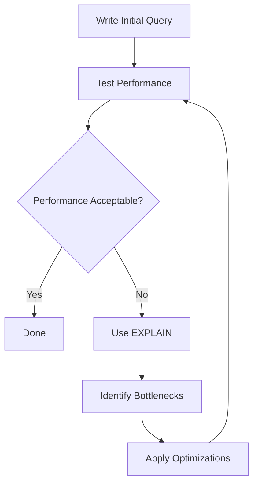

# SQL Query Optimization

## Introduction

SQL query optimization is the process of improving the performance and efficiency of your database queries. Even when your queries return correct results, they might not be running as efficiently as possible, which can lead to slow application performance, especially as your data grows.

In this guide, we'll explore various techniques to optimize your SQL queries, making them faster and more efficient. These optimizations are essential skills for anyone working with databases, whether you're building a small application or managing large enterprise systems.

## Why Query Optimization Matters

Before diving into specific techniques, let's understand why optimization matters:

1. **Performance** - Optimized queries run faster, providing better user experience
2. **Resource usage** - Efficient queries use less CPU, memory, and I/O operations
3. **Scalability** - Well-optimized queries continue to perform as your data grows
4. **Cost savings** - Reduced resource usage can translate to lower infrastructure costs

## Understanding Query Execution

To optimize SQL queries effectively, it helps to understand how the database executes them. When you run a query, the database goes through several phases:

1. **Parsing** - The SQL statement is checked for syntax errors
2. **Optimization** - The database creates an execution plan
3. **Execution** - The plan is executed and results are returned

The **execution plan** is the database's strategy for retrieving your data. You can view this plan using the `EXPLAIN` command (or similar, depending on your database system).

```sql
EXPLAIN SELECT * FROM customers WHERE city = 'New York';
```

Let's look at optimization techniques to improve these execution plans.

## Key Optimization Techniques

### 1. Use Indexes Effectively

Indexes are one of the most powerful tools for query optimization. They work similar to an index in a book, allowing the database to quickly locate data without scanning every row.

#### Creating an Index

```sql
CREATE INDEX idx_customers_city ON customers(city);
```

#### Before indexing:

```sql
SELECT * FROM customers WHERE city = 'New York';
-- Without an index, this might perform a full table scan
```

**Execution time:** 500ms (with 100,000 records)

#### After indexing:

```sql
-- Same query, but now with an index on the city column
SELECT * FROM customers WHERE city = 'New York';
```

**Execution time:** 10ms (with 100,000 records)

#### Tips for effective indexing:

- Index columns that appear frequently in WHERE, JOIN, and ORDER BY clauses
- Avoid over-indexing (each index takes storage space and slows down writes)
- Consider composite indexes for queries that filter on multiple columns
- Remember that indexes speed up reads but slow down writes (INSERT/UPDATE/DELETE)

### 2. Be Specific in SELECT Statements

Avoid using `SELECT *` when you only need specific columns.

#### Instead of:

```sql
SELECT * FROM customers WHERE customer_id = 1001;
```

#### Do this:

```sql
SELECT first_name, last_name, email FROM customers WHERE customer_id = 1001;
```

This reduces the amount of data transferred and can make use of covering indexes (indexes that contain all the columns needed for a query).

### 3. Optimize JOINs

JOINs can be expensive operations when not properly optimized.

#### Tips for optimizing JOINs:

- Join on indexed columns
- Use the appropriate JOIN type (INNER, LEFT, RIGHT)
- Limit the number of tables in a single query (consider breaking complex queries)
- Filter data before joining when possible

#### Example:

```sql
-- Less efficient (filtering after the join)
SELECT o.order_id, c.customer_name 
FROM orders o
JOIN customers c ON o.customer_id = c.customer_id
WHERE o.order_date > '2023-01-01';

-- More efficient (filtering before the join)
SELECT o.order_id, c.customer_name 
FROM (SELECT * FROM orders WHERE order_date > '2023-01-01') o
JOIN customers c ON o.customer_id = c.customer_id;
```

### 4. Use WHERE Conditions Efficiently

The conditions in your WHERE clause significantly impact query performance.

#### Tips for efficient WHERE clauses:

- Put the most restrictive conditions first
- Use indexed columns in WHERE conditions
- Avoid functions on indexed columns
- Be careful with wildcard searches, especially at the beginning of a pattern

#### Examples:

```sql
-- Slower (function on indexed column)
SELECT * FROM customers WHERE YEAR(signup_date) = 2023;

-- Faster (allows index usage)
SELECT * FROM customers WHERE signup_date >= '2023-01-01' AND signup_date < '2024-01-01';
```

```sql
-- Slower (wildcard at beginning prevents effective index use)
SELECT * FROM products WHERE product_name LIKE '%laptop%';

-- Faster (if searching for products that start with a specific word)
SELECT * FROM products WHERE product_name LIKE 'laptop%';
```

### 5. Limit Results When Possible

If you're only displaying a subset of results (like in paginated interfaces), use LIMIT to reduce the data transferred.

```sql
-- Get 10 records starting from the 21st record (for page 3 with 10 items per page)
SELECT product_id, product_name, price 
FROM products 
ORDER BY price DESC 
LIMIT 10 OFFSET 20;
```

### 6. Avoid Subqueries When Possible

Subqueries can sometimes lead to performance issues, especially in the WHERE clause. Often, JOINs can be more efficient.

#### Instead of:

```sql
SELECT customer_name 
FROM customers 
WHERE customer_id IN (SELECT customer_id FROM orders WHERE total > 1000);
```

#### Consider:

```sql
SELECT DISTINCT c.customer_name 
FROM customers c
JOIN orders o ON c.customer_id = o.customer_id 
WHERE o.total > 1000;
```

### 7. Use EXPLAIN to Analyze Queries

The EXPLAIN command helps you understand how your database executes your queries.

```sql
EXPLAIN SELECT c.customer_name, SUM(o.total) as total_spent
FROM customers c
JOIN orders o ON c.customer_id = o.customer_id
GROUP BY c.customer_name
HAVING SUM(o.total) > 5000;
```

The output will show you how the database plans to execute the query, including:
- Which indexes it's using (or not using)
- The types of operations (scans, joins, etc.)
- The estimated cost

Different database systems have different EXPLAIN formats, but they all provide valuable insights for optimization.

## Query Optimization Workflow

Here's a recommended workflow for optimizing your queries:



## Real-World Example: E-commerce Product Search

Let's optimize a product search function for an e-commerce site.

### Initial Query:

```sql
SELECT p.product_id, p.product_name, p.price, p.description, 
       c.category_name, s.stock_quantity
FROM products p
JOIN categories c ON p.category_id = c.category_id
JOIN inventory s ON p.product_id = s.product_id
WHERE p.product_name LIKE '%phone%'
ORDER BY p.price;
```

### Analysis:

1. The `LIKE '%phone%'` prevents efficient index use
2. We're selecting all columns including the potentially large `description`
3. We might be returning more rows than needed for display

### Optimized Query:

```sql
-- Create a full-text search index
CREATE FULLTEXT INDEX idx_product_search ON products(product_name, description);

-- Use the index for more efficient searching
SELECT p.product_id, p.product_name, p.price,
       c.category_name, s.stock_quantity
FROM products p
JOIN categories c ON p.category_id = c.category_id
JOIN inventory s ON p.product_id = s.product_id
WHERE MATCH(p.product_name, p.description) AGAINST('phone' IN BOOLEAN MODE)
AND s.stock_quantity > 0  -- Only show in-stock items
ORDER BY p.price
LIMIT 20;  -- Assuming we're showing 20 products per page
```

### Improvements:

1. Used full-text search instead of LIKE for better performance
2. Omitted the large description field from the results
3. Added a filter for in-stock items to reduce rows
4. Limited results to 20 items
5. Assumed indexes on join columns and sort column

## Common Pitfalls to Avoid

1. **N+1 Query Problem**: Running a query for each result of another query
2. **Cartesian Products**: Joins without proper conditions leading to explosive row growth
3. **Over-indexing**: Creating too many indexes, which slows down writes
4. **Using OR with Indexed and Non-indexed Columns**: This often prevents index usage
5. **Correlation Subqueries**: Subqueries that depend on the outer query can be slow

## Database-Specific Optimization Tips

Different database systems have specific optimization techniques:

### MySQL
- Use `EXPLAIN FORMAT=JSON` for detailed execution plans
- Consider the InnoDB and MyISAM storage engines' different strengths
- Optimize the buffer pool size for your workload

### PostgreSQL
- Use `EXPLAIN ANALYZE` to see actual execution times
- Consider partial indexes for specific query patterns
- Utilize the PostgreSQL query planner hints when needed

### SQLite
- Use the ANALYZE command to collect statistics
- Ensure proper transaction management for write-heavy workloads
- Use proper indexing as SQLite's query optimizer is relatively simple

## Summary

SQL query optimization is a critical skill for building performant database applications. The key techniques we've covered include:

- Using indexes effectively
- Being specific in SELECT statements
- Optimizing JOINs and WHERE conditions
- Limiting results when possible
- Using the EXPLAIN command to understand query execution

Remember that optimization is often an iterative process. Start with the basics, measure performance, and continually refine your queries as your application grows and evolves.

## Further Learning

To deepen your understanding of SQL optimization, consider exploring:

1. **Database-specific optimization guides** for your particular database system
2. **Query plan visualization tools** to better understand execution plans
3. **Database monitoring tools** to identify problematic queries in production
4. **Index design strategies** for complex query patterns
5. **Normalization and denormalization** trade-offs for your specific use case

## Practice Exercises

1. Take a complex query from your project and use EXPLAIN to analyze its execution plan
2. Identify missing indexes in your database that could improve common queries
3. Refactor a query that uses SELECT * to only select necessary columns
4. Convert a subquery to a JOIN and compare performance
5. Optimize a query that uses a large IN clause or multiple OR conditions

By consistently applying these optimization techniques, you'll write more efficient SQL queries and build faster, more scalable applications.