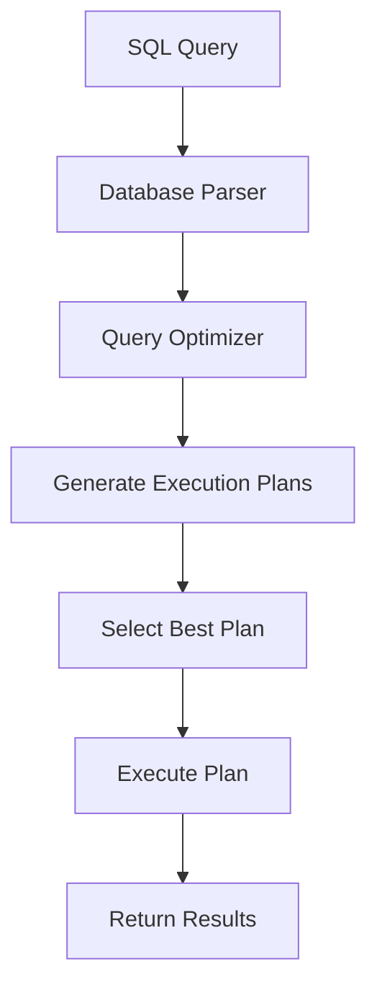

# SQL Execution Plans

When you run a SQL query, the database doesn't immediately execute it. Instead, it first develops a plan of action - a roadmap for how to efficiently retrieve or modify the data you've requested. This roadmap is called an **execution plan** (also known as a query plan or explain plan), and understanding it is crucial for writing performant SQL code.

## What is an SQL Execution Plan?

An execution plan is a step-by-step blueprint that details exactly how the database engine will execute your query. It shows:

- The order in which tables will be accessed
- Which indexes (if any) will be used
- How data will be filtered, sorted, and joined
- Estimated cost and number of rows for each operation

Think of it like a recipe that the database follows to cook up your results in the most efficient way possible.

## Why Are Execution Plans Important?

Understanding execution plans helps you:

1. **Identify performance bottlenecks** in your queries
2. **Understand why certain queries are slow**
3. **Optimize queries** by making informed changes
4. **Verify that indexes** are being used correctly
5. **Learn how the database optimizer** thinks and works

## How to Generate an Execution Plan

Different database systems have different ways to view execution plans:

### MySQL

```sql
EXPLAIN SELECT * FROM customers 
WHERE country = 'USA' AND credit_limit > 10000;
```

Example output:

```
+----+-------------+-----------+------------+------+---------------+------+---------+------+------+----------+-------------+
| id | select_type | table     | partitions | type | possible_keys | key  | key_len | ref  | rows | filtered | Extra       |
+----+-------------+-----------+------------+------+---------------+------+---------+------+------+----------+-------------+
|  1 | SIMPLE      | customers | NULL       | ALL  | NULL          | NULL | NULL    | NULL | 122  | 11.11    | Using where |
+----+-------------+-----------+------------+------+---------------+------+---------+------+------+----------+-------------+
```

### PostgreSQL

```sql
EXPLAIN SELECT * FROM customers 
WHERE country = 'USA' AND credit_limit > 10000;
```

Example output:

```
                             QUERY PLAN
---------------------------------------------------------------------
 Seq Scan on customers  (cost=0.00..2.22 rows=5 width=180)
   Filter: ((country = 'USA'::text) AND (credit_limit > 10000))
```

### SQL Server

```sql
SET SHOWPLAN_TEXT ON;
GO
SELECT * FROM customers 
WHERE country = 'USA' AND credit_limit > 10000;
GO
SET SHOWPLAN_TEXT OFF;
```

Or graphically:

```sql
SET SHOWPLAN_ALL ON;
GO
SELECT * FROM customers 
WHERE country = 'USA' AND credit_limit > 10000;
GO
SET SHOWPLAN_ALL OFF;
```

### Oracle

```sql
EXPLAIN PLAN FOR
SELECT * FROM customers 
WHERE country = 'USA' AND credit_limit > 10000;

SELECT * FROM TABLE(DBMS_XPLAN.DISPLAY);
```

## Reading an Execution Plan

Let's break down a simple PostgreSQL execution plan:

```
                                QUERY PLAN
--------------------------------------------------------------------------
 Hash Join  (cost=1.11..2.19 rows=5 width=68)
   Hash Cond: (orders.customer_id = customers.customer_id)
   ->  Seq Scan on orders  (cost=0.00..1.04 rows=4 width=36)
   ->  Hash  (cost=1.05..1.05 rows=5 width=36)
         ->  Seq Scan on customers  (cost=0.00..1.05 rows=5 width=36)
               Filter: ((country = 'USA'::text) AND (credit_limit > 10000))
```

Reading from bottom to top:

1. **Seq Scan on customers**: The database scans all rows in the customers table
2. **Filter**: It filters for customers in the USA with credit limit > 10000
3. **Hash**: It creates a hash table of the filtered customers
4. **Seq Scan on orders**: It scans all rows in the orders table
5. **Hash Join**: It joins orders with customers using the hash table
6. **Final result**: The joined data is returned

The `cost` values (1.11..2.19) represent estimated processing units - higher numbers mean more expensive operations.

## Common Plan Operations

Here are some operations you'll commonly see in execution plans:

### Table Access Methods

- **Sequential Scan (Table Scan)**: Reads every row in a table (slow for large tables)
- **Index Scan**: Uses an index to find specific rows (usually faster)
- **Index Only Scan**: Gets data directly from the index without accessing the table (very fast)
- **Bitmap Scan**: Uses a bitmap to track which rows to retrieve (good for medium selectivity)

### Join Methods

- **Nested Loop Join**: For each row in the outer table, scans the inner table (good for small tables)
- **Hash Join**: Builds a hash table on the smaller table, then probes it (good for larger tables)
- **Merge Join**: Both inputs are sorted, then merged (good for pre-sorted data)



## Real-World Example: Optimizing a Slow Query

Let's look at a real-world scenario where understanding execution plans helps us optimize a query.

Original query:

```sql
SELECT o.order_id, o.order_date, c.customer_name
FROM orders o, customers c
WHERE o.customer_id = c.customer_id
AND o.order_date > '2023-01-01'
AND c.country = 'USA';
```

MySQL execution plan:

```
+----+-------------+-------+------------+------+---------------+------+---------+------+------+----------+----------------------------------------------------+
| id | select_type | table | partitions | type | possible_keys | key  | key_len | ref  | rows | filtered | Extra                                              |
+----+-------------+-------+------------+------+---------------+------+---------+------+------+----------+----------------------------------------------------+
|  1 | SIMPLE      | o     | NULL       | ALL  | NULL          | NULL | NULL    | NULL | 1000 | 33.33    | Using where                                        |
|  1 | SIMPLE      | c     | NULL       | ALL  | NULL          | NULL | NULL    | NULL |  100 | 10.00    | Using where; Using join buffer (Block Nested Loop) |
+----+-------------+-------+------------+------+---------------+------+---------+------+------+----------+----------------------------------------------------+
```

Problems identified:
1. Table scan on orders table (type = ALL)
2. Table scan on customers table (type = ALL)
3. Block nested loop join (inefficient for large tables)

Solution: Add appropriate indexes

```sql
CREATE INDEX idx_orders_date ON orders(order_date);
CREATE INDEX idx_customers_country ON customers(country);
CREATE INDEX idx_orders_customer_id ON orders(customer_id);
```

Updated execution plan:

```
+----+-------------+-------+------------+------+------------------------+------------------------+---------+-------------------------+------+----------+-------------+
| id | select_type | table | partitions | type | possible_keys          | key                    | key_len | ref                     | rows | filtered | Extra       |
+----+-------------+-------+------------+------+------------------------+------------------------+---------+-------------------------+------+----------+-------------+
|  1 | SIMPLE      | c     | NULL       | ref  | idx_customers_country  | idx_customers_country  | 3       | const                   |   10 | 100.00   | Using where |
|  1 | SIMPLE      | o     | NULL       | ref  | idx_orders_customer_id | idx_orders_customer_id | 4       | mydb.c.customer_id      |   10 | 33.33    | Using where |
+----+-------------+-------+------------+------+------------------------+------------------------+---------+-------------------------+------+----------+-------------+
```

The optimized plan shows:
1. First, it filters customers by country using an index
2. Then it joins the orders table using the customer_id index
3. Finally, it filters by order_date

Estimated rows processed dropped from 1100 to just 20!

## Common Issues Revealed by Execution Plans

Execution plans can help you identify these common problems:

1. **Missing indexes**: Look for table scans (Seq Scan) on large tables
2. **Inefficient joins**: Watch for nested loops on large tables
3. **Suboptimal query structure**: Complex subqueries may show as expensive operations
4. **Data type mismatches**: Implicit conversions prevent index usage
5. **Poor statistics**: Wildly inaccurate row estimates

## Practical Tips for Using Execution Plans

1. **Compare alternatives**: Test different query formulations to see which produces better plans
2. **Check actual vs. estimated rows**: Large discrepancies indicate outdated statistics
3. **Look for expensive operations**: Focus optimization on the highest-cost steps
4. **Verify index usage**: Ensure your indexes are actually being used
5. **Test with realistic data volumes**: Plans change as data grows

## Best Practices for Query Optimization

Based on execution plan analysis:

1. **Use appropriate indexes** for columns in WHERE, JOIN, and ORDER BY clauses
2. **Be specific with column selection** rather than using SELECT *
3. **Avoid functions on indexed columns** in WHERE clauses
4. **Consider query restructuring** if the plan shows expensive operations
5. **Keep statistics up to date** for accurate optimizer decisions
6. **Watch for implicit conversions** that prevent index usage

## Summary

SQL execution plans are invaluable tools for understanding and optimizing database performance. By learning to generate and interpret these plans, you can:

- Understand how the database processes your queries
- Identify bottlenecks and inefficiencies
- Make informed decisions about indexing and query structure
- Verify that your optimization efforts are working

As you work with databases, regularly checking execution plans should become part of your development workflow, especially when dealing with complex queries or large data volumes.

## Additional Resources

- [Use the Query Execution Plan to Make SQL Server Queries Faster](https://www.red-gate.com/simple-talk/sql/performance/execution-plan-basics/)
- [PostgreSQL EXPLAIN Documentation](https://www.postgresql.org/docs/current/sql-explain.html)
- [MySQL EXPLAIN Output Format](https://dev.mysql.com/doc/refman/8.0/en/explain-output.html)
- [SQL Server Execution Plans](https://learn.microsoft.com/en-us/sql/relational-databases/performance/execution-plans)

## Exercises

1. Generate an execution plan for a simple query on your own database. Identify which access methods are being used.
2. Write a query that joins three tables and examine its execution plan. Try rewriting the query in different ways to see how the plan changes.
3. Create a table with 1000+ records but no indexes. Run a query with a WHERE clause, check the plan, then add an appropriate index and observe how the plan changes.
4. Find a slow query in your application and use the execution plan to identify why it's slow. Implement at least one optimization based on your findings.
5. Compare execution plans across different database systems (if available) for the same logical query. Note the differences in plan presentation and operation types.