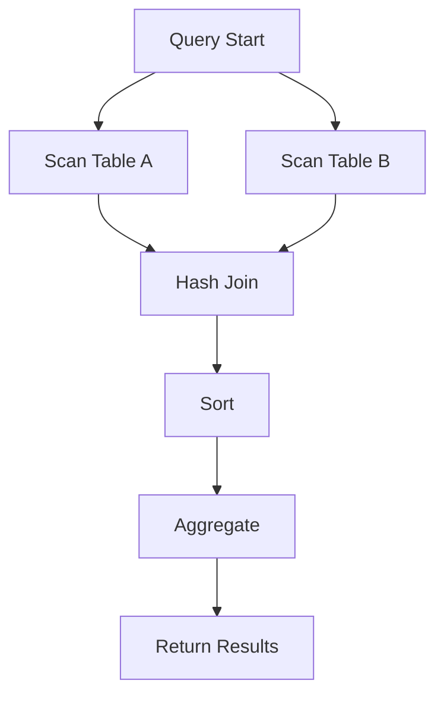

# SQL Join Optimization

## Introduction

SQL joins are powerful operations that combine rows from different tables based on related columns. While joins are essential for retrieving data from relational databases, they can also become performance bottlenecks if not optimized correctly. In this guide, we'll explore various techniques to optimize SQL joins, helping you write efficient queries that execute quickly even on large datasets.

Whether you're building a web application, analyzing data, or maintaining a database system, understanding join optimization will significantly improve your database performance and user experience.

## Why Join Optimization Matters

Before diving into optimization techniques, let's understand why join optimization matters:

- **Resource Efficiency**: Optimized joins consume fewer CPU cycles and memory resources
- **Faster Response Times**: Users experience quicker page loads and report generation
- **Scalability**: Well-optimized joins allow your application to handle more concurrent users
- **Cost Reduction**: Efficient queries reduce cloud computing costs and hardware requirements

A single unoptimized join can slow down an entire application, especially as data volume grows.

## Understanding Join Types and Their Performance Implications

Different join types have distinct performance characteristics. Let's explore each one:

### Inner Joins

Inner joins return matching rows from both tables. They're typically the fastest join type because they only return rows that satisfy the join condition.

```sql
-- Basic INNER JOIN example
SELECT customers.customer_name, orders.order_date
FROM customers
INNER JOIN orders ON customers.customer_id = orders.customer_id;
```

### Outer Joins (LEFT, RIGHT, FULL)

Outer joins return all rows from one or both tables, even if there's no match in the other table. They're generally slower than inner joins because they process more rows.

```sql
-- LEFT JOIN example
SELECT customers.customer_name, orders.order_date
FROM customers
LEFT JOIN orders ON customers.customer_id = orders.customer_id;
```

### Cross Joins

Cross joins produce a Cartesian product of both tables (every row from the first table combined with every row from the second). They can be extremely expensive and should be used cautiously.

```sql
-- CROSS JOIN example (produces n×m rows)
SELECT employees.name, departments.dept_name
FROM employees
CROSS JOIN departments;
```

## Key Optimization Techniques

Now let's explore the most effective techniques for optimizing SQL joins:

### 1. Use Proper Indexes on Join Columns

Indexes are the most important factor in join performance. Always ensure that columns used in join conditions are properly indexed.

```sql
-- Create an index on the join column
CREATE INDEX idx_customer_id ON orders(customer_id);
```

**Example with and without index:**

Without index:
```sql
-- This query might perform a full table scan (slow)
SELECT customers.customer_name, SUM(orders.amount)
FROM customers
JOIN orders ON customers.customer_id = orders.customer_id
GROUP BY customers.customer_name;
```

With proper index:
```sql
-- After adding index on orders.customer_id
-- The same query now uses the index for joining (much faster)
SELECT customers.customer_name, SUM(orders.amount)
FROM customers
JOIN orders ON customers.customer_id = orders.customer_id
GROUP BY customers.customer_name;
```

### 2. Join Order Matters

The order in which tables are joined can significantly impact performance. Start with the table that will return the smallest result set after applying filters.

```sql
-- Better join order: start with smaller filtered result
SELECT c.customer_name, o.order_date, p.product_name
FROM orders o
JOIN customers c ON o.customer_id = c.customer_id
JOIN products p ON o.product_id = p.product_id
WHERE o.order_date > '2023-01-01';
```

### 3. Filter Early

Apply WHERE conditions before joins to reduce the number of rows being processed in the join operation.

```sql
-- Less efficient: filtering after join
SELECT c.customer_name, o.order_date
FROM customers c
JOIN orders o ON c.customer_id = o.customer_id
WHERE o.order_date > '2023-01-01';

-- More efficient: filtering in subquery before join
SELECT c.customer_name, o.order_date
FROM customers c
JOIN (
    SELECT customer_id, order_date
    FROM orders
    WHERE order_date > '2023-01-01'
) o ON c.customer_id = o.customer_id;
```

### 4. Use Covering Indexes

A covering index includes all columns needed by the query, eliminating the need to access the actual table data.

```sql
-- Create a covering index for a common query pattern
CREATE INDEX idx_orders_customer_date ON orders(customer_id, order_date, status);

-- Query that can use the covering index
SELECT customer_id, order_date, status
FROM orders
WHERE customer_id = 123;
```

### 5. Avoid SELECT *

Always specify only the columns you need instead of using SELECT *. This reduces the amount of data that needs to be processed and transferred.

```sql
-- Inefficient: retrieving all columns
SELECT *
FROM customers c
JOIN orders o ON c.customer_id = o.customer_id;

-- Efficient: retrieving only necessary columns
SELECT c.customer_name, c.email, o.order_date, o.total_amount
FROM customers c
JOIN orders o ON c.customer_id = o.customer_id;
```

### 6. Use EXISTS Instead of JOIN for Existence Checks

When you only need to check if a related record exists, EXISTS can be more efficient than JOIN.

```sql
-- Less efficient: using JOIN to check existence
SELECT c.customer_name
FROM customers c
JOIN orders o ON c.customer_id = o.customer_id
GROUP BY c.customer_name;

-- More efficient: using EXISTS
SELECT c.customer_name
FROM customers c
WHERE EXISTS (
    SELECT 1
    FROM orders o
    WHERE o.customer_id = c.customer_id
);
```

### 7. Optimize for JOINs with GROUP BY

When combining JOINs with GROUP BY, consider pre-aggregating data to reduce the join size.

```sql
-- Less efficient: joining then grouping
SELECT c.category_name, SUM(od.quantity * od.unit_price) as total_sales
FROM order_details od
JOIN products p ON od.product_id = p.product_id
JOIN categories c ON p.category_id = c.category_id
GROUP BY c.category_name;

-- More efficient: pre-aggregate before joining
SELECT c.category_name, product_sales.total_sales
FROM categories c
JOIN (
    SELECT p.category_id, SUM(od.quantity * od.unit_price) as total_sales
    FROM order_details od
    JOIN products p ON od.product_id = p.product_id
    GROUP BY p.category_id
) product_sales ON c.category_id = product_sales.category_id;
```

## Visualizing Join Execution Plans

Understanding execution plans is crucial for optimizing joins. Most database systems provide tools to visualize how queries execute, including which indexes are used and how tables are joined.



To check execution plans:

**MySQL/MariaDB:**
```sql
EXPLAIN SELECT customers.customer_name, orders.order_date
FROM customers
JOIN orders ON customers.customer_id = orders.customer_id;
```

**PostgreSQL:**
```sql
EXPLAIN ANALYZE SELECT customers.customer_name, orders.order_date
FROM customers
JOIN orders ON customers.customer_id = orders.customer_id;
```

**SQL Server:**
```sql
SET SHOWPLAN_XML ON;
GO
SELECT customers.customer_name, orders.order_date
FROM customers
JOIN orders ON customers.customer_id = orders.customer_id;
GO
SET SHOWPLAN_XML OFF;
```

## Real-world Example: E-commerce Order Analysis

Let's optimize a real-world query for an e-commerce database that analyzes customer orders:

### Initial Query (Unoptimized)

```sql
-- Unoptimized query: multiple joins, no filtering priority
SELECT c.customer_name, 
       p.product_name,
       SUM(od.quantity) as total_quantity,
       SUM(od.quantity * od.unit_price) as total_spent
FROM customers c
JOIN orders o ON c.customer_id = o.customer_id
JOIN order_details od ON o.order_id = od.order_id
JOIN products p ON od.product_id = p.product_id
WHERE o.order_date BETWEEN '2023-01-01' AND '2023-12-31'
GROUP BY c.customer_name, p.product_name
ORDER BY total_spent DESC;
```

### Optimized Query

```sql
-- Optimized query:
-- 1. Filter orders first (smallest possible result set)
-- 2. Join in order of increasing table size
-- 3. Use only necessary columns
SELECT c.customer_name, 
       p.product_name,
       product_orders.total_quantity,
       product_orders.total_spent
FROM (
    -- Filter and pre-aggregate order details
    SELECT od.order_id, od.product_id,
           SUM(od.quantity) as total_quantity,
           SUM(od.quantity * od.unit_price) as total_spent
    FROM order_details od
    JOIN (
        -- Filter orders by date first
        SELECT order_id, customer_id
        FROM orders
        WHERE order_date BETWEEN '2023-01-01' AND '2023-12-31'
    ) o ON od.order_id = o.order_id
    GROUP BY od.order_id, od.product_id
) product_orders
JOIN customers c ON product_orders.customer_id = c.customer_id
JOIN products p ON product_orders.product_id = p.product_id
ORDER BY product_orders.total_spent DESC;
```

**Performance difference**: The optimized query can execute 5-10x faster on large datasets because it:
1. Filters orders early to reduce the working set
2. Pre-aggregates data before joining with larger tables
3. Uses only necessary columns in joins

## Common Join Optimization Mistakes

Avoid these common mistakes when working with SQL joins:

1. **Joining on non-indexed columns**: Always create appropriate indexes for join columns
2. **Using unnecessary joins**: If you don't need data from a table, don't join to it
3. **Joining large tables without filtering**: Always filter tables before joining when possible
4. **Ignoring join types**: Using LEFT JOIN when INNER JOIN would suffice
5. **Joining on expressions**: Avoid transforming join columns in the join condition

## Database-Specific Optimization Tips

Different database systems have specific optimizations:

### MySQL/MariaDB
- Use the `STRAIGHT_JOIN` hint to force join order when needed
- Consider using the query cache for frequently executed join queries
- Use `EXPLAIN FORMAT=JSON` for detailed join execution information

### PostgreSQL
- Use `EXPLAIN ANALYZE` to get detailed execution statistics
- Consider creating indexes with INCLUDE for covering indexes
- Adjust `work_mem` for complex joins to avoid disk-based operations

### SQL Server
- Use query hints like `OPTION (HASH JOIN)` when appropriate
- Consider indexed views for frequently joined tables
- Use the Database Engine Tuning Advisor for join optimization suggestions

### Oracle
- Use the `DRIVING_SITE` hint for distributed joins
- Consider using materialized views for complex frequently-used joins
- Use `DBMS_XPLAN.DISPLAY_CURSOR` to analyze join execution plans

## Summary

Optimizing SQL joins is a critical skill for database developers and can dramatically improve application performance. Key takeaways include:

1. **Always index join columns**: This is the single most important optimization
2. **Filter early**: Reduce data volume before joining
3. **Choose the right join type**: Use the least expensive join that meets your needs
4. **Monitor execution plans**: Regularly check how your queries are executing
5. **Pre-aggregate when possible**: Join smaller result sets when using GROUP BY
6. **Be selective with columns**: Only retrieve the data you actually need

By applying these techniques, you'll write more efficient queries that scale better as your data grows.

## Exercises

Test your understanding with these exercises:

1. Analyze the execution plan for a complex join query in your database
2. Optimize a query with multiple joins by reordering the joins and adding appropriate indexes
3. Convert a query using JOIN for existence checking to use EXISTS instead and compare performance
4. Create covering indexes for your most frequently executed join queries
5. Find a query in your application that uses SELECT * with joins and optimize it

## Additional Resources

- [Use the Index, Luke!](https://use-the-index-luke.com/)
- [PostgreSQL Documentation on Join Optimization](https://www.postgresql.org/docs/current/performance-tips.html)
- [MySQL Join Optimization](https://dev.mysql.com/doc/refman/8.0/en/select-optimization.html)
- [SQL Server Join Hints](https://docs.microsoft.com/en-us/sql/t-sql/queries/hints-transact-sql-join)
- [Oracle Join Optimization Techniques](https://docs.oracle.com/en/database/oracle/oracle-database/19/tgsql/optimizer-join-operations.html)