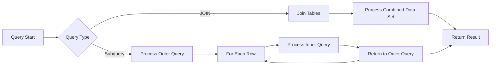

# SQL Subquery Optimization

## Introduction

Subqueries are powerful SQL features that allow you to nest one query within another. While they can make your queries more readable and modular, they can also significantly impact performance if not used properly. This guide will help you understand how subqueries work and how to optimize them for better performance.

A subquery (also known as an inner query or nested query) is a query that is embedded within another SQL statement. Subqueries can appear in various parts of a SQL statement, such as the SELECT, FROM, WHERE, or HAVING clauses.

## Types of Subqueries

Before diving into optimization techniques, let's understand the different types of subqueries:

### 1. Scalar Subqueries

A scalar subquery returns exactly one column and one row.

```sql
-- Find employees who earn more than the average salary
SELECT employee_name, salary
FROM employees
WHERE salary > (SELECT AVG(salary) FROM employees);
```

### 2. Row Subqueries

A row subquery returns exactly one row but can contain multiple columns.

```sql
-- Find an employee with the same department and job as employee_id 123
SELECT employee_name
FROM employees
WHERE (department_id, job_id) = (
    SELECT department_id, job_id
    FROM employees
    WHERE employee_id = 123
);
```

### 3. Table Subqueries

A table subquery returns multiple rows and columns and can be used in the FROM clause.

```sql
-- Get department statistics
SELECT dept.department_name, emp_stats.avg_salary
FROM departments dept
JOIN (
    SELECT department_id, AVG(salary) as avg_salary
    FROM employees
    GROUP BY department_id
) emp_stats ON dept.department_id = emp_stats.department_id;
```

### 4. Correlated Subqueries

A correlated subquery references columns from the outer query and is executed once for each row processed by the outer query.

```sql
-- Find employees who earn more than the average salary in their department
SELECT e1.employee_name, e1.salary, e1.department_id
FROM employees e1
WHERE e1.salary > (
    SELECT AVG(e2.salary)
    FROM employees e2
    WHERE e2.department_id = e1.department_id
);
```

## Common Performance Issues with Subqueries

Subqueries can cause performance problems for several reasons:

1. **Multiple Executions**: Especially with correlated subqueries, the inner query may be executed for each row of the outer query.
2. **Unnecessary Data Processing**: Some subqueries retrieve more data than needed.
3. **Inefficient Execution Plans**: The database optimizer might not always choose the most efficient execution plan.
4. **Memory Usage**: Complex nested subqueries can consume significant memory.

## Optimization Techniques

Let's explore various techniques to optimize subqueries:

### 1. Use EXISTS Instead of IN for Large Datasets

The `IN` operator with a subquery can be inefficient for large datasets because it retrieves all values. Using `EXISTS` often performs better since it stops once a match is found.

```sql
-- Less efficient with large subquery results
SELECT customer_name
FROM customers
WHERE customer_id IN (SELECT customer_id FROM orders WHERE order_date > '2023-01-01');

-- More efficient alternative
SELECT customer_name
FROM customers c
WHERE EXISTS (SELECT 1 FROM orders o WHERE o.customer_id = c.customer_id AND o.order_date > '2023-01-01');
```

### 2. Replace Subqueries with JOINs When Possible

JOINs often perform better than subqueries, especially for retrieving data from related tables.

```sql
-- Using a subquery
SELECT e.employee_name, 
       (SELECT d.department_name FROM departments d WHERE d.department_id = e.department_id) as dept_name
FROM employees e;

-- Using a JOIN (typically more efficient)
SELECT e.employee_name, d.department_name
FROM employees e
JOIN departments d ON e.department_id = d.department_id;
```

### 3. Use Temporary Tables or CTEs for Complex Subqueries

For complex subqueries that are used multiple times, consider using temporary tables or Common Table Expressions (CTEs).

```sql
-- Using a CTE
WITH high_value_orders AS (
    SELECT customer_id, SUM(order_total) as total_spent
    FROM orders
    GROUP BY customer_id
    HAVING SUM(order_total) > 10000
)
SELECT c.customer_name, hvo.total_spent
FROM customers c
JOIN high_value_orders hvo ON c.customer_id = hvo.customer_id
ORDER BY hvo.total_spent DESC;
```

### 4. Avoid Unnecessary Columns in Subqueries

Only select the columns you need in your subquery.

```sql
-- Inefficient (selecting unnecessary columns)
SELECT customer_name
FROM customers
WHERE customer_id IN (SELECT customer_id, order_id, order_date FROM orders WHERE order_total > 1000);

-- Efficient (selecting only what's needed)
SELECT customer_name
FROM customers
WHERE customer_id IN (SELECT customer_id FROM orders WHERE order_total > 1000);
```

### 5. Limit Subquery Results When Possible

Use LIMIT (or equivalent in your DBMS) to restrict subquery results when appropriate.

```sql
-- Get customers who placed the 5 most recent orders
SELECT customer_name
FROM customers c
WHERE c.customer_id IN (
    SELECT o.customer_id
    FROM orders o
    ORDER BY o.order_date DESC
    LIMIT 5
);
```

### 6. Uncorrelate Correlated Subqueries

Correlated subqueries can be performance intensive. When possible, rewrite them as uncorrelated queries.

```sql
-- Correlated subquery
SELECT product_name, price
FROM products p
WHERE price > (
    SELECT AVG(price)
    FROM products
    WHERE category_id = p.category_id
);

-- Uncorrelated alternative using JOIN
SELECT p.product_name, p.price
FROM products p
JOIN (
    SELECT category_id, AVG(price) as avg_price
    FROM products
    GROUP BY category_id
) cat_avg ON p.category_id = cat_avg.category_id
WHERE p.price > cat_avg.avg_price;
```

### 7. Use Indexing to Support Subqueries

Ensure that columns used in subquery joins or comparisons are properly indexed.

```sql
-- If this query is frequently used
SELECT employee_name
FROM employees
WHERE department_id IN (SELECT department_id FROM departments WHERE location_id = 1700);

-- Create indexes if they don't exist
CREATE INDEX idx_dept_location ON departments(location_id);
CREATE INDEX idx_emp_department ON employees(department_id);
```

## Measuring Subquery Performance

To optimize your subqueries effectively, you need to measure their performance:

1. **Execution Plans**: Use `EXPLAIN` (PostgreSQL, MySQL) or `EXPLAIN PLAN` (Oracle) to view the execution plan.

```sql
-- PostgreSQL/MySQL
EXPLAIN SELECT * FROM employees WHERE department_id IN (SELECT department_id FROM departments WHERE location_id = 1700);
```

2. **Time Measurement**: Measure the execution time before and after optimization.

```sql
-- PostgreSQL
EXPLAIN ANALYZE SELECT * FROM employees WHERE department_id IN (SELECT department_id FROM departments WHERE location_id = 1700);
```

## Real-World Examples

Let's look at a few real-world scenarios and how to optimize them:

### Example 1: Finding Inactive Customers

**Task**: Find customers who haven't placed an order in the last 6 months.

**Initial Query**:

```sql
SELECT customer_id, customer_name
FROM customers
WHERE customer_id NOT IN (
    SELECT DISTINCT customer_id
    FROM orders
    WHERE order_date >= DATE_SUB(CURRENT_DATE, INTERVAL 6 MONTH)
);
```

**Optimized Query**:

```sql
SELECT c.customer_id, c.customer_name
FROM customers c
LEFT JOIN orders o ON c.customer_id = o.customer_id 
    AND o.order_date >= DATE_SUB(CURRENT_DATE, INTERVAL 6 MONTH)
WHERE o.order_id IS NULL;
```

### Example 2: Department Salary Statistics

**Task**: For each department, find employees who earn more than their department's average salary.

**Initial Query (with correlated subquery)**:

```sql
SELECT e.employee_id, e.employee_name, e.department_id, e.salary
FROM employees e
WHERE e.salary > (
    SELECT AVG(salary)
    FROM employees
    WHERE department_id = e.department_id
);
```

**Optimized Query (using CTE)**:

```sql
WITH dept_avg_salary AS (
    SELECT department_id, AVG(salary) as avg_salary
    FROM employees
    GROUP BY department_id
)
SELECT e.employee_id, e.employee_name, e.department_id, e.salary
FROM employees e
JOIN dept_avg_salary d ON e.department_id = d.department_id
WHERE e.salary > d.avg_salary;
```

### Example 3: Top Products by Category

**Task**: Find the top 3 most expensive products in each category.

**Initial Query (using ROW_NUMBER in a nested subquery)**:

```sql
SELECT product_id, product_name, category_id, price
FROM (
    SELECT product_id, product_name, category_id, price,
           ROW_NUMBER() OVER (PARTITION BY category_id ORDER BY price DESC) as price_rank
    FROM products
) ranked_products
WHERE price_rank <= 3;
```

This query is already optimized using window functions, which are often more efficient than correlated subqueries for ranking operations.

## Visualization of Subquery vs. JOIN Performance

Let's visualize the difference in performance between subqueries and joins:



This diagram illustrates why correlated subqueries can be inefficient - they require processing the inner query for each row of the outer query, while a JOIN processes the data set just once.

## Summary

Optimizing SQL subqueries is a critical skill for improving database performance. Key strategies include:

1. Using EXISTS instead of IN for large datasets
2. Replacing subqueries with JOINs when possible
3. Using temporary tables or CTEs for complex subqueries
4. Avoiding unnecessary columns in subqueries
5. Limiting subquery results when possible
6. Uncorrelating correlated subqueries
7. Using proper indexing to support subqueries

Remember that optimization techniques can vary depending on your specific database management system. Always test your queries and analyze execution plans to ensure your optimizations are effective.

## Exercises

1. Rewrite the following query using a JOIN instead of a subquery:
   ```sql
   SELECT product_name
   FROM products
   WHERE category_id IN (SELECT category_id FROM categories WHERE category_name = 'Electronics');
   ```

2. Optimize this correlated subquery:
   ```sql
   SELECT employee_name
   FROM employees e
   WHERE salary > (SELECT AVG(salary) FROM employees WHERE department_id = e.department_id);
   ```

3. Create an optimized query to find customers who have placed orders for all available products.

## Additional Resources

- [PostgreSQL Query Planning Documentation](https://www.postgresql.org/docs/current/performance-tips.html)
- [MySQL Subquery Optimization](https://dev.mysql.com/doc/refman/8.0/en/subquery-optimization.html)
- [SQL Performance Explained (Book by Markus Winand)](https://use-the-index-luke.com/)
- [Modern SQL (Website with advanced SQL techniques)](https://modern-sql.com/)