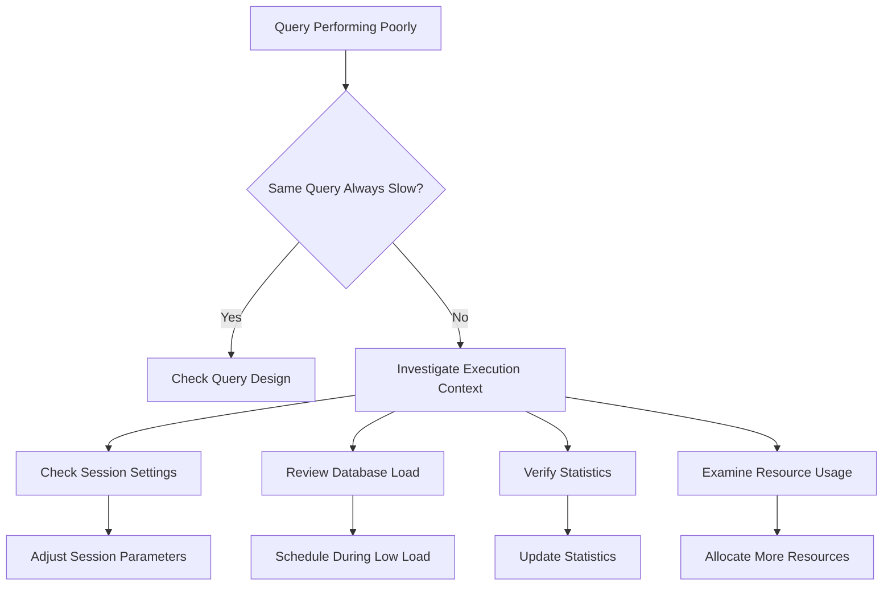

# SQL Execution Context

## Introduction

When you run a SQL query, it doesn't execute in isolation. Each query operates within what's called an **execution context** - an environment that influences how your query is processed, optimized, and executed by the database engine. Understanding this context is crucial for writing efficient SQL code and troubleshooting performance issues.

Think of execution context as all the "behind-the-scenes" factors that affect how your query runs. This includes database settings, session variables, existing data distribution, server resources, and much more. Even identical queries can perform differently depending on their execution context.

This article will help you understand SQL execution contexts and show you how to work with them to optimize your queries.

## What Makes Up an Execution Context?

An execution context consists of several key components:

### 1. Session Settings

Every database connection creates a session with specific settings that influence query behavior:

```sql
-- Example: Setting session variables in MySQL
SET SESSION sort_buffer_size = 1048576; -- 1MB
SET SESSION query_cache_type = 1; -- Enable query cache

-- Now queries in this session will use these settings
SELECT * FROM customers WHERE region = 'Northeast';
```

Common session settings include:
- Memory allocation for sorting and joins
- Query timeouts
- Transaction isolation levels
- Optimizer settings

### 2. Database Configuration

The global database configuration establishes defaults for all queries:

```sql
-- Example of checking PostgreSQL configuration settings
SHOW max_connections;
SHOW shared_buffers;
SHOW work_mem;
```

These settings affect available resources for your queries and how the database engine prioritizes operations.

### 3. Schema and Statistics

The database's understanding of your data heavily influences execution plans:

```sql
-- Example: Update statistics in SQL Server
UPDATE STATISTICS Sales.Customer;

-- Then run a query that will benefit from up-to-date statistics
SELECT * FROM Sales.Customer 
WHERE CustomerType = 'Retail' AND Region = 'West';
```

Key factors include:
- Table and index statistics
- Constraint definitions
- Data distribution information

### 4. Current Database State

The live state of the database when your query runs:

```sql
-- Example: Checking MySQL's current load
SHOW PROCESSLIST;

-- Check for locks that might affect your query
SELECT * FROM information_schema.innodb_locks;
```

This includes:
- Current load and concurrent queries
- Lock state and resource availability
- Cache contents and buffer pool state

## How Execution Context Affects Query Performance

Let's examine how the same query can perform differently in various contexts:

### Example 1: The Impact of Statistics

Consider this query:

```sql
SELECT customer_id, SUM(order_amount) 
FROM orders
WHERE order_date BETWEEN '2023-01-01' AND '2023-12-31'
GROUP BY customer_id
HAVING SUM(order_amount) > 1000;
```

**Scenario 1: With outdated statistics**
```
Execution plan: Full table scan of orders table, in-memory sort
Estimated rows: 1,000
Actual rows: 50,000
Execution time: 3.5 seconds
```

**Scenario 2: After updating statistics**
```
Execution plan: Index seek on order_date, hash aggregate
Estimated rows: 48,500
Actual rows: 50,000
Execution time: 0.8 seconds
```

The database made better decisions with accurate statistics.

### Example 2: Session Memory Settings

Consider a large join operation:

```sql
SELECT c.name, COUNT(o.order_id) AS order_count
FROM customers c
JOIN orders o ON c.customer_id = o.customer_id
GROUP BY c.name;
```

**Scenario 1: Default session memory**
```
Execution plan: Nested loop join, spills to disk during grouping
Memory allocated: 4MB
Execution time: 7.2 seconds
```

**Scenario 2: Increased session memory**
```sql
-- Increase memory allocation before query
SET SESSION work_mem = '32MB';
```

```
Execution plan: Hash join, in-memory grouping
Memory allocated: 28MB
Execution time: 1.8 seconds
```

With more memory, the database could use faster algorithms.

## Diagnosing Execution Context Issues

Here's how to identify when execution context is affecting your query performance:



Common diagnostic queries:

**PostgreSQL:**
```sql
-- Check current query execution
SELECT query, state, wait_event, wait_event_type, 
       query_start, backend_start 
FROM pg_stat_activity 
WHERE state != 'idle';

-- View execution statistics for a specific table
SELECT * FROM pg_stat_user_tables WHERE relname = 'orders';
```

**MySQL:**
```sql
-- Show current process list with query execution time
SHOW FULL PROCESSLIST;

-- Check if your query is using indexes effectively
EXPLAIN SELECT * FROM orders WHERE customer_id = 123;
```

**SQL Server:**
```sql
-- View active query execution contexts
SELECT session_id, status, command, total_elapsed_time,
       cpu_time, logical_reads, wait_type
FROM sys.dm_exec_requests
WHERE session_id > 50; -- Exclude system sessions
```

## Optimizing Your Queries for Different Contexts

Let's look at practical strategies for making your queries robust across execution contexts:

### 1. Make Statistics-Friendly Queries

Write queries that can benefit from statistics:

```sql
-- Less optimal: Using function on indexed column
SELECT * FROM customers WHERE YEAR(registration_date) = 2023;

-- Better: Allow statistics to be used effectively
SELECT * FROM customers 
WHERE registration_date >= '2023-01-01' 
  AND registration_date < '2024-01-01';
```

### 2. Use Query Hints Strategically

When you know better than the optimizer:

```sql
-- MySQL example: Force index use
SELECT * FROM orders FORCE INDEX (idx_customer_id)
WHERE customer_id = 123;

-- SQL Server example: Specify join strategy
SELECT c.name, o.order_date
FROM customers c
INNER MERGE JOIN orders o ON c.customer_id = o.customer_id
WHERE c.region = 'West';
```

Only use hints when you're sure they'll help - they can backfire as data or system characteristics change.

### 3. Write Context-Aware Applications

Design applications that adjust to different execution contexts:

```javascript
// Pseudocode example of a context-aware application
function executeLargeQuery(connection, query) {
  // Check system load first
  const currentLoad = connection.query("SHOW PROCESSLIST").length;
  
  if (currentLoad > 100) {
    // High load context: Use pagination to reduce impact
    return executeWithPagination(connection, query, 1000);
  } else {
    // Low load context: Execute directly
    return connection.query(query);
  }
}
```

### 4. Include Context in Performance Testing

Don't just test if your query works - test how it performs under different conditions:

```sql
-- Test with cold cache
DBCC DROPCLEANBUFFERS; -- SQL Server
SELECT * FROM large_table WHERE complex_condition;

-- Test with warm cache (run it twice)
SELECT * FROM large_table WHERE complex_condition;
SELECT * FROM large_table WHERE complex_condition;

-- Test under load (while other queries are running)
-- This requires a separate load-generating script
```

## Real-World Application: E-commerce Database

Let's put this knowledge into practice with a real-world example:

```sql
-- Common e-commerce query that's context-sensitive
SELECT 
    p.product_name,
    c.category_name,
    COUNT(o.order_id) AS times_ordered,
    SUM(oi.quantity) AS units_sold,
    AVG(oi.price) AS average_price
FROM 
    products p
    JOIN categories c ON p.category_id = c.category_id
    JOIN order_items oi ON p.product_id = oi.product_id
    JOIN orders o ON oi.order_id = o.order_id
WHERE 
    o.order_date >= DATEADD(month, -3, CURRENT_DATE)
GROUP BY 
    p.product_name, c.category_name
ORDER BY 
    units_sold DESC
LIMIT 100;
```

**Context-Aware Optimization:**

1. **Precondition the context:**
```sql
-- Before running the report, update statistics
ANALYZE TABLE products, categories, order_items, orders;

-- Ensure adequate memory for this complex query
SET SESSION sort_buffer_size = 8388608; -- 8MB
```

2. **Make the query adaptable:**
```sql
-- Add index hints only when needed
SELECT /*+ INDEX(o order_date_idx) */
    p.product_name,
    c.category_name,
    COUNT(o.order_id) AS times_ordered,
    SUM(oi.quantity) AS units_sold,
    AVG(oi.price) AS average_price
FROM 
    -- Tables as before
WHERE 
    -- Date condition that's index-friendly
    o.order_date >= DATE_TRUNC('month', CURRENT_DATE - INTERVAL '3 months')
GROUP BY 
    p.product_name, c.category_name
ORDER BY 
    units_sold DESC
LIMIT 100;
```

3. **Monitor execution in different contexts:**
```sql
-- Before the main report runs, check context
SELECT * FROM sys.dm_os_performance_counters 
WHERE counter_name IN ('Page life expectancy', 'Buffer cache hit ratio');

-- Based on results, might decide to:
-- 1. Run report now
-- 2. Schedule for later
-- 3. Use a pre-aggregated summary table instead
```

## Summary

Understanding SQL execution context is crucial for consistent performance:

1. **Query performance depends on context**: The same query can perform differently based on session settings, database configuration, statistics, and current load.

2. **Key context elements**: Session variables, memory allocation, statistics, concurrent activity, and cache state all influence how your query executes.

3. **Context-aware optimization**: Write queries that work well across different contexts, using appropriate hints and avoiding constructs that prevent optimizer flexibility.

4. **Monitor and adapt**: Use diagnostic queries to understand the current execution context and adjust your approach accordingly.

By considering execution context in your SQL development process, you'll write more robust, reliable queries that perform well under various conditions.

## Additional Resources and Exercises

### Resources for Further Learning

- [PostgreSQL Documentation: The Statistics Collector](https://www.postgresql.org/docs/current/monitoring-stats.html)
- [MySQL Performance Schema](https://dev.mysql.com/doc/refman/8.0/en/performance-schema.html)
- [SQL Server Execution Plans](https://learn.microsoft.com/en-us/sql/relational-databases/performance/execution-plans)

### Exercises to Test Your Understanding

1. **Context Analysis**: Run the same query with different session settings and compare execution plans.
   ```sql
   -- Try with different memory settings
   SET work_mem = '4MB';
   EXPLAIN ANALYZE SELECT * FROM large_table ORDER BY non_indexed_column;
   
   SET work_mem = '64MB';
   EXPLAIN ANALYZE SELECT * FROM large_table ORDER BY non_indexed_column;
   ```

2. **Statistics Impact**: Compare query performance before and after updating statistics.
   ```sql
   -- Before updating stats
   EXPLAIN SELECT * FROM customers WHERE last_purchase_date > '2023-01-01';
   
   -- Update stats
   ANALYZE customers;
   
   -- After updating stats
   EXPLAIN SELECT * FROM customers WHERE last_purchase_date > '2023-01-01';
   ```

3. **Load Testing**: Set up a script that runs multiple concurrent queries and observe how performance changes under load.

4. **Context Diagnosis**: Write a script that checks the current execution context and recommends optimization strategies based on what it finds.