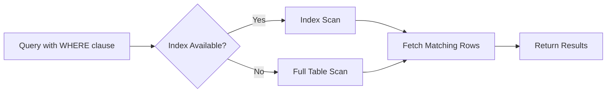

# SQL Indexing Strategies

## Introduction

Database performance is crucial for application responsiveness, and one of the most powerful tools for improving SQL performance is proper indexing. Think of indexes as the table of contents in a book - without them, you'd have to scan every page to find specific information. Similarly, without proper indexes, databases must perform full table scans to find your data.

In this guide, we'll explore various SQL indexing strategies that can dramatically improve your query performance. We'll learn when to use different types of indexes, how to create them, and how to avoid common pitfalls that can negatively impact performance.

## What Are Database Indexes?

A database index is a data structure that improves the speed of data retrieval operations on a database table. Indexes work by creating a separate structure that points to the data in the table, allowing the database engine to find specific rows much faster than scanning the entire table.

### How Indexes Work

When you create an index on a column, the database creates a sorted structure containing the values from that column along with pointers to the corresponding rows. This allows the database to use efficient search algorithms like binary search instead of scanning every row.



## Types of SQL Indexes

Let's explore the common types of indexes available in most database systems:

### 1. Single-Column Indexes

This is the simplest form of indexing, where an index is created on a single column.

```sql
-- Creating a single-column index
CREATE INDEX idx_customers_email ON customers(email);
```

This index would be useful for queries like:

```sql
SELECT * FROM customers WHERE email = 'john@example.com';
```

### 2. Composite Indexes (Multi-Column)

Composite indexes include multiple columns in a specific order.

```sql
-- Creating a composite index
CREATE INDEX idx_customers_city_state ON customers(city, state);
```

This index would help optimize queries that filter by both city and state or just by city (the first column in the index):

```sql
-- Uses the composite index effectively
SELECT * FROM customers WHERE city = 'New York' AND state = 'NY';

-- Also uses the index (but only for the 'city' part)
SELECT * FROM customers WHERE city = 'New York';

-- Does NOT use the index effectively
SELECT * FROM customers WHERE state = 'NY';
```

### 3. Unique Indexes

Unique indexes ensure that no two rows have the same value in the indexed column(s).

```sql
-- Creating a unique index
CREATE UNIQUE INDEX idx_products_sku ON products(sku);
```

This prevents duplicate SKUs and also helps with query performance:

```sql
SELECT * FROM products WHERE sku = 'ABC123';
```

### 4. Covering Indexes

A covering index includes all the columns referenced in a query, allowing the database to satisfy the query using only the index without accessing the table.

```sql
-- Creating a covering index
CREATE INDEX idx_orders_customer_date ON orders(customer_id, order_date, total_amount);
```

For a query like:

```sql
SELECT order_date, total_amount FROM orders WHERE customer_id = 123;
```

The database can retrieve all required data directly from the index without accessing the actual table.

## When to Create Indexes

Indexes are particularly beneficial for:

1. Columns used in WHERE clauses
2. Columns used in JOIN conditions 
3. Columns used in ORDER BY or GROUP BY operations
4. Columns with high cardinality (many unique values)

## Practical Examples

Let's explore some real-world indexing scenarios:

### Example 1: Optimizing a User Search Feature

Imagine you have a `users` table and need to optimize searches by username:

```sql
-- Create the users table
CREATE TABLE users (
    id INT PRIMARY KEY,
    username VARCHAR(50),
    email VARCHAR(100),
    created_at TIMESTAMP,
    status VARCHAR(20)
);

-- Add data (in a real scenario, you'd have thousands of users)
INSERT INTO users VALUES 
(1, 'john_doe', 'john@example.com', '2023-01-15 10:30:00', 'active'),
(2, 'jane_smith', 'jane@example.com', '2023-02-20 14:45:00', 'active'),
-- ... more users ...
(1000, 'user1000', 'user1000@example.com', '2023-06-10 09:15:00', 'inactive');

-- Create an index on username for faster searches
CREATE INDEX idx_users_username ON users(username);
```

Before the index, a query like this would require a full table scan:

```sql
SELECT * FROM users WHERE username = 'john_doe';
```

After creating the index, the database can find the row directly.

### Example 2: Optimizing Report Queries

For a reporting system that frequently filters orders by date range and groups by status:

```sql
-- Create the orders table
CREATE TABLE orders (
    id INT PRIMARY KEY,
    customer_id INT,
    order_date DATE,
    status VARCHAR(20),
    total_amount DECIMAL(10, 2)
);

-- Create a composite index to optimize date range filters and status grouping
CREATE INDEX idx_orders_date_status ON orders(order_date, status);
```

This index will improve the performance of reporting queries like:

```sql
SELECT status, COUNT(*), SUM(total_amount) 
FROM orders 
WHERE order_date BETWEEN '2023-01-01' AND '2023-03-31' 
GROUP BY status;
```

## Index Maintenance and Best Practices

### When to Avoid Indexes

Indexes aren't always beneficial:

1. On small tables (full table scans may be faster)
2. On columns with low cardinality (few unique values)
3. On tables that are frequently updated (indexes slow down writes)

### Monitoring Index Usage

Most database systems provide ways to check if your indexes are being used:

```sql
-- For PostgreSQL
EXPLAIN ANALYZE SELECT * FROM customers WHERE email = 'john@example.com';

-- For MySQL
EXPLAIN SELECT * FROM customers WHERE email = 'john@example.com';

-- For SQL Server
SET STATISTICS IO ON;
SELECT * FROM customers WHERE email = 'john@example.com';
```

The output will show whether an index scan is being used and how efficient it is.

### Index Fragmentation

Over time, as data is modified, indexes can become fragmented, reducing their effectiveness. Periodically rebuilding indexes can help maintain performance:

```sql
-- For PostgreSQL
REINDEX TABLE customers;

-- For MySQL
ALTER TABLE customers DROP INDEX idx_customers_email;
ALTER TABLE customers ADD INDEX idx_customers_email (email);

-- For SQL Server
ALTER INDEX idx_customers_email ON customers REBUILD;
```

## Common Indexing Mistakes

1. **Over-indexing**: Creating too many indexes on a table can slow down write operations without providing significant read benefits.

2. **Indexing low-cardinality columns**: Columns with few unique values (like gender or status) often don't benefit from indexing.

3. **Not considering query patterns**: Creating indexes without understanding how your data is actually queried can lead to unused indexes.

4. **Ignoring the impact on writes**: Every index added to a table slows down INSERT, UPDATE, and DELETE operations.

## Practical Exercise: Analyzing and Improving Query Performance

Here's a step-by-step exercise to practice your indexing skills:

1. Create a sample table with at least 1000 rows
2. Run a complex query without indexes and note the execution time
3. Analyze the query to identify potential index candidates
4. Create appropriate indexes
5. Run the query again and compare the execution time
6. Use EXPLAIN to verify that your indexes are being used

## Summary

Proper indexing is a critical skill for database performance optimization. By understanding when and how to use different types of indexes, you can dramatically improve your application's response times and user experience.

Remember these key points:
- Indexes speed up SELECT queries but slow down data modifications
- Choose columns for indexing based on your query patterns
- Composite indexes should be ordered with the most selective columns first
- Monitor and maintain your indexes regularly
- Don't over-index your tables

## Additional Resources

- [PostgreSQL Indexing Documentation](https://www.postgresql.org/docs/current/indexes.html)
- [MySQL Indexing Strategies](https://dev.mysql.com/doc/refman/8.0/en/optimization-indexes.html)
- [SQL Server Index Design Guide](https://docs.microsoft.com/en-us/sql/relational-databases/sql-server-index-design-guide)

## Further Exercises

1. Create a table with a million rows and compare the performance of queries with and without indexes
2. Experiment with different index types on the same data and compare their performance
3. Write a script to identify unused indexes in your database
4. Create a covering index for a complex query and measure the performance improvement