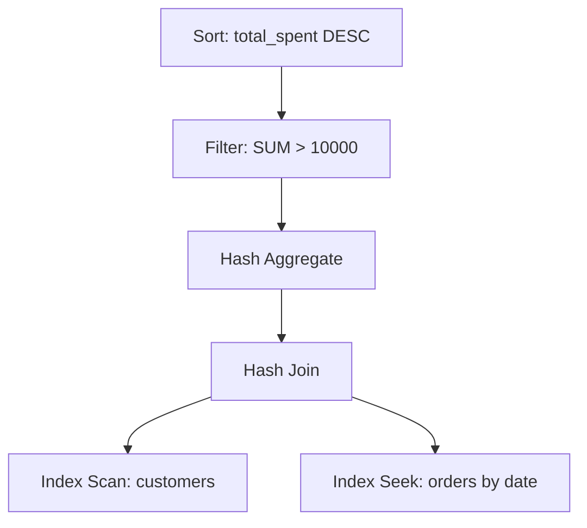
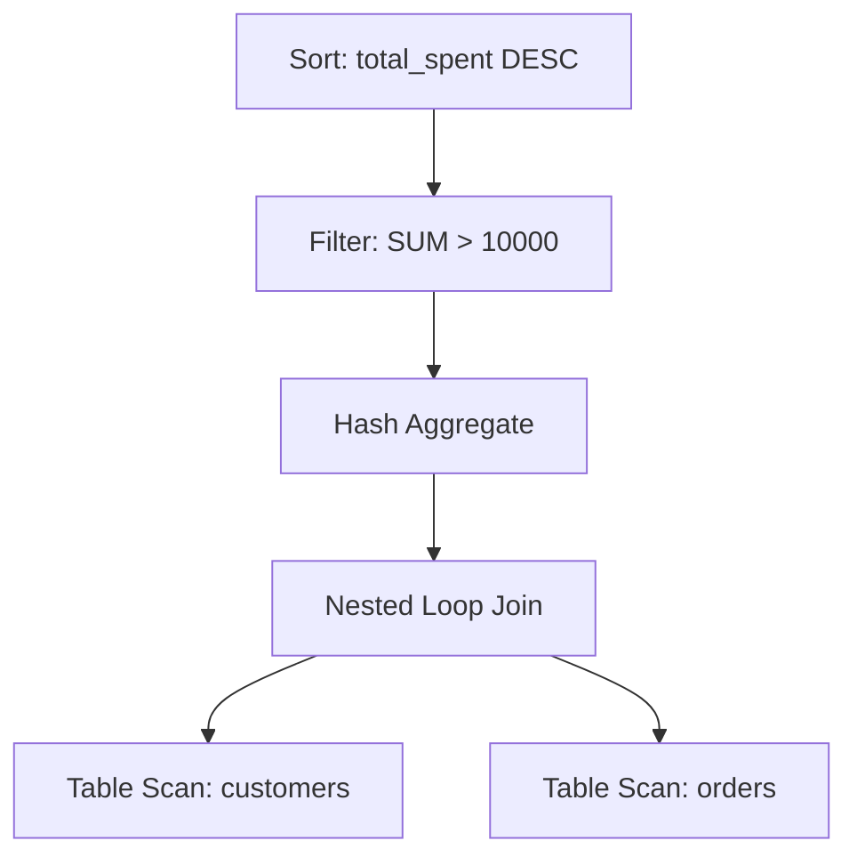

# SQL Statistics

## Introduction

SQL Statistics are vital metadata that database systems collect and maintain about tables, columns, and indexes. These statistics help the query optimizer make informed decisions about how to efficiently execute queries. Think of statistics as the "map" that guides the database engine to find the fastest route to your data.

In this tutorial, we'll explore what SQL statistics are, why they matter for performance, how to view and manage them, and how they influence query execution plans.

## What Are SQL Statistics?

Database statistics typically include information such as:

- Table size (number of rows and pages)
- Column value distributions
- Index density and selectivity
- Data cardinality (number of unique values)
- Histogram information about data distribution

These metrics help the database engine estimate the cost of different query execution strategies and choose the most efficient approach.

## Why Statistics Matter for Performance

Imagine trying to find the most efficient route without knowing how busy different roads are or how far apart locations might be. You'd likely make poor choices! Similarly, without accurate statistics:

- The query optimizer may choose suboptimal execution plans
- Simple queries might scan entire tables instead of using indexes
- Joins might be performed inefficiently
- Query performance can degrade significantly

Let's see a concrete example:

```sql
-- This query's performance depends on accurate statistics
SELECT customer_name, order_date
FROM customers c
JOIN orders o ON c.customer_id = o.customer_id
WHERE order_total > 1000
  AND order_date > '2023-01-01';
```

With good statistics, the database knows:
- How many orders are typically over $1000
- The distribution of order dates
- How many customers have large orders
- Which indexes would be most helpful

This information helps it choose the best execution plan.

## Viewing Database Statistics

Different database systems provide various ways to view statistics. Here are examples for major SQL platforms:

### In SQL Server

```sql
-- View statistics for a specific table
DBCC SHOW_STATISTICS ('orders', 'IX_orders_date');

-- View statistics information for all tables
SELECT 
    OBJECT_NAME(s.object_id) AS TableName,
    s.name AS StatisticsName,
    s.auto_created,
    s.user_created,
    s.no_recompute,
    sp.last_updated,
    sp.rows,
    sp.rows_sampled,
    sp.modification_counter
FROM sys.stats s
CROSS APPLY sys.dm_db_stats_properties(s.object_id, s.stats_id) sp
WHERE OBJECT_NAME(s.object_id) = 'orders';
```

Example output:

```
TableName  StatisticsName         auto_created  last_updated           rows    modification_counter
---------- --------------------- ------------- ---------------------- ------- ---------------------
orders     IX_orders_date         0             2023-06-15 10:23:45    125000  5423
orders     IX_orders_customer_id  0             2023-06-15 10:24:12    125000  1270
```

### In PostgreSQL

```sql
-- Examine statistics for a table
SELECT * FROM pg_stats 
WHERE tablename = 'orders' AND attname = 'order_date';

-- View when statistics were last collected
SELECT
    schemaname,
    relname,
    last_analyze,
    last_autoanalyze
FROM pg_stat_user_tables
WHERE relname = 'orders';
```

### In MySQL

```sql
-- Check table statistics
SHOW TABLE STATUS LIKE 'orders';

-- View index statistics
SHOW INDEX FROM orders;
```

## Managing Statistics

Keeping statistics up-to-date is crucial for consistent query performance. Here's how to manage them:

### Updating Statistics

Most database systems update statistics automatically, but you can manually update them:

```sql
-- SQL Server
UPDATE STATISTICS orders;

-- PostgreSQL
ANALYZE orders;

-- MySQL
ANALYZE TABLE orders;
```

### When to Update Statistics

Consider updating statistics manually when:

- You've made significant data changes (bulk inserts/updates)
- Query performance suddenly degrades
- After major index changes
- Before running critical reports or batch processes

## How Statistics Influence Query Plans

Let's examine how statistics affect query execution with a real-world example:

```sql
-- Query to find high-value recent customers
SELECT c.customer_id, c.customer_name, SUM(o.order_total) as total_spent
FROM customers c
JOIN orders o ON c.customer_id = o.customer_id
WHERE o.order_date > '2023-01-01'
GROUP BY c.customer_id, c.customer_name
HAVING SUM(o.order_total) > 10000
ORDER BY total_spent DESC;
```

With accurate statistics, the database knows:

1. What percentage of orders are after '2023-01-01'
2. How selective the customer_id is in the join
3. The distribution of order_total values
4. Whether it's worth using indexes for this query

This allows it to make intelligent decisions like:
- Using an index scan instead of a table scan
- Choosing the right join algorithm (nested loops vs. hash join)
- Deciding whether to use parallel processing

Let's visualize a simplified query plan:



Without good statistics, the database might choose a much less efficient plan:



## Statistics Decay

Statistics become less accurate as data changes. This "statistics decay" leads to performance problems over time:

1. **Initial state**: Statistics are updated and query performance is optimal
2. **Data changes**: Inserts, updates, and deletes modify the data
3. **Statistics mismatch**: The statistics no longer reflect actual data
4. **Poor plans**: The optimizer makes decisions based on outdated information
5. **Performance degradation**: Queries slow down

To prevent this cycle, ensure your statistics update strategy matches your data modification patterns.

## Common Statistics Problems and Solutions

| Problem | Symptoms | Solution |
|---------|----------|----------|
| Outdated statistics | Sudden query slowdowns | Update statistics |
| Insufficient sampling | Inaccurate cardinality estimates | Increase sampling rate |
| Missing statistics | Poor join performance | Create statistics on join columns |
| Statistics turned off | Inconsistent performance | Enable auto-update statistics |
| Skewed data distribution | Some queries fast, others slow | Consider filtered statistics |

## Practical Example: Troubleshooting with Statistics

Let's say a previously fast query is now taking minutes to complete:

```sql
SELECT product_name, category_name, SUM(quantity_sold) as total_sold
FROM products p
JOIN sales s ON p.product_id = s.product_id
JOIN categories c ON p.category_id = c.category_id
WHERE sale_date BETWEEN '2023-01-01' AND '2023-12-31'
GROUP BY product_name, category_name
ORDER BY total_sold DESC;
```

Here's how we'd use statistics to troubleshoot:

1. **Check execution plan**: Look for table scans, inefficient joins
2. **Examine statistics age**: When were statistics last updated?

```sql
-- SQL Server example
SELECT 
    OBJECT_NAME(s.object_id) AS TableName,
    s.name AS StatisticsName,
    sp.last_updated,
    sp.modification_counter
FROM sys.stats s
CROSS APPLY sys.dm_db_stats_properties(s.object_id, s.stats_id) sp
WHERE OBJECT_NAME(s.object_id) IN ('products', 'sales', 'categories');
```

3. **Update statistics**: If outdated, update them

```sql
UPDATE STATISTICS products;
UPDATE STATISTICS sales;
UPDATE STATISTICS categories;
```

4. **Verify improvement**: Rerun the query to see if performance improves

## Advanced Statistics Topics

For those interested in deeper understanding:

### Filtered Statistics

Some databases allow creating statistics on a subset of data:

```sql
-- SQL Server example
CREATE STATISTICS st_recent_orders 
ON orders(order_date, order_total)
WHERE order_date > '2023-01-01';
```

This can be extremely helpful for tables with skewed data distributions.

### Statistics and Temporary Tables

Temporary tables often lack good statistics, which can lead to poor performance. Explicitly creating statistics can help:

```sql
-- Create temp table
CREATE TEMPORARY TABLE recent_orders AS
SELECT * FROM orders WHERE order_date > '2023-01-01';

-- Create statistics on the temp table
ANALYZE recent_orders;
```

### Statistics in Multi-tenant Databases

In shared database architectures, statistics management becomes more complex. Consider:
- Separate statistics maintenance windows per tenant
- Custom statistics sampling rates based on tenant data size
- Tenant-specific filtered statistics

## Summary

SQL Statistics are crucial metadata that help database engines optimize query execution:

- They provide information about data distribution and characteristics
- The query optimizer uses them to choose efficient execution plans
- Out-of-date statistics can cause severe performance problems
- Regular statistics maintenance is essential for consistent performance
- Different database systems offer various tools to view and manage statistics

By understanding and properly maintaining database statistics, you can ensure your SQL queries perform at their best consistently.

## Additional Resources

- [Microsoft SQL Server Statistics Documentation](https://learn.microsoft.com/en-us/sql/relational-databases/statistics/statistics)
- [PostgreSQL Statistics Collector](https://www.postgresql.org/docs/current/monitoring-stats.html)
- [MySQL Optimizer Statistics](https://dev.mysql.com/doc/refman/8.0/en/optimizer-statistics.html)

## Exercises

1. Check the age of statistics on your most frequently queried tables.
2. Compare the execution plan of a complex query before and after updating statistics.
3. Identify tables in your database where statistics might be inaccurate due to frequent data changes.
4. Create a scheduled job to update statistics on your most critical tables.
5. Examine a poorly performing query and determine if statistics issues might be the cause.