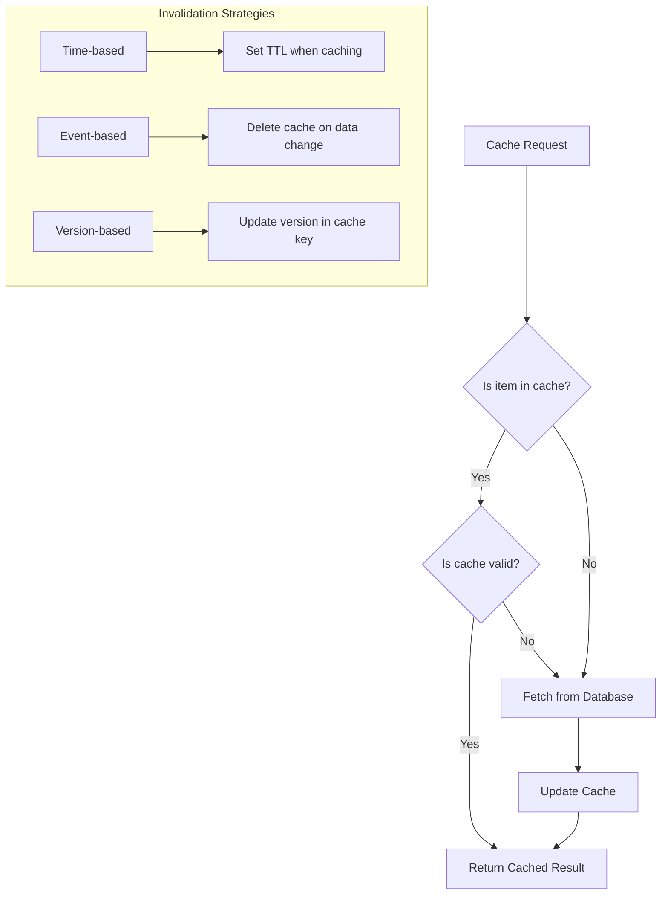

# SQL Caching

## Introduction

Database operations can be resource-intensive, especially when dealing with complex queries or large datasets. SQL caching provides a solution to this problem by temporarily storing query results or frequently accessed data in memory, allowing subsequent identical queries to be served more quickly without repeating the same expensive operations.

In this tutorial, we'll explore SQL caching concepts, techniques, and best practices that can significantly improve your application's performance. By the end, you'll understand how to implement various caching strategies to optimize your database interactions.

## What is SQL Caching?

SQL caching is the process of storing the results of database queries in a faster access medium (usually memory) to reduce the need for repeated expensive database operations. Think of it as keeping a copy of information you look up frequently in a notebook on your desk, rather than having to walk to the library each time you need it.

### Benefits of SQL Caching

- **Improved Response Time**: Cached data can be retrieved much faster than executing queries against the database
- **Reduced Database Load**: Fewer queries hitting the database means less CPU, memory, and I/O usage
- **Increased Application Scalability**: Your application can handle more users with the same database resources
- **Lower Operating Costs**: Reduced database load can translate to lower infrastructure costs

## Types of SQL Caching

Let's explore the most common types of caching strategies used with SQL databases:

### 1. Query Cache

A query cache stores the results of complete SQL queries along with the exact query text. When the same query is executed again, the database can return the cached results instead of processing the query again.

#### MySQL Query Cache Example

Prior to MySQL 8.0, MySQL offered a built-in query cache. Here's how you could configure it:

```sql
-- Check if query cache is enabled
SHOW VARIABLES LIKE 'query_cache_type';

-- Enable query cache
SET GLOBAL query_cache_type = 1;
SET GLOBAL query_cache_size = 67108864; -- Set cache size to 64MB
```

**Note**: MySQL removed the query cache feature in version 8.0. For newer versions, consider using application-level caching or other caching mechanisms.

### 2. Result Cache

Similar to query caching but implemented at the application level. The application stores query results in memory and serves them when the same query is requested again.

#### Example with Node.js and Redis

```javascript
const redis = require('redis');
const client = redis.createClient();
const { promisify } = require('util');
const getAsync = promisify(client.get).bind(client);
const setAsync = promisify(client.set).bind(client);

async function getUserById(userId) {
  // Try to get user from cache first
  const cacheKey = `user:${userId}`;
  const cachedUser = await getAsync(cacheKey);
  
  if (cachedUser) {
    console.log('Cache hit! Returning user from cache');
    return JSON.parse(cachedUser);
  }
  
  console.log('Cache miss! Fetching user from database');
  // Simulate database query
  const query = `SELECT * FROM users WHERE id = ${userId}`;
  const user = await db.executeQuery(query); // This is pseudocode
  
  // Store in cache for future requests (expire after 1 hour)
  await setAsync(cacheKey, JSON.stringify(user), 'EX', 3600);
  
  return user;
}

// Usage
const user = await getUserById(123);
console.log(user);
```

**Output Example**:

First call:
```
Cache miss! Fetching user from database
{ id: 123, name: 'John Doe', email: 'john@example.com' }
```

Second call (within cache expiry):
```
Cache hit! Returning user from cache
{ id: 123, name: 'John Doe', email: 'john@example.com' }
```

### 3. Database Buffer Cache

Modern database systems use buffer caches to keep frequently accessed data pages in memory. This is an internal caching mechanism managed by the database itself.

#### PostgreSQL Shared Buffers Example

In PostgreSQL, you can configure the shared buffer size in the configuration:

```sql
-- Check current shared_buffers setting
SHOW shared_buffers;

-- Example output:
-- 128MB
```

In the postgresql.conf file, you might set:

```
shared_buffers = 2GB  # Recommended to be 25% of system memory
```

### 4. Materialized Views

Materialized views store the results of complex queries as actual tables that can be queried directly. Unlike regular views, materialized views physically store the data.

#### PostgreSQL Materialized View Example

```sql
-- Create a materialized view for monthly sales report
CREATE MATERIALIZED VIEW monthly_sales AS
SELECT 
    date_trunc('month', order_date) AS month,
    product_id,
    SUM(quantity) AS total_quantity,
    SUM(quantity * price) AS total_revenue
FROM orders
GROUP BY date_trunc('month', order_date), product_id;

-- Query the materialized view (fast)
SELECT * FROM monthly_sales
WHERE month = '2023-01-01'
ORDER BY total_revenue DESC
LIMIT 10;

-- To refresh the data when needed:
REFRESH MATERIALIZED VIEW monthly_sales;
```

## Caching Patterns and Best Practices

### Cache Invalidation Strategies

Cache invalidation is the process of removing or updating cached data when the underlying data changes. Here are common strategies:

1. **Time-based invalidation**: Cache entries expire after a set period
2. **Event-based invalidation**: Cache is updated when data changes
3. **Version-based invalidation**: Cache keys include a version number that changes when data changes

Here's a diagram showing these strategies:



### Write-Through vs. Lazy Loading

#### Write-Through Caching

In write-through caching, data is written to both the cache and the database simultaneously:

```javascript
async function updateUser(userId, userData) {
  // Update database
  const query = `UPDATE users SET ... WHERE id = ${userId}`;
  await db.executeQuery(query);
  
  // Update cache
  const cacheKey = `user:${userId}`;
  await setAsync(cacheKey, JSON.stringify(userData), 'EX', 3600);
  
  return userData;
}
```

#### Lazy Loading (Cache-Aside)

In lazy loading, data is only loaded into the cache when it's first requested:

```javascript
async function getUserProfile(userId) {
  const cacheKey = `userProfile:${userId}`;
  
  // Try to get from cache first
  let userProfile = await getAsync(cacheKey);
  
  if (userProfile) {
    return JSON.parse(userProfile);
  }
  
  // Cache miss - get from database
  userProfile = await db.queryUserProfile(userId);
  
  // Store in cache for next time
  await setAsync(cacheKey, JSON.stringify(userProfile), 'EX', 1800);
  
  return userProfile;
}
```

## Real-World SQL Caching Examples

### E-commerce Product Catalog

An e-commerce website can cache product information to improve browsing performance:

```javascript
async function getProductDetails(productId) {
  const cacheKey = `product:${productId}`;
  
  // Try to get from cache
  const cachedProduct = await redisClient.get(cacheKey);
  if (cachedProduct) {
    const product = JSON.parse(cachedProduct);
    // Check if cache is stale
    if (Date.now() - product.cachedAt < 3600000) { // 1 hour
      return product;
    }
  }
  
  // Cache miss or stale data - fetch from database
  const query = `
    SELECT p.*, c.name as category_name, 
           (SELECT AVG(rating) FROM reviews WHERE product_id = p.id) as avg_rating
    FROM products p
    JOIN categories c ON p.category_id = c.id
    WHERE p.id = ?
  `;
  
  const product = await db.execute(query, [productId]);
  
  // Add timestamp and store in cache
  product.cachedAt = Date.now();
  await redisClient.set(cacheKey, JSON.stringify(product), 'EX', 3600);
  
  return product;
}
```

### Dashboard Analytics

For a business dashboard showing daily statistics:

```sql
-- Create materialized view for dashboard data
CREATE MATERIALIZED VIEW daily_stats AS
SELECT 
    date_trunc('day', created_at) AS day,
    COUNT(*) as total_orders,
    SUM(order_total) as revenue,
    COUNT(DISTINCT customer_id) as unique_customers
FROM orders
GROUP BY date_trunc('day', created_at);

-- Create a function to refresh this view once per day
CREATE OR REPLACE FUNCTION refresh_daily_stats()
RETURNS VOID AS $$
BEGIN
    REFRESH MATERIALIZED VIEW daily_stats;
END;
$$ LANGUAGE plpgsql;

-- Set up a scheduled job to run this function daily
-- This is database-specific, but here's a PostgreSQL example using pg_cron extension
SELECT cron.schedule('0 1 * * *', 'SELECT refresh_daily_stats()');
```

## Monitoring Cache Performance

To ensure your caching strategy is effective, monitor these key metrics:

1. **Cache Hit Ratio**: Percentage of requests served from cache
2. **Cache Size**: Amount of memory used by the cache
3. **Cache Latency**: Time to retrieve data from cache vs. database
4. **Database Load**: Reduction in database CPU/memory usage

Here's a simple way to track cache hit ratio in your application:

```javascript
const cacheStats = {
  hits: 0,
  misses: 0,
  get hitRatio() {
    const total = this.hits + this.misses;
    return total === 0 ? 0 : this.hits / total;
  }
};

async function getCachedData(key) {
  const cachedValue = await redisClient.get(key);
  
  if (cachedValue) {
    cacheStats.hits++;
    return JSON.parse(cachedValue);
  }
  
  cacheStats.misses++;
  // Get from database and cache result
  // ...
}

// Log stats periodically
setInterval(() => {
  console.log(`Cache Hit Ratio: ${(cacheStats.hitRatio * 100).toFixed(2)}%`);
  console.log(`Hits: ${cacheStats.hits}, Misses: ${cacheStats.misses}`);
}, 60000); // Every minute
```

## Common Caching Pitfalls

When implementing SQL caching, be aware of these common issues:

1. **Cache Stampede**: Multiple simultaneous cache misses causing database overload
2. **Stale Data**: Cached data becoming outdated due to poor invalidation
3. **Over-caching**: Caching everything without consideration for data volatility
4. **Memory Pressure**: Using too much memory for caching, causing swapping

### Preventing Cache Stampede

Here's a simplified implementation to prevent cache stampede using a mutex lock:

```javascript
const locks = {};

async function getCachedDataWithLock(key) {
  // Try getting from cache first
  const cachedData = await redisClient.get(key);
  if (cachedData) {
    return JSON.parse(cachedData);
  }
  
  // Cache miss - check if someone else is already fetching
  if (locks[key]) {
    // Wait for the other process to finish
    await locks[key];
    // Try again from cache
    const refreshedData = await redisClient.get(key);
    return refreshedData ? JSON.parse(refreshedData) : null;
  }
  
  // Set a promise as a lock
  let resolveLock;
  locks[key] = new Promise(resolve => {
    resolveLock = resolve;
  });
  
  try {
    // Fetch data from database
    const data = await fetchFromDatabase(key);
    // Update cache
    await redisClient.set(key, JSON.stringify(data), 'EX', 3600);
    return data;
  } finally {
    // Release the lock
    resolveLock();
    delete locks[key];
  }
}
```

## Summary

SQL caching is a powerful technique for improving database application performance. In this tutorial, we covered:

- Core concepts of SQL caching and its benefits
- Different types of caching strategies: query cache, result cache, buffer cache, and materialized views
- Best practices for implementing caching, including invalidation strategies
- Real-world examples of SQL caching in e-commerce and dashboard applications
- How to monitor cache performance and avoid common pitfalls

By implementing SQL caching effectively, you can significantly reduce database load, improve response times, and enhance the overall scalability of your applications.

## Additional Resources and Exercises

### Further Reading

- [Redis Documentation](https://redis.io/documentation)
- [PostgreSQL Materialized Views](https://www.postgresql.org/docs/current/rules-materializedviews.html)
- [Database Internals: A Deep Dive into How Distributed Data Systems Work](https://www.amazon.com/Database-Internals-Deep-Distributed-Systems/dp/1492040347)

### Practice Exercises

1. **Basic Caching**: Implement a simple cache for user profiles using an in-memory store like Redis
2. **Materialized View**: Create a materialized view for a complex report query and set up a refresh schedule
3. **Cache Invalidation**: Design a cache invalidation strategy for a blog application where posts and comments can be updated
4. **Performance Testing**: Compare the performance of your application with and without caching, measuring response times and throughput
5. **Advanced**: Implement a distributed caching solution using a tool like Redis Cluster or Memcached to handle high-volume applications

By practicing these exercises, you'll gain hands-on experience with SQL caching concepts and be better prepared to implement efficient caching strategies in your own applications.