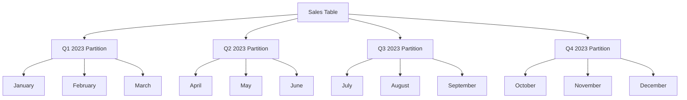

# SQL Partitioning

## Introduction

SQL partitioning is a powerful optimization technique that divides large tables into smaller, more manageable pieces called partitions. These partitions are stored as separate objects in the database but function collectively as a single table when queried. Think of partitioning as organizing a massive filing cabinet into separate drawers - you can access just the drawer you need rather than searching through the entire cabinet.

For database systems handling large volumes of data, partitioning can dramatically improve performance, simplify maintenance, and enhance availability. When you're working with tables that contain millions or billions of rows, properly implemented partitioning can transform slow, resource-intensive queries into fast, efficient ones.

In this guide, we'll explore SQL partitioning concepts, implementation techniques, and real-world applications to help you leverage this powerful feature in your database designs.

## Why Use Partitioning?

Before diving into the technical details, let's understand the key benefits of partitioning:

1. **Improved Query Performance**: Queries that filter on the partition key can skip irrelevant partitions (known as partition pruning), reducing the amount of data scanned.

2. **Enhanced Maintenance**: Operations like backups, index rebuilds, and data purges can be performed on individual partitions instead of the entire table.

3. **Better Data Management**: Historical data can be easily archived or purged by simply managing entire partitions.

4. **Increased Availability**: If one partition becomes unavailable, the rest of the table remains accessible.

5. **Parallel Operations**: Database systems can process operations on different partitions in parallel.

## Partitioning Strategies

There are several ways to partition data, each suited for different scenarios:

### 1. Range Partitioning

Range partitioning divides data based on a range of values in the partition key. This is commonly used with date columns to partition data by time periods.

```sql
-- Example of range partitioning in PostgreSQL
CREATE TABLE sales (
    sale_id INT,
    product_id INT,
    sale_date DATE,
    amount DECIMAL(10,2)
) PARTITION BY RANGE (sale_date);

-- Creating individual partitions
CREATE TABLE sales_2023_q1 PARTITION OF sales
    FOR VALUES FROM ('2023-01-01') TO ('2023-04-01');

CREATE TABLE sales_2023_q2 PARTITION OF sales
    FOR VALUES FROM ('2023-04-01') TO ('2023-07-01');

CREATE TABLE sales_2023_q3 PARTITION OF sales
    FOR VALUES FROM ('2023-07-01') TO ('2023-10-01');

CREATE TABLE sales_2023_q4 PARTITION OF sales
    FOR VALUES FROM ('2023-10-01') TO ('2024-01-01');
```

With this setup, when you query for sales in Q2 2023, the database only needs to scan the `sales_2023_q2` partition:

```sql
-- This query will only scan the Q2 partition
SELECT * FROM sales 
WHERE sale_date >= '2023-04-01' AND sale_date < '2023-07-01';
```

### 2. List Partitioning

List partitioning divides data based on discrete values in the partition key. This is useful for categorical data.

```sql
-- Example of list partitioning in PostgreSQL
CREATE TABLE customers (
    customer_id INT,
    name VARCHAR(100),
    region VARCHAR(50),
    email VARCHAR(100)
) PARTITION BY LIST (region);

-- Creating individual partitions
CREATE TABLE customers_north PARTITION OF customers
    FOR VALUES IN ('North', 'Northwest', 'Northeast');

CREATE TABLE customers_south PARTITION OF customers
    FOR VALUES IN ('South', 'Southwest', 'Southeast');

CREATE TABLE customers_west PARTITION OF customers
    FOR VALUES IN ('West', 'Central West');

CREATE TABLE customers_east PARTITION OF customers
    FOR VALUES IN ('East', 'Central East');
```

### 3. Hash Partitioning

Hash partitioning distributes data evenly across partitions based on a hash value of the partition key. This is useful when you need to distribute data evenly but don't have a natural range or list to partition by.

```sql
-- Example of hash partitioning in PostgreSQL
CREATE TABLE orders (
    order_id INT,
    customer_id INT,
    order_date DATE,
    total_amount DECIMAL(10,2)
) PARTITION BY HASH (customer_id);

-- Creating individual partitions
CREATE TABLE orders_part_0 PARTITION OF orders
    FOR VALUES WITH (MODULUS 4, REMAINDER 0);

CREATE TABLE orders_part_1 PARTITION OF orders
    FOR VALUES WITH (MODULUS 4, REMAINDER 1);

CREATE TABLE orders_part_2 PARTITION OF orders
    FOR VALUES WITH (MODULUS 4, REMAINDER 2);

CREATE TABLE orders_part_3 PARTITION OF orders
    FOR VALUES WITH (MODULUS 4, REMAINDER 3);
```

### 4. Composite Partitioning

Some database systems support composite partitioning, which combines multiple partitioning strategies. For example, you might partition by range on date and then subpartition by list on region.

## Visualizing Partitioning

Let's visualize how range partitioning works with a time-based example:



## Practical Implementation Examples

Let's look at some practical examples of implementing partitioning in different database systems:

### Example 1: Time-Series Data in PostgreSQL

For a web analytics application tracking page views:

```sql
-- Create a partitioned table for page views
CREATE TABLE page_views (
    view_id BIGSERIAL,
    page_url VARCHAR(255),
    user_id INT,
    view_timestamp TIMESTAMP,
    duration_seconds INT,
    referrer_url VARCHAR(255)
) PARTITION BY RANGE (view_timestamp);

-- Create monthly partitions
CREATE TABLE page_views_2023_01 PARTITION OF page_views
    FOR VALUES FROM ('2023-01-01') TO ('2023-02-01');

CREATE TABLE page_views_2023_02 PARTITION OF page_views
    FOR VALUES FROM ('2023-02-01') TO ('2023-03-01');

-- Creating a monthly partition function
CREATE OR REPLACE FUNCTION create_month_partition()
RETURNS VOID AS $$
DECLARE
    next_month DATE;
BEGIN
    -- Get the date for the next month
    next_month := date_trunc('month', CURRENT_DATE) + interval '1 month';
    
    -- Create the partition if it doesn't exist
    EXECUTE format(
        'CREATE TABLE IF NOT EXISTS page_views_%s PARTITION OF page_views FOR VALUES FROM (%L) TO (%L)',
        to_char(next_month, 'YYYY_MM'),
        next_month,
        next_month + interval '1 month'
    );
END;
$$ LANGUAGE plpgsql;

-- Example of querying data for a specific date range
SELECT 
    date_trunc('day', view_timestamp) AS day,
    COUNT(*) AS views
FROM page_views
WHERE view_timestamp BETWEEN '2023-01-15' AND '2023-02-15'
GROUP BY day
ORDER BY day;
```

In this example, the DBMS will only scan the relevant monthly partitions when executing the query.

### Example 2: Regional Sales Data in MySQL

```sql
-- Create a partitioned table for sales data
CREATE TABLE regional_sales (
    sale_id INT AUTO_INCREMENT PRIMARY KEY,
    sale_date DATE,
    region VARCHAR(20),
    product_id INT,
    quantity INT,
    total_price DECIMAL(10,2)
)
PARTITION BY LIST COLUMNS(region) (
    PARTITION p_north VALUES IN ('North', 'Northwest', 'Northeast'),
    PARTITION p_south VALUES IN ('South', 'Southwest', 'Southeast'),
    PARTITION p_east VALUES IN ('East'),
    PARTITION p_west VALUES IN ('West'),
    PARTITION p_central VALUES IN ('Central')
);

-- Insert sample data
INSERT INTO regional_sales (sale_date, region, product_id, quantity, total_price)
VALUES 
    ('2023-06-01', 'North', 101, 5, 250.00),
    ('2023-06-01', 'South', 102, 3, 150.00),
    ('2023-06-02', 'East', 101, 2, 100.00),
    ('2023-06-02', 'West', 103, 8, 400.00),
    ('2023-06-03', 'Central', 102, 4, 200.00);

-- Query sales for specific regions
SELECT 
    region,
    SUM(total_price) AS total_sales
FROM regional_sales
WHERE region IN ('North', 'Northeast', 'Northwest')
GROUP BY region;
```

This query will only scan the `p_north` partition, improving performance.

## Partition Maintenance

One of the main benefits of partitioning is simplified maintenance. Here are some common maintenance tasks:

### Adding New Partitions

As your data grows, you'll need to add new partitions:

```sql
-- PostgreSQL example: Add a new partition for a new quarter
CREATE TABLE sales_2024_q1 PARTITION OF sales
    FOR VALUES FROM ('2024-01-01') TO ('2024-04-01');
```

### Removing Old Partitions

To archive or delete old data:

```sql
-- PostgreSQL example: Detach a partition (keeps the data but removes it from the main table)
ALTER TABLE sales DETACH PARTITION sales_2022_q1;

-- Or simply drop the partition to remove the data
DROP TABLE sales_2022_q1;
```

### Splitting Partitions

If a partition becomes too large:

```sql
-- PostgreSQL example: Split a quarterly partition into monthly partitions
-- First, create the new monthly partitions
CREATE TABLE sales_2023_01 PARTITION OF sales
    FOR VALUES FROM ('2023-01-01') TO ('2023-02-01');
    
CREATE TABLE sales_2023_02 PARTITION OF sales
    FOR VALUES FROM ('2023-02-01') TO ('2023-03-01');
    
CREATE TABLE sales_2023_03 PARTITION OF sales
    FOR VALUES FROM ('2023-03-01') TO ('2023-04-01');

-- Then detach the original quarterly partition
ALTER TABLE sales DETACH PARTITION sales_2023_q1;

-- Move data from the old partition to the new ones
INSERT INTO sales SELECT * FROM sales_2023_q1 
    WHERE sale_date >= '2023-01-01' AND sale_date < '2023-02-01';
    
INSERT INTO sales SELECT * FROM sales_2023_q1 
    WHERE sale_date >= '2023-02-01' AND sale_date < '2023-03-01';
    
INSERT INTO sales SELECT * FROM sales_2023_q1 
    WHERE sale_date >= '2023-03-01' AND sale_date < '2023-04-01';

-- Finally, drop the old partition
DROP TABLE sales_2023_q1;
```

## Best Practices for SQL Partitioning

To make the most of partitioning, follow these best practices:

1. **Choose the Right Partition Key**: Select a column that is frequently used in WHERE clauses and allows for even distribution of data.

2. **Don't Over-Partition**: Having too many partitions can increase overhead. A good rule of thumb is to aim for partitions that contain at least 100MB of data.

3. **Include the Partition Key in Indexes**: Ensure your most common queries can benefit from both partitioning and indexing.

4. **Plan for Growth**: Implement automation for creating new partitions as your data grows.

5. **Monitor Partition Sizes**: Keep partitions balanced for optimal performance.

6. **Test Performance**: Compare query performance with and without partitioning to ensure you're getting the expected benefits.

7. **Consider Partition Pruning**: Design your queries to take advantage of partition pruning by including the partition key in WHERE clauses.

## Common Partitioning Pitfalls

Watch out for these common issues when implementing partitioning:

1. **Queries Without Partition Keys**: Queries that don't include the partition key in the WHERE clause may need to scan all partitions, negating the performance benefits.

2. **Cross-Partition Operations**: Joins or aggregations across multiple partitions can be expensive.

3. **Unique Constraints**: In some database systems, unique constraints can only be enforced within a partition, not across the entire table.

4. **Too Many Small Partitions**: This can lead to management overhead and reduced performance.

5. **Incompatible SQL Features**: Some database features might not work with partitioned tables, depending on your database system.

## Partitioning in Different Database Systems

While the concepts are similar, the syntax and capabilities vary across database systems:

### PostgreSQL

PostgreSQL supports declarative partitioning with RANGE, LIST, and HASH strategies:

```sql
CREATE TABLE measurement (
    city_id INT NOT NULL,
    logdate DATE NOT NULL,
    peaktemp INT,
    unitsales INT
) PARTITION BY RANGE (logdate);
```

### MySQL

MySQL supports RANGE, LIST, HASH, and KEY partitioning:

```sql
CREATE TABLE sales (
    id INT AUTO_INCREMENT,
    sale_date DATE,
    amount DECIMAL(10,2)
)
PARTITION BY RANGE (YEAR(sale_date)) (
    PARTITION p0 VALUES LESS THAN (2022),
    PARTITION p1 VALUES LESS THAN (2023),
    PARTITION p2 VALUES LESS THAN (2024),
    PARTITION p3 VALUES LESS THAN MAXVALUE
);
```

### SQL Server

SQL Server uses partition functions and schemes:

```sql
-- Create a partition function
CREATE PARTITION FUNCTION SalesByDatePF (DATE)
AS RANGE RIGHT FOR VALUES ('2022-01-01', '2023-01-01', '2024-01-01');

-- Create a partition scheme
CREATE PARTITION SCHEME SalesByDatePS
AS PARTITION SalesByDatePF
TO (fg1, fg2, fg3, fg4);

-- Create a partitioned table
CREATE TABLE sales (
    sale_id INT IDENTITY(1,1),
    sale_date DATE,
    amount DECIMAL(10,2)
)
ON SalesByDatePS (sale_date);
```

### Oracle

Oracle Database uses RANGE, LIST, HASH, and COMPOSITE partitioning:

```sql
CREATE TABLE sales (
    sale_id NUMBER,
    sale_date DATE,
    amount NUMBER
)
PARTITION BY RANGE (sale_date) (
    PARTITION sales_2022 VALUES LESS THAN (TO_DATE('01-JAN-2023', 'DD-MON-YYYY')),
    PARTITION sales_2023 VALUES LESS THAN (TO_DATE('01-JAN-2024', 'DD-MON-YYYY')),
    PARTITION sales_future VALUES LESS THAN (MAXVALUE)
);
```

## Summary

SQL partitioning is a powerful technique for managing large datasets efficiently. By dividing tables into smaller, more manageable partitions, you can achieve better query performance, simplified maintenance, and improved data lifecycle management.

We've covered the main partitioning strategies (RANGE, LIST, HASH), implementation examples, maintenance operations, best practices, and syntax differences across major database systems. With this knowledge, you should be able to design and implement effective partitioning strategies for your database applications.

Remember that partitioning is not a one-size-fits-all solution. The best approach depends on your specific data patterns, query requirements, and maintenance needs. Always test your partitioning strategy with realistic workloads to ensure it delivers the expected benefits.

## Additional Resources

- [PostgreSQL Documentation on Partitioning](https://www.postgresql.org/docs/current/ddl-partitioning.html)
- [MySQL Partitioning](https://dev.mysql.com/doc/refman/8.0/en/partitioning.html)
- [SQL Server Partitioning](https://learn.microsoft.com/en-us/sql/relational-databases/partitions/partitioned-tables-and-indexes)
- [Oracle Partitioning Guide](https://docs.oracle.com/en/database/oracle/oracle-database/19/vldbg/partition-concepts.html)

## Exercises

1. Design a partitioning strategy for an e-commerce order table that receives approximately 100,000 orders per day. Consider how you would partition the data to optimize for both historical reporting and recent order processing.

2. Implement a range-partitioned table for temperature readings from IoT devices, with one partition per month. Write queries to find the average temperature for a specific device in the last 30 days.

3. For a multi-tenant application, design a partitioning strategy that isolates each tenant's data for improved security and performance.

4. Create a script that automatically generates new time-based partitions for a logging table one month in advance of when they'll be needed.

5. Design a partitioning strategy for a global user database that needs to be partitioned by geographic region, then sub-partitioned by registration date.