# SQL Query Hints

## Introduction

SQL query hints are special instructions provided to the database query optimizer that influence how a query is executed. They serve as performance tuning mechanisms that allow developers to override the database engine's default execution plans when necessary.

While modern database engines generally make good optimization decisions, they sometimes lack context about specific data distributions or application requirements. Query hints give you a way to provide this additional context and fine-tune query execution for better performance.

In this tutorial, we'll explore:
- What query hints are and when to use them
- Common types of query hints across different database systems
- Practical examples with performance improvements
- Best practices and potential pitfalls

## What Are Query Hints?

Query hints are directives embedded within SQL statements that guide the database engine's query optimizer. They modify the default behavior of the optimizer by suggesting or forcing specific execution strategies.

Think of query hints as gentle (or sometimes forceful) suggestions to the database on how to process your query. They're like telling a GPS system "I know there's construction on the highway, so please take the back roads" when the GPS might not be aware of the current road conditions.

## When to Use Query Hints

Before diving into specific hints, it's important to understand when to use them:

- **Use query hints sparingly**: Modern query optimizers are sophisticated and generally make good decisions.
- **Only after proper indexing and schema design**: Hints should not be a substitute for a well-designed database.
- **When you have evidence**: Use hints when you've analyzed query plans and identified suboptimal decisions.
- **After thorough testing**: Always verify that hints actually improve performance in your specific scenario.

## Common Types of Query Hints

Query hints vary across database systems, but here are some common categories:

### 1. Join Hints

Join hints specify which join algorithm the database should use.

#### Example in SQL Server:

```sql
-- Without hint (SQL Server chooses join type)
SELECT o.order_id, c.customer_name
FROM orders o
JOIN customers c ON o.customer_id = c.customer_id
WHERE o.order_date > '2023-01-01';

-- With HASH JOIN hint
SELECT o.order_id, c.customer_name
FROM orders o
JOIN customers c WITH (HASH JOIN) ON o.customer_id = c.customer_id
WHERE o.order_date > '2023-01-01';
```

#### Example in Oracle:

```sql
-- Without hint
SELECT o.order_id, c.customer_name
FROM orders o
JOIN customers c ON o.customer_id = c.customer_id
WHERE o.order_date > TO_DATE('2023-01-01', 'YYYY-MM-DD');

-- With USE_HASH hint
SELECT /*+ USE_HASH(o c) */ o.order_id, c.customer_name
FROM orders o
JOIN customers c ON o.customer_id = c.customer_id
WHERE o.order_date > TO_DATE('2023-01-01', 'YYYY-MM-DD');
```

### 2. Index Hints

Index hints specify which indexes the query optimizer should use or ignore.

#### Example in MySQL:

```sql
-- Without hint
SELECT * FROM customers 
WHERE region = 'North' AND status = 'Active';

-- With FORCE INDEX hint
SELECT * FROM customers FORCE INDEX (idx_region_status)
WHERE region = 'North' AND status = 'Active';
```

#### Example in SQL Server:

```sql
-- Without hint
SELECT * FROM products
WHERE category = 'Electronics' AND price < 500;

-- With INDEX hint
SELECT * FROM products WITH (INDEX(idx_category_price))
WHERE category = 'Electronics' AND price < 500;
```

### 3. Table Scan Hints

These hints force the database to perform a full table scan rather than using indexes.

#### Example in Oracle:

```sql
-- Without hint
SELECT * FROM orders WHERE order_date > ADD_MONTHS(SYSDATE, -1);

-- With FULL hint
SELECT /*+ FULL(orders) */ * FROM orders 
WHERE order_date > ADD_MONTHS(SYSDATE, -1);
```

### 4. Query Parallelism Hints

These control whether and how a query uses parallel processing.

#### Example in SQL Server:

```sql
-- Without hint
SELECT AVG(total_amount) FROM orders GROUP BY region;

-- With MAXDOP hint (limiting to 4 processors)
SELECT AVG(total_amount) FROM orders GROUP BY region OPTION (MAXDOP 4);
```

#### Example in Oracle:

```sql
-- Without hint
SELECT department_id, AVG(salary) FROM employees GROUP BY department_id;

-- With parallel hint
SELECT /*+ PARALLEL(employees, 4) */ department_id, AVG(salary) 
FROM employees GROUP BY department_id;
```

## Real-World Example: Optimizing a Complex Query

Let's walk through a practical example of using query hints to optimize a slow-running report query:

### Scenario

You have a reporting query that needs to analyze sales data across multiple dimensions. The query joins several large tables and is running too slowly.

### Original Query (PostgreSQL):

```sql
SELECT 
    p.product_name,
    c.category_name,
    r.region_name,
    SUM(s.quantity) as total_quantity,
    SUM(s.quantity * s.unit_price) as revenue
FROM 
    sales s
    JOIN products p ON s.product_id = p.product_id
    JOIN categories c ON p.category_id = c.category_id
    JOIN stores st ON s.store_id = st.store_id
    JOIN regions r ON st.region_id = r.region_id
WHERE 
    s.sale_date BETWEEN '2023-01-01' AND '2023-12-31'
GROUP BY 
    p.product_name, c.category_name, r.region_name
ORDER BY 
    revenue DESC;
```

When you analyze this query's execution plan, you notice the database is choosing a nested loop join for the sales and products tables, which is inefficient for large datasets.

### Optimized Query with Hints:

```sql
SELECT 
    p.product_name,
    c.category_name,
    r.region_name,
    SUM(s.quantity) as total_quantity,
    SUM(s.quantity * s.unit_price) as revenue
FROM 
    sales s
    JOIN /*+ HASH JOIN */ products p ON s.product_id = p.product_id
    JOIN /*+ HASH JOIN */ categories c ON p.category_id = c.category_id
    JOIN /*+ HASH JOIN */ stores st ON s.store_id = st.store_id
    JOIN /*+ HASH JOIN */ regions r ON st.region_id = r.region_id
WHERE 
    s.sale_date BETWEEN '2023-01-01' AND '2023-12-31'
GROUP BY 
    p.product_name, c.category_name, r.region_name
ORDER BY 
    revenue DESC;
```

### Performance Comparison:

| Query Version | Execution Time | Rows Processed | Memory Used |
|---------------|----------------|----------------|-------------|
| Original      | 2 minutes 15 seconds | 1,500,000 | 245 MB |
| With Hints    | 28 seconds    | 1,500,000      | 320 MB |

By specifying hash joins, we've reduced the execution time by over 80%, with a modest increase in memory usage.

## Query Hints Across Different Database Systems

Let's look at the syntax differences for query hints across major database systems:

```mermaid
graph TB
    A[SQL Query Hints] --> B[SQL Server]
    A --> C[Oracle]
    A --> D[MySQL]
    A --> E[PostgreSQL]
    
    B --> B1[Table Hints WITH &#40;HINT&#41;]
    B --> B2[Query Hints OPTION &#40;HINT&#41;]
    
    C --> C1[Comment-based /*+ HINT */]
    
    D --> D1[Index hints USE/FORCE/IGNORE INDEX]
    D --> D2[Optimizer hints /*+ HINT */]
    
    E --> E1[Comment-based /*+ HINT */]
    E --> E2[Configuration Parameters]
```



## Best Practices for Using Query Hints

1. **Measure First**: Always establish a performance baseline before adding hints.
2. **Document Why**: Comment your SQL to explain why a hint was necessary.
3. **Retest Periodically**: As data volumes change, hints may become unnecessary or even counterproductive.
4. **Database-Specific Understanding**: Learn the specific optimization techniques for your database system.
5. **Version Changes**: Be aware that optimizer behavior can change between database versions.

## Potential Pitfalls

Query hints come with some risks:

1. **Optimizer Improvements**: Future versions of the database might have better optimizers, but your hints will override them.
2. **Data Changes**: As data distribution changes, a once-helpful hint might become detrimental.
3. **Maintenance Burden**: Hints create an additional layer to maintain and understand.
4. **False Sense of Security**: Hints might mask underlying schema or indexing problems.

## Example: When Hints Go Wrong

Consider this query with a hint that worked well initially:

```sql
-- Initially performs well with small dataset
SELECT /*+ INDEX(customers idx_region) */ 
    customer_id, customer_name
FROM 
    customers
WHERE 
    region = 'North';
```

But as the 'North' region grows to contain 70% of all customers, using the index becomes less efficient than a table scan. The hint now forces a suboptimal plan.

## Summary

SQL query hints are powerful tools for fine-tuning database performance when used appropriately:

- They allow developers to influence the query optimizer's decisions
- Different database systems have their own syntax and available hints
- Hints should be used sparingly and only after proper analysis
- Always measure performance before and after applying hints
- Be aware that hints that help today might hurt tomorrow as data changes

While query hints can dramatically improve performance in specific scenarios, they should be considered a specialized tool rather than a first-resort solution. Proper database design, indexing, and query structure should always be your primary optimization strategies.

## Additional Resources

- [Oracle Query Optimizer Hints Documentation](https://docs.oracle.com/en/database/oracle/oracle-database/19/tgsql/influencing-the-optimizer.html)
- [SQL Server Query Hints Documentation](https://docs.microsoft.com/en-us/sql/t-sql/queries/hints-transact-sql-query)
- [MySQL Optimizer Hints](https://dev.mysql.com/doc/refman/8.0/en/optimizer-hints.html)
- [PostgreSQL Performance Optimization](https://www.postgresql.org/docs/current/performance-tips.html)

## Exercises

1. Compare the execution plans for a complex query in your database with and without hints.
2. Take a slow-running query from your application and experiment with different hint combinations.
3. Create a test case where the wrong hint makes performance worse, not better.
4. Research which hints are available in your specific database system and create a reference sheet.
5. Practice reading execution plans and identifying when the optimizer is making suboptimal choices.