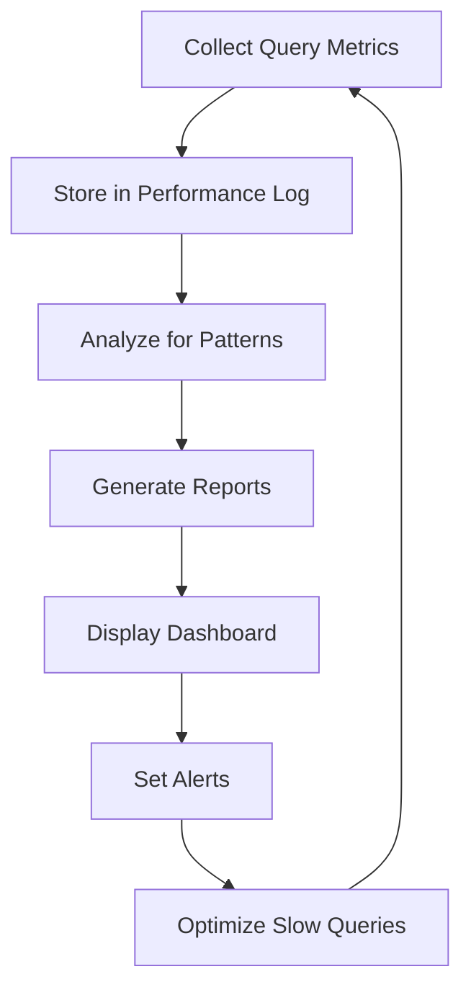
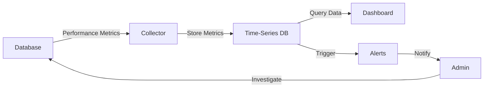

# SQL Performance Monitoring

## Introduction

SQL performance monitoring is the process of tracking, analyzing, and optimizing the execution of SQL queries to ensure your database operates efficiently. For beginners who are building their first applications with databases, understanding how to monitor performance is crucial. Even simple queries can become slow as your data grows, and learning to identify and fix performance bottlenecks will help you build scalable applications.

In this guide, we'll explore the fundamentals of SQL performance monitoring, introduce essential tools and techniques, and provide practical examples that you can apply to your own projects.

## Why Monitor SQL Performance?

Before diving into how to monitor SQL performance, let's understand why it matters:

- **User Experience**: Slow queries lead to slow applications, which frustrates users
- **Resource Efficiency**: Inefficient queries waste server resources and increase costs
- **Scalability**: Performance issues that are minor with small datasets can become critical as data grows
- **Proactive Problem Solving**: Identifying issues before they impact users prevents downtime

## Key Performance Metrics to Monitor

When monitoring SQL performance, these are the primary metrics you should track:

### Query Execution Time

This is the total time a query takes to execute, measured in milliseconds or seconds. It's the most direct indicator of performance.

### CPU Usage

High CPU usage during query execution can indicate inefficient query plans or missing indexes.

### Memory Usage

Queries that consume excessive memory may cause swapping and dramatically slow down the database server.

### Disk I/O

Excessive disk reads or writes can be a sign of missing indexes or poorly optimized queries.

### Cache Hit Ratio

This measures how often data is served from memory cache versus being read from disk. A higher ratio is better.

### Number of Rows Examined

Efficient queries examine only the rows they need. If a query examines millions of rows but returns only a few, it's likely inefficient.

## Basic Monitoring Techniques

Let's explore some fundamental techniques for monitoring SQL performance:

### Using EXPLAIN

The `EXPLAIN` command is available in most SQL databases and shows how the database executes your query. It's your first line of defense against performance issues.

```sql
-- Basic EXPLAIN example in MySQL/PostgreSQL
EXPLAIN SELECT * FROM customers WHERE last_name = 'Smith';
```

Example output (MySQL):

```
+----+-------------+-----------+------------+------+---------------+------+---------+------+------+----------+-------------+
| id | select_type | table     | partitions | type | possible_keys | key  | key_len | ref  | rows | filtered | Extra       |
+----+-------------+-----------+------------+------+---------------+------+---------+------+------+----------+-------------+
|  1 | SIMPLE      | customers | NULL       | ALL  | NULL          | NULL | NULL    | NULL | 1000 |    10.00 | Using where |
+----+-------------+-----------+------------+------+---------------+------+---------+------+------+----------+-------------+
```

The output tells us this query is performing a full table scan (`type: ALL`) which is inefficient, especially for large tables.

### Using Query Execution Plans

More detailed than EXPLAIN, execution plans show the exact steps the database takes to execute a query.

```sql
-- PostgreSQL example
EXPLAIN ANALYZE SELECT customers.*, orders.order_date 
FROM customers 
JOIN orders ON customers.customer_id = orders.customer_id
WHERE orders.total_amount > 100;
```

Example output (simplified):

```
Nested Loop  (cost=4.18..31.04 rows=33 width=68) (actual time=0.028..0.053 rows=5 loops=1)
  ->  Seq Scan on orders  (cost=0.00..18.50 rows=33 width=12) (actual time=0.012..0.016 rows=5 loops=1)
        Filter: (total_amount > 100)
  ->  Index Scan using customers_pkey on customers  (cost=0.00..0.38 rows=1 width=64) (actual time=0.006..0.006 rows=1 loops=5)
        Index Cond: (customer_id = orders.customer_id)
Planning Time: 0.112 ms
Execution Time: 0.083 ms
```

This shows not just the plan but the actual execution time and number of rows processed at each step.

### Monitoring Query Runtime

You can measure the execution time of a query using database-specific functions:

```sql
-- In MySQL
SELECT *, NOW() as start_time FROM large_table WHERE complex_condition;
SELECT NOW() as end_time;

-- In PostgreSQL
\timing on
SELECT * FROM large_table WHERE complex_condition;
\timing off
```

### Using Database System Views

Most databases provide system views that expose performance information:

```sql
-- MySQL example - see currently running queries
SELECT * FROM information_schema.PROCESSLIST
WHERE command = 'Query' AND time > 5;  -- queries running > 5 seconds

-- PostgreSQL example - see slow queries
SELECT query, calls, total_time, rows, mean_time
FROM pg_stat_statements
ORDER BY mean_time DESC
LIMIT 10;
```

## Database-Specific Monitoring Tools

Different database systems offer specialized tools for performance monitoring:

### MySQL Tools

**Performance Schema**

MySQL's Performance Schema provides detailed monitoring information:

```sql
-- Enable Performance Schema if not already enabled
SET GLOBAL performance_schema = ON;

-- Find queries consuming the most time
SELECT digest_text, count_star, avg_timer_wait
FROM performance_schema.events_statements_summary_by_digest
ORDER BY avg_timer_wait DESC
LIMIT 10;
```

**Slow Query Log**

The slow query log records queries that exceed a specified execution time:

```sql
-- Enable slow query log
SET GLOBAL slow_query_log = 'ON';
SET GLOBAL long_query_time = 1;  -- Log queries taking > 1 second

-- View the slow query log (location varies by installation)
-- Usually at /var/log/mysql/mysql-slow.log
```

### PostgreSQL Tools

**pg_stat_statements**

This extension tracks execution statistics for all SQL statements:

```sql
-- Enable the extension if not already enabled
CREATE EXTENSION IF NOT EXISTS pg_stat_statements;

-- Query to find the slowest statements
SELECT query, calls, total_time, rows, 
       (total_time / calls) as avg_time
FROM pg_stat_statements
ORDER BY avg_time DESC
LIMIT 10;
```

**Log Analysis**

PostgreSQL can log slow queries to a file for analysis:

```sql
-- In postgresql.conf set:
-- log_min_duration_statement = 1000  -- Log queries > 1000ms (1 second)
```

### SQL Server Tools

**Dynamic Management Views (DMVs)**

SQL Server provides DMVs for performance monitoring:

```sql
-- Find the most expensive queries
SELECT TOP 10
    total_worker_time/execution_count AS avg_cpu_time,
    execution_count, 
    total_worker_time,
    total_elapsed_time/execution_count as avg_elapsed_time,
    total_logical_reads/execution_count as avg_logical_reads,
    t.text
FROM sys.dm_exec_query_stats AS s
CROSS APPLY sys.dm_exec_sql_text(s.sql_handle) AS t
ORDER BY total_worker_time/execution_count DESC;
```

## Common Performance Issues and Solutions

Let's look at some typical SQL performance problems and how to solve them:

### Missing Indexes

**Problem Example:**
```sql
-- Slow query without proper index
SELECT * FROM orders WHERE customer_email = 'user@example.com';
```

If `customer_email` doesn't have an index, the database must scan the entire table.

**Solution:**
```sql
-- Create an index on the column
CREATE INDEX idx_orders_customer_email ON orders(customer_email);
```

**How to detect:** EXPLAIN will show a table scan instead of an index scan.

### Inefficient JOINs

**Problem Example:**
```sql
-- Joining tables without proper indexes
SELECT o.order_id, c.name
FROM orders o, customers c
WHERE o.customer_id = c.id AND o.status = 'shipped';
```

**Solution:**
```sql
-- Create indexes for the join columns and filter conditions
CREATE INDEX idx_orders_customer_id ON orders(customer_id);
CREATE INDEX idx_orders_status ON orders(status);
-- Use explicit JOIN syntax
SELECT o.order_id, c.name
FROM orders o
JOIN customers c ON o.customer_id = c.id
WHERE o.status = 'shipped';
```

### Selecting Too Many Columns

**Problem Example:**
```sql
-- Selecting all columns when only a few are needed
SELECT * FROM products WHERE category = 'electronics';
```

**Solution:**
```sql
-- Select only necessary columns
SELECT product_id, name, price FROM products WHERE category = 'electronics';
```

### Using Functions in WHERE Clauses

**Problem Example:**
```sql
-- Function in WHERE clause prevents index usage
SELECT * FROM customers WHERE YEAR(registration_date) = 2023;
```

**Solution:**
```sql
-- Rewrite to allow index usage
SELECT * FROM customers 
WHERE registration_date >= '2023-01-01' 
AND registration_date < '2024-01-01';
```

## Setting Up Performance Monitoring

Let's create a simple monitoring system for your database. Here's a step-by-step approach:

### 1. Create a Performance Log Table

```sql
CREATE TABLE query_performance_log (
  id INT AUTO_INCREMENT PRIMARY KEY,
  query_text TEXT,
  execution_time_ms FLOAT,
  rows_returned INT,
  captured_at TIMESTAMP DEFAULT CURRENT_TIMESTAMP
);
```

### 2. Create a Logging Procedure

```sql
DELIMITER //
CREATE PROCEDURE log_query_performance(IN query_text TEXT, IN start_time TIMESTAMP)
BEGIN
  DECLARE execution_time FLOAT;
  DECLARE rows_returned INT;
  
  SET execution_time = TIMESTAMPDIFF(MICROSECOND, start_time, NOW()) / 1000.0;
  SET rows_returned = ROW_COUNT();
  
  INSERT INTO query_performance_log (query_text, execution_time_ms, rows_returned)
  VALUES (query_text, execution_time, rows_returned);
END //
DELIMITER ;
```

### 3. Use the Logger

```sql
SET @start_time = NOW();
SELECT * FROM large_table WHERE complex_condition;
CALL log_query_performance('SELECT * FROM large_table WHERE complex_condition', @start_time);
```

### 4. Analyze Performance Over Time

```sql
-- Find queries with increasing execution times
SELECT query_text, 
       AVG(execution_time_ms) as avg_time,
       MIN(execution_time_ms) as min_time,
       MAX(execution_time_ms) as max_time,
       COUNT(*) as execution_count
FROM query_performance_log
GROUP BY query_text
HAVING COUNT(*) > 5 AND MAX(execution_time_ms) > MIN(execution_time_ms) * 2
ORDER BY avg_time DESC;
```

## Visualizing Performance Data

Monitoring becomes more effective when you can visualize trends over time. Here's a simple example of how you might create a performance dashboard flow:



## Case Study: Optimizing an E-commerce Query

Let's look at a real-world example of performance monitoring and optimization:

**Original Query:**
```sql
SELECT p.product_name, p.price, p.description, c.category_name, 
       m.manufacturer_name, SUM(o.quantity) as units_sold
FROM products p
LEFT JOIN categories c ON p.category_id = c.category_id
LEFT JOIN manufacturers m ON p.manufacturer_id = m.manufacturer_id
LEFT JOIN order_items o ON p.product_id = o.product_id
WHERE p.price > 50
GROUP BY p.product_id, p.product_name, p.price, p.description, 
         c.category_name, m.manufacturer_name
ORDER BY units_sold DESC;
```

**Performance Issue:**
When running EXPLAIN, we see this query is doing multiple table scans and has a high execution time of 3.5 seconds.

**Monitoring Steps:**
1. Run EXPLAIN to identify bottlenecks
2. Check indexes on joined tables
3. Use a profiler to measure time spent on each operation

**Optimized Query:**
```sql
-- First, add missing indexes
CREATE INDEX idx_products_category ON products(category_id);
CREATE INDEX idx_products_manufacturer ON products(manufacturer_id);
CREATE INDEX idx_products_price ON products(price);
CREATE INDEX idx_order_items_product ON order_items(product_id);

-- Then, rewrite the query to be more efficient
SELECT p.product_name, p.price, p.description, c.category_name, 
       m.manufacturer_name, COALESCE(s.units_sold, 0) as units_sold
FROM products p
LEFT JOIN categories c ON p.category_id = c.category_id
LEFT JOIN manufacturers m ON p.manufacturer_id = m.manufacturer_id
LEFT JOIN (
  SELECT product_id, SUM(quantity) as units_sold
  FROM order_items
  GROUP BY product_id
) s ON p.product_id = s.product_id
WHERE p.price > 50
ORDER BY units_sold DESC;
```

**Result:**
The optimized query runs in 0.2 seconds, a 17x improvement.

## Real-time Database Monitoring

For production environments, consider setting up real-time monitoring with these steps:

1. **Enable database performance counters**
2. **Set up metric collection** (every 1-5 minutes)
3. **Configure alerts** for when queries exceed thresholds
4. **Create a dashboard** to visualize trends

Here's a simplified flow for real-time monitoring:



## Best Practices for Ongoing Performance Monitoring

1. **Establish baselines** - Know what "normal" performance looks like
2. **Monitor trends** - Look for gradual degradation, not just sudden issues
3. **Test in staging first** - Verify all changes in a non-production environment
4. **Document changes** - Keep track of optimizations and their effects
5. **Use automated tools** - Set up continuous monitoring rather than manual checks
6. **Prioritize optimizations** - Focus on high-impact, frequently-run queries first
7. **Review schema design** - Sometimes performance issues stem from database design

## Exercises

Try these exercises to practice your SQL performance monitoring skills:

1. **Find Slow Queries**: Enable slow query logging in your database and identify the top 3 slowest queries
2. **Optimize a Query**: Take one slow query and use EXPLAIN to identify why it's slow, then optimize it
3. **Create a Monitoring Dashboard**: Set up a simple dashboard to track query performance over time
4. **Compare Execution Plans**: Write a query two different ways and compare their execution plans
5. **Index Impact Analysis**: Measure query performance before and after adding an index

## Additional Resources

For more in-depth learning, consider these resources:

- **Books**:
  - "High Performance MySQL" by Baron Schwartz
  - "SQL Performance Explained" by Markus Winand

- **Online Documentation**:
  - [MySQL Performance Schema](https://dev.mysql.com/doc/refman/8.0/en/performance-schema.html)
  - [PostgreSQL Performance Tips](https://wiki.postgresql.org/wiki/Performance_Optimization)
  - [SQL Server Query Performance Tuning](https://docs.microsoft.com/en-us/sql/relational-databases/performance/monitoring-performance-by-using-the-query-store)

- **Tools**:
  - [pgBadger](https://github.com/darold/pgbadger) for PostgreSQL log analysis
  - [pt-query-digest](https://www.percona.com/doc/percona-toolkit/LATEST/pt-query-digest.html) for MySQL query analysis

## Summary

SQL performance monitoring is an essential skill for any developer working with databases. By understanding the key metrics, using appropriate tools, and applying systematic optimization techniques, you can ensure your database queries remain fast and efficient even as your application grows.

Remember these key takeaways:

1. Monitor query execution time, resource usage, and query plans regularly
2. Use database-specific tools like EXPLAIN, performance schemas, and slow query logs
3. Address common issues like missing indexes, inefficient joins, and poor query structure
4. Establish a baseline and track performance over time
5. Optimize the most important and frequently run queries first

With consistent monitoring and proactive optimization, you'll build applications that remain responsive and efficient even under heavy load.