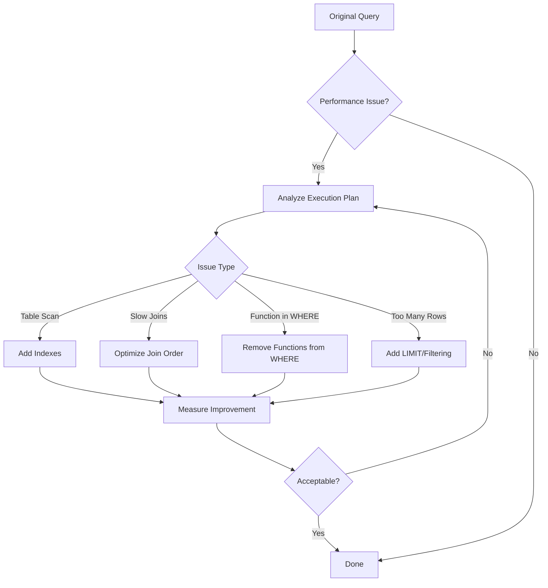

# SQL Query Tuning

## Introduction

SQL query tuning is the process of improving the performance of SQL queries. When databases grow in size or when applications need to handle more concurrent users, even simple queries can become slow. Query tuning helps identify and fix these performance bottlenecks, resulting in faster response times and better resource utilization.

In this tutorial, we'll explore various techniques to optimize your SQL queries, understand execution plans, and learn how to measure performance improvements. By the end, you'll have the knowledge to write efficient SQL queries that perform well even as your data grows.

## Why Query Tuning Matters

Before diving into optimization techniques, let's understand why query tuning is important:

- **Improved user experience**: Faster queries mean more responsive applications
- **Resource efficiency**: Optimized queries use less CPU, memory, and I/O
- **Scalability**: Well-tuned queries continue to perform as data volumes increase
- **Cost savings**: Efficient queries can reduce infrastructure costs

## Understanding Query Execution

To optimize SQL queries, you first need to understand how a database executes them. When you run a query, the database follows these steps:

1. **Parsing**: Checks the query syntax and validates table and column names
2. **Optimization**: Creates an execution plan (how to retrieve the data)
3. **Execution**: Runs the plan and returns results

The **execution plan** is crucial for optimization. It shows how the database will retrieve data—whether it will use indexes, perform full table scans, or join tables in a specific order.

### Viewing Execution Plans

Most database systems provide tools to view execution plans:

```sql
-- MySQL/MariaDB
EXPLAIN SELECT * FROM customers WHERE last_name = 'Smith';

-- PostgreSQL
EXPLAIN ANALYZE SELECT * FROM customers WHERE last_name = 'Smith';

-- SQL Server
SET SHOWPLAN_ALL ON;
SELECT * FROM customers WHERE last_name = 'Smith';
SET SHOWPLAN_ALL OFF;

-- Oracle
EXPLAIN PLAN FOR SELECT * FROM customers WHERE last_name = 'Smith';
SELECT * FROM TABLE(DBMS_XPLAN.DISPLAY);
```

Sample output (MySQL):

```
+----+-------------+-----------+------------+------+---------------+------+---------+------+------+----------+-------------+
| id | select_type | table     | partitions | type | possible_keys | key  | key_len | ref  | rows | filtered | Extra       |
+----+-------------+-----------+------------+------+---------------+------+---------+------+------+----------+-------------+
|  1 | SIMPLE      | customers | NULL       | ALL  | NULL          | NULL | NULL    | NULL | 1000 |    10.00 | Using where |
+----+-------------+-----------+------------+------+---------------+------+---------+------+------+----------+-------------+
```

This output tells us the query is performing a full table scan (`type: ALL`) without using any indexes, which can be inefficient for large tables.

## Common Query Tuning Techniques

Let's explore key techniques to optimize your SQL queries:

### 1. Use Appropriate Indexes

Indexes are the most powerful tools for query optimization. They help the database find data quickly without scanning the entire table.

```sql
-- Creating an index on the last_name column
CREATE INDEX idx_last_name ON customers(last_name);

-- Now run the query again
SELECT * FROM customers WHERE last_name = 'Smith';
```

After adding the index, the execution plan might look like:

```
+----+-------------+-----------+------------+------+---------------+-------------+---------+-------+------+----------+-------+
| id | select_type | table     | partitions | type | possible_keys | key         | key_len | ref   | rows | filtered | Extra |
+----+-------------+-----------+------------+------+---------------+-------------+---------+-------+------+----------+-------+
|  1 | SIMPLE      | customers | NULL       | ref  | idx_last_name | idx_last_name | 768     | const |    5 |   100.00 | NULL  |
+----+-------------+-----------+------------+------+---------------+-------------+---------+-------+------+----------+-------+
```

Now the database uses the index (`type: ref`), examining only 5 rows instead of 1000.

#### Index Types:

- **Single-column indexes**: Index on one column
- **Composite indexes**: Index on multiple columns (order matters!)
- **Covering indexes**: Index that contains all data needed by a query

#### Best Practices for Indexes:

- Index columns used in WHERE, JOIN, and ORDER BY clauses
- Avoid over-indexing (each index increases write overhead)
- Consider the selectivity of columns (how unique the values are)

### 2. Be Selective in Column Selection

Avoid using `SELECT *` when you only need specific columns:

```sql
-- Instead of this
SELECT * FROM orders WHERE customer_id = 123;

-- Use this
SELECT order_id, order_date, total_amount 
FROM orders 
WHERE customer_id = 123;
```

Benefits:
- Reduces I/O and memory usage
- Improves network traffic
- Can leverage covering indexes

### 3. Optimize JOIN Operations

JOIN operations can be expensive, especially with large tables:

```sql
-- Inefficient join without proper indexes
SELECT c.name, o.order_date, o.total_amount
FROM customers c
JOIN orders o ON c.customer_id = o.customer_id
WHERE o.order_date > '2023-01-01';
```

Optimization strategies:
- Ensure joined columns are indexed
- Join smaller tables first
- Filter data before joining when possible

```sql
-- More efficient approach
SELECT c.name, o.order_date, o.total_amount
FROM (
    SELECT * FROM orders 
    WHERE order_date > '2023-01-01'
) o
JOIN customers c ON c.customer_id = o.customer_id;
```

### 4. Use WHERE Clauses Effectively

The WHERE clause determines how many rows the database must process:

```sql
-- Less efficient (non-sargable query)
SELECT * FROM products 
WHERE YEAR(created_at) = 2023;

-- More efficient (sargable query)
SELECT * FROM products 
WHERE created_at >= '2023-01-01' 
AND created_at < '2024-01-01';
```

Tips for efficient WHERE clauses:
- Avoid functions on indexed columns
- Use simple comparison operators
- Consider the order of conditions (most selective first)

### 5. Beware of LIKE with Leading Wildcards

Using a leading wildcard (`%text`) prevents the database from using indexes effectively:

```sql
-- Inefficient (can't use index)
SELECT * FROM customers 
WHERE last_name LIKE '%son';

-- More efficient (can use index)
SELECT * FROM customers 
WHERE last_name LIKE 'John%';
```

For full-text search requirements, consider using full-text search capabilities of your database rather than `LIKE` with wildcards.

### 6. LIMIT Your Results

When you only need a subset of results, use LIMIT (or TOP in SQL Server, ROWNUM in Oracle):

```sql
-- Return only the first 100 rows
SELECT * FROM log_entries 
ORDER BY created_at DESC 
LIMIT 100;
```

This is especially helpful for pagination and reporting queries.

## Real-world Example: Optimizing a Complex Query

Let's optimize a real-world query step by step:

### Original Query

```sql
SELECT 
    p.product_name,
    c.category_name,
    SUM(o.quantity) as total_sold,
    AVG(o.price_per_unit) as avg_price
FROM 
    orders o
JOIN 
    products p ON o.product_id = p.product_id
JOIN 
    categories c ON p.category_id = c.category_id
WHERE 
    YEAR(o.order_date) = 2023
GROUP BY 
    p.product_name, c.category_name
ORDER BY 
    total_sold DESC;
```

### Problems with this Query

1. Function `YEAR()` on `order_date` prevents efficient index use
2. Joining multiple tables without considering table sizes
3. Selecting unnecessary columns for grouping

### Optimized Query

```sql
SELECT 
    p.product_name,
    c.category_name,
    SUM(o.quantity) as total_sold,
    AVG(o.price_per_unit) as avg_price
FROM 
    orders o
JOIN 
    products p ON o.product_id = p.product_id
JOIN 
    categories c ON p.category_id = c.category_id
WHERE 
    o.order_date >= '2023-01-01' 
    AND o.order_date < '2024-01-01'
GROUP BY 
    p.product_id  -- Assuming product_id uniquely identifies a product
HAVING 
    SUM(o.quantity) > 0  -- Only include products with sales
ORDER BY 
    total_sold DESC
LIMIT 100;  -- Only need top 100 products
```

### Improvements Made

1. Replaced `YEAR()` function with date range comparison
2. Added LIMIT to return only top sellers
3. Grouped by `product_id` instead of `product_name` (assuming it's the primary key)
4. Added HAVING clause to filter out products with no sales

### Creating Appropriate Indexes

```sql
CREATE INDEX idx_orders_date ON orders(order_date);
CREATE INDEX idx_orders_product ON orders(product_id);
CREATE INDEX idx_product_category ON products(category_id);
```

These indexes will significantly improve the performance of our query.

## Measuring Query Performance

Always measure performance before and after optimization to ensure your changes are effective:

```sql
-- MySQL/MariaDB
SELECT SQL_NO_CACHE * FROM large_table WHERE complex_condition;

-- PostgreSQL
EXPLAIN ANALYZE SELECT * FROM large_table WHERE complex_condition;

-- SQL Server
SET STATISTICS TIME ON;
SELECT * FROM large_table WHERE complex_condition;
SET STATISTICS TIME OFF;
```

Key metrics to monitor:
- Execution time
- Number of rows examined
- Memory usage
- Disk I/O

## Common Query Tuning Patterns

Let's visualize some common query patterns and their optimizations:



## Advanced Tuning Techniques

Once you've mastered the basics, consider these advanced techniques:

### 1. Query Rewriting

Sometimes restructuring a query can significantly improve performance:

```sql
-- Instead of a complex join
SELECT *
FROM table1 t1
JOIN table2 t2 ON t1.id = t2.id
WHERE t1.status = 'active'
AND t2.created_at > '2023-01-01';

-- Consider using EXISTS
SELECT *
FROM table1 t1
WHERE t1.status = 'active'
AND EXISTS (
    SELECT 1
    FROM table2 t2
    WHERE t1.id = t2.id
    AND t2.created_at > '2023-01-01'
);
```

### 2. Denormalization for Read-Heavy Workloads

For read-heavy applications, consider denormalizing some data:

```sql
-- Instead of joining every time
SELECT c.name, COUNT(o.order_id) as order_count
FROM customers c
JOIN orders o ON c.customer_id = o.customer_id
GROUP BY c.name;

-- Create a summary table
CREATE TABLE customer_order_summary (
    customer_id INT PRIMARY KEY,
    customer_name VARCHAR(100),
    order_count INT,
    last_updated TIMESTAMP
);
```

### 3. Partitioning Large Tables

For very large tables, consider partitioning:

```sql
-- Example of partitioning in MySQL
CREATE TABLE orders (
    order_id INT,
    order_date DATE,
    customer_id INT,
    amount DECIMAL(10,2)
)
PARTITION BY RANGE (YEAR(order_date)) (
    PARTITION p2021 VALUES LESS THAN (2022),
    PARTITION p2022 VALUES LESS THAN (2023),
    PARTITION p2023 VALUES LESS THAN (2024),
    PARTITION pOther VALUES LESS THAN MAXVALUE
);
```

Partitioning can improve query performance by allowing the database to scan only relevant partitions.

## Common Query Tuning Mistakes

Avoid these common pitfalls:

1. **Over-indexing**: Too many indexes slow down write operations
2. **Premature optimization**: Don't optimize without measuring first
3. **Ignoring database statistics**: Ensure statistics are up to date
4. **Not considering the workload**: OLTP vs. OLAP systems need different optimization strategies
5. **One-size-fits-all approach**: Different queries may need different optimization techniques

## Summary

SQL query tuning is an essential skill for any developer working with databases. By understanding execution plans, using indexes effectively, and applying the techniques covered in this tutorial, you can significantly improve the performance of your applications.

Remember these key takeaways:

- Analyze execution plans to understand query performance
- Use appropriate indexes on columns used in WHERE, JOIN, and ORDER BY clauses
- Be selective in column selection (avoid SELECT *)
- Optimize JOIN operations by filtering data first
- Use WHERE clauses effectively (avoid functions on indexed columns)
- Measure performance before and after optimization

## Additional Resources

To further enhance your SQL query tuning skills, explore these resources:

- [Use The Index, Luke](https://use-the-index-luke.com/) - A guide to database performance for developers
- [MySQL Performance Blog](https://www.percona.com/blog/) - In-depth articles on MySQL performance
- [SQL Performance Explained](https://sql-performance-explained.com/) - An excellent book on SQL performance

## Exercises

To practice your query tuning skills:

1. Take a slow query from your application and analyze its execution plan
2. Identify missing indexes in your database schema
3. Rewrite a query that uses functions in the WHERE clause
4. Optimize a query that uses multiple JOINs
5. Compare the performance of different query variations using EXPLAIN

Remember, query tuning is both an art and a science. The more you practice, the better you'll become at spotting and fixing performance issues in your SQL queries.