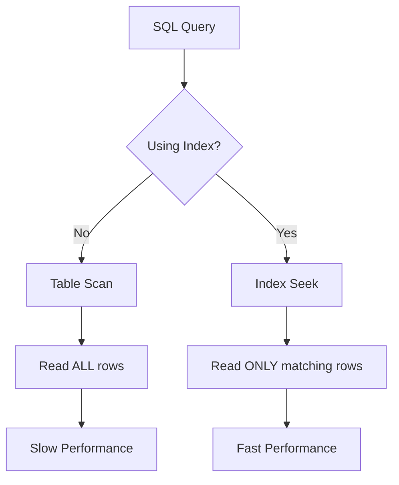

# SQL Avoiding Table Scans

## Introduction

When your database queries start running slowly, one of the most common culprits is the **table scan** (also called a full table scan). A table scan occurs when the database engine needs to examine every row in a table to find the data you're looking for. This is like searching for a book in a library by checking every single book on every shelf instead of using the catalog system!

In this tutorial, we'll explore what table scans are, why they're problematic for performance, how to identify them, and most importantly, techniques to avoid them. By the end, you'll be able to write more efficient queries that run faster and consume fewer resources.

## What is a Table Scan?

A table scan is a database operation where the query engine reads **every row** in a table to find the data that matches your query conditions. While this approach always works, it becomes increasingly inefficient as your tables grow larger.

Let's visualize the difference between a table scan and an optimized query:



## Why Table Scans Are Problematic

Table scans become a serious performance issue for several reasons:

1. **Linear scaling**: The time required grows linearly with table size
2. **High I/O cost**: Reading entire tables demands significant disk operations
3. **Memory pressure**: Large datasets may not fit in memory cache
4. **Resource contention**: Other queries may be slowed down
5. **Poor scalability**: Performance degrades as your data grows

For small tables with few rows, table scans may be acceptable. But as your application scales, table scans quickly become performance bottlenecks.

## How to Identify Table Scans

Before you can fix table scans, you need to identify them. Here are several ways to spot table scans in your database:

### 1. Using EXPLAIN or EXPLAIN PLAN

Most database systems provide an EXPLAIN command that shows how a query will be executed:

```sql
-- MySQL/PostgreSQL syntax
EXPLAIN SELECT * FROM customers WHERE last_name = 'Smith';

-- SQL Server syntax
SET SHOWPLAN_TEXT ON;
GO
SELECT * FROM customers WHERE last_name = 'Smith';
GO
SET SHOWPLAN_TEXT OFF;
```

Look for terms like "TABLE ACCESS FULL", "Seq Scan", or "Table Scan" in the output.

### 2. Query Execution Statistics

You can also examine query statistics after execution:

```sql
-- MySQL
SHOW STATUS LIKE 'Handler_read%';

-- SQL Server
SELECT * FROM sys.dm_exec_query_stats;
```

### 3. Database Monitoring Tools

Most database management systems include monitoring tools that highlight slow queries and can identify table scan operations.

## Techniques to Avoid Table Scans

Now that we understand the problem, let's explore solutions:

### 1. Create Appropriate Indexes

The most effective way to avoid table scans is to create indexes on columns used in WHERE clauses, JOIN conditions, and ORDER BY statements:

```sql
-- Create an index on the last_name column
CREATE INDEX idx_customers_last_name ON customers(last_name);

-- Now this query will use the index instead of scanning
SELECT * FROM customers WHERE last_name = 'Smith';
```

Before and after performance comparison:

| Query | Without Index | With Index |
|-------|---------------|------------|
| SELECT * FROM customers WHERE last_name = 'Smith' | 2.5 seconds | 0.03 seconds |

### 2. Use Covering Indexes

A covering index contains all the columns needed by a query, allowing the database to retrieve data directly from the index without accessing the table:

```sql
-- Create a covering index for a common query
CREATE INDEX idx_customers_name_email ON customers(last_name, first_name, email);

-- This query can be satisfied entirely from the index
SELECT first_name, email FROM customers WHERE last_name = 'Smith';
```

### 3. Optimize WHERE Clauses

Write WHERE clauses that can utilize indexes effectively:

```sql
-- Bad: Function on indexed column prevents index use
SELECT * FROM orders WHERE YEAR(order_date) = 2023; -- Forces table scan

-- Good: Rewrite to allow index use
SELECT * FROM orders WHERE order_date BETWEEN '2023-01-01' AND '2023-12-31'; -- Can use index
```

### 4. Limit Result Sets

Retrieve only the data you need:

```sql
-- Bad: Retrieving all columns and rows
SELECT * FROM products;

-- Better: Limit columns and rows
SELECT product_id, name, price FROM products LIMIT 100;
```

### 5. Use Partitioning for Very Large Tables

For extremely large tables, consider partitioning to divide the table into smaller, more manageable pieces:

```sql
-- Example of table partitioning (syntax varies by database)
CREATE TABLE sales (
    sale_id INT,
    sale_date DATE,
    amount DECIMAL(10,2)
) PARTITION BY RANGE (YEAR(sale_date)) (
    PARTITION p2021 VALUES LESS THAN (2022),
    PARTITION p2022 VALUES LESS THAN (2023),
    PARTITION p2023 VALUES LESS THAN (2024),
    PARTITION pfuture VALUES LESS THAN MAXVALUE
);
```

## Real-World Example: Order Processing System

Let's walk through an example of optimizing queries for an e-commerce order processing system.

### Original Schema (Prone to Table Scans):

```sql
CREATE TABLE orders (
    order_id INT PRIMARY KEY,
    customer_id INT,
    order_date DATETIME,
    status VARCHAR(20),
    total_amount DECIMAL(10,2)
);

-- Initial query (will cause a table scan)
SELECT * FROM orders WHERE status = 'shipped' AND order_date > '2023-01-01';
```

### Optimized Schema:

```sql
CREATE TABLE orders (
    order_id INT PRIMARY KEY,
    customer_id INT,
    order_date DATETIME,
    status VARCHAR(20),
    total_amount DECIMAL(10,2)
);

-- Create a multi-column index to support our query
CREATE INDEX idx_orders_status_date ON orders(status, order_date);

-- Now this query will use the index instead of scanning
SELECT * FROM orders WHERE status = 'shipped' AND order_date > '2023-01-01';
```

Let's check the execution plan before and after:

**Before optimization:**
```
Table: orders  Access Type: ALL  Rows Examined: 1,000,000  Filter: status='shipped' AND order_date > '2023-01-01'
```

**After optimization:**
```
Table: orders  Access Type: range  Rows Examined: 5,230  Key: idx_orders_status_date
```

The optimized query examines only the relevant rows instead of scanning the entire table, resulting in significantly better performance.

## Common Mistakes to Avoid

1. **Indexing every column**: Too many indexes can slow down write operations.
2. **Using functions on indexed columns**: This prevents index usage.
3. **Selecting all columns**: Use specific column names instead of `SELECT *`.
4. **Ignoring LIKE patterns**: `LIKE 'Smith%'` can use an index, but `LIKE '%Smith'` cannot.
5. **Neglecting to analyze query performance**: Regularly use EXPLAIN to check query execution plans.

## Summary

Table scans are a common database performance issue that occurs when a query needs to examine every row in a table. As your data grows, these operations become increasingly costly. 

To avoid table scans:

- Create appropriate indexes on columns used in query conditions
- Use covering indexes where possible
- Write index-friendly WHERE clauses
- Limit the amount of data retrieved
- Consider partitioning for very large tables

By applying these techniques, you can dramatically improve the performance of your database queries, making your applications faster and more scalable.

## Exercises

1. Given the following query, create an appropriate index to avoid a table scan:
   ```sql
   SELECT product_name, price FROM products WHERE category = 'Electronics' ORDER BY price DESC;
   ```

2. Identify why the following query might cause a table scan even with an index on `email`:
   ```sql
   SELECT * FROM users WHERE LOWER(email) = 'user@example.com';
   ```

3. Rewrite this query to make it more index-friendly:
   ```sql
   SELECT * FROM orders WHERE MONTH(order_date) = 3;
   ```

## Additional Resources

- [MySQL Index Documentation](https://dev.mysql.com/doc/refman/8.0/en/optimization-indexes.html)
- [PostgreSQL Index Types](https://www.postgresql.org/docs/current/indexes-types.html)
- [SQL Server Index Architecture](https://docs.microsoft.com/en-us/sql/relational-databases/sql-server-index-design-guide)
- [Database Indexing Strategies](https://use-the-index-luke.com/)
- [Query Optimization Techniques](https://www.sqlshack.com/query-optimization-techniques-in-sql-server-tips-and-tricks/)