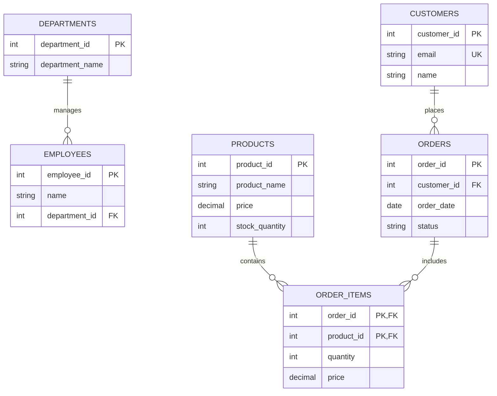

# SQL Constraints Overview

## Introduction

SQL constraints are rules that enforce data integrity within your database tables. They act as safeguards to ensure that the data stored in your database remains accurate, reliable, and consistent. Constraints prevent invalid data from being inserted, updated, or deleted, helping you avoid data corruption and maintain the quality of your information.

Think of constraints as the "guardrails" of your database that help prevent errors before they happen. Just as guardrails keep vehicles on the road, constraints keep your data valid and your database operations safe.

## Why Constraints Matter

Imagine a database without constraints:
- Users could enter invalid dates like February 31st
- Someone might accidentally leave required fields empty
- Duplicate records could be created for unique entities
- References between tables could become orphaned or invalid

Constraints help prevent these problems by enforcing rules about what kind of data can be stored and how data relates to other parts of your database.

## Types of SQL Constraints

Let's explore the common SQL constraints and how they help maintain data integrity.

### 1. NOT NULL Constraint

The `NOT NULL` constraint ensures that a column cannot store null (empty) values. This is useful for columns that should always contain a value.

```sql
-- Creating a table with NOT NULL constraints
CREATE TABLE employees (
    employee_id INT,
    first_name VARCHAR(50) NOT NULL,
    last_name VARCHAR(50) NOT NULL,
    email VARCHAR(100) NOT NULL,
    hire_date DATE
);
```

In this example, `first_name`, `last_name`, and `email` must always have a value. If you try to insert a row without one of these values:

```sql
-- This will fail because email is missing
INSERT INTO employees (employee_id, first_name, last_name, hire_date)
VALUES (1, 'John', 'Smith', '2023-01-15');
```

The database will reject this with an error like:
```
ERROR: NULL value in column "email" violates not-null constraint
```

### 2. UNIQUE Constraint

The `UNIQUE` constraint ensures that all values in a column (or a combination of columns) are different. This prevents duplicate values in columns that should contain only unique values.

```sql
-- Creating a table with a UNIQUE constraint
CREATE TABLE customers (
    customer_id INT,
    email VARCHAR(100) UNIQUE,
    phone VARCHAR(20) UNIQUE,
    name VARCHAR(100)
);
```

If you try to insert a duplicate email:

```sql
-- First insertion works
INSERT INTO customers VALUES (1, 'john@example.com', '555-123-4567', 'John Smith');

-- This will fail because the email already exists
INSERT INTO customers VALUES (2, 'john@example.com', '555-987-6543', 'Johnny Smith');
```

The database will reject the second insertion with an error like:
```
ERROR: duplicate key value violates unique constraint "customers_email_key"
```

You can also create a composite unique constraint across multiple columns:

```sql
CREATE TABLE class_enrollment (
    student_id INT,
    class_id INT,
    enrollment_date DATE,
    UNIQUE (student_id, class_id)
);
```

This ensures a student cannot enroll in the same class twice.

### 3. PRIMARY KEY Constraint

A `PRIMARY KEY` constraint combines `NOT NULL` and `UNIQUE` constraints. It uniquely identifies each record in a table and is typically used as the main identifier for rows.

```sql
-- Creating a table with a PRIMARY KEY constraint
CREATE TABLE products (
    product_id INT PRIMARY KEY,
    product_name VARCHAR(100),
    price DECIMAL(10, 2),
    stock_quantity INT
);
```

You can also define a primary key after declaring all columns:

```sql
CREATE TABLE products (
    product_id INT,
    product_name VARCHAR(100),
    price DECIMAL(10, 2),
    stock_quantity INT,
    PRIMARY KEY (product_id)
);
```

Or even create a composite primary key from multiple columns:

```sql
CREATE TABLE order_items (
    order_id INT,
    product_id INT,
    quantity INT,
    price DECIMAL(10, 2),
    PRIMARY KEY (order_id, product_id)
);
```

### 4. FOREIGN KEY Constraint

The `FOREIGN KEY` constraint creates a relationship between tables. It ensures that values in one table correspond to values in another table, maintaining referential integrity.

```sql
-- First, create the "departments" table
CREATE TABLE departments (
    department_id INT PRIMARY KEY,
    department_name VARCHAR(50)
);

-- Then create the "employees" table with a FOREIGN KEY reference
CREATE TABLE employees (
    employee_id INT PRIMARY KEY,
    name VARCHAR(100),
    department_id INT,
    FOREIGN KEY (department_id) REFERENCES departments(department_id)
);
```

With this constraint:
- You cannot add an employee with a department_id that doesn't exist in the departments table
- You cannot delete a department if employees are still assigned to it (unless you specify additional delete behaviors)

```sql
-- Insert a department
INSERT INTO departments VALUES (1, 'Engineering');

-- This works because department_id 1 exists
INSERT INTO employees VALUES (101, 'Alice Johnson', 1);

-- This fails because department_id 2 doesn't exist
INSERT INTO employees VALUES (102, 'Bob Smith', 2);
```

The second insertion would fail with an error like:
```
ERROR: insert or update on table "employees" violates foreign key constraint "employees_department_id_fkey"
```

#### Foreign Key Delete and Update Behaviors

Foreign keys can be configured with different behaviors when the referenced record is updated or deleted:

```sql
CREATE TABLE employees (
    employee_id INT PRIMARY KEY,
    name VARCHAR(100),
    department_id INT,
    FOREIGN KEY (department_id) 
        REFERENCES departments(department_id)
        ON DELETE CASCADE
        ON UPDATE CASCADE
);
```

Common options include:
- `CASCADE`: If a department is deleted, all employees in that department are automatically deleted
- `SET NULL`: If a department is deleted, the department_id in employees becomes NULL
- `SET DEFAULT`: Sets the column to its default value
- `RESTRICT`: Prevents deletion if referenced records exist (this is often the default)
- `NO ACTION`: Similar to RESTRICT, but checked at the end of the transaction

### 5. CHECK Constraint

The `CHECK` constraint enforces a condition on the values that can be inserted or updated in a column.

```sql
-- Creating a table with CHECK constraints
CREATE TABLE products (
    product_id INT PRIMARY KEY,
    product_name VARCHAR(100),
    price DECIMAL(10, 2) CHECK (price > 0),
    discount_percent DECIMAL(5, 2) CHECK (discount_percent BETWEEN 0 AND 100),
    release_date DATE CHECK (release_date <= CURRENT_DATE)
);
```

With these constraints:
- Price must be positive
- Discount must be between 0% and 100%
- Release date cannot be in the future

```sql
-- This will fail because of negative price
INSERT INTO products VALUES (1, 'Bad Product', -10.99, 0, '2023-01-01');
```

The database would reject this with:
```
ERROR: new row for relation "products" violates check constraint "products_price_check"
```

You can also name your constraints for clearer error messages and easier management:

```sql
CREATE TABLE employees (
    employee_id INT PRIMARY KEY,
    name VARCHAR(100),
    salary DECIMAL(10, 2),
    hire_date DATE,
    CONSTRAINT valid_salary CHECK (salary > 0),
    CONSTRAINT valid_hire_date CHECK (hire_date <= CURRENT_DATE)
);
```

### 6. DEFAULT Constraint

The `DEFAULT` constraint provides a default value for a column when no value is specified during insertion.

```sql
-- Creating a table with DEFAULT constraints
CREATE TABLE orders (
    order_id INT PRIMARY KEY,
    customer_id INT,
    order_date DATE DEFAULT CURRENT_DATE,
    status VARCHAR(20) DEFAULT 'Pending'
);
```

When inserting without specifying these columns:

```sql
-- The order_date and status will use default values
INSERT INTO orders (order_id, customer_id) VALUES (1, 101);
```

The resulting row would contain:
```
order_id: 1
customer_id: 101
order_date: [today's date]
status: 'Pending'
```

## Visualizing Table Relationships with Constraints

Foreign key constraints create relationships between tables that can be visualized in an entity-relationship diagram:



## Adding Constraints to Existing Tables

You can add constraints to tables that already exist:

```sql
-- Adding a NOT NULL constraint
ALTER TABLE employees
ALTER COLUMN email SET NOT NULL;

-- Adding a UNIQUE constraint
ALTER TABLE employees
ADD CONSTRAINT unique_email UNIQUE (email);

-- Adding a CHECK constraint
ALTER TABLE products
ADD CONSTRAINT positive_price CHECK (price > 0);

-- Adding a PRIMARY KEY constraint
ALTER TABLE departments
ADD CONSTRAINT pk_departments PRIMARY KEY (department_id);

-- Adding a FOREIGN KEY constraint
ALTER TABLE employees
ADD CONSTRAINT fk_department
FOREIGN KEY (department_id) REFERENCES departments(department_id);
```

## Best Practices for Using Constraints

1. **Use meaningful constraint names**: Name constraints clearly so error messages are more helpful.

2. **Apply constraints at creation time**: Define constraints when you create tables rather than adding them later.

3. **Consider performance impacts**: Constraints add overhead to data modifications, but the benefits usually outweigh the costs.

4. **Use appropriate constraint types**: Choose the right constraint for each data integrity requirement.

5. **Document constraints**: Keep documentation on your constraints as part of your database schema documentation.

## Real-World Example: E-commerce Database

Let's see how constraints work together in a simplified e-commerce database:

```sql
-- Users table with constraints
CREATE TABLE users (
    user_id INT PRIMARY KEY,
    username VARCHAR(50) UNIQUE NOT NULL,
    email VARCHAR(100) UNIQUE NOT NULL,
    password_hash VARCHAR(100) NOT NULL,
    created_at TIMESTAMP DEFAULT CURRENT_TIMESTAMP,
    last_login TIMESTAMP,
    is_active BOOLEAN DEFAULT TRUE,
    CHECK (email LIKE '%@%.%')
);

-- Products table with constraints
CREATE TABLE products (
    product_id INT PRIMARY KEY,
    name VARCHAR(100) NOT NULL,
    description TEXT,
    price DECIMAL(10, 2) NOT NULL CHECK (price > 0),
    stock_quantity INT NOT NULL DEFAULT 0 CHECK (stock_quantity >= 0),
    category VARCHAR(50),
    created_at TIMESTAMP DEFAULT CURRENT_TIMESTAMP
);

-- Orders table with constraints
CREATE TABLE orders (
    order_id INT PRIMARY KEY,
    user_id INT NOT NULL,
    order_date TIMESTAMP DEFAULT CURRENT_TIMESTAMP,
    status VARCHAR(20) DEFAULT 'Pending' CHECK (status IN ('Pending', 'Processing', 'Shipped', 'Delivered', 'Cancelled')),
    total_amount DECIMAL(10, 2) CHECK (total_amount >= 0),
    shipping_address TEXT NOT NULL,
    FOREIGN KEY (user_id) REFERENCES users(user_id)
);

-- Order items table with constraints
CREATE TABLE order_items (
    order_id INT,
    product_id INT,
    quantity INT NOT NULL CHECK (quantity > 0),
    price_per_unit DECIMAL(10, 2) NOT NULL CHECK (price_per_unit > 0),
    PRIMARY KEY (order_id, product_id),
    FOREIGN KEY (order_id) REFERENCES orders(order_id) ON DELETE CASCADE,
    FOREIGN KEY (product_id) REFERENCES products(product_id)
);
```

In this example:
- User emails must include an @ symbol and a domain
- Product prices and stock quantities must be non-negative
- Order status must be one of the predefined values
- If an order is deleted, all its order items are automatically deleted (CASCADE)
- Each order item must have a positive quantity and price

## Common Constraint Errors and Solutions

| Error | Cause | Solution |
|-------|-------|----------|
| Violation of NOT NULL constraint | Trying to insert NULL into a NOT NULL column | Provide a value for the column |
| Violation of UNIQUE constraint | Trying to insert a duplicate value | Use a different value or update the existing record |
| Violation of PRIMARY KEY constraint | Trying to insert a duplicate primary key | Use a different primary key value |
| Violation of FOREIGN KEY constraint | Referencing a non-existent parent record | First insert the parent record or use a valid reference |
| Violation of CHECK constraint | Value doesn't meet the check condition | Provide a value that satisfies the condition |

## Summary

SQL constraints are essential tools for maintaining data integrity in your database. They provide rules that:

- Prevent empty values where data is required (NOT NULL)
- Ensure uniqueness of identifiers and other values (UNIQUE, PRIMARY KEY)
- Maintain relationships between tables (FOREIGN KEY)
- Validate data against business rules (CHECK)
- Provide sensible defaults (DEFAULT)

By using constraints effectively, you can ensure your database maintains high data quality and prevents many common data errors before they occur.

## Additional Resources

- Try experimenting with [SQL Fiddle](http://sqlfiddle.com) to practice creating tables with constraints
- Check your database system's documentation for system-specific constraint features
- Learn about indexes, which often work alongside constraints to improve performance

## Exercises

1. Create a `students` table with appropriate constraints for a school database. Include fields for student ID, name, email, date of birth, and enrollment date.

2. Create a `courses` table and an `enrollments` table with appropriate constraints to track which students are enrolled in which courses.

3. Write SQL statements to add a CHECK constraint to the `students` table that ensures students must be at least 16 years old.

4. Create a composite UNIQUE constraint that prevents a student from enrolling in the same course twice.

5. Practice adding, modifying, and removing constraints on existing tables using ALTER TABLE statements.