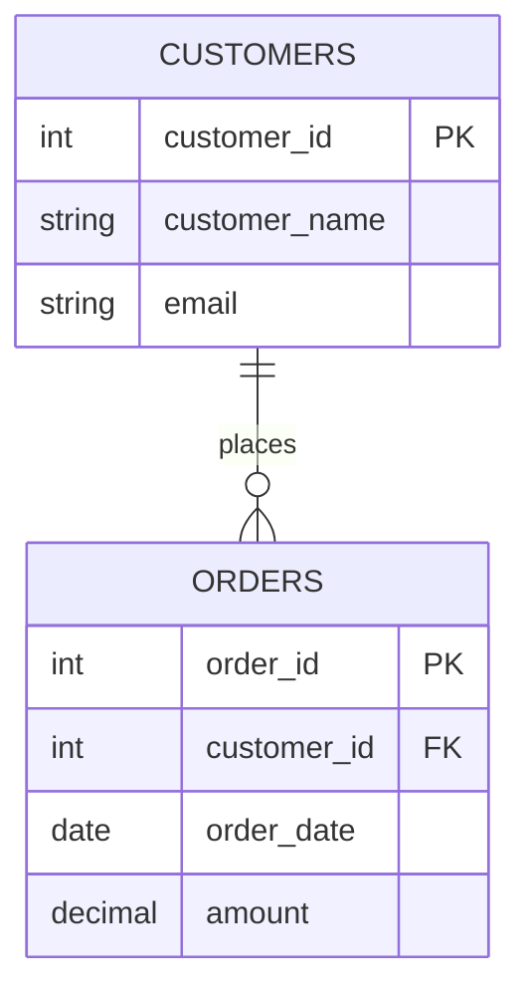
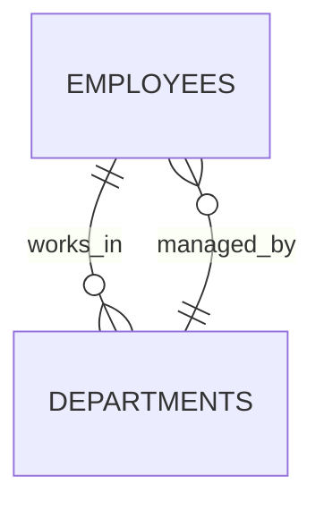

# SQL Referential Integrity

## Introduction

Referential integrity is one of the fundamental concepts in relational database design, ensuring that relationships between tables remain consistent. In simpler terms, it guarantees that a foreign key value in one table has a matching primary key value in another table.

When you learn about relational databases, you'll often hear that they're built on "relationships." Referential integrity is what keeps these relationships valid and reliable. Without it, your database could contain orphaned records or invalid references, leading to data inconsistencies and potentially incorrect query results.

In this guide, we'll explore:
- What referential integrity is and why it matters
- How to implement it using foreign key constraints
- Common actions for maintaining referential integrity
- Real-world examples and best practices

## Understanding Referential Integrity

### What Is Referential Integrity?

Referential integrity is a database concept that ensures that relationships between tables remain valid. This means that if one table has a foreign key referencing another table's primary key, that reference must always be valid.

For example, if an `orders` table contains a `customer_id` that references the `customers` table, referential integrity ensures that:
1. Every `customer_id` in the `orders` table exists in the `customers` table
2. No customer can be deleted from the `customers` table if they have associated orders (unless special actions are defined)

### Why Is Referential Integrity Important?

Referential integrity provides several benefits:

1. **Data Consistency**: Prevents orphaned records or invalid references
2. **Data Accuracy**: Ensures that relationships between entities are valid
3. **Data Reliability**: Maintains the trustworthiness of your data
4. **Application Simplification**: Reduces the need for validation code in applications

### Visual Representation

Here's a simplified diagram showing how referential integrity works:



In this diagram:
- The line between tables represents a relationship
- The `||--o{` notation indicates a one-to-many relationship (one customer can place many orders)
- `FK` indicates a foreign key in the `ORDERS` table that references the primary key (`PK`) in the `CUSTOMERS` table

## Implementing Referential Integrity

Let's explore how to implement referential integrity in SQL using foreign key constraints.

### Creating Tables with Foreign Key Constraints

Here's an example of creating two related tables with a foreign key constraint:

```sql
-- Create the parent table (referenced table)
CREATE TABLE customers (
    customer_id INT PRIMARY KEY,
    customer_name VARCHAR(100) NOT NULL,
    email VARCHAR(100) UNIQUE,
    phone VARCHAR(20)
);

-- Create the child table (referencing table) with a foreign key
CREATE TABLE orders (
    order_id INT PRIMARY KEY,
    customer_id INT NOT NULL,
    order_date DATE NOT NULL,
    total_amount DECIMAL(10, 2) NOT NULL,
    FOREIGN KEY (customer_id) REFERENCES customers(customer_id)
);
```

In this example:
- `customers` is the parent table with `customer_id` as its primary key
- `orders` is the child table with a foreign key `customer_id` that references the `customers` table
- The `FOREIGN KEY` constraint ensures referential integrity

### Adding Foreign Key Constraints to Existing Tables

If you already have tables and need to add a foreign key constraint:

```sql
-- Add a foreign key to an existing table
ALTER TABLE orders
ADD CONSTRAINT fk_orders_customers
FOREIGN KEY (customer_id) REFERENCES customers(customer_id);
```

## Referential Actions

When you define a foreign key constraint, you can also specify what should happen when the referenced row in the parent table is updated or deleted. These are called referential actions.

### Common Referential Actions

1. **CASCADE**: Automatically update or delete related rows in the child table
2. **RESTRICT**: Prevent the update or deletion if related rows exist (this is the default in many databases)
3. **SET NULL**: Set the foreign key column to NULL
4. **SET DEFAULT**: Set the foreign key column to its default value
5. **NO ACTION**: Similar to RESTRICT, but checked differently depending on the database system

### Example of Specifying Referential Actions

```sql
CREATE TABLE orders (
    order_id INT PRIMARY KEY,
    customer_id INT,
    order_date DATE NOT NULL,
    total_amount DECIMAL(10, 2) NOT NULL,
    FOREIGN KEY (customer_id) REFERENCES customers(customer_id)
    ON DELETE SET NULL
    ON UPDATE CASCADE
);
```

In this example:
- If a customer is deleted, the `customer_id` in related orders will be set to NULL
- If a customer's ID is updated, the change will automatically cascade to all related orders

## Practical Examples

Let's walk through some real-world examples to see referential integrity in action.

### Example 1: E-commerce Database

Imagine an e-commerce database with customers, orders, and products:

```sql
-- Create the customers table
CREATE TABLE customers (
    customer_id INT PRIMARY KEY,
    name VARCHAR(100) NOT NULL,
    email VARCHAR(100) UNIQUE NOT NULL
);

-- Create the products table
CREATE TABLE products (
    product_id INT PRIMARY KEY,
    name VARCHAR(100) NOT NULL,
    price DECIMAL(10, 2) NOT NULL,
    stock_quantity INT NOT NULL
);

-- Create the orders table with foreign key to customers
CREATE TABLE orders (
    order_id INT PRIMARY KEY,
    customer_id INT NOT NULL,
    order_date TIMESTAMP NOT NULL DEFAULT CURRENT_TIMESTAMP,
    status VARCHAR(20) NOT NULL,
    FOREIGN KEY (customer_id) REFERENCES customers(customer_id)
    ON DELETE RESTRICT
);

-- Create the order_items table with foreign keys to orders and products
CREATE TABLE order_items (
    order_item_id INT PRIMARY KEY,
    order_id INT NOT NULL,
    product_id INT NOT NULL,
    quantity INT NOT NULL,
    price_at_time DECIMAL(10, 2) NOT NULL,
    FOREIGN KEY (order_id) REFERENCES orders(order_id) ON DELETE CASCADE,
    FOREIGN KEY (product_id) REFERENCES products(product_id) ON DELETE RESTRICT
);
```

In this design:
- You cannot delete a customer who has orders (RESTRICT)
- If an order is deleted, all associated order items are automatically deleted (CASCADE)
- You cannot delete a product that exists in any order item (RESTRICT)

### Example 2: Testing Referential Integrity

Let's see what happens when we try to violate referential integrity:

```sql
-- First, add some sample data
INSERT INTO customers (customer_id, name, email) 
VALUES (1, 'Jane Smith', 'jane@example.com');

INSERT INTO products (product_id, name, price, stock_quantity) 
VALUES (101, 'Laptop', 999.99, 50);

-- This works - the customer exists
INSERT INTO orders (order_id, customer_id, status) 
VALUES (1001, 1, 'Pending');

-- This works - the order and product exist
INSERT INTO order_items (order_item_id, order_id, product_id, quantity, price_at_time) 
VALUES (10001, 1001, 101, 1, 999.99);

-- This will fail - customer_id 999 doesn't exist in the customers table
INSERT INTO orders (order_id, customer_id, status) 
VALUES (1002, 999, 'Pending');
-- Error: FOREIGN KEY constraint failed

-- This will fail - cannot delete a customer with orders
DELETE FROM customers WHERE customer_id = 1;
-- Error: FOREIGN KEY constraint failed

-- This will cascade - deleting the order also deletes its order items
DELETE FROM orders WHERE order_id = 1001;
-- Success: Both the order and its order items will be deleted
```

## Common Issues and Solutions

### Handling Circular References

Sometimes you might have tables that reference each other, creating a circular dependency:



In this case, you can:
1. Create the tables without foreign key constraints
2. Add data to both tables
3. Add the foreign key constraints afterwards

Example:

```sql
-- Create tables without foreign keys first
CREATE TABLE departments (
    department_id INT PRIMARY KEY,
    name VARCHAR(100) NOT NULL,
    manager_id INT NULL
);

CREATE TABLE employees (
    employee_id INT PRIMARY KEY,
    name VARCHAR(100) NOT NULL,
    department_id INT NULL
);

-- Add the foreign key constraints after creating both tables
ALTER TABLE departments
ADD CONSTRAINT fk_departments_manager
FOREIGN KEY (manager_id) REFERENCES employees(employee_id);

ALTER TABLE employees
ADD CONSTRAINT fk_employees_department
FOREIGN KEY (department_id) REFERENCES departments(department_id);
```

### Disabling and Enabling Constraints

During data migration or bulk operations, you might need to temporarily disable foreign key constraints:

```sql
-- Disable foreign key checks (MySQL)
SET FOREIGN_KEY_CHECKS = 0;

-- Perform your operations
-- ...

-- Enable foreign key checks again
SET FOREIGN_KEY_CHECKS = 1;
```

Note: The syntax varies by database system. In SQL Server, you would use `ALTER TABLE ... NOCHECK CONSTRAINT ...`

## Best Practices

1. **Always define foreign key constraints**: Don't rely on application logic alone
2. **Choose appropriate referential actions**: Consider the business rules that should apply
3. **Index foreign key columns**: This improves query performance
4. **Be careful with cascading deletes**: They can cause unintended data loss if not properly planned
5. **Consider using triggers for complex referential integrity**: When standard actions aren't sufficient
6. **Validate data before migration**: Ensure referential integrity before loading data

## Summary

Referential integrity is a cornerstone of relational database design, ensuring that relationships between tables remain valid and consistent. By properly implementing foreign key constraints and choosing appropriate referential actions, you can:

- Prevent invalid data relationships
- Automate the handling of related data
- Improve data quality and reliability
- Reduce the need for application-level validation

Remember that while referential integrity adds some overhead to database operations, the benefits in terms of data consistency and reliability far outweigh the costs.

## Exercises

1. Design a simple database for a library system with tables for books, authors, and borrowers. Implement appropriate foreign key constraints.
2. Experiment with different referential actions (CASCADE, SET NULL, etc.) to see how they affect related data.
3. Write SQL queries to test referential integrity by attempting to insert invalid data or delete referenced rows.
4. Create a scenario with circular references and implement a solution.

## Additional Resources

- [SQL Foreign Key Constraint documentation](https://www.w3schools.com/sql/sql_foreignkey.asp)
- [Database Normalization Basics](https://www.guru99.com/database-normalization.html)
- [Understanding Database Constraints](https://www.geeksforgeeks.org/sql-constraints/)
- Book: "Database Design for Mere Mortals" by Michael J. Hernandez