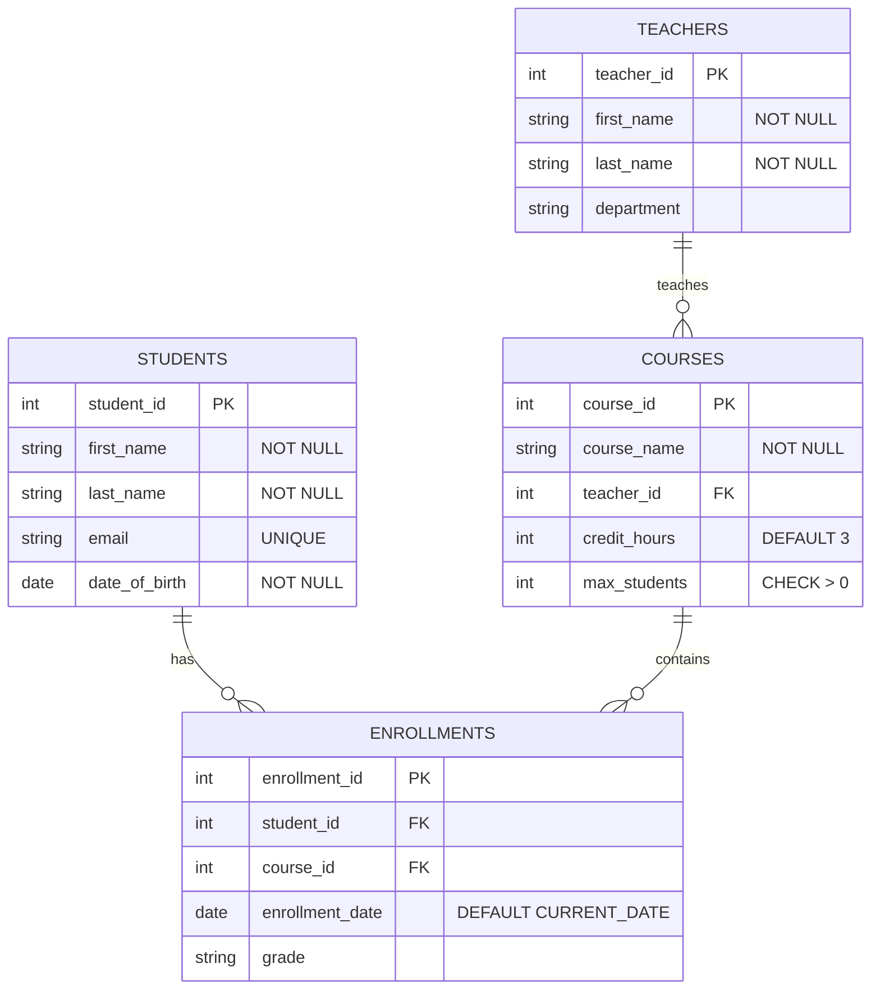

# SQL Constraint Management

## Introduction

Database constraints are rules that enforce data integrity within your database tables. They act as guardrails, preventing invalid or inconsistent data from being stored. Proper constraint management is essential for building reliable database systems that maintain data accuracy and consistency over time.

In this tutorial, we'll explore different types of SQL constraints, how to create and modify them, and best practices for constraint management. Whether you're designing a new database or maintaining an existing one, understanding constraints will help you build more robust applications.

## Types of SQL Constraints

SQL offers several constraint types, each serving a specific purpose in maintaining data integrity:

### 1. PRIMARY KEY Constraint

The PRIMARY KEY constraint uniquely identifies each record in a table. It cannot contain NULL values and must be unique across all rows.

```sql
-- Creating a table with a PRIMARY KEY constraint
CREATE TABLE students (
    student_id INT PRIMARY KEY,
    first_name VARCHAR(50),
    last_name VARCHAR(50),
    email VARCHAR(100)
);

-- Output: Table created successfully
```

You can also add a PRIMARY KEY constraint to an existing table:

```sql
-- Adding a PRIMARY KEY constraint to an existing table
ALTER TABLE students
ADD PRIMARY KEY (student_id);
```

### 2. FOREIGN KEY Constraint

FOREIGN KEY constraints establish relationships between tables by ensuring values in one table match values in another table.

```sql
-- Creating a table with a FOREIGN KEY constraint
CREATE TABLE enrollments (
    enrollment_id INT PRIMARY KEY,
    student_id INT,
    course_id INT,
    enrollment_date DATE,
    FOREIGN KEY (student_id) REFERENCES students(student_id)
);

-- Output: Table created successfully
```

In this example, the `student_id` in the `enrollments` table must match a valid `student_id` in the `students` table.

### 3. UNIQUE Constraint

The UNIQUE constraint ensures all values in a column or a combination of columns are unique across the table.

```sql
-- Creating a table with a UNIQUE constraint
CREATE TABLE users (
    user_id INT PRIMARY KEY,
    username VARCHAR(50) UNIQUE,
    email VARCHAR(100) UNIQUE,
    password VARCHAR(100)
);

-- Output: Table created successfully
```

With this constraint, we cannot have two users with the same username or email.

### 4. NOT NULL Constraint

The NOT NULL constraint ensures a column cannot have NULL values.

```sql
-- Creating a table with NOT NULL constraints
CREATE TABLE products (
    product_id INT PRIMARY KEY,
    product_name VARCHAR(100) NOT NULL,
    price DECIMAL(10, 2) NOT NULL,
    description TEXT
);

-- Output: Table created successfully
```

In this example, `product_name` and `price` must always have values.

### 5. CHECK Constraint

The CHECK constraint ensures values in a column meet a specific condition.

```sql
-- Creating a table with a CHECK constraint
CREATE TABLE employees (
    employee_id INT PRIMARY KEY,
    first_name VARCHAR(50) NOT NULL,
    last_name VARCHAR(50) NOT NULL,
    age INT CHECK (age >= 18),
    salary DECIMAL(10, 2) CHECK (salary > 0)
);

-- Output: Table created successfully
```

This ensures employees are at least 18 years old and have a positive salary.

### 6. DEFAULT Constraint

The DEFAULT constraint provides a default value for a column when no value is specified.

```sql
-- Creating a table with DEFAULT constraints
CREATE TABLE orders (
    order_id INT PRIMARY KEY,
    customer_id INT,
    order_date DATE DEFAULT CURRENT_DATE,
    status VARCHAR(20) DEFAULT 'Pending'
);

-- Output: Table created successfully
```

If `order_date` isn't specified when inserting a new record, it defaults to the current date.

## Managing Constraints

### Adding Constraints to Existing Tables

You can add constraints to existing tables using the ALTER TABLE statement:

```sql
-- Adding a UNIQUE constraint
ALTER TABLE employees
ADD CONSTRAINT unique_email UNIQUE (email);

-- Adding a CHECK constraint
ALTER TABLE products
ADD CONSTRAINT valid_price CHECK (price > 0);

-- Adding a FOREIGN KEY constraint
ALTER TABLE orders
ADD CONSTRAINT fk_customer
FOREIGN KEY (customer_id) REFERENCES customers(customer_id);
```

### Naming Constraints

It's a best practice to give constraints meaningful names for easier management:

```sql
-- Creating a table with named constraints
CREATE TABLE customers (
    customer_id INT,
    customer_name VARCHAR(100) NOT NULL,
    email VARCHAR(100),
    credit_limit DECIMAL(10, 2),
    CONSTRAINT pk_customer PRIMARY KEY (customer_id),
    CONSTRAINT unique_email UNIQUE (email),
    CONSTRAINT valid_credit CHECK (credit_limit >= 0)
);
```

### Viewing Existing Constraints

You can view existing constraints using database-specific commands. Here's how to do it in some popular database systems:

**PostgreSQL**:
```sql
-- View all constraints in a specific table
SELECT conname, contype, pg_get_constraintdef(oid)
FROM pg_constraint
WHERE conrelid = 'table_name'::regclass;
```

**MySQL**:
```sql
-- View constraints in a specific table
SHOW CREATE TABLE table_name;
```

**SQL Server**:
```sql
-- View constraints in a specific table
SELECT * FROM INFORMATION_SCHEMA.TABLE_CONSTRAINTS
WHERE TABLE_NAME = 'table_name';
```

### Dropping Constraints

You can remove constraints when they are no longer needed:

```sql
-- Dropping a named constraint
ALTER TABLE customers
DROP CONSTRAINT unique_email;

-- Dropping a PRIMARY KEY constraint
ALTER TABLE customers
DROP PRIMARY KEY;

-- Dropping a FOREIGN KEY constraint
ALTER TABLE orders
DROP CONSTRAINT fk_customer;
```

## Practical Examples and Real-World Applications

### Example 1: E-commerce Database

Let's design a simplified e-commerce database with appropriate constraints:

```sql
-- Creating a customers table
CREATE TABLE customers (
    customer_id INT PRIMARY KEY,
    first_name VARCHAR(50) NOT NULL,
    last_name VARCHAR(50) NOT NULL,
    email VARCHAR(100) UNIQUE NOT NULL,
    phone VARCHAR(15)
);

-- Creating a products table
CREATE TABLE products (
    product_id INT PRIMARY KEY,
    product_name VARCHAR(100) NOT NULL,
    category VARCHAR(50),
    price DECIMAL(10, 2) NOT NULL CHECK (price > 0),
    stock_quantity INT NOT NULL DEFAULT 0 CHECK (stock_quantity >= 0)
);

-- Creating an orders table with relationships
CREATE TABLE orders (
    order_id INT PRIMARY KEY,
    customer_id INT NOT NULL,
    order_date TIMESTAMP DEFAULT CURRENT_TIMESTAMP,
    status VARCHAR(20) DEFAULT 'Pending',
    FOREIGN KEY (customer_id) REFERENCES customers(customer_id)
);

-- Creating an order_items table with relationships
CREATE TABLE order_items (
    order_item_id INT PRIMARY KEY,
    order_id INT NOT NULL,
    product_id INT NOT NULL,
    quantity INT NOT NULL CHECK (quantity > 0),
    price_per_unit DECIMAL(10, 2) NOT NULL,
    FOREIGN KEY (order_id) REFERENCES orders(order_id),
    FOREIGN KEY (product_id) REFERENCES products(product_id)
);
```

This structure enforces:
- Customer emails must be unique
- Product prices must be positive
- Stock quantities cannot be negative
- Order quantities must be positive
- Relationships between orders, customers, and products

### Example 2: School Management System

Let's look at constraints for a school management system:



The SQL implementation:

```sql
CREATE TABLE students (
    student_id INT PRIMARY KEY,
    first_name VARCHAR(50) NOT NULL,
    last_name VARCHAR(50) NOT NULL,
    email VARCHAR(100) UNIQUE,
    date_of_birth DATE NOT NULL
);

CREATE TABLE teachers (
    teacher_id INT PRIMARY KEY,
    first_name VARCHAR(50) NOT NULL,
    last_name VARCHAR(50) NOT NULL,
    department VARCHAR(50)
);

CREATE TABLE courses (
    course_id INT PRIMARY KEY,
    course_name VARCHAR(100) NOT NULL,
    teacher_id INT,
    credit_hours INT DEFAULT 3,
    max_students INT CHECK (max_students > 0),
    FOREIGN KEY (teacher_id) REFERENCES teachers(teacher_id)
);

CREATE TABLE enrollments (
    enrollment_id INT PRIMARY KEY,
    student_id INT,
    course_id INT,
    enrollment_date DATE DEFAULT CURRENT_DATE,
    grade VARCHAR(2),
    FOREIGN KEY (student_id) REFERENCES students(student_id),
    FOREIGN KEY (course_id) REFERENCES courses(course_id),
    -- Ensure a student can only enroll once in a course
    CONSTRAINT unique_enrollment UNIQUE (student_id, course_id)
);
```

## Best Practices for Constraint Management

1. **Plan your constraints early**: Identify data integrity requirements during the database design phase.

2. **Use meaningful constraint names**: Name your constraints descriptively for easier management and troubleshooting.

3. **Balance constraints and performance**: While constraints are vital for data integrity, excessive constraints can impact performance. Focus on critical business rules.

4. **Consider cascading actions**: When using foreign keys, decide on appropriate actions when parent records are updated or deleted:
   ```sql
   CREATE TABLE order_items (
       -- other columns
       FOREIGN KEY (order_id) REFERENCES orders(order_id)
           ON DELETE CASCADE
           ON UPDATE CASCADE
   );
   ```

5. **Use CHECK constraints for domain validation**: CHECK constraints are more efficient than validating data in application code.

6. **Document your constraints**: Maintain documentation of your constraint design decisions for future reference.

7. **Test constraint behavior**: Verify constraint behavior during development to ensure they enforce business rules correctly.

## Common Challenges and Solutions

### Challenge 1: Disabling Constraints Temporarily

Sometimes during bulk data loading or migration, you might need to temporarily disable constraints:

**SQL Server**:
```sql
-- Disable a specific constraint
ALTER TABLE table_name
NOCHECK CONSTRAINT constraint_name;

-- Re-enable the constraint
ALTER TABLE table_name
CHECK CONSTRAINT constraint_name;
```

**MySQL**:
```sql
-- Disable foreign key checks
SET FOREIGN_KEY_CHECKS = 0;

-- Re-enable foreign key checks
SET FOREIGN_KEY_CHECKS = 1;
```

### Challenge 2: Handling Existing Violations

When adding constraints to tables with existing data:

1. First, identify potential violations:
   ```sql
   -- Find potential NOT NULL violations
   SELECT * FROM customers WHERE email IS NULL;
   
   -- Find potential CHECK constraint violations
   SELECT * FROM products WHERE price <= 0;
   ```

2. Clean up the data before adding the constraint:
   ```sql
   -- Fix violations
   UPDATE products SET price = 1.0 WHERE price <= 0;
   ```

3. Then apply the constraint:
   ```sql
   ALTER TABLE products
   ADD CONSTRAINT valid_price CHECK (price > 0);
   ```

## Summary

SQL constraints are powerful tools for maintaining data integrity in your database. By properly implementing PRIMARY KEY, FOREIGN KEY, UNIQUE, NOT NULL, CHECK, and DEFAULT constraints, you can ensure that your data remains accurate and consistent.

Key takeaways from this tutorial:
- Constraints enforce business rules at the database level
- Different constraint types serve different data integrity purposes
- Constraints can be added during table creation or added later
- Naming constraints makes management easier
- Constraint planning should be part of your database design process

By mastering constraint management, you'll build more robust and reliable database applications that effectively maintain data integrity.

## Exercises

1. Create a database schema for a library system with tables for books, authors, and borrowers. Implement appropriate constraints to ensure data integrity.

2. Add CHECK constraints to ensure book ISBN numbers follow a valid format and publication dates are not in the future.

3. Practice adding, modifying, and removing constraints on existing tables.

4. Implement a constraint that ensures a book can only be borrowed if it's marked as available.

5. Create a table with a composite PRIMARY KEY consisting of two columns.

## Additional Resources

- [SQL Constraints - W3Schools](https://www.w3schools.com/sql/sql_constraints.asp)
- [PostgreSQL Constraints Documentation](https://www.postgresql.org/docs/current/ddl-constraints.html)
- [MySQL Constraints Documentation](https://dev.mysql.com/doc/refman/8.0/en/constraints.html)
- [SQL Server Constraints Documentation](https://docs.microsoft.com/en-us/sql/relational-databases/tables/create-table-database-engine)