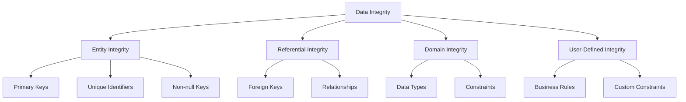

# SQL Entity Integrity

## Introduction

Entity Integrity is one of the fundamental principles in database design that helps maintain data accuracy and reliability. In simple terms, entity integrity ensures that each row in a table is uniquely identifiable and that this identifier is never null or duplicated.

If you've ever wondered why database designers insist on having primary keys or why certain values cannot be null, you're about to discover the crucial concept of entity integrity!

## What is Entity Integrity?

Entity integrity is a rule that states:

> Every table must have a primary key, and the column or columns that make up the primary key must contain unique, non-null values.

This might sound simple, but it's one of the foundational principles that keep your database organized and your data reliable.

## Why Entity Integrity Matters

Imagine trying to find a specific book in a library where multiple books have the same ID number, or some books have no ID at all. It would be chaotic! Entity integrity prevents similar chaos in your database by ensuring:

1. Each record can be uniquely identified
2. No duplicate entries exist
3. The primary identifier always has a valid value
4. Data can be reliably retrieved, updated, and related to other tables

## Implementing Entity Integrity in SQL

### Primary Keys

The most common way to implement entity integrity is through primary keys. A primary key is a column (or combination of columns) that uniquely identifies each row in a table.

```sql
-- Creating a table with a primary key
CREATE TABLE employees (
    employee_id INT PRIMARY KEY,
    first_name VARCHAR(50),
    last_name VARCHAR(50),
    email VARCHAR(100)
);
```

In this example, `employee_id` is our primary key. The database will automatically enforce uniqueness and prevent null values in this column.

### Auto-incrementing Primary Keys

Many databases support auto-incrementing values for primary keys, which automatically assigns a unique numeric value to each new record:

```sql
-- Using auto-increment in MySQL
CREATE TABLE customers (
    customer_id INT AUTO_INCREMENT PRIMARY KEY,
    name VARCHAR(100),
    email VARCHAR(100)
);

-- In PostgreSQL, you would use SERIAL
CREATE TABLE customers (
    customer_id SERIAL PRIMARY KEY,
    name VARCHAR(100),
    email VARCHAR(100)
);

-- In SQL Server, you would use IDENTITY
CREATE TABLE customers (
    customer_id INT IDENTITY(1,1) PRIMARY KEY,
    name VARCHAR(100),
    email VARCHAR(100)
);
```

### Composite Primary Keys

Sometimes, you need multiple columns to uniquely identify a row. This is called a composite primary key:

```sql
-- Creating a table with a composite primary key
CREATE TABLE course_enrollment (
    student_id INT,
    course_id INT,
    enrollment_date DATE,
    PRIMARY KEY (student_id, course_id)
);
```

In this example, neither `student_id` nor `course_id` alone can uniquely identify a row, but the combination of both can.

## Entity Integrity Violations and Handling

Let's look at some common entity integrity violations and how the database prevents them:

### Violation 1: Attempting to Insert Duplicate Primary Key Values

```sql
-- First insertion succeeds
INSERT INTO employees (employee_id, first_name, last_name, email)
VALUES (1, 'John', 'Doe', 'john.doe@example.com');

-- Second insertion with the same primary key will fail
INSERT INTO employees (employee_id, first_name, last_name, email)
VALUES (1, 'Jane', 'Smith', 'jane.smith@example.com');

-- Output: Error: Duplicate entry '1' for key 'PRIMARY'
```

### Violation 2: Attempting to Insert NULL for a Primary Key

```sql
-- This insertion will fail
INSERT INTO employees (employee_id, first_name, last_name, email)
VALUES (NULL, 'Bob', 'Johnson', 'bob.johnson@example.com');

-- Output: Error: Column 'employee_id' cannot be null
```

## Real-World Applications

### Example 1: E-commerce Product Catalog

In an e-commerce database, entity integrity ensures that each product has a unique identifier:

```sql
CREATE TABLE products (
    product_id INT PRIMARY KEY,
    product_name VARCHAR(100),
    price DECIMAL(10, 2),
    stock_quantity INT
);

-- Adding products
INSERT INTO products VALUES (1001, 'Smartphone X', 699.99, 50);
INSERT INTO products VALUES (1002, 'Wireless Headphones', 129.99, 100);
INSERT INTO products VALUES (1003, 'Laptop Pro', 1299.99, 25);
```

This ensures that:
- Each product can be uniquely identified by its `product_id`
- Orders and inventory systems can reliably reference specific products
- No product will be missing an identifier

### Example 2: Hospital Patient Records

In a healthcare system, entity integrity is critical for patient safety:

```sql
CREATE TABLE patients (
    patient_id CHAR(10) PRIMARY KEY,
    first_name VARCHAR(50),
    last_name VARCHAR(50),
    date_of_birth DATE,
    blood_type VARCHAR(3)
);

INSERT INTO patients VALUES ('P000000001', 'Maria', 'Garcia', '1985-04-12', 'O+');
INSERT INTO patients VALUES ('P000000002', 'James', 'Wilson', '1972-09-23', 'AB-');
```

Entity integrity ensures that:
- Each patient has a unique identifier
- Patient records cannot be duplicated
- Medical records, prescriptions, and test results can be correctly associated with patients

## Entity Integrity vs. Other Integrity Types

Entity integrity is just one type of data integrity in relational databases. Here's how it relates to other types:



## Common Misconceptions

### Misconception 1: "I don't need a primary key for small tables"

Even small tables should have primary keys. Without them, you'll face challenges when:
- Relating the table to other tables
- Updating specific records
- Ensuring data consistency as the table grows

### Misconception 2: "Using the auto-increment feature is always the best choice"

While auto-increment keys are convenient, they don't always represent the best design choice:
- They don't carry any meaningful information
- For some applications, natural keys (like product codes or ISBN numbers) might be more appropriate
- They can create issues in distributed systems or when merging databases

## Best Practices for Entity Integrity

1. **Choose appropriate primary keys**: Consider the nature of your data when selecting primary keys. Use auto-increment columns for internal IDs, but consider natural keys when they're stable and meaningful.

2. **Use surrogate keys when appropriate**: A surrogate key is an artificial identifier (like an auto-increment ID) that has no business meaning. They're useful when natural keys are lengthy or might change.

3. **Keep primary keys simple**: Primary keys should be simple, stable, and as compact as possible, as they'll be referenced by foreign keys in other tables.

4. **Document your primary key strategy**: Make sure your team understands the primary key strategy for consistent implementation.

5. **Consider future growth**: Choose a primary key strategy that will accommodate growth and potential system changes.

## Summary

Entity integrity is a fundamental principle in database design that ensures each row in a table can be uniquely identified. By enforcing primary keys that are both unique and non-null, entity integrity prevents duplicates, ensures data can be reliably identified, and forms the foundation for relationships between tables.

Key takeaways:
- Entity integrity requires every table to have a primary key with unique, non-null values
- Primary keys can be single columns, composite (multiple columns), or generated (auto-increment)
- Database systems automatically enforce entity integrity by rejecting duplicate or null values for primary keys
- Entity integrity is essential for data reliability and forms the foundation for table relationships

## Exercises

1. Create a `students` table with an appropriate primary key and fields for name, email, and enrollment date.

2. Create an `orders` table with a composite primary key combining order_id and product_id.

3. Try to insert records that violate entity integrity and observe the error messages.

4. For an existing table without a primary key, write an ALTER TABLE statement to add one.

5. Design a database schema for a library system that properly implements entity integrity for books, members, and loans.

## Additional Resources

- [Database Normalization Guide](https://example.com/normalization)
- [SQL Constraints in Depth](https://example.com/constraints)
- [Best Practices for Primary Key Design](https://example.com/primary-keys)
- [SQL Primary Key vs. Unique Constraint](https://example.com/pk-vs-unique)
- [The Role of Constraints in Data Integrity](https://example.com/data-integrity)