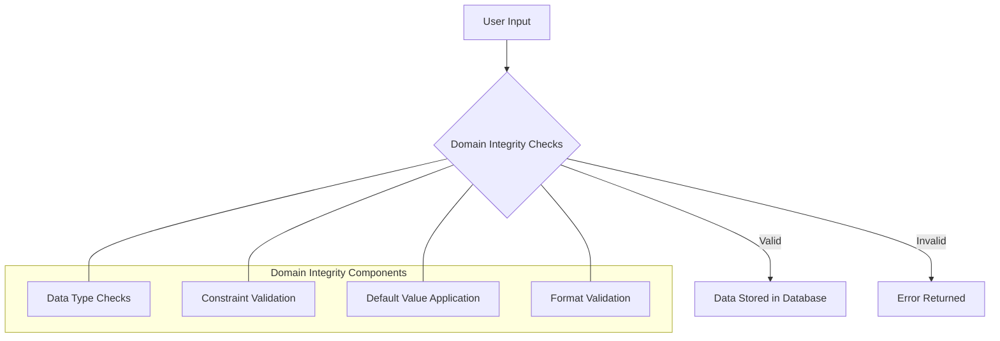

# SQL Domain Integrity

## Introduction

When designing a database, ensuring the quality and reliability of your data is crucial. **Domain integrity** is one of the fundamental components of SQL data integrity that helps maintain data quality. In this article, we'll explore what domain integrity is, why it's important, and how to implement it in your SQL databases.

Domain integrity ensures that all data in a column falls within a defined set of values – the "domain" of that column. Think of a domain as the universe of acceptable values for a particular field. For example, a column storing age should only contain positive integers, while a column for email addresses should only contain properly formatted email strings.

## What is Domain Integrity?

Domain integrity refers to the rules that define the valid values a column can accept. It ensures that data stored in a column conforms to the intended data type, format, and range of values.

Let's break down the key aspects of domain integrity:

1. **Data types** - Define the kind of data a column can store (integers, text, dates, etc.)
2. **Constraints** - Rules that restrict the values that can be entered
3. **Default values** - Values assigned when no value is provided
4. **Format rules** - Requirements for how data must be structured

## Implementing Domain Integrity in SQL

SQL provides several mechanisms to enforce domain integrity. Let's explore each one with examples.

### 1. Data Types

The most basic form of domain integrity is enforced through data types. SQL offers various data types that restrict what kind of data can be stored in a column.

```sql
CREATE TABLE Employees (
    employee_id INT,
    first_name VARCHAR(50),
    birth_date DATE,
    salary DECIMAL(10, 2),
    is_active BOOLEAN
);
```

In this example:
- `employee_id` can only store integers
- `first_name` can store text up to 50 characters
- `birth_date` can only store valid date values
- `salary` can store decimal numbers with 10 digits in total, 2 of which are after the decimal point
- `is_active` can only store boolean values (true/false)

If you try to insert incompatible data, SQL will reject it:

```sql
-- This will fail because text cannot be stored in an INT column
INSERT INTO Employees (employee_id, first_name) 
VALUES ('ABC', 'John');
```

**Output:**
```
Error: Data type mismatch - Cannot convert 'ABC' to INT
```

### 2. CHECK Constraints

CHECK constraints allow you to define more specific rules beyond basic data types. They let you specify conditions that values must meet to be accepted.

```sql
CREATE TABLE Products (
    product_id INT,
    product_name VARCHAR(100),
    price DECIMAL(10, 2) CHECK (price > 0),
    weight DECIMAL(8, 2) CHECK (weight BETWEEN 0.1 AND 1000),
    category VARCHAR(50) CHECK (category IN ('Electronics', 'Clothing', 'Food', 'Books'))
);
```

In this example:
- `price` must be greater than zero
- `weight` must be between 0.1 and 1000
- `category` must be one of the four specified values

Let's see what happens when we try to violate these constraints:

```sql
-- This will fail because price can't be negative
INSERT INTO Products (product_id, product_name, price, weight, category)
VALUES (1, 'Smartphone', -199.99, 0.5, 'Electronics');
```

**Output:**
```
Error: CHECK constraint failed on column 'price'
```

### 3. DEFAULT Values

Default values provide a fallback when no value is specified during insertion, helping maintain domain integrity.

```sql
CREATE TABLE Orders (
    order_id INT,
    customer_id INT,
    order_date DATE DEFAULT CURRENT_DATE,
    status VARCHAR(20) DEFAULT 'Pending',
    total_amount DECIMAL(10, 2) DEFAULT 0.00
);
```

Now, if we insert a record without specifying some values:

```sql
INSERT INTO Orders (order_id, customer_id) 
VALUES (1001, 5);
```

**Output:**
```
1 row inserted
```

The database will automatically assign these values:
- `order_date`: Today's date
- `status`: 'Pending'
- `total_amount`: 0.00

### 4. ENUM Types (in some database systems)

Some SQL databases like MySQL support ENUM types, which restrict a column to a predefined list of values:

```sql
CREATE TABLE Surveys (
    survey_id INT,
    question TEXT,
    response ENUM('Strongly Disagree', 'Disagree', 'Neutral', 'Agree', 'Strongly Agree')
);
```

This ensures that `response` can only contain one of these five values.

### 5. User-Defined Domains (in PostgreSQL)

PostgreSQL allows you to create custom domains that enforce specific constraints:

```sql
-- Create a domain for email addresses
CREATE DOMAIN email_address AS VARCHAR(100)
    CHECK (VALUE ~ '^[a-zA-Z0-9._%+-]+@[a-zA-Z0-9.-]+\.[a-zA-Z]{2,}$');

-- Use the domain in a table
CREATE TABLE Users (
    user_id INT,
    name VARCHAR(100),
    email email_address,
    registration_date DATE
);
```

Now any value inserted into the `email` column must match the email format pattern.

## Real-World Applications

Let's explore some practical examples of domain integrity in real-world scenarios.

### Example 1: E-commerce Database

```sql
CREATE TABLE Customers (
    customer_id INT PRIMARY KEY,
    email VARCHAR(100) CHECK (email LIKE '%@%.%'),
    phone_number VARCHAR(15) CHECK (phone_number ~ '^\+?[0-9]{10,14}$'),
    birth_date DATE CHECK (birth_date <= CURRENT_DATE),
    loyalty_points INT DEFAULT 0 CHECK (loyalty_points >= 0)
);
```

This ensures:
- Email addresses contain @ and a period
- Phone numbers are in a valid format
- Birth dates cannot be in the future
- Loyalty points start at 0 and cannot be negative

### Example 2: Inventory Management System

```sql
CREATE TABLE Inventory (
    item_id INT PRIMARY KEY,
    item_name VARCHAR(100) NOT NULL,
    quantity INT DEFAULT 0 CHECK (quantity >= 0),
    last_restock_date DATE DEFAULT CURRENT_DATE,
    storage_location VARCHAR(50) CHECK (storage_location IN ('Warehouse A', 'Warehouse B', 'Store Front')),
    temperature_req DECIMAL(4,1) CHECK (temperature_req BETWEEN -20 AND 40)
);
```

Here:
- Items must have a name
- Quantity cannot be negative
- New items get today's date as restock date by default
- Storage locations are limited to three options
- Temperature requirements must be between -20°C and 40°C

## Visualizing Domain Integrity

Here's a visual representation of how domain integrity works within a database:



## Best Practices for Domain Integrity

1. **Be specific with data types**: Choose the most appropriate and specific data type for each column.

2. **Use constraints liberally**: Constraints are your first line of defense against bad data.

3. **Document your domains**: Make sure to comment your code or maintain documentation about what values are acceptable for each column.

4. **Test boundary conditions**: When designing constraints, test values at the edges of your domain to ensure they behave as expected.

5. **Consider future needs**: Design domains that can accommodate future data requirements without frequent alterations.

## Common Mistakes to Avoid

1. **Using overly permissive data types** - For example, using VARCHAR when INT would be more appropriate.

2. **Not setting default values** - This can lead to NULL values or incomplete records.

3. **Creating constraints that are too strict** - This might reject valid data.

4. **Overlooking performance implications** - Complex CHECK constraints can slow down data insertion.

## Summary

SQL Domain Integrity is an essential aspect of database design that ensures data quality and consistency. By properly implementing data types, constraints, default values, and other domain integrity mechanisms, you can prevent invalid data from entering your database.

Key points to remember:
- Domain integrity defines and enforces the valid values for each column
- SQL provides various tools for enforcement including data types, CHECK constraints, and DEFAULT values
- Well-implemented domain integrity reduces errors and improves data reliability
- Consider both current and future needs when designing domain constraints

## Exercises

1. Create a table for a library management system with appropriate domain integrity constraints for book ISBN numbers, publication dates, and loan status.

2. Design a table for a healthcare application that stores patient vital signs with domain constraints that enforce medically valid ranges.

3. Modify an existing table to add a CHECK constraint that ensures email addresses follow a valid format.

4. Create a user-defined domain in PostgreSQL for US zip codes and use it in a table.

5. Design a table for tracking financial transactions with domain constraints for account numbers, transaction types, and amounts.

## Additional Resources

- [SQL Data Types Reference](https://www.w3schools.com/sql/sql_datatypes.asp)
- [PostgreSQL Documentation on Domains](https://www.postgresql.org/docs/current/domains.html)
- [MySQL CHECK Constraints](https://dev.mysql.com/doc/refman/8.0/en/create-table-check-constraints.html)
- [SQL Server Data Validation Techniques](https://docs.microsoft.com/en-us/sql/relational-databases/tables/specify-computed-columns-in-a-table)