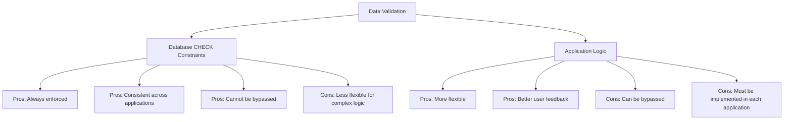

# SQL Check Constraints

## Introduction

Database integrity is fundamental to creating reliable and trustworthy systems. While you can validate data at the application level, implementing constraints directly in your database provides an additional layer of protection. **CHECK constraints** are powerful tools that allow you to define specific conditions that values must meet before they can be inserted or updated in a table.

Think of CHECK constraints as guardians that validate your data against predefined rules. They prevent invalid data from entering your database, ensuring that information remains accurate and consistent—regardless of how that data is being inserted.

## What are CHECK Constraints?

A CHECK constraint is a type of integrity constraint that specifies a condition that must be true for each row in a table. If a row violates the constraint, the database will reject the operation (INSERT, UPDATE) that would have created the invalid data.

### Basic Syntax

```sql
CREATE TABLE table_name (
    column_name data_type,
    ...,
    CONSTRAINT constraint_name CHECK (condition)
);
```

Or you can define it directly on a column:

```sql
CREATE TABLE table_name (
    column_name data_type CHECK (condition),
    ...
);
```

The condition can include:
- Comparison operators (`<`, `>`, `=`, `<=`, `>=`, `<>`)
- Logical operators (`AND`, `OR`, `NOT`)
- Functions appropriate for the database system
- Multiple columns from the same table

## Simple CHECK Constraint Examples

### Example 1: Age Validation

Let's create a `students` table where we ensure all students are at least 18 years old:

```sql
CREATE TABLE students (
    student_id INT PRIMARY KEY,
    first_name VARCHAR(50) NOT NULL,
    last_name VARCHAR(50) NOT NULL,
    age INT,
    CONSTRAINT chk_student_age CHECK (age >= 18)
);
```

Now, let's try to insert valid and invalid data:

```sql
-- Valid insertion (age meets the constraint)
INSERT INTO students (student_id, first_name, last_name, age)
VALUES (1, 'John', 'Smith', 19);

-- Invalid insertion (age violates the constraint)
INSERT INTO students (student_id, first_name, last_name, age)
VALUES (2, 'Emma', 'Johnson', 17);
```

**Output for the invalid insertion:**
```
Error: CHECK constraint 'chk_student_age' violated
```

The second INSERT statement fails because the age value (17) violates our CHECK constraint.

### Example 2: Price Range Validation

For an e-commerce database, we might want to ensure product prices are positive:

```sql
CREATE TABLE products (
    product_id INT PRIMARY KEY,
    product_name VARCHAR(100) NOT NULL,
    price DECIMAL(10,2) CHECK (price > 0),
    description TEXT
);
```

This constraint ensures that no product can have a zero or negative price.

## Complex CHECK Constraints

### Example 3: Multiple Conditions

You can combine multiple conditions using logical operators:

```sql
CREATE TABLE employees (
    employee_id INT PRIMARY KEY,
    first_name VARCHAR(50) NOT NULL,
    last_name VARCHAR(50) NOT NULL,
    salary DECIMAL(10,2),
    department VARCHAR(50),
    CONSTRAINT chk_salary_by_dept CHECK (
        (department = 'IT' AND salary >= 60000) OR
        (department = 'HR' AND salary >= 50000) OR
        (department = 'Sales' AND salary >= 45000) OR
        (department <> 'IT' AND department <> 'HR' AND department <> 'Sales')
    )
);
```

This constraint ensures that employees in specific departments have salaries that meet minimum thresholds.

### Example 4: Date Validation

For a booking system, we might want to ensure end dates come after start dates:

```sql
CREATE TABLE bookings (
    booking_id INT PRIMARY KEY,
    customer_id INT NOT NULL,
    room_id INT NOT NULL,
    start_date DATE NOT NULL,
    end_date DATE NOT NULL,
    CONSTRAINT chk_booking_dates CHECK (end_date > start_date)
);
```

Let's test this constraint:

```sql
-- Valid booking (end date after start date)
INSERT INTO bookings VALUES (1, 101, 5, '2023-06-01', '2023-06-05');

-- Invalid booking (end date before start date)
INSERT INTO bookings VALUES (2, 102, 7, '2023-07-15', '2023-07-10');
```

**Output for the invalid insertion:**
```
Error: CHECK constraint 'chk_booking_dates' violated
```

## CHECK Constraints with Multiple Columns

### Example 5: Discount Validation

In this example, we ensure that discounted prices are always lower than regular prices:

```sql
CREATE TABLE sale_items (
    item_id INT PRIMARY KEY,
    item_name VARCHAR(100) NOT NULL,
    regular_price DECIMAL(10,2) NOT NULL,
    sale_price DECIMAL(10,2),
    CONSTRAINT chk_valid_sale_price CHECK (sale_price < regular_price)
);
```

### Example 6: Shipping Weight Calculation

For a shipping database, we might validate that total weight equals the sum of item weight and packaging:

```sql
CREATE TABLE shipments (
    shipment_id INT PRIMARY KEY,
    item_weight DECIMAL(6,2) NOT NULL,
    packaging_weight DECIMAL(4,2) NOT NULL,
    total_weight DECIMAL(6,2) NOT NULL,
    CONSTRAINT chk_total_weight CHECK (
        total_weight = item_weight + packaging_weight
    )
);
```

## Adding CHECK Constraints to Existing Tables

You can add CHECK constraints to tables that already exist:

```sql
-- Adding a CHECK constraint to an existing table
ALTER TABLE students
ADD CONSTRAINT chk_student_email CHECK (email LIKE '%@%.%');
```

This would validate that email addresses contain at least an '@' character and a period.

## Real-World Applications

### Example 7: Credit Card Validation

For a payment processing system, we might validate credit card numbers:

```sql
CREATE TABLE payments (
    payment_id INT PRIMARY KEY,
    customer_id INT NOT NULL,
    credit_card_number VARCHAR(16),
    expiry_date DATE NOT NULL,
    CONSTRAINT chk_credit_card CHECK (
        LENGTH(credit_card_number) = 16 AND
        credit_card_number ~ '^[0-9]+$'
    )
);
```

This ensures credit card numbers are exactly 16 digits and contain only numbers. (Note: In a real system, you would use more sophisticated validation and proper encryption.)

### Example 8: Inventory Management

For an inventory system, we might ensure that stock levels never go negative:

```sql
CREATE TABLE inventory (
    product_id INT PRIMARY KEY,
    product_name VARCHAR(100) NOT NULL,
    quantity_in_stock INT NOT NULL,
    reorder_level INT NOT NULL,
    CONSTRAINT chk_stock_positive CHECK (quantity_in_stock >= 0),
    CONSTRAINT chk_reorder_level CHECK (reorder_level > 0)
);
```

This prevents recording negative inventory and ensures the reorder level is always positive.

## CHECK Constraints vs Application Logic

Let's compare implementing validation at the database level versus the application level:



While application-level validation provides better user feedback, database constraints ensure that no matter how data enters your database (direct SQL, API, application), it always meets your requirements.

## Best Practices for CHECK Constraints

1. **Name your constraints** for easier troubleshooting and maintenance
2. **Keep constraints simple** when possible
3. **Document complex constraints** in comments or documentation
4. **Test constraints rigorously** with boundary values
5. **Consider performance impacts** for very complex conditions
6. **Use appropriate constraint types** (don't use CHECK when FOREIGN KEY would be more appropriate)

## Common Pitfalls and Limitations

- CHECK constraints cannot reference columns in other tables
- Some databases have limitations on the functions you can use in CHECK constraints
- Constraints that are too restrictive may prevent valid operations
- NULL values may not behave as expected with CHECK constraints (a condition with NULL evaluates to UNKNOWN, not FALSE)

## Summary

CHECK constraints are powerful tools for maintaining data integrity directly at the database level. They allow you to define business rules that all data must follow, regardless of how that data enters your database. By implementing appropriate CHECK constraints, you can prevent invalid data, ensure consistency, and build more reliable systems.

Key points to remember:
- CHECK constraints validate data against specified conditions
- They can use comparison and logical operators
- They can involve multiple columns from the same table
- They cannot reference other tables
- They provide an additional layer of protection beyond application-level validation

## Additional Resources

1. [PostgreSQL CHECK Constraints Documentation](https://www.postgresql.org/docs/current/ddl-constraints.html)
2. [MySQL CHECK Constraints Documentation](https://dev.mysql.com/doc/refman/8.0/en/create-table-check-constraints.html)
3. [SQL Server CHECK Constraints Documentation](https://learn.microsoft.com/en-us/sql/relational-databases/tables/create-check-constraints)

## Exercises

1. Create a `temperature_readings` table with a CHECK constraint that ensures temperature values are within a realistic range (-50°C to 60°C).

2. Design a `user_accounts` table with constraints that ensure passwords are at least 8 characters long.

3. Implement a CHECK constraint that validates email addresses in a `contacts` table (hint: use the appropriate pattern matching for your database system).

4. Create a `projects` table where the completion percentage must be between 0 and 100.

5. Design a database schema for a store with appropriate CHECK constraints for product prices, inventory levels, and discount rates.