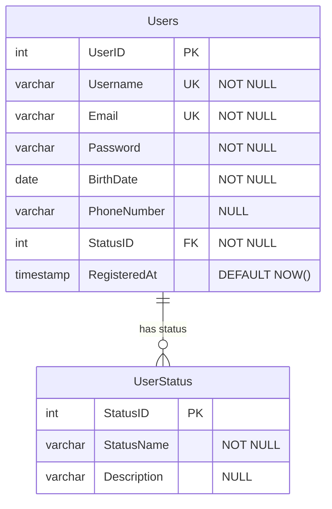

# SQL Data Validation

## Introduction

Data validation is a critical component of SQL data integrity that ensures the data entering a database meets specific rules and requirements before being stored. Proper validation prevents corrupted, inaccurate, or malformed data from contaminating your database, which could lead to incorrect analysis, system failures, or security vulnerabilities.

In this guide, we'll explore various SQL data validation techniques that help maintain the quality and reliability of your data. These techniques are essential for anyone working with databases, from beginners to experienced developers.

## Why Data Validation Matters

Imagine you're building an e-commerce application. Without proper data validation:
- A user might enter a negative price for a product
- An order might be created with an invalid delivery address
- Customer information might contain incomplete or incorrect details

Such inconsistencies can cause your application to malfunction or produce unreliable results. Data validation acts as a gatekeeper, ensuring that only valid data enters your database.

## SQL Validation Techniques

### 1. Constraints

Constraints are rules enforced by the database management system to maintain data integrity. They prevent invalid data from being inserted, updated, or deleted.

#### Common Types of Constraints:

##### NOT NULL Constraint

The `NOT NULL` constraint ensures that a column cannot have a NULL value.

```sql
-- Creating a table with NOT NULL constraints
CREATE TABLE Customers (
    CustomerID INT PRIMARY KEY,
    FirstName VARCHAR(50) NOT NULL,
    LastName VARCHAR(50) NOT NULL,
    Email VARCHAR(100) NOT NULL
);

-- This insert will succeed
INSERT INTO Customers VALUES (1, 'John', 'Doe', 'john.doe@example.com');

-- This insert will fail because LastName is NULL
INSERT INTO Customers VALUES (2, 'Jane', NULL, 'jane@example.com');
```

##### UNIQUE Constraint

The `UNIQUE` constraint ensures that all values in a column or a set of columns are unique.

```sql
-- Creating a table with a UNIQUE constraint
CREATE TABLE Products (
    ProductID INT PRIMARY KEY,
    ProductName VARCHAR(100) NOT NULL,
    ProductCode VARCHAR(20) UNIQUE,
    Price DECIMAL(10, 2)
);

-- These inserts will succeed (different ProductCode values)
INSERT INTO Products VALUES (1, 'Laptop', 'LAP001', 999.99);
INSERT INTO Products VALUES (2, 'Monitor', 'MON001', 299.99);

-- This insert will fail (duplicate ProductCode)
INSERT INTO Products VALUES (3, 'Desktop', 'LAP001', 1299.99);
```

##### CHECK Constraint

The `CHECK` constraint ensures that values in a column meet specified conditions.

```sql
-- Creating a table with CHECK constraints
CREATE TABLE Orders (
    OrderID INT PRIMARY KEY,
    OrderDate DATE NOT NULL,
    Quantity INT CHECK (Quantity > 0),
    TotalAmount DECIMAL(10, 2) CHECK (TotalAmount >= 0)
);

-- This insert will succeed
INSERT INTO Orders VALUES (1, '2023-01-15', 5, 250.00);

-- This insert will fail because Quantity is negative
INSERT INTO Orders VALUES (2, '2023-01-16', -3, 150.00);
```

##### PRIMARY KEY Constraint

The `PRIMARY KEY` constraint uniquely identifies each record in a table and ensures that the column(s) cannot contain NULL values.

```sql
-- Creating a table with a PRIMARY KEY constraint
CREATE TABLE Employees (
    EmployeeID INT PRIMARY KEY,
    FirstName VARCHAR(50) NOT NULL,
    LastName VARCHAR(50) NOT NULL,
    Department VARCHAR(50)
);

-- These inserts will succeed (different EmployeeID values)
INSERT INTO Employees VALUES (1, 'Alice', 'Johnson', 'HR');
INSERT INTO Employees VALUES (2, 'Bob', 'Smith', 'IT');

-- This insert will fail (duplicate EmployeeID)
INSERT INTO Employees VALUES (1, 'Carol', 'Williams', 'Marketing');
```

##### FOREIGN KEY Constraint

The `FOREIGN KEY` constraint ensures referential integrity by linking data between two tables.

```sql
-- Creating parent and child tables with a FOREIGN KEY constraint
CREATE TABLE Departments (
    DepartmentID INT PRIMARY KEY,
    DepartmentName VARCHAR(50) NOT NULL
);

CREATE TABLE Staff (
    StaffID INT PRIMARY KEY,
    FirstName VARCHAR(50) NOT NULL,
    LastName VARCHAR(50) NOT NULL,
    DepartmentID INT,
    FOREIGN KEY (DepartmentID) REFERENCES Departments(DepartmentID)
);

-- Inserting into parent table
INSERT INTO Departments VALUES (1, 'Human Resources');
INSERT INTO Departments VALUES (2, 'Information Technology');

-- These inserts will succeed (valid DepartmentID values)
INSERT INTO Staff VALUES (1, 'David', 'Brown', 1);
INSERT INTO Staff VALUES (2, 'Emma', 'Davis', 2);

-- This insert will fail (invalid DepartmentID)
INSERT INTO Staff VALUES (3, 'Frank', 'Wilson', 3);
```

### 2. Data Types

Selecting the appropriate data type for each column is a fundamental form of validation.

```sql
CREATE TABLE Products (
    ProductID INT,
    ProductName VARCHAR(100),
    Price DECIMAL(10, 2),  -- Ensures 2 decimal places
    InStock BOOLEAN,       -- Only TRUE/FALSE values
    ManufactureDate DATE,  -- Only valid dates
    Description TEXT       -- For longer text content
);
```

Each data type enforces specific rules:
- `INT`: Only integer values allowed
- `DECIMAL(10, 2)`: Numbers with up to 10 digits and 2 decimal places
- `DATE`: Only valid date values
- `VARCHAR(100)`: Strings with a maximum length of 100 characters

### 3. Triggers

Triggers are special stored procedures that automatically execute when certain events occur. They can implement complex validation rules that constraints cannot handle.

```sql
-- Creating a trigger to validate email format
CREATE TRIGGER validate_email
BEFORE INSERT OR UPDATE ON Customers
FOR EACH ROW
BEGIN
    IF NEW.Email NOT LIKE '%_@_%._%' THEN
        SIGNAL SQLSTATE '45000' 
        SET MESSAGE_TEXT = 'Invalid email format';
    END IF;
END;
```

This trigger checks if the email format is valid before allowing an insert or update operation.

### 4. Stored Procedures

Stored procedures can include validation logic before performing operations on the data.

```sql
-- Creating a stored procedure with validation
CREATE PROCEDURE add_new_product(
    IN p_name VARCHAR(100),
    IN p_price DECIMAL(10, 2),
    IN p_category VARCHAR(50)
)
BEGIN
    -- Validate input parameters
    IF p_name IS NULL OR p_name = '' THEN
        SIGNAL SQLSTATE '45000' 
        SET MESSAGE_TEXT = 'Product name cannot be empty';
    END IF;
    
    IF p_price <= 0 THEN
        SIGNAL SQLSTATE '45000' 
        SET MESSAGE_TEXT = 'Price must be greater than zero';
    END IF;
    
    -- If validation passes, insert the new product
    INSERT INTO Products (ProductName, Price, Category)
    VALUES (p_name, p_price, p_category);
END;

-- Using the stored procedure
CALL add_new_product('Smartphone', 699.99, 'Electronics');
CALL add_new_product('', 50.00, 'Office Supplies'); -- This will fail
CALL add_new_product('Notebook', -10.00, 'Office Supplies'); -- This will fail
```

## Real-World Application: User Registration System

Let's implement comprehensive data validation for a user registration system.



### Implementation:

```sql
-- Create UserStatus table
CREATE TABLE UserStatus (
    StatusID INT PRIMARY KEY,
    StatusName VARCHAR(20) NOT NULL,
    Description VARCHAR(100)
);

-- Insert status values
INSERT INTO UserStatus VALUES 
(1, 'Active', 'Account is active and usable'),
(2, 'Pending', 'Account awaiting email verification'),
(3, 'Suspended', 'Account temporarily suspended'),
(4, 'Inactive', 'Account inactive');

-- Create Users table with comprehensive validation
CREATE TABLE Users (
    UserID INT PRIMARY KEY AUTO_INCREMENT,
    Username VARCHAR(50) NOT NULL UNIQUE,
    Email VARCHAR(100) NOT NULL UNIQUE CHECK (Email LIKE '%_@_%._%'),
    Password VARCHAR(100) NOT NULL CHECK (LENGTH(Password) >= 8),
    BirthDate DATE NOT NULL CHECK (BirthDate <= CURRENT_DATE() AND 
                                   DATEDIFF(CURRENT_DATE(), BirthDate)/365 >= 13),
    PhoneNumber VARCHAR(20),
    StatusID INT NOT NULL DEFAULT 2,
    RegisteredAt TIMESTAMP DEFAULT CURRENT_TIMESTAMP,
    FOREIGN KEY (StatusID) REFERENCES UserStatus(StatusID)
);

-- Create a trigger for additional phone number validation
DELIMITER //
CREATE TRIGGER validate_phone_number
BEFORE INSERT OR UPDATE ON Users
FOR EACH ROW
BEGIN
    -- If phone number is provided, validate format (simple example)
    IF NEW.PhoneNumber IS NOT NULL AND NEW.PhoneNumber NOT REGEXP '^[0-9+-]{10,15}$' THEN
        SIGNAL SQLSTATE '45000' 
        SET MESSAGE_TEXT = 'Phone number format is invalid';
    END IF;
END;
//
DELIMITER ;

-- Create a registration stored procedure with additional validation
DELIMITER //
CREATE PROCEDURE register_user(
    IN p_username VARCHAR(50),
    IN p_email VARCHAR(100),
    IN p_password VARCHAR(100),
    IN p_birthdate DATE,
    IN p_phone VARCHAR(20)
)
BEGIN
    DECLARE username_exists INT;
    DECLARE email_exists INT;
    
    -- Check if username already exists
    SELECT COUNT(*) INTO username_exists FROM Users WHERE Username = p_username;
    IF username_exists > 0 THEN
        SIGNAL SQLSTATE '45000' SET MESSAGE_TEXT = 'Username already taken';
    END IF;
    
    -- Check if email already exists
    SELECT COUNT(*) INTO email_exists FROM Users WHERE Email = p_email;
    IF email_exists > 0 THEN
        SIGNAL SQLSTATE '45000' SET MESSAGE_TEXT = 'Email already registered';
    END IF;
    
    -- Additional password strength validation
    IF p_password NOT REGEXP '[A-Z]' OR 
       p_password NOT REGEXP '[a-z]' OR 
       p_password NOT REGEXP '[0-9]' THEN
        SIGNAL SQLSTATE '45000' 
        SET MESSAGE_TEXT = 'Password must contain uppercase, lowercase, and numbers';
    END IF;
    
    -- If all validation passes, insert the new user
    INSERT INTO Users (Username, Email, Password, BirthDate, PhoneNumber)
    VALUES (p_username, p_email, p_password, p_birthdate, p_phone);
    
    SELECT 'User registered successfully' AS Message;
END;
//
DELIMITER ;
```

### Using the registration system:

```sql
-- Successful registration
CALL register_user('john_doe', 'john.doe@example.com', 'Password123', '1990-05-15', '+1234567890');

-- Failed registrations with validation errors
CALL register_user('jane_doe', 'not-an-email', 'Password123', '1995-07-20', '+9876543210');
-- Error: Email format is invalid

CALL register_user('jane_doe', 'jane.doe@example.com', 'password', '1995-07-20', '+9876543210');
-- Error: Password must contain uppercase, lowercase, and numbers

CALL register_user('jane_doe', 'jane.doe@example.com', 'Password123', '2015-07-20', '+9876543210');
-- Error: User must be at least 13 years old

CALL register_user('john_doe', 'different.email@example.com', 'Password123', '1992-03-10', '+1234567890');
-- Error: Username already taken
```

## Advanced Validation Techniques

### Regular Expressions

Regular expressions provide powerful pattern matching for string validation:

```sql
-- Validate email format using REGEXP
CREATE TABLE Contacts (
    ContactID INT PRIMARY KEY,
    Email VARCHAR(100) CHECK (Email REGEXP '^[a-zA-Z0-9._%+-]+@[a-zA-Z0-9.-]+\\.[a-zA-Z]{2,}$')
);

-- Validate US phone number format
CREATE TABLE Customers (
    CustomerID INT PRIMARY KEY,
    Phone VARCHAR(20) CHECK (Phone REGEXP '^\\+1-[0-9]{3}-[0-9]{3}-[0-9]{4}$')
);
```

### Computed Columns

Some database systems support computed columns that can be used for validation:

```sql
-- Example in SQL Server
CREATE TABLE Products (
    ProductID INT PRIMARY KEY,
    UnitPrice DECIMAL(10, 2),
    Quantity INT,
    TotalValue AS (UnitPrice * Quantity) PERSISTED CHECK (TotalValue <= 10000)
);
```

This ensures that the total value of any product entry doesn't exceed $10,000.

## Best Practices for SQL Data Validation

1. **Validate at Multiple Levels**:
   - Database level (constraints, triggers)
   - Application level (before sending data to the database)
   - User interface level (form validation)

2. **Use Appropriate Constraints**:
   - Apply `NOT NULL` to required fields
   - Use `UNIQUE` for fields that must contain unique values
   - Implement `CHECK` constraints for value ranges and patterns
   - Define `PRIMARY KEY` and `FOREIGN KEY` constraints for relationships

3. **Choose Correct Data Types**:
   - Use the most restrictive data type that meets your needs
   - Consider precision and scale for numeric data
   - Use the appropriate string types and lengths

4. **Document Validation Rules**:
   - Maintain clear documentation of all validation rules
   - Include comments in your SQL code to explain complex validation logic

5. **Test Edge Cases**:
   - Test boundary values (minimum, maximum, empty)
   - Test invalid inputs
   - Test special characters and unusual formats

6. **Consider Performance**:
   - Complex validation logic in triggers can impact performance
   - Consider validation timing (before or after operations)
   - Balance validation thoroughness with performance requirements

## Summary

SQL data validation is a crucial aspect of maintaining data integrity in your database systems. By implementing constraints, appropriate data types, triggers, stored procedures, and other validation techniques, you can ensure that your database contains only valid, consistent, and reliable data.

The validation techniques we've explored serve as gatekeepers that prevent invalid data from entering your database, thereby safeguarding the quality and reliability of your data assets.

## Exercises

1. Create a `Students` table with the following validations:
   - Student ID must be unique
   - Name cannot be empty
   - Age must be between 16 and 120
   - GPA must be between 0.0 and 4.0
   - Email must be in a valid format

2. Add a trigger to validate that a student's enrollment date is not in the future.

3. Create a stored procedure that registers a new course with validations for:
   - Course code (must follow format: ABC123)
   - Credit hours (must be between 1 and 6)
   - Maximum enrollment (must be between 5 and 300)

4. Design a database schema for a library management system with appropriate validation constraints for books, members, and borrowing records.

## Additional Resources

- [SQL Constraints (W3Schools)](https://www.w3schools.com/sql/sql_constraints.asp)
- [Data Validation Techniques in SQL Server](https://learn.microsoft.com/en-us/sql/relational-databases/tables/use-check-constraints-for-data-validation)
- [Database Design Best Practices](https://www.oracle.com/database/what-is-database-design/)
- [PostgreSQL Data Validation](https://www.postgresql.org/docs/current/ddl-constraints.html)
- [MySQL Data Validation](https://dev.mysql.com/doc/refman/8.0/en/data-validation.html)