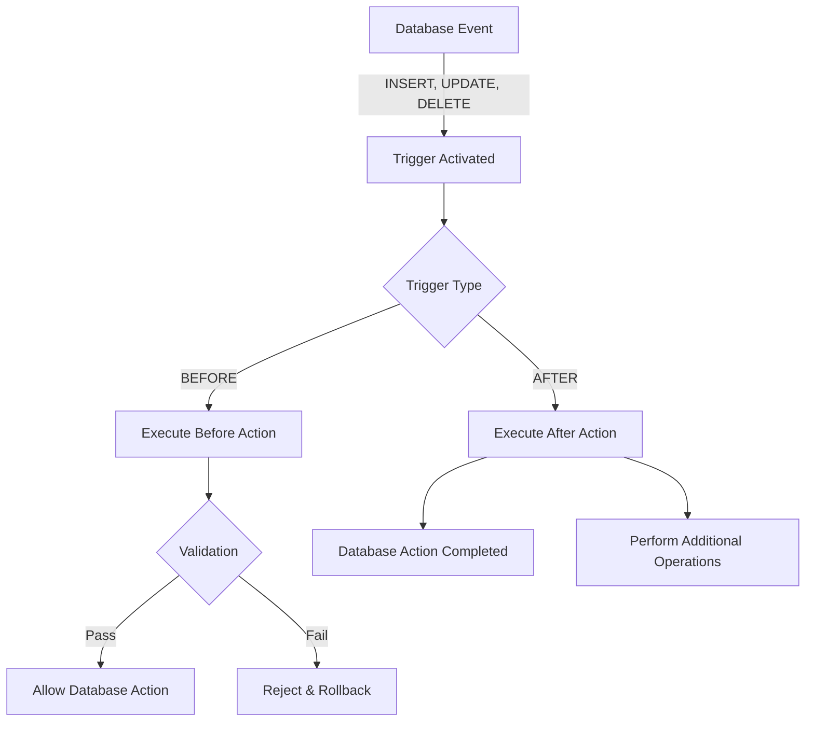

# SQL Triggers for Integrity

## Introduction

Database integrity is crucial for maintaining accurate and reliable data. While constraints like PRIMARY KEY, FOREIGN KEY, and CHECK help enforce basic rules, SQL triggers provide a more powerful mechanism for implementing complex integrity rules. In this tutorial, we'll explore how triggers can be used to maintain data integrity in your database systems.

Triggers are special stored procedures that automatically execute in response to specific events on a table or view. These events can be INSERT, UPDATE, DELETE, or even database-level events in some systems. Triggers are particularly useful for enforcing business rules and maintaining data consistency across related tables.

## Understanding SQL Triggers

### What is a Trigger?

A trigger is a database object that is associated with a table and activates when a particular event occurs for that table. Triggers can execute before or after the triggering event, depending on your needs.

The basic syntax for creating a trigger looks like this:

```sql
CREATE TRIGGER trigger_name
{BEFORE | AFTER} {INSERT | UPDATE | DELETE} ON table_name
FOR EACH ROW
BEGIN
    -- Trigger logic here
END;
```

### Types of Triggers

Triggers can be categorized based on when they execute:

1. **BEFORE triggers**: Execute before the triggering event (INSERT, UPDATE, DELETE)
2. **AFTER triggers**: Execute after the triggering event

They can also be categorized based on level:

1. **Row-level triggers**: Execute once for each affected row (FOR EACH ROW)
2. **Statement-level triggers**: Execute once for the entire statement (default in some systems)

## Creating Basic Triggers for Data Integrity

Let's start with a simple example. Suppose we have a `products` table and want to ensure that product prices are never reduced by more than 50% in a single update.

```sql
-- Create a products table
CREATE TABLE products (
    product_id INT PRIMARY KEY,
    product_name VARCHAR(100) NOT NULL,
    price DECIMAL(10, 2) NOT NULL,
    last_updated TIMESTAMP
);

-- Create a BEFORE UPDATE trigger to enforce price reduction rule
CREATE TRIGGER check_price_reduction
BEFORE UPDATE ON products
FOR EACH ROW
BEGIN
    IF NEW.price < (OLD.price * 0.5) THEN
        SIGNAL SQLSTATE '45000' 
        SET MESSAGE_TEXT = 'Price cannot be reduced by more than 50%';
    END IF;
END;
```

Now, let's test our trigger:

```sql
-- Insert a product
INSERT INTO products VALUES (1, 'Laptop', 1000.00, NOW());

-- This update should succeed
UPDATE products SET price = 600.00 WHERE product_id = 1;

-- This update should fail (trigger will prevent it)
UPDATE products SET price = 400.00 WHERE product_id = 1;
```

Output for the last statement:
```
ERROR 1644 (45000): Price cannot be reduced by more than 50%
```

### Referential Integrity with Triggers

While foreign keys handle basic referential integrity, triggers can implement more complex rules. Let's consider an example with `orders` and `inventory` tables.

```sql
-- Create tables
CREATE TABLE inventory (
    product_id INT PRIMARY KEY,
    product_name VARCHAR(100),
    quantity_in_stock INT NOT NULL DEFAULT 0,
    CHECK (quantity_in_stock >= 0)
);

CREATE TABLE orders (
    order_id INT PRIMARY KEY,
    product_id INT,
    quantity INT NOT NULL,
    order_date TIMESTAMP DEFAULT CURRENT_TIMESTAMP,
    FOREIGN KEY (product_id) REFERENCES inventory(product_id)
);

-- Create a trigger to update inventory when an order is placed
CREATE TRIGGER update_inventory_after_order
AFTER INSERT ON orders
FOR EACH ROW
BEGIN
    UPDATE inventory
    SET quantity_in_stock = quantity_in_stock - NEW.quantity
    WHERE product_id = NEW.product_id;
    
    -- Check if inventory went below zero after update
    IF (SELECT quantity_in_stock FROM inventory WHERE product_id = NEW.product_id) < 0 THEN
        SIGNAL SQLSTATE '45000' 
        SET MESSAGE_TEXT = 'Insufficient inventory for this order';
    END IF;
END;
```

Let's test this trigger:

```sql
-- Insert inventory
INSERT INTO inventory VALUES (101, 'Smartphone', 20);

-- This order should succeed
INSERT INTO orders (order_id, product_id, quantity) VALUES (1, 101, 5);

-- Check inventory
SELECT * FROM inventory WHERE product_id = 101;
```

Output:
```
| product_id | product_name | quantity_in_stock |
|------------|--------------|-------------------|
| 101        | Smartphone   | 15                |
```

```sql
-- This order should fail (insufficient inventory)
INSERT INTO orders (order_id, product_id, quantity) VALUES (2, 101, 20);
```

Output:
```
ERROR 1644 (45000): Insufficient inventory for this order
```

## Using Triggers for Auditing Changes

Triggers are excellent for maintaining audit trails, which is another aspect of data integrity.

```sql
-- Create audit table
CREATE TABLE employees (
    emp_id INT PRIMARY KEY,
    emp_name VARCHAR(100),
    salary DECIMAL(10, 2),
    department VARCHAR(50)
);

CREATE TABLE employee_audit (
    audit_id INT AUTO_INCREMENT PRIMARY KEY,
    emp_id INT,
    action_type VARCHAR(10),
    old_salary DECIMAL(10, 2),
    new_salary DECIMAL(10, 2),
    changed_by VARCHAR(100),
    change_date TIMESTAMP DEFAULT CURRENT_TIMESTAMP
);

-- Create trigger to track salary changes
CREATE TRIGGER audit_salary_changes
AFTER UPDATE ON employees
FOR EACH ROW
BEGIN
    IF OLD.salary != NEW.salary THEN
        INSERT INTO employee_audit (emp_id, action_type, old_salary, new_salary, changed_by)
        VALUES (NEW.emp_id, 'UPDATE', OLD.salary, NEW.salary, CURRENT_USER());
    END IF;
END;
```

Let's see the trigger in action:

```sql
-- Insert an employee
INSERT INTO employees VALUES (1, 'John Doe', 50000.00, 'IT');

-- Update salary
UPDATE employees SET salary = 55000.00 WHERE emp_id = 1;

-- Check audit table
SELECT * FROM employee_audit;
```

Output:
```
| audit_id | emp_id | action_type | old_salary | new_salary | changed_by | change_date         |
|----------|--------|-------------|------------|------------|------------|---------------------|
| 1        | 1      | UPDATE      | 50000.00   | 55000.00   | root@localhost | 2023-05-15 14:30:22 |
```

## Complex Data Integrity with Multiple Table Coordination

Triggers can coordinate integrity across multiple tables. Consider a banking application with `accounts` and `transactions` tables:

```sql
-- Create tables
CREATE TABLE accounts (
    account_id INT PRIMARY KEY,
    customer_name VARCHAR(100),
    balance DECIMAL(15, 2) NOT NULL DEFAULT 0.00,
    account_status VARCHAR(20) DEFAULT 'active',
    CHECK (balance >= 0)
);

CREATE TABLE transactions (
    transaction_id INT AUTO_INCREMENT PRIMARY KEY,
    account_id INT,
    transaction_type VARCHAR(20),
    amount DECIMAL(15, 2),
    transaction_date TIMESTAMP DEFAULT CURRENT_TIMESTAMP,
    FOREIGN KEY (account_id) REFERENCES accounts(account_id)
);

-- Create trigger to update account balance
CREATE TRIGGER update_balance_after_transaction
AFTER INSERT ON transactions
FOR EACH ROW
BEGIN
    IF NEW.transaction_type = 'deposit' THEN
        UPDATE accounts 
        SET balance = balance + NEW.amount 
        WHERE account_id = NEW.account_id;
    ELSEIF NEW.transaction_type = 'withdrawal' THEN
        -- First check if there's enough balance
        IF (SELECT balance FROM accounts WHERE account_id = NEW.account_id) < NEW.amount THEN
            SIGNAL SQLSTATE '45000' 
            SET MESSAGE_TEXT = 'Insufficient funds for withdrawal';
        ELSE
            UPDATE accounts 
            SET balance = balance - NEW.amount 
            WHERE account_id = NEW.account_id;
        END IF;
    END IF;
END;
```

Testing the banking system:

```sql
-- Create account
INSERT INTO accounts (account_id, customer_name, balance) VALUES (1001, 'Alice Smith', 1000.00);

-- Make deposit
INSERT INTO transactions (account_id, transaction_type, amount) VALUES (1001, 'deposit', 500.00);

-- Check balance
SELECT * FROM accounts WHERE account_id = 1001;
```

Output:
```
| account_id | customer_name | balance | account_status |
|------------|---------------|---------|----------------|
| 1001       | Alice Smith   | 1500.00 | active         |
```

```sql
-- Make withdrawal
INSERT INTO transactions (account_id, transaction_type, amount) VALUES (1001, 'withdrawal', 200.00);

-- Check balance
SELECT * FROM accounts WHERE account_id = 1001;
```

Output:
```
| account_id | customer_name | balance | account_status |
|------------|---------------|---------|----------------|
| 1001       | Alice Smith   | 1300.00 | active         |
```

```sql
-- Attempt excessive withdrawal
INSERT INTO transactions (account_id, transaction_type, amount) VALUES (1001, 'withdrawal', 2000.00);
```

Output:
```
ERROR 1644 (45000): Insufficient funds for withdrawal
```

## Visualizing Trigger Workflow



## Best Practices for Trigger Design

1. **Keep triggers simple**: Complex trigger logic can be difficult to debug and maintain.

2. **Avoid recursive triggers**: Be careful not to create situations where triggers activate each other endlessly.

3. **Document thoroughly**: Always document the purpose and functionality of your triggers.

4. **Consider performance**: Triggers execute on every qualifying action, so ensure they're efficient.

5. **Use transactions wisely**: For complex operations, consider using transactions to ensure atomicity.

6. **Don't overuse triggers**: While powerful, triggers should not replace application logic entirely.

## Potential Issues with Triggers

While triggers are powerful tools for maintaining data integrity, they come with some challenges:

1. **Hidden logic**: Triggers execute automatically and can make debugging difficult.

2. **Performance impact**: Poorly designed triggers can significantly impact database performance.

3. **Maintenance overhead**: As your database schema evolves, triggers need to be updated accordingly.

4. **Testing complexity**: Triggers can make unit testing more challenging.

## Summary

SQL triggers are powerful mechanisms for maintaining data integrity beyond what basic constraints can provide. They allow you to implement complex business rules, coordinate changes across multiple tables, audit modifications, and ensure that your data remains consistent and reliable.

By using triggers appropriately, you can push much of your data validation logic to the database level, ensuring that your data remains consistent regardless of which application or user interacts with it.

## Exercises

1. Create a trigger that prevents updates to a `users` table during non-business hours (outside 9 AM to 5 PM).

2. Implement a trigger that automatically archives deleted records from a `customers` table to a `deleted_customers` table.

3. Design a trigger system for a library database that maintains book inventory counts when books are checked out or returned.

4. Create an audit trigger that tracks all modifications to a sensitive `employee_salaries` table.

5. Implement a trigger that enforces a business rule where a customer cannot have more than 5 active orders at one time.

## Additional Resources

- [MySQL Trigger Documentation](https://dev.mysql.com/doc/refman/8.0/en/trigger-syntax.html)
- [PostgreSQL Trigger Documentation](https://www.postgresql.org/docs/current/triggers.html)
- [SQL Server Trigger Documentation](https://learn.microsoft.com/en-us/sql/relational-databases/triggers/create-triggers)
- [Oracle Trigger Documentation](https://docs.oracle.com/en/database/oracle/oracle-database/19/lnpls/CREATE-TRIGGER-statement.html)