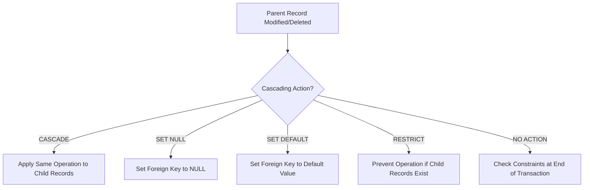

# SQL Cascading Actions

## Introduction

When working with relational databases, maintaining data integrity is crucial. One of the key aspects of data integrity is ensuring that relationships between tables remain consistent, even when data is modified or deleted. SQL Cascading Actions provide a powerful mechanism to automatically maintain these relationships.

In this tutorial, we'll explore how cascading actions work, why they're important, and how to implement them in your database design. By the end, you'll understand how to use these features to build more robust and maintainable database applications.

## What Are SQL Cascading Actions?

Cascading actions are rules that define what happens to related data when a primary key record is updated or deleted. They're specified as part of foreign key constraints and automatically propagate changes from a parent table to its child tables.

Without cascading actions, you would need to manually handle related records when making changes to parent tables, which can be error-prone and cumbersome.

## Types of Cascading Actions

When defining a foreign key constraint, you can specify several types of cascading actions:

1. **CASCADE**: Automatically applies the same operation (update or delete) to related records
2. **SET NULL**: Sets the foreign key field to NULL when the referenced record is modified
3. **SET DEFAULT**: Sets the foreign key field to its default value
4. **RESTRICT**: Prevents the operation if related records exist
5. **NO ACTION**: Similar to RESTRICT, but checked at the end of the transaction

Let's visualize these relationships with a diagram:



## Setting Up Cascading Actions

Let's look at how to set up cascading actions when creating tables with foreign key relationships.

### Basic Syntax

```sql
CREATE TABLE parent_table (
    parent_id INT PRIMARY KEY,
    /* other columns */
);

CREATE TABLE child_table (
    child_id INT PRIMARY KEY,
    parent_id INT,
    /* other columns */
    FOREIGN KEY (parent_id) REFERENCES parent_table(parent_id)
    ON DELETE action
    ON UPDATE action
);
```

Where `action` is one of: `CASCADE`, `SET NULL`, `SET DEFAULT`, `RESTRICT`, or `NO ACTION`.

## Practical Examples

Let's explore some real-world examples to understand how cascading actions work in practice.

### Example 1: Customer Orders Database

Imagine we're building an e-commerce database with `customers` and `orders` tables. When a customer is deleted, we want to automatically delete all their orders too.

```sql
-- Create the customers table
CREATE TABLE customers (
    customer_id INT PRIMARY KEY,
    first_name VARCHAR(50) NOT NULL,
    last_name VARCHAR(50) NOT NULL,
    email VARCHAR(100) UNIQUE NOT NULL
);

-- Create the orders table with CASCADE delete
CREATE TABLE orders (
    order_id INT PRIMARY KEY,
    customer_id INT,
    order_date DATE NOT NULL,
    total_amount DECIMAL(10, 2) NOT NULL,
    FOREIGN KEY (customer_id) REFERENCES customers(customer_id)
    ON DELETE CASCADE
);

-- Insert sample data
INSERT INTO customers (customer_id, first_name, last_name, email)
VALUES (1, 'John', 'Doe', 'john@example.com'),
       (2, 'Jane', 'Smith', 'jane@example.com');

INSERT INTO orders (order_id, customer_id, order_date, total_amount)
VALUES (101, 1, '2023-01-15', 125.50),
       (102, 1, '2023-02-20', 75.25),
       (103, 2, '2023-01-25', 220.00);

-- Check the data
SELECT * FROM customers;
SELECT * FROM orders;

-- Delete a customer
DELETE FROM customers WHERE customer_id = 1;

-- Check what happened to the orders
SELECT * FROM orders;
```

**Output:**
```
-- Before deletion:
-- customers table:
customer_id | first_name | last_name | email
-----------+------------+-----------+----------------
1          | John       | Doe       | john@example.com
2          | Jane       | Smith     | jane@example.com

-- orders table:
order_id | customer_id | order_date | total_amount
---------+-------------+------------+-------------
101      | 1           | 2023-01-15 | 125.50
102      | 1           | 2023-02-20 | 75.25
103      | 2           | 2023-01-25 | 220.00

-- After deletion:
-- orders table:
order_id | customer_id | order_date | total_amount
---------+-------------+------------+-------------
103      | 2           | 2023-01-25 | 220.00
```

Notice that when we deleted the customer with `customer_id = 1`, all of their orders were automatically deleted as well, thanks to the `ON DELETE CASCADE` rule.

### Example 2: Department Managers with SET NULL

In this example, we'll use the `SET NULL` action. If a department is deleted, we want to keep the employees but set their department reference to NULL.

```sql
-- Create the departments table
CREATE TABLE departments (
    dept_id INT PRIMARY KEY,
    dept_name VARCHAR(50) NOT NULL
);

-- Create the employees table with SET NULL on delete
CREATE TABLE employees (
    emp_id INT PRIMARY KEY,
    emp_name VARCHAR(100) NOT NULL,
    dept_id INT,
    FOREIGN KEY (dept_id) REFERENCES departments(dept_id)
    ON DELETE SET NULL
);

-- Insert sample data
INSERT INTO departments (dept_id, dept_name)
VALUES (1, 'HR'), (2, 'Engineering'), (3, 'Marketing');

INSERT INTO employees (emp_id, emp_name, dept_id)
VALUES (101, 'Alice Johnson', 1),
       (102, 'Bob Smith', 2),
       (103, 'Carol Davis', 2),
       (104, 'David Wilson', 3);

-- Check the data
SELECT * FROM departments;
SELECT * FROM employees;

-- Delete a department
DELETE FROM departments WHERE dept_id = 2;

-- Check what happened to the employees
SELECT * FROM employees;
```

**Output:**
```
-- Before deletion:
-- departments table:
dept_id | dept_name
--------+------------
1       | HR
2       | Engineering
3       | Marketing

-- employees table:
emp_id | emp_name      | dept_id
-------+---------------+--------
101    | Alice Johnson | 1
102    | Bob Smith     | 2
103    | Carol Davis   | 2
104    | David Wilson  | 3

-- After deletion:
-- employees table:
emp_id | emp_name      | dept_id
-------+---------------+--------
101    | Alice Johnson | 1
102    | Bob Smith     | NULL
103    | Carol Davis   | NULL
104    | David Wilson  | 3
```

When we deleted the Engineering department, the employees who worked there were kept in the database, but their `dept_id` values were set to NULL.

### Example 3: Preventing Deletion with RESTRICT

Sometimes, you want to prevent the deletion of a parent record if child records exist. Let's see how to use the `RESTRICT` action in a project management database:

```sql
-- Create the projects table
CREATE TABLE projects (
    project_id INT PRIMARY KEY,
    project_name VARCHAR(100) NOT NULL,
    start_date DATE NOT NULL
);

-- Create the tasks table with RESTRICT on delete
CREATE TABLE tasks (
    task_id INT PRIMARY KEY,
    task_name VARCHAR(100) NOT NULL,
    project_id INT,
    FOREIGN KEY (project_id) REFERENCES projects(project_id)
    ON DELETE RESTRICT
);

-- Insert sample data
INSERT INTO projects (project_id, project_name, start_date)
VALUES (1, 'Website Redesign', '2023-03-01'),
       (2, 'Mobile App Development', '2023-04-15');

INSERT INTO tasks (task_id, task_name, project_id)
VALUES (101, 'Design Homepage', 1),
       (102, 'Implement Login Page', 1),
       (103, 'Create App Wireframes', 2);

-- Try to delete a project with tasks
DELETE FROM projects WHERE project_id = 1;
```

**Output:**
```
Error: Cannot delete or update a parent row: a foreign key constraint fails
```

The deletion was prevented because there are tasks associated with the project, and we used the `RESTRICT` action.

## Handling Updates with Cascading Actions

Cascading actions aren't just for deletions - they're also useful for updates to primary keys. Let's see an example of `ON UPDATE CASCADE`:

```sql
-- Create the categories table
CREATE TABLE categories (
    category_id INT PRIMARY KEY,
    category_name VARCHAR(50) NOT NULL
);

-- Create the products table with CASCADE on update
CREATE TABLE products (
    product_id INT PRIMARY KEY,
    product_name VARCHAR(100) NOT NULL,
    category_id INT,
    price DECIMAL(10, 2) NOT NULL,
    FOREIGN KEY (category_id) REFERENCES categories(category_id)
    ON UPDATE CASCADE
);

-- Insert sample data
INSERT INTO categories (category_id, category_name)
VALUES (1, 'Electronics'), (2, 'Clothing');

INSERT INTO products (product_id, product_name, category_id, price)
VALUES (101, 'Smartphone', 1, 699.99),
       (102, 'Laptop', 1, 1299.99),
       (103, 'T-shirt', 2, 19.99);

-- Update a category ID
UPDATE categories SET category_id = 5 WHERE category_id = 1;

-- Check what happened to the products
SELECT * FROM products;
```

**Output:**
```
-- Before update:
-- products table:
product_id | product_name | category_id | price
-----------+--------------+-------------+--------
101        | Smartphone   | 1           | 699.99
102        | Laptop       | 1           | 1299.99
103        | T-shirt      | 2           | 19.99

-- After update:
-- products table:
product_id | product_name | category_id | price
-----------+--------------+-------------+--------
101        | Smartphone   | 5           | 699.99
102        | Laptop       | 5           | 1299.99
103        | T-shirt      | 2           | 19.99
```

Notice that when we updated the category ID from 1 to 5, all products in that category were automatically updated to reference the new category ID.

## Best Practices for Cascading Actions

When implementing cascading actions, keep these best practices in mind:

1. **Choose the right action for your business needs**:
   - Use `CASCADE` when child records cannot exist without the parent
   - Use `SET NULL` when child records can exist independently
   - Use `RESTRICT` when you want to prevent accidental deletion

2. **Consider performance implications**:
   - Cascading operations can affect many records and potentially impact performance
   - Be especially careful with deep hierarchies of cascading relationships

3. **Test thoroughly**:
   - Always test cascading actions before deploying to production
   - Verify that they behave as expected with different data scenarios

4. **Document your cascading strategy**:
   - Make sure your team understands the cascading behavior in your database

## Summary

SQL Cascading Actions are a powerful feature that helps maintain data integrity in relational databases. By automating the handling of related records during updates and deletes, they reduce errors and simplify your application code.

In this tutorial, we covered:
- The different types of cascading actions: CASCADE, SET NULL, SET DEFAULT, RESTRICT, and NO ACTION
- How to define cascading actions in foreign key constraints
- Practical examples of each type of action in real-world scenarios
- Best practices for implementing cascading actions

With this knowledge, you can design more robust database schemas that automatically maintain relational integrity.

## Additional Resources

To further strengthen your understanding of SQL data integrity concepts, check out these resources:

1. [SQL Foreign Keys Documentation](https://www.w3schools.com/sql/sql_foreignkey.asp)
2. [Database Normalization](https://www.geeksforgeeks.org/database-normalization-normal-forms/)
3. [SQL Constraints Tutorial](https://www.tutorialspoint.com/sql/sql-constraints.htm)

## Exercises

1. Create a database schema for a library system with books and borrowers. Implement appropriate cascading actions based on business rules.

2. Modify the e-commerce example to include a `products` table related to `orders`. What cascading actions would be appropriate?

3. Design a social media database with users, posts, and comments. Implement cascading actions that make sense for this domain.

4. Write SQL statements to test each type of cascading action and observe the results.

5. Think about a scenario where `SET DEFAULT` would be more appropriate than `SET NULL`. Implement this scenario with sample data.