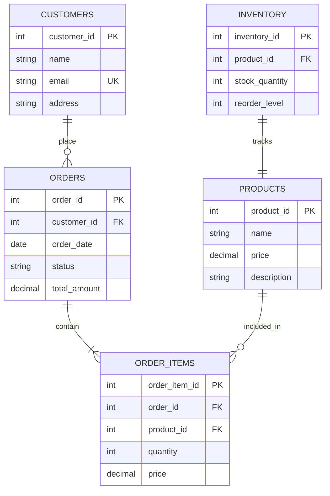

# SQL Data Consistency

## Introduction

Data consistency is a critical aspect of database management that ensures all data within a database remains accurate, reliable, and follows defined rules and relationships. In SQL databases, consistency guarantees that any transaction will bring the database from one valid state to another valid state, preserving all predefined rules.

Think of data consistency like keeping your bookshelf organized - when you add a new book, you place it according to a system (by author, genre, or size). Similarly, when you add or modify data in a database, consistency ensures the data follows all the rules you've established.

## Why Data Consistency Matters

Inconsistent data can lead to several problems:

- Incorrect calculations and reports
- Unreliable business intelligence
- Poor decision-making based on faulty data
- User confusion and distrust
- Application errors

Let's explore how SQL maintains data consistency through various mechanisms and best practices.

## Core Mechanisms for Maintaining Data Consistency

### 1. Constraints

Constraints are rules that restrict the data that can be stored in tables, ensuring accuracy and reliability.

#### Primary Key Constraints

Primary keys ensure each row in a table is uniquely identifiable:

```sql
CREATE TABLE employees (
    employee_id INT PRIMARY KEY,
    first_name VARCHAR(50),
    last_name VARCHAR(50),
    email VARCHAR(100)
);
```

With this constraint, attempting to insert duplicate employee IDs will result in an error:

```sql
-- First insert works fine
INSERT INTO employees VALUES (1, 'John', 'Doe', 'john.doe@example.com');

-- This will fail with an error
INSERT INTO employees VALUES (1, 'Jane', 'Smith', 'jane.smith@example.com');
-- Error: Duplicate entry '1' for key 'PRIMARY'
```

#### Foreign Key Constraints

Foreign keys maintain relationships between tables:

```sql
CREATE TABLE departments (
    department_id INT PRIMARY KEY,
    department_name VARCHAR(50)
);

CREATE TABLE employees (
    employee_id INT PRIMARY KEY,
    first_name VARCHAR(50),
    last_name VARCHAR(50),
    department_id INT,
    FOREIGN KEY (department_id) REFERENCES departments(department_id)
);
```

Now, you cannot add an employee with a department that doesn't exist:

```sql
-- This will fail if department_id 100 doesn't exist in the departments table
INSERT INTO employees VALUES (1, 'John', 'Doe', 100);
-- Error: Cannot add or update a child row: a foreign key constraint fails
```

#### Check Constraints

Check constraints ensure values meet specific conditions:

```sql
CREATE TABLE products (
    product_id INT PRIMARY KEY,
    product_name VARCHAR(100),
    price DECIMAL(10, 2) CHECK (price > 0),
    stock_quantity INT CHECK (stock_quantity >= 0)
);
```

Trying to insert negative prices or stock quantities will fail:

```sql
-- This will fail due to check constraint violation
INSERT INTO products VALUES (1, 'Laptop', -999.99, 10);
-- Error: Check constraint violation
```

#### Unique Constraints

Unique constraints ensure no duplicate values exist in specified columns:

```sql
CREATE TABLE users (
    user_id INT PRIMARY KEY,
    username VARCHAR(50) UNIQUE,
    email VARCHAR(100) UNIQUE
);
```

Attempting to create users with duplicate usernames or emails will fail:

```sql
-- First insert works
INSERT INTO users VALUES (1, 'johndoe', 'john@example.com');

-- This will fail due to unique constraint on username
INSERT INTO users VALUES (2, 'johndoe', 'different@example.com');
-- Error: Duplicate entry 'johndoe' for key 'username'
```

#### NOT NULL Constraints

NOT NULL constraints ensure columns always contain a value:

```sql
CREATE TABLE orders (
    order_id INT PRIMARY KEY,
    customer_id INT NOT NULL,
    order_date DATE NOT NULL,
    total_amount DECIMAL(10, 2) NOT NULL
);
```

Attempting to insert NULL values will fail:

```sql
-- This will fail due to NULL in the customer_id field
INSERT INTO orders VALUES (1, NULL, '2023-09-15', 150.75);
-- Error: Column 'customer_id' cannot be null
```

### 2. Transactions

Transactions group multiple operations together to ensure they all succeed or fail as a unit, maintaining consistency.

#### ACID Properties

Successful transactions follow the ACID properties:

- **Atomicity**: All operations complete successfully or none do
- **Consistency**: The database moves from one valid state to another
- **Isolation**: Transactions operate independently of each other
- **Durability**: Changes persist even after system failures

```sql
-- Start a transaction
BEGIN TRANSACTION;

-- Withdraw money from one account
UPDATE accounts SET balance = balance - 500 WHERE account_id = 123;

-- Deposit to another account
UPDATE accounts SET balance = balance + 500 WHERE account_id = 456;

-- If both operations succeed, commit the changes
COMMIT;

-- If any operation fails, roll back all changes
-- ROLLBACK;
```

If the second update fails, the ROLLBACK ensures the first update is undone, maintaining consistency.

### 3. Triggers

Triggers are procedures that automatically execute when specific events occur, helping enforce complex consistency rules:

```sql
CREATE TRIGGER check_inventory
AFTER INSERT ON order_items
FOR EACH ROW
BEGIN
    UPDATE products 
    SET stock_quantity = stock_quantity - NEW.quantity 
    WHERE product_id = NEW.product_id;
    
    -- Ensure stock doesn't go negative
    IF (SELECT stock_quantity FROM products WHERE product_id = NEW.product_id) < 0 THEN
        SIGNAL SQLSTATE '45000' 
        SET MESSAGE_TEXT = 'Insufficient inventory';
    END IF;
END;
```

This trigger automatically updates inventory and prevents orders that would result in negative stock.

## Real-World Applications

### E-commerce Database Example

Let's look at how data consistency applies to an e-commerce system:



In this e-commerce system, here's how we maintain consistency:

1. When a customer places an order, we need to:
   - Check if products are in stock
   - Update inventory levels
   - Calculate the order total correctly
   - Track the customer's order history

2. A transaction handling an order might look like:

```sql
BEGIN TRANSACTION;

-- Insert the order
INSERT INTO orders (customer_id, order_date, status, total_amount)
VALUES (101, CURRENT_DATE, 'Pending', 0);

-- Get the new order ID
SET @order_id = LAST_INSERT_ID();

-- Add order items and check inventory
INSERT INTO order_items (order_id, product_id, quantity, price)
VALUES (@order_id, 201, 2, (SELECT price FROM products WHERE product_id = 201));

-- Update inventory
UPDATE inventory
SET stock_quantity = stock_quantity - 2
WHERE product_id = 201;

-- Check if inventory went negative
IF (SELECT stock_quantity FROM inventory WHERE product_id = 201) < 0 THEN
    ROLLBACK;
    SELECT 'Order failed: Insufficient inventory';
ELSE
    -- Update order total
    UPDATE orders
    SET total_amount = (SELECT SUM(quantity * price) FROM order_items WHERE order_id = @order_id)
    WHERE order_id = @order_id;
    
    COMMIT;
    SELECT 'Order placed successfully';
END IF;
```

### Banking System Example

Banking systems rely heavily on data consistency to prevent issues like double-spending or lost transactions:

```sql
BEGIN TRANSACTION;

-- Check if account has sufficient funds
DECLARE @balance DECIMAL(10, 2);
SELECT @balance = balance FROM accounts WHERE account_id = 123;

IF @balance >= 500 THEN
    -- Withdraw from account
    UPDATE accounts SET balance = balance - 500 WHERE account_id = 123;
    
    -- Record transaction
    INSERT INTO transactions (account_id, transaction_type, amount, transaction_date)
    VALUES (123, 'Withdrawal', 500, CURRENT_TIMESTAMP);
    
    COMMIT;
    SELECT 'Withdrawal successful';
ELSE
    ROLLBACK;
    SELECT 'Insufficient funds';
END IF;
```

## Best Practices for Ensuring Data Consistency

1. **Design with normalization in mind**: Organize data to minimize redundancy.
   
2. **Use appropriate constraints**: Identify which constraints (PRIMARY KEY, FOREIGN KEY, CHECK, etc.) are needed for your data model.
   
3. **Implement transactions wisely**: Group related operations into transactions, but keep transactions as short as possible.
   
4. **Consider isolation levels**: Choose the appropriate transaction isolation level based on your consistency needs.

```sql
-- Set transaction isolation level
SET TRANSACTION ISOLATION LEVEL READ COMMITTED;

-- Begin transaction
BEGIN TRANSACTION;
-- Operations here
COMMIT;
```

5. **Use stored procedures for complex operations**: Encapsulate complex logic in stored procedures to ensure consistent application of business rules.

```sql
CREATE PROCEDURE transfer_funds(
    IN sender_id INT,
    IN receiver_id INT,
    IN amount DECIMAL(10, 2),
    OUT success BOOLEAN
)
BEGIN
    DECLARE sender_balance DECIMAL(10, 2);
    
    START TRANSACTION;
    
    -- Check sender balance
    SELECT balance INTO sender_balance FROM accounts WHERE account_id = sender_id FOR UPDATE;
    
    IF sender_balance >= amount THEN
        -- Deduct from sender
        UPDATE accounts SET balance = balance - amount WHERE account_id = sender_id;
        
        -- Add to receiver
        UPDATE accounts SET balance = balance + amount WHERE account_id = receiver_id;
        
        -- Record transaction
        INSERT INTO transactions (sender_id, receiver_id, amount, transaction_date)
        VALUES (sender_id, receiver_id, amount, CURRENT_TIMESTAMP);
        
        SET success = TRUE;
        COMMIT;
    ELSE
        SET success = FALSE;
        ROLLBACK;
    END IF;
END;
```

6. **Regularly validate data**: Run periodic checks to ensure data remains consistent.

```sql
-- Check for orphaned records
SELECT o.order_id 
FROM orders o 
LEFT JOIN customers c ON o.customer_id = c.customer_id
WHERE c.customer_id IS NULL;
```

7. **Use appropriate locking mechanisms**: Understand how row-level and table-level locks work to prevent conflicts.

8. **Implement error handling**: Properly handle errors to prevent partial operations.

## Common Consistency Challenges and Solutions

### Challenge 1: Race Conditions

When multiple users try to update the same data simultaneously, race conditions can occur.

**Solution**: Use proper locking or optimistic concurrency control:

```sql
-- Pessimistic locking (SELECT ... FOR UPDATE)
BEGIN TRANSACTION;
SELECT * FROM products WHERE product_id = 101 FOR UPDATE;
-- Now other transactions must wait until this one completes
UPDATE products SET stock_quantity = stock_quantity - 1 WHERE product_id = 101;
COMMIT;

-- Optimistic concurrency control
BEGIN TRANSACTION;
SELECT product_id, stock_quantity, last_updated FROM products WHERE product_id = 101;
-- Do some processing
UPDATE products 
SET stock_quantity = stock_quantity - 1, last_updated = CURRENT_TIMESTAMP
WHERE product_id = 101 AND last_updated = @original_timestamp;
-- If 0 rows affected, someone else updated the record
IF @@ROWCOUNT = 0 THEN
    ROLLBACK;
    -- Handle concurrency conflict
ELSE
    COMMIT;
END IF;
```

### Challenge 2: Referential Integrity During Deletions

Handling deletions that would violate foreign key constraints.

**Solution**: Use appropriate ON DELETE clauses:

```sql
CREATE TABLE orders (
    order_id INT PRIMARY KEY,
    customer_id INT,
    FOREIGN KEY (customer_id) 
    REFERENCES customers(customer_id) 
    ON DELETE CASCADE -- or ON DELETE SET NULL
);
```

### Challenge 3: Maintaining Derived Data

Keeping calculated or aggregated values consistent with source data.

**Solution**: Use triggers or materialized views:

```sql
CREATE TRIGGER update_order_total
AFTER INSERT, UPDATE, DELETE ON order_items
FOR EACH ROW
BEGIN
    -- Recalculate order total
    UPDATE orders
    SET total_amount = (
        SELECT COALESCE(SUM(quantity * price), 0)
        FROM order_items
        WHERE order_id = CASE
            WHEN TG_OP = 'DELETE' THEN OLD.order_id
            ELSE NEW.order_id
        END
    )
    WHERE order_id = CASE
        WHEN TG_OP = 'DELETE' THEN OLD.order_id
        ELSE NEW.order_id
    END;
END;
```

## Summary

SQL data consistency ensures that your database maintains accuracy and reliability by enforcing rules and relationships. Key mechanisms for maintaining consistency include:

1. **Constraints** (PRIMARY KEY, FOREIGN KEY, CHECK, UNIQUE, NOT NULL)
2. **Transactions** with ACID properties
3. **Triggers** for automating consistency checks
4. **Best practices** like normalization, proper error handling, and locking strategies

By implementing these mechanisms and following best practices, you can build robust database systems that maintain data integrity even under complex conditions.

## Additional Resources

- [SQL Constraints Documentation](https://www.postgresql.org/docs/current/ddl-constraints.html)
- [Transaction Processing Concepts](https://www.ibm.com/docs/en/db2/11.5?topic=concepts-transaction-processing)
- [Database Normalization Tutorial](https://www.guru99.com/database-normalization.html)

## Exercises

1. Create a database schema for a library management system with appropriate constraints to ensure data consistency.

2. Write a transaction that handles transferring a product from one warehouse to another, ensuring inventory counts remain consistent.

3. Design a trigger that maintains the total sales amount for each salesperson whenever a new sale is recorded or an existing sale is modified.

4. Implement a solution for handling concurrent reservations for limited seating at an event, ensuring no double bookings occur.

5. Create a stored procedure that implements a "soft delete" strategy that maintains referential integrity without actually removing data.