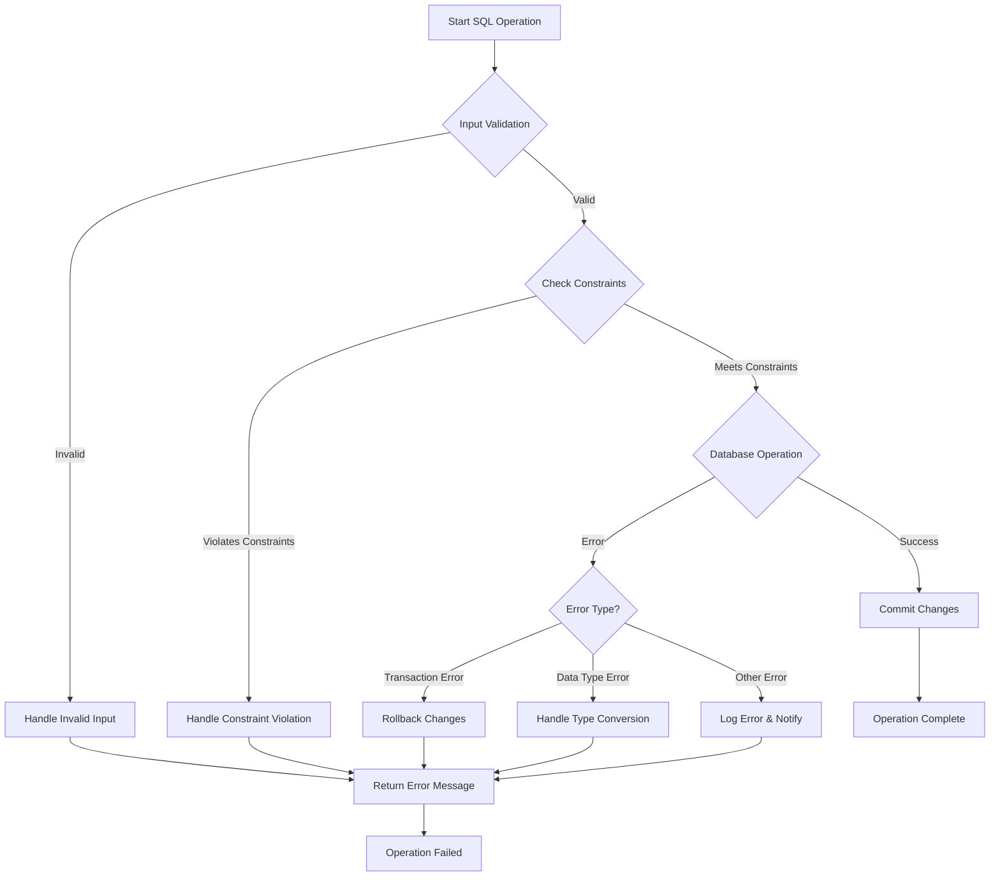

# SQL Error Prevention

## Introduction

SQL error prevention is a fundamental aspect of maintaining data integrity in database systems. When working with databases, errors can occur at various stages - from query syntax mistakes to logical errors in data manipulation. These errors not only disrupt application functionality but can potentially compromise data integrity, leading to inconsistent or corrupted data states.

This guide explores common SQL errors, their prevention techniques, and best practices to ensure your database operations remain error-free and maintain data integrity. By learning these preventive measures early in your SQL journey, you'll develop robust habits that will serve you throughout your database development career.

## Common SQL Errors and Prevention Techniques

### Syntax Errors

Syntax errors occur when SQL statements don't follow the proper grammar rules of SQL language.

#### Examples of Syntax Errors

```sql
-- Missing semicolon
SELECT * FROM customers

-- Incorrect keyword spelling
SLECT * FROM customers;

-- Unbalanced parentheses
SELECT * FROM customers WHERE (age > 18 AND city = 'New York';
```

#### Prevention Techniques

1. **Use SQL IDE with syntax highlighting**
   Modern SQL editors provide color-coding and auto-completion that make syntax errors immediately visible.

2. **Format queries consistently**
   Consistent indentation and line breaks make it easier to spot missing elements.

3. **Validate before execution**
   Many database tools offer query validation without running the query.

### Data Type Mismatch Errors

These errors occur when you try to store data of one type into a column of an incompatible type.

```sql
-- Example: Trying to insert a string into an integer column
INSERT INTO products (product_id, price) 
VALUES ('ABC', 29.99);  -- Error: product_id expects an integer
```

#### Prevention Techniques

1. **Use explicit casting when necessary**

```sql
-- Correct approach using casting
SELECT product_name, CAST(price AS VARCHAR(10)) AS price_label
FROM products;
```

2. **Always check column data types before inserting or updating data**

```sql
-- View table structure before operations
DESCRIBE products;
-- or
SHOW COLUMNS FROM products;
```

### NULL Handling Errors

Improper handling of NULL values can lead to unexpected results or errors.

```sql
-- Problematic: This will not find rows where email is NULL
SELECT * FROM customers WHERE email != 'example@test.com';
```

#### Prevention Techniques

1. **Always use IS NULL or IS NOT NULL for NULL comparisons**

```sql
-- Correct approach
SELECT * FROM customers 
WHERE email != 'example@test.com' OR email IS NULL;
```

2. **Use COALESCE for default values**

```sql
-- Returns 'Unknown' if email is NULL
SELECT customer_name, COALESCE(email, 'Unknown') AS contact_email
FROM customers;
```

### SQL Injection Vulnerabilities

SQL injection occurs when malicious SQL code is inserted into queries through user input.

```sql
-- Vulnerable query construction
const query = "SELECT * FROM users WHERE username = '" + username + "'";
```

#### Prevention Techniques

1. **Use parameterized queries or prepared statements**

```javascript
// JavaScript with prepared statement
const query = "SELECT * FROM users WHERE username = ?";
connection.query(query, [username], function(error, results) {
  // Handle results
});
```

```python
# Python with parameterized query
cursor.execute("SELECT * FROM users WHERE username = %s", (username,))
```

2. **Validate and sanitize all user inputs**

3. **Apply the principle of least privilege for database users**

### Constraint Violation Errors

These errors occur when database constraints like primary key, foreign key, or unique constraints are violated.

```sql
-- Error: Inserting duplicate primary key
INSERT INTO customers (customer_id, name) VALUES (101, 'John Doe');
-- If 101 already exists as a customer_id
```

#### Prevention Techniques

1. **Check for existence before insertion**

```sql
-- Check if record exists before insertion
SELECT COUNT(*) FROM customers WHERE customer_id = 101;
-- Only proceed with insert if count is 0
```

2. **Use INSERT IGNORE or ON DUPLICATE KEY UPDATE when appropriate**

```sql
-- MySQL example: Insert or update if exists
INSERT INTO customers (customer_id, name, last_updated)
VALUES (101, 'John Doe', NOW())
ON DUPLICATE KEY UPDATE name = 'John Doe', last_updated = NOW();
```

3. **Implement transactions for multi-table operations**

```sql
-- Start transaction for related operations
BEGIN TRANSACTION;

INSERT INTO orders (order_id, customer_id, order_date) 
VALUES (1001, 101, '2023-10-15');

INSERT INTO order_items (order_id, product_id, quantity) 
VALUES (1001, 5, 2);

-- If everything is successful
COMMIT;
-- If an error occurs
-- ROLLBACK;
```

## Defensive SQL Programming Techniques

### Error Handling with TRY-CATCH

Many SQL database systems provide try-catch mechanisms to handle errors gracefully.

```sql
-- SQL Server example
BEGIN TRY
    INSERT INTO customers (customer_id, name) VALUES (101, 'John Doe');
    PRINT 'Customer added successfully.';
END TRY
BEGIN CATCH
    PRINT 'An error occurred: ' + ERROR_MESSAGE();
END CATCH;
```

### Using Transactions for Atomic Operations

```sql
BEGIN TRANSACTION;

-- Check if product exists and has sufficient inventory
DECLARE @InStock INT;
SELECT @InStock = quantity FROM inventory WHERE product_id = 5;

IF @InStock >= 2
BEGIN
    -- Update inventory
    UPDATE inventory SET quantity = quantity - 2 WHERE product_id = 5;
    
    -- Create order
    INSERT INTO orders (customer_id, product_id, quantity, order_date)
    VALUES (101, 5, 2, GETDATE());
    
    COMMIT;
    PRINT 'Order placed successfully.';
END
ELSE
BEGIN
    ROLLBACK;
    PRINT 'Insufficient inventory.';
END
```

### Using Database Procedures and Functions

Encapsulating logic in stored procedures can prevent errors by centralizing data access logic.

```sql
-- Create stored procedure for adding a new customer
CREATE PROCEDURE add_customer
    @customer_id INT,
    @name VARCHAR(100),
    @email VARCHAR(100)
AS
BEGIN
    -- Check if customer already exists
    IF NOT EXISTS (SELECT 1 FROM customers WHERE customer_id = @customer_id)
    BEGIN
        INSERT INTO customers (customer_id, name, email)
        VALUES (@customer_id, @name, @email);
        RETURN 0; -- Success
    END
    ELSE
    BEGIN
        RETURN 1; -- Customer already exists
    END
END;

-- Usage
DECLARE @result INT;
EXEC @result = add_customer 101, 'John Doe', 'john@example.com';
IF @result = 0
    PRINT 'Customer added successfully.';
ELSE
    PRINT 'Customer already exists.';
```

## Testing and Validation Strategies

### Unit Testing SQL Queries

Creating tests for your SQL queries ensures they behave as expected under various conditions.

```sql
-- Test case: Customer insertion with validation
BEGIN TRANSACTION;

-- Test setup - clean test data
DELETE FROM test_customers WHERE customer_id BETWEEN 900 AND 999;

-- Test execution
INSERT INTO test_customers (customer_id, name, email)
VALUES (901, 'Test User', 'test@example.com');

-- Test verification
DECLARE @count INT;
SELECT @count = COUNT(*) FROM test_customers WHERE customer_id = 901;

IF @count = 1
    PRINT 'Test passed: Customer inserted successfully.';
ELSE
    PRINT 'Test failed: Customer not inserted.';

-- Cleanup
ROLLBACK;
```

### Database Schema Validation

Regularly validating your database schema helps prevent structural issues.

```sql
-- Check for columns that allow NULLs where they shouldn't
SELECT table_name, column_name
FROM information_schema.columns
WHERE is_nullable = 'YES'
AND table_name IN ('customers', 'orders', 'products')
AND column_name IN ('id', 'customer_id', 'product_id');

-- Check for missing indexes on frequently queried columns
SELECT table_name, column_name
FROM information_schema.columns
WHERE table_name = 'orders'
AND column_name = 'order_date'
AND NOT EXISTS (
    SELECT 1 FROM information_schema.statistics
    WHERE table_name = 'orders'
    AND column_name = 'order_date'
);
```

## Real-World Example: Building a Robust Order Processing System

Let's bring all these concepts together with a comprehensive example of a simple order processing system.

### Database Schema

```sql
-- Create tables with appropriate constraints
CREATE TABLE customers (
    customer_id INT PRIMARY KEY,
    name VARCHAR(100) NOT NULL,
    email VARCHAR(100) UNIQUE,
    created_at TIMESTAMP DEFAULT CURRENT_TIMESTAMP
);

CREATE TABLE products (
    product_id INT PRIMARY KEY,
    name VARCHAR(100) NOT NULL,
    price DECIMAL(10, 2) NOT NULL CHECK (price > 0),
    inventory_count INT NOT NULL DEFAULT 0 CHECK (inventory_count >= 0)
);

CREATE TABLE orders (
    order_id INT PRIMARY KEY,
    customer_id INT NOT NULL,
    order_date TIMESTAMP DEFAULT CURRENT_TIMESTAMP,
    status VARCHAR(20) DEFAULT 'pending',
    FOREIGN KEY (customer_id) REFERENCES customers(customer_id)
);

CREATE TABLE order_items (
    order_id INT,
    product_id INT,
    quantity INT NOT NULL CHECK (quantity > 0),
    price_at_order DECIMAL(10, 2) NOT NULL,
    PRIMARY KEY (order_id, product_id),
    FOREIGN KEY (order_id) REFERENCES orders(order_id),
    FOREIGN KEY (product_id) REFERENCES products(product_id)
);
```

### Order Processing Procedure

```sql
CREATE PROCEDURE create_order(
    IN p_customer_id INT,
    IN p_product_id INT,
    IN p_quantity INT,
    OUT p_order_id INT,
    OUT p_status VARCHAR(100)
)
BEGIN
    DECLARE v_price DECIMAL(10, 2);
    DECLARE v_inventory INT;
    DECLARE exit handler for SQLEXCEPTION
    BEGIN
        ROLLBACK;
        SET p_status = 'Error: ' || SQLERRM;
    END;

    -- Start transaction
    START TRANSACTION;

    -- Validate customer exists
    IF NOT EXISTS (SELECT 1 FROM customers WHERE customer_id = p_customer_id) THEN
        SET p_status = 'Error: Customer does not exist';
        ROLLBACK;
        RETURN;
    END IF;

    -- Get product info and validate
    SELECT price, inventory_count INTO v_price, v_inventory
    FROM products WHERE product_id = p_product_id;
    
    IF v_price IS NULL THEN
        SET p_status = 'Error: Product does not exist';
        ROLLBACK;
        RETURN;
    END IF;
    
    IF v_inventory < p_quantity THEN
        SET p_status = 'Error: Insufficient inventory';
        ROLLBACK;
        RETURN;
    END IF;

    -- Generate new order ID
    SELECT COALESCE(MAX(order_id), 0) + 1 INTO p_order_id FROM orders;
    
    -- Create order
    INSERT INTO orders (order_id, customer_id)
    VALUES (p_order_id, p_customer_id);
    
    -- Add order item
    INSERT INTO order_items (order_id, product_id, quantity, price_at_order)
    VALUES (p_order_id, p_product_id, p_quantity, v_price);
    
    -- Update inventory
    UPDATE products 
    SET inventory_count = inventory_count - p_quantity
    WHERE product_id = p_product_id;
    
    -- Commit transaction
    COMMIT;
    
    SET p_status = 'Success';
END;
```

### Usage Example

```sql
-- Prepare variables for the result
DECLARE @order_id INT;
DECLARE @status VARCHAR(100);

-- Call the procedure
CALL create_order(101, 5, 2, @order_id, @status);

-- Check result
SELECT @order_id AS new_order_id, @status AS order_status;
```

## Decision Flow for Error Prevention



## Summary

SQL error prevention is a critical skill for maintaining data integrity in your applications. By implementing the techniques covered in this guide, you can significantly reduce the risk of database errors and data corruption:

- Use proper syntax and formatting in your SQL queries
- Handle data type conversions carefully
- Address NULL values correctly
- Prevent SQL injection attacks with parameterized queries
- Respect and verify database constraints
- Implement transactions for related operations
- Create stored procedures for complex operations
- Test your SQL code thoroughly

Remember that prevention is always better than cure - the time spent implementing these practices will save countless hours of debugging and data recovery efforts.

## Exercises

1. **Error Identification**: Given the following SQL statements, identify any potential errors and fix them:
   ```sql
   SELECT product_name price FROM products WHERE category = electronics;
   INSERT INTO customers VALUES ('John Doe', john@example.com, 30);
   UPDATE employee SET salary = salary * 1.1 WHERE department = 'IT' AND hire_date > '2020-01-01;
   ```

2. **Transaction Exercise**: Write a transaction that transfers funds from one account to another, handling potential errors like insufficient funds.

3. **Constraint Planning**: Design a database schema for a library management system with appropriate constraints to prevent common errors.

4. **Stored Procedure Development**: Create a stored procedure that handles user registration with appropriate error checking and prevention.

## Additional Resources

- [SQL Style Guide](https://www.sqlstyle.guide/)
- [OWASP SQL Injection Prevention Cheat Sheet](https://cheatsheetseries.owasp.org/cheatsheets/SQL_Injection_Prevention_Cheat_Sheet.html)
- [PostgreSQL Documentation on Error Handling](https://www.postgresql.org/docs/current/plpgsql-control-structures.html#PLPGSQL-ERROR-TRAPPING)
- [MySQL Documentation on Transactions](https://dev.mysql.com/doc/refman/8.0/en/sql-transaction-statements.html)
- Book: "SQL Antipatterns: Avoiding the Pitfalls of Database Programming" by Bill Karwin