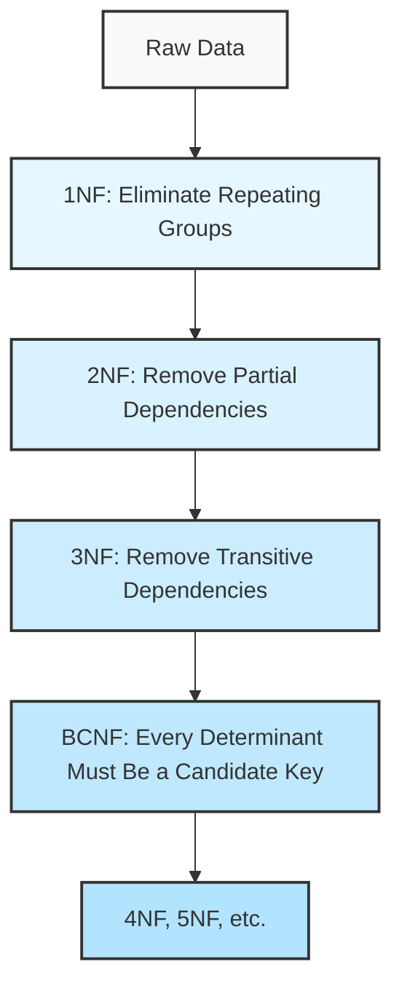
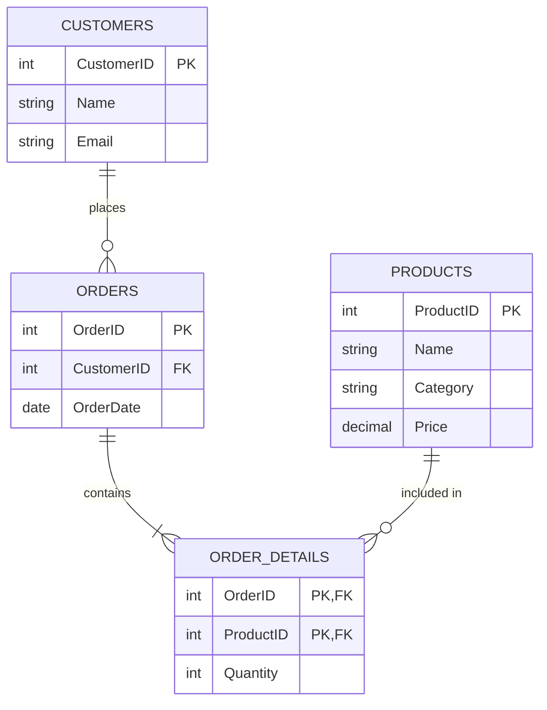

# SQL Normalization

## Introduction

Database normalization is a systematic approach to organizing data in a relational database. It's one of the most fundamental concepts in SQL database design that helps you create efficient, flexible, and maintainable databases while eliminating data redundancy and avoiding anomalies.

Imagine you're building a database for an online store. You might be tempted to keep all information (customers, products, orders) in one massive table. However, this approach quickly leads to problems as your application grows. Normalization provides a structured framework to divide your data into multiple related tables, each serving a specific purpose.

In this guide, we'll explore the different normalization forms (1NF through BCNF), understand why they matter, and see how to apply them in real-world scenarios.

## What is Normalization?

Normalization is the process of structuring a database to:

1. Reduce data redundancy (duplicate information)
2. Improve data integrity (accuracy and consistency)
3. Minimize modification anomalies (insertion, update, and deletion problems)
4. Simplify queries and maintenance

The normalization process follows a series of steps called "normal forms." Each normal form builds upon the previous one, adding more constraints and refining the structure.

## First Normal Form (1NF)

### Definition

A table is in First Normal Form (1NF) when:
- Each column contains atomic (indivisible) values
- Each column contains values of the same type
- Each row is unique (typically ensured by a primary key)
- There are no repeating groups or arrays

### The Problem with Non-1NF Data

Consider this non-normalized table for a bookstore:

```
BookOrders
---------------------------------
OrderID | Customer | Books
---------------------------------
1       | Alice    | "SQL Basics, Python Programming"
2       | Bob      | "C# in Depth"
3       | Charlie  | "Database Design, Web Development, JavaScript"
```

The problem? The "Books" column contains multiple values. This makes querying difficult. For example, how would you find all orders containing "Database Design"?

### Converting to 1NF

To convert to 1NF, we eliminate multi-valued attributes by creating separate rows:

```
BookOrders_1NF
---------------------------------
OrderID | Customer | Book
---------------------------------
1       | Alice    | SQL Basics
1       | Alice    | Python Programming
2       | Bob      | C# in Depth
3       | Charlie  | Database Design
3       | Charlie  | Web Development
3       | Charlie  | JavaScript
```

Now each cell contains a single, atomic value, making it 1NF compliant.

## Second Normal Form (2NF)

### Definition

A table is in Second Normal Form (2NF) when:
- It's already in 1NF
- All non-key attributes are fully functionally dependent on the entire primary key, not just part of it

This is particularly important for tables with composite primary keys.

### The Problem with 1NF-only Data

Let's expand our example with book prices:

```
BookOrders_1NF
---------------------------------------------------------
OrderID | Customer | Book             | Price
---------------------------------------------------------
1       | Alice    | SQL Basics       | 29.99
1       | Alice    | Python Programming | 34.99
2       | Bob      | C# in Depth      | 44.99
3       | Charlie  | Database Design  | 39.99
3       | Charlie  | Web Development  | 49.99
3       | Charlie  | JavaScript       | 24.99
```

Here, the composite primary key is (OrderID, Book). But notice that the book price depends only on the Book, not on the OrderID. This is a partial dependency and violates 2NF.

### Converting to 2NF

We split the table into two:

```
Orders
---------------------------------
OrderID | Customer
---------------------------------
1       | Alice
2       | Bob
3       | Charlie
```

```
OrderDetails
---------------------------------
OrderID | Book             | Price
---------------------------------
1       | SQL Basics       | 29.99
1       | Python Programming | 34.99
2       | C# in Depth      | 44.99
3       | Database Design  | 39.99
3       | Web Development  | 49.99
3       | JavaScript       | 24.99
```

But wait - Price still depends only on Book, not on OrderID. Let's create a third table:

```
Books
---------------------------------
Book             | Price
---------------------------------
SQL Basics       | 29.99
Python Programming | 34.99
C# in Depth      | 44.99
Database Design  | 39.99
Web Development  | 49.99
JavaScript       | 24.99
```

```
OrderDetails (Updated)
---------------------------------
OrderID | Book
---------------------------------
1       | SQL Basics
1       | Python Programming
2       | C# in Depth
3       | Database Design
3       | Web Development
3       | JavaScript
```

Now our database is in 2NF.

## Third Normal Form (3NF)

### Definition

A table is in Third Normal Form (3NF) when:
- It's already in 2NF
- All non-key attributes are non-transitively dependent on the primary key

In simpler terms, a non-key column should not depend on another non-key column.

### The Problem with 2NF-only Data

Let's expand our database by adding book authors:

```
Books
------------------------------------------
Book             | Price | Author
------------------------------------------
SQL Basics       | 29.99 | John Smith
Python Programming | 34.99 | Jane Doe
C# in Depth      | 44.99 | Tom Wilson
Database Design  | 39.99 | John Smith
Web Development  | 49.99 | Jane Doe
JavaScript       | 24.99 | Sarah Black
```

Here, Author depends on Book, which is the primary key. But imagine we want to add the author's contact information:

```
Books
-----------------------------------------------------------------------
Book             | Price | Author      | AuthorEmail
-----------------------------------------------------------------------
SQL Basics       | 29.99 | John Smith  | john@example.com
Python Programming | 34.99 | Jane Doe    | jane@example.com
C# in Depth      | 44.99 | Tom Wilson  | tom@example.com
Database Design  | 39.99 | John Smith  | john@example.com
Web Development  | 49.99 | Jane Doe    | jane@example.com
JavaScript       | 24.99 | Sarah Black | sarah@example.com
```

Notice that AuthorEmail depends on Author, not directly on Book (the primary key). This is a transitive dependency and violates 3NF.

### Converting to 3NF

We split into two tables again:

```
Books
------------------------------------------
Book             | Price | AuthorID
------------------------------------------
SQL Basics       | 29.99 | 1
Python Programming | 34.99 | 2
C# in Depth      | 44.99 | 3
Database Design  | 39.99 | 1
Web Development  | 49.99 | 2
JavaScript       | 24.99 | 4
```

```
Authors
------------------------------------------
AuthorID | Name        | Email
------------------------------------------
1        | John Smith  | john@example.com
2        | Jane Doe    | jane@example.com
3        | Tom Wilson  | tom@example.com
4        | Sarah Black | sarah@example.com
```

Now our database is in 3NF because all attributes depend directly on their table's primary key.

## Boyce-Codd Normal Form (BCNF)

### Definition

A table is in Boyce-Codd Normal Form (BCNF) when:
- It's already in 3NF
- For every functional dependency X → Y, X must be a superkey

BCNF is a stronger version of 3NF, addressing certain anomalies that 3NF doesn't fully resolve.

### The Problem with 3NF-only Data

Consider a scenario with courses, professors, and rooms:

```
CourseSchedule
-------------------------------------------------
CourseID | Professor   | Room  | Schedule
-------------------------------------------------
CS101    | Dr. Brown   | R101  | Mon 9-11 AM
CS102    | Dr. Wilson  | R102  | Tue 1-3 PM
CS103    | Dr. Brown   | R103  | Wed 2-4 PM
CS104    | Dr. Wilson  | R101  | Thu 10-12 AM
```

Let's assume:
1. Each course is taught by one professor
2. Each professor teaches in only one room
3. Multiple courses can be taught in the same room

Here, Room depends on Professor, not on CourseID (the primary key). This violates BCNF even though it's in 3NF.

### Converting to BCNF

We split into two tables:

```
ProfessorRooms
--------------------------
Professor   | Room
--------------------------
Dr. Brown   | R101
Dr. Wilson  | R102
```

```
CourseSchedule
-----------------------------------------
CourseID | Professor   | Schedule
-----------------------------------------
CS101    | Dr. Brown   | Mon 9-11 AM
CS102    | Dr. Wilson  | Tue 1-3 PM
CS103    | Dr. Brown   | Wed 2-4 PM
CS104    | Dr. Wilson  | Thu 10-12 AM
```

Now our database is in BCNF.

## Database Normalization Process Diagram

Here's a visual representation of the normalization process:



## When to Denormalize?

While normalization offers many benefits, it's not always the best approach for every scenario. Denormalization (intentionally introducing redundancy) might be appropriate when:

1. **Read Performance is Critical**: If your application primarily reads data rather than writes, denormalization can reduce the need for complex joins.

2. **Reporting and Analytics**: Data warehouses often use denormalized structures like star or snowflake schemas for faster analytical queries.

3. **Specific Query Patterns**: If certain queries are performed frequently, denormalizing to optimize for those specific patterns may be beneficial.

Example of denormalization:

```
# Normalized Tables
Customers
---------------------------------
CustomerID | Name  | City
---------------------------------
1          | Alice | New York
2          | Bob   | Chicago

Orders
---------------------------------
OrderID | CustomerID | Product | Amount
---------------------------------
101     | 1          | Laptop  | 1200
102     | 1          | Mouse   | 25
103     | 2          | Monitor | 350

# Denormalized Table
OrdersWithCustomerInfo
-------------------------------------------------
OrderID | CustomerID | Name  | City     | Product | Amount
-------------------------------------------------
101     | 1          | Alice | New York | Laptop  | 1200
102     | 1          | Alice | New York | Mouse   | 25
103     | 2          | Bob   | Chicago  | Monitor | 350
```

The denormalized table duplicates customer information but allows for faster queries that need both customer and order data.

## Practical Example: Building an E-commerce Database

Let's see how normalization applies to a practical e-commerce system.

### Initial Unnormalized Design

We start with a single table that captures everything:

```
StoreData
----------------------------------------------------------------------------------
OrderID | Customer | Email         | Product       | Category | Price | Quantity
----------------------------------------------------------------------------------
1       | Alice    | a@example.com | iPhone        | Electronics | 999  | 1
1       | Alice    | a@example.com | Phone Case    | Accessories | 29   | 1
2       | Bob      | b@example.com | Laptop        | Electronics | 1299 | 1
2       | Bob      | b@example.com | Laptop Sleeve | Accessories | 49   | 1
2       | Bob      | b@example.com | Mouse         | Electronics | 59   | 2
```

### Step 1: Apply 1NF

Our table is already in 1NF because it has no multi-valued attributes.

### Step 2: Apply 2NF

We identify the primary key as (OrderID, Product) and note that Customer and Email depend only on OrderID, not the entire primary key:

```
Customers
---------------------------------
CustomerID | Name  | Email
---------------------------------
1          | Alice | a@example.com
2          | Bob   | b@example.com

Orders
---------------------------------
OrderID | CustomerID
---------------------------------
1       | 1
2       | 2

OrderDetails
-----------------------------------------
OrderID | Product       | Price | Quantity
-----------------------------------------
1       | iPhone        | 999   | 1
1       | Phone Case    | 29    | 1
2       | Laptop        | 1299  | 1
2       | Laptop Sleeve | 49    | 1
2       | Mouse         | 59    | 2
```

### Step 3: Apply 3NF

We notice that Price depends on Product, not on OrderID:

```
Products
-----------------------------------------
ProductID | Name          | Category     | Price
-----------------------------------------
1         | iPhone        | Electronics  | 999
2         | Phone Case    | Accessories  | 29
3         | Laptop        | Electronics  | 1299
4         | Laptop Sleeve | Accessories  | 49
5         | Mouse         | Electronics  | 59

OrderDetails (Updated)
-----------------------------------------
OrderID | ProductID | Quantity
-----------------------------------------
1       | 1         | 1
1       | 2         | 1
2       | 3         | 1
2       | 4         | 1
2       | 5         | 2
```

### Final Schema

Our normalized e-commerce database now has:



This normalized design reduces redundancy, improves data integrity, and makes the database more maintainable.

## Common Normalization Pitfalls

### 1. Over-normalization

While normalization is beneficial, taking it too far (beyond BCNF to 4NF, 5NF, etc.) often yields diminishing returns while increasing query complexity.

### 2. Ignoring Performance Requirements

Normalization may lead to more joins, which can impact query performance. Always balance theoretical purity with practical performance needs.

### 3. Rigid Adherence

Normalization rules are guidelines, not strict mandates. Sometimes, controlled denormalization is the right choice.

## Summary

Database normalization is a critical skill for designing efficient, maintainable SQL databases. By systematically applying the normal forms:

- **1NF**: Eliminate repeating groups, ensure atomic values
- **2NF**: Remove partial dependencies
- **3NF**: Remove transitive dependencies
- **BCNF**: Ensure every determinant is a candidate key

You create databases that minimize redundancy, avoid anomalies, and provide a solid foundation for your applications. While perfect normalization isn't always the goal, understanding these principles helps you make informed design decisions.

## Exercises

1. Identify the normalization form of the following table:
   ```
   Students(StudentID, Name, Course1, Course2, Course3)
   ```

2. Convert the following table to 3NF:
   ```
   Employees(EmployeeID, Name, Department, DepartmentHead, Project, ProjectBudget)
   ```
   Given that:
   - Each employee belongs to one department
   - Each department has one department head
   - Employees can work on multiple projects
   - Each project has one budget

3. Design a normalized database schema for a library system tracking:
   - Books (ISBN, title, publication year, publisher)
   - Authors (multiple authors per book)
   - Members (ID, name, address)
   - Loans (who borrowed what and when)

## Additional Resources

- [Database Design and Relational Theory](https://www.oreilly.com/library/view/database-design-and/9781449330187/) by C.J. Date
- [SQL Antipatterns](https://pragprog.com/book/bksqla/sql-antipatterns) by Bill Karwin
- [Visual explanation of database normalization](https://www.essentialsql.com/get-ready-to-learn-sql-database-normalization-explained-in-simple-english/)
- [PostgreSQL Documentation: Table Partitioning](https://www.postgresql.org/docs/current/ddl-partitioning.html) (for when you need to scale beyond normalization)
- [SQL Fiddle](http://sqlfiddle.com/) - Test your normalized designs