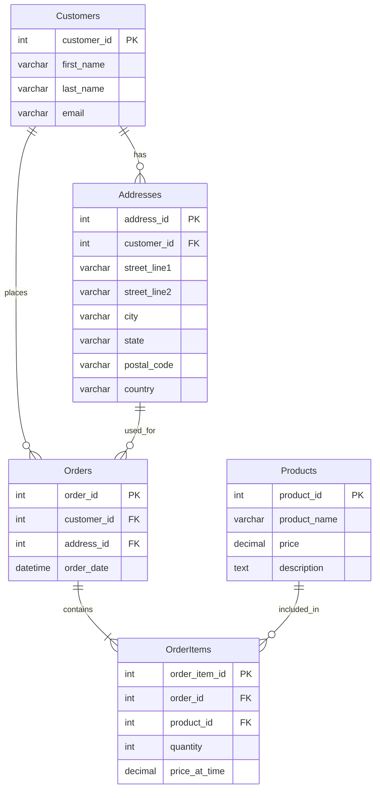

# SQL First Normal Form

## Introduction

Database normalization is a crucial process in relational database design that helps organize data efficiently, eliminate redundancy, and reduce the potential for anomalies when modifying data. The **First Normal Form (1NF)** is the initial step in the normalization process and serves as the foundation for all higher normal forms.

In this article, we'll explore what First Normal Form is, why it's important, how to implement it, and examine practical examples to help you understand its real-world applications.

## What is First Normal Form?

First Normal Form (1NF) is a database normalization rule that establishes the basic requirements for an organized database table. A table is said to be in First Normal Form if it satisfies the following conditions:

1. **Each column contains atomic (indivisible) values**
2. **Each column contains values of the same type**
3. **Each row is unique** (often implemented using a primary key)
4. **The order of rows and columns doesn't matter**

Let's break down each of these requirements to understand them better.

## First Normal Form Requirements

### 1. Atomic Values

The most fundamental requirement of 1NF is that each cell in the table must contain only a single value—not a list, set, or nested table. This is called "atomicity."

For example, if you're storing phone numbers for contacts, each phone number should have its own row or column. Storing multiple phone numbers in a single cell (like "555-1234, 555-5678") violates 1NF.

### 2. Values of the Same Type

Each column must contain data of the same type. For instance, a column named "phone_number" should only contain phone numbers, not a mix of phone numbers and email addresses.

### 3. Unique Rows

Each row must be uniquely identifiable, typically by using a primary key. This ensures that no two rows contain identical data across all columns.

### 4. Order Independence

The order of rows and columns should not affect the meaning or operation of the data. The database should work the same way regardless of how rows and columns are physically arranged.

## Identifying Violations of First Normal Form

Let's look at an example of a table that violates 1NF and then see how to fix it:

### Example: Student Course Enrollment (Violating 1NF)

| student_id | student_name | courses_enrolled |
|------------|--------------|------------------|
| 1 | John Smith | Math, Physics, Chemistry |
| 2 | Sarah Johnson | Biology, Chemistry |
| 3 | Michael Brown | Physics, Computer Science, Math |

This table violates 1NF because the `courses_enrolled` column contains multiple values (non-atomic values).

## Converting to First Normal Form

To convert this table to 1NF, we need to ensure each cell contains only atomic values. Let's fix it:

### Solution 1: Create Separate Columns

One approach is to create separate columns for each possible course:

| student_id | student_name | math | physics | chemistry | biology | computer_science |
|------------|--------------|------|---------|-----------|---------|------------------|
| 1 | John Smith | Yes | Yes | Yes | No | No |
| 2 | Sarah Johnson | No | No | Yes | Yes | No |
| 3 | Michael Brown | Yes | Yes | No | No | Yes |

This solution works only if we know the maximum number of courses a student can take, but it's not very scalable and creates many null values.

### Solution 2: Create a Separate Table (Preferred)

A better approach is to create a separate table for course enrollments:

**Students Table:**

| student_id | student_name |
|------------|--------------|
| 1 | John Smith |
| 2 | Sarah Johnson |
| 3 | Michael Brown |

**Enrollments Table:**

| enrollment_id | student_id | course_name |
|---------------|------------|-------------|
| 1 | 1 | Math |
| 2 | 1 | Physics |
| 3 | 1 | Chemistry |
| 4 | 2 | Biology |
| 5 | 2 | Chemistry |
| 6 | 3 | Physics |
| 7 | 3 | Computer Science |
| 8 | 3 | Math |

Now each table is in 1NF because:
- Each cell contains a single, atomic value
- Each column contains values of the same type
- Each row is unique (using the primary keys `student_id` and `enrollment_id`)
- The order of rows and columns doesn't matter

## Implementing 1NF in SQL

Let's see how to implement the above example in SQL:

```sql
-- Create the Students table
CREATE TABLE Students (
    student_id INT PRIMARY KEY,
    student_name VARCHAR(100) NOT NULL
);

-- Create the Enrollments table with a foreign key reference
CREATE TABLE Enrollments (
    enrollment_id INT PRIMARY KEY,
    student_id INT NOT NULL,
    course_name VARCHAR(50) NOT NULL,
    FOREIGN KEY (student_id) REFERENCES Students(student_id)
);

-- Insert data into Students table
INSERT INTO Students (student_id, student_name) VALUES
(1, 'John Smith'),
(2, 'Sarah Johnson'),
(3, 'Michael Brown');

-- Insert data into Enrollments table
INSERT INTO Enrollments (enrollment_id, student_id, course_name) VALUES
(1, 1, 'Math'),
(2, 1, 'Physics'),
(3, 1, 'Chemistry'),
(4, 2, 'Biology'),
(5, 2, 'Chemistry'),
(6, 3, 'Physics'),
(7, 3, 'Computer Science'),
(8, 3, 'Math');
```

Now we can query the data to find, for example, all courses a student is enrolled in:

```sql
SELECT s.student_name, e.course_name
FROM Students s
JOIN Enrollments e ON s.student_id = e.student_id
WHERE s.student_id = 1;
```

**Output:**
```
student_name | course_name
-------------|------------
John Smith   | Math
John Smith   | Physics
John Smith   | Chemistry
```

## Real-World Applications

Let's look at some real-world scenarios where applying 1NF is essential:

### Example: E-commerce Order System

Consider an e-commerce database that needs to store customer orders. A poorly designed table might look like this:

| order_id | customer_name | products_ordered | shipping_address |
|----------|--------------|------------------|-------------------|
| 1001 | Maria Garcia | Laptop, Headphones, Mouse | 123 Main St, Apt 4B, New York, NY 10001 |
| 1002 | Alex Kim | Smartphone, Case | 456 Pine Ave, Seattle, WA 98101 |

This table violates 1NF in multiple ways:
- The `products_ordered` column contains multiple values
- The `shipping_address` column contains composite data that should be broken down

Here's how we can normalize it:

**Customers Table:**
```sql
CREATE TABLE Customers (
    customer_id INT PRIMARY KEY,
    first_name VARCHAR(50) NOT NULL,
    last_name VARCHAR(50) NOT NULL,
    email VARCHAR(100) UNIQUE NOT NULL
);
```

**Addresses Table:**
```sql
CREATE TABLE Addresses (
    address_id INT PRIMARY KEY,
    customer_id INT NOT NULL,
    street_line1 VARCHAR(100) NOT NULL,
    street_line2 VARCHAR(100),
    city VARCHAR(50) NOT NULL,
    state VARCHAR(50) NOT NULL,
    postal_code VARCHAR(20) NOT NULL,
    country VARCHAR(50) NOT NULL DEFAULT 'USA',
    FOREIGN KEY (customer_id) REFERENCES Customers(customer_id)
);
```

**Orders Table:**
```sql
CREATE TABLE Orders (
    order_id INT PRIMARY KEY,
    customer_id INT NOT NULL,
    address_id INT NOT NULL,
    order_date DATETIME NOT NULL DEFAULT CURRENT_TIMESTAMP,
    FOREIGN KEY (customer_id) REFERENCES Customers(customer_id),
    FOREIGN KEY (address_id) REFERENCES Addresses(address_id)
);
```

**Products Table:**
```sql
CREATE TABLE Products (
    product_id INT PRIMARY KEY,
    product_name VARCHAR(100) NOT NULL,
    price DECIMAL(10,2) NOT NULL,
    description TEXT
);
```

**OrderItems Table:**
```sql
CREATE TABLE OrderItems (
    order_item_id INT PRIMARY KEY,
    order_id INT NOT NULL,
    product_id INT NOT NULL,
    quantity INT NOT NULL DEFAULT 1,
    price_at_time DECIMAL(10,2) NOT NULL,
    FOREIGN KEY (order_id) REFERENCES Orders(order_id),
    FOREIGN KEY (product_id) REFERENCES Products(product_id)
);
```

With this design, each table is in 1NF, and we've also prepared the database for further normalization (2NF and 3NF).

### Visualizing the Relationship

Here's a diagram showing the relationships between these tables:



## Benefits of First Normal Form

Implementing 1NF provides several advantages:

1. **Eliminates redundant data**: By ensuring each piece of data is stored in only one place, we reduce storage requirements.

2. **Simplifies queries**: With atomic values, it's easier to filter, sort, and retrieve specific data.

3. **Improves data integrity**: Prevents inconsistencies that might arise from having the same data stored in multiple places.

4. **Facilitates future normalization**: 1NF is a prerequisite for achieving higher normal forms (2NF, 3NF, etc.).

5. **Makes maintenance easier**: When data needs to be updated, you only need to change it in one place.

## Common 1NF Mistakes to Avoid

1. **Storing comma-separated values**: Never store multiple values in a single field separated by commas or other delimiters.

2. **Using array data types inappropriately**: While some database systems support array types, using them often leads to designs that conceptually violate 1NF principles.

3. **Creating "miscellaneous" fields**: Avoid creating fields like "notes" or "additional_info" that mix different types of data.

4. **Repeating column patterns**: Don't create columns like "phone1", "phone2", "phone3". Instead, create a separate related table.

## Summary

First Normal Form (1NF) is the foundation of good relational database design. By ensuring that:

- All column values are atomic (indivisible)
- Each column contains values of the same type
- Each row is unique
- The order of rows and columns doesn't matter

You set the stage for a well-designed, efficient database that can grow with your application's needs.

Remember that 1NF is just the first step in normalization. After achieving 1NF, you can proceed to Second Normal Form (2NF) and Third Normal Form (3NF) to further optimize your database structure.

## Exercises

To reinforce your understanding of 1NF, try these exercises:

1. Identify 1NF violations in the following table and normalize it:
   ```
   | employee_id | employee_name | skills            | projects      |
   |-------------|---------------|-------------------|---------------|
   | 101         | Jane Doe      | SQL, Python, Java | Alpha, Beta   |
   | 102         | John Smith    | C++, JavaScript   | Alpha, Gamma  |
   ```

2. Design a 1NF-compliant database to store information about books, authors, and publishers.

3. Convert this non-1NF student course grade table to 1NF:
   ```
   | student_id | courses_and_grades                      |
   |------------|----------------------------------------|
   | 1          | Math:A, Physics:B+, Chemistry:A-        |
   | 2          | Biology:B, Chemistry:C, English:A       |
   ```

## Additional Resources

- [Database Normalization Explained](https://www.essentialsql.com/get-ready-to-learn-sql-database-normalization-explained-in-simple-english/)
- [SQL for Data Analysis](https://www.udacity.com/course/sql-for-data-analysis--ud198)
- [W3Schools SQL Tutorial](https://www.w3schools.com/sql/)
- [SQLZoo Interactive SQL Tutorial](https://sqlzoo.net/)