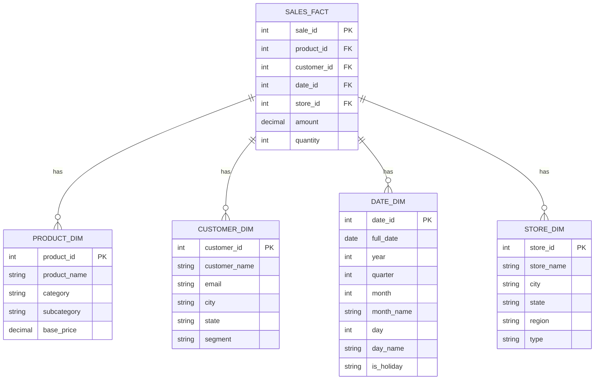
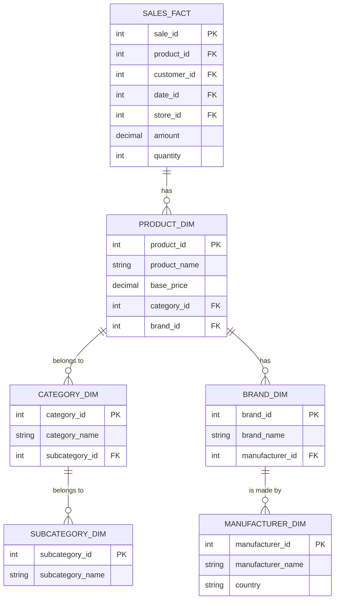

# SQL Dimensional Modeling

## Introduction

Dimensional modeling is a database design technique optimized for data warehousing and business intelligence applications. Unlike traditional entity-relationship modeling (used for transactional databases), dimensional modeling prioritizes query performance and ease of understanding for business users analyzing large volumes of data.

In this guide, we'll explore how to design analytical databases using dimensional modeling concepts in SQL, creating structures that make complex queries simple and efficient.

## What is Dimensional Modeling?

Dimensional modeling organizes data into two types of tables:

1. **Fact tables** - contain business measurements, metrics, or "facts" about business processes
2. **Dimension tables** - contain descriptive attributes that provide context for the facts

This approach creates intuitive database schemas that mirror how business users naturally think about their data, while also providing excellent query performance for analytical workloads.

## The Star Schema

The most common dimensional model is the **star schema**, where a central fact table connects to multiple dimension tables, forming a star-like pattern.



### Fact Tables

Fact tables record business events or transactions with:

- **Foreign keys** linking to dimension tables
- **Numerical measurements** or metrics (facts)

Characteristics of fact tables:
- Often contain many rows (millions to billions)
- Should be as narrow as possible (few columns)
- Typically focus on one business process (sales, orders, etc.)
- Usually contain low-cardinality keys and high-cardinality facts

Let's create an example fact table for retail sales:

```sql
-- Creating a fact table for sales
CREATE TABLE sales_fact (
    sale_id INT PRIMARY KEY,
    date_id INT,
    product_id INT,
    store_id INT,
    customer_id INT,
    quantity INT NOT NULL,
    amount DECIMAL(10,2) NOT NULL,
    discount DECIMAL(10,2) NOT NULL,
    FOREIGN KEY (date_id) REFERENCES date_dim(date_id),
    FOREIGN KEY (product_id) REFERENCES product_dim(product_id),
    FOREIGN KEY (store_id) REFERENCES store_dim(store_id),
    FOREIGN KEY (customer_id) REFERENCES customer_dim(customer_id)
);
```

### Dimension Tables

Dimension tables provide the context for fact measurements and contain:

- **Descriptive attributes** about business entities
- **Hierarchical relationships** between attributes
- A **primary key** that serves as a foreign key in fact tables

Characteristics of dimension tables:
- Contain fewer rows than fact tables but more columns
- Store descriptive, textual attributes
- Often contain hierarchies (e.g., product category > subcategory > product)
- Should be denormalized for query simplicity

Let's create a few example dimension tables:

```sql
-- Creating a product dimension table
CREATE TABLE product_dim (
    product_id INT PRIMARY KEY,
    product_name VARCHAR(100) NOT NULL,
    brand VARCHAR(50) NOT NULL,
    category VARCHAR(50) NOT NULL,
    subcategory VARCHAR(50) NOT NULL,
    base_price DECIMAL(10,2) NOT NULL,
    size VARCHAR(20),
    color VARCHAR(20),
    description TEXT
);

-- Creating a date dimension table
CREATE TABLE date_dim (
    date_id INT PRIMARY KEY,
    full_date DATE NOT NULL,
    day INT NOT NULL,
    day_name VARCHAR(10) NOT NULL,
    month INT NOT NULL,
    month_name VARCHAR(10) NOT NULL,
    quarter INT NOT NULL,
    year INT NOT NULL,
    is_weekend BOOLEAN NOT NULL,
    is_holiday BOOLEAN NOT NULL,
    season VARCHAR(10) NOT NULL
);
```

## The Snowflake Schema

The **snowflake schema** is a variation of the star schema where dimension tables are normalized into multiple related tables, creating a snowflake-like pattern.



While more normalized, the snowflake schema requires more joins, which can impact query performance. It's useful when dimension tables are very large or when certain dimension hierarchies need to be queried independently.

Example of snowflake schema SQL:

```sql
-- Creating a normalized product dimension hierarchy
CREATE TABLE subcategory_dim (
    subcategory_id INT PRIMARY KEY,
    subcategory_name VARCHAR(50) NOT NULL
);

CREATE TABLE category_dim (
    category_id INT PRIMARY KEY,
    category_name VARCHAR(50) NOT NULL,
    subcategory_id INT,
    FOREIGN KEY (subcategory_id) REFERENCES subcategory_dim(subcategory_id)
);

CREATE TABLE product_dim (
    product_id INT PRIMARY KEY,
    product_name VARCHAR(100) NOT NULL,
    category_id INT,
    base_price DECIMAL(10,2) NOT NULL,
    FOREIGN KEY (category_id) REFERENCES category_dim(category_id)
);
```

## Designing Fact Tables

There are three main types of fact tables:

### 1. Transaction Fact Tables

Record data at the transaction level (most detailed).

```sql
-- Transaction fact table example
CREATE TABLE sale_transaction_fact (
    transaction_id INT PRIMARY KEY,
    date_id INT,
    product_id INT,
    customer_id INT,
    store_id INT,
    quantity INT,
    unit_price DECIMAL(10,2),
    discount_amount DECIMAL(10,2),
    net_amount DECIMAL(10,2),
    tax_amount DECIMAL(10,2),
    total_amount DECIMAL(10,2),
    FOREIGN KEY (date_id) REFERENCES date_dim(date_id),
    FOREIGN KEY (product_id) REFERENCES product_dim(product_id),
    FOREIGN KEY (customer_id) REFERENCES customer_dim(customer_id),
    FOREIGN KEY (store_id) REFERENCES store_dim(store_id)
);
```

### 2. Periodic Snapshot Fact Tables

Record regular snapshots of data at specified time intervals.

```sql
-- Periodic snapshot fact table example (monthly inventory levels)
CREATE TABLE inventory_monthly_fact (
    inventory_snapshot_id INT PRIMARY KEY,
    date_id INT, -- represents month-end date
    product_id INT,
    store_id INT,
    beginning_quantity INT,
    received_quantity INT,
    sold_quantity INT,
    adjustment_quantity INT,
    ending_quantity INT,
    stock_value DECIMAL(10,2),
    FOREIGN KEY (date_id) REFERENCES date_dim(date_id),
    FOREIGN KEY (product_id) REFERENCES product_dim(product_id),
    FOREIGN KEY (store_id) REFERENCES store_dim(store_id)
);
```

### 3. Accumulating Snapshot Fact Tables

Track the complete lifecycle of a business process with multiple date columns for each milestone.

```sql
-- Accumulating snapshot fact table example (order processing)
CREATE TABLE order_processing_fact (
    order_id INT PRIMARY KEY,
    customer_id INT,
    product_id INT,
    order_date_id INT,
    approved_date_id INT,
    shipped_date_id INT,
    delivered_date_id INT,
    returned_date_id INT,
    quantity INT,
    amount DECIMAL(10,2),
    shipping_cost DECIMAL(10,2),
    total_amount DECIMAL(10,2),
    current_status VARCHAR(20),
    FOREIGN KEY (customer_id) REFERENCES customer_dim(customer_id),
    FOREIGN KEY (product_id) REFERENCES product_dim(product_id),
    FOREIGN KEY (order_date_id) REFERENCES date_dim(date_id),
    FOREIGN KEY (approved_date_id) REFERENCES date_dim(date_id),
    FOREIGN KEY (shipped_date_id) REFERENCES date_dim(date_id),
    FOREIGN KEY (delivered_date_id) REFERENCES date_dim(date_id),
    FOREIGN KEY (returned_date_id) REFERENCES date_dim(date_id)
);
```

## Designing Dimension Tables

### Slowly Changing Dimensions (SCDs)

Dimensions can change over time, and there are different strategies to handle these changes:

#### Type 1 SCD: Overwrite

Simply update the attribute value, losing the historical value.

```sql
-- Type 1 SCD: Just update the record
UPDATE customer_dim
SET city = 'New York', state = 'NY'
WHERE customer_id = 123;
```

#### Type 2 SCD: Add New Row

Keep full history by adding a new row with:
- Same business key
- New surrogate key
- Effective date range
- Current flag indicator

```sql
-- Type 2 SCD: Creating a customer dimension with history tracking
CREATE TABLE customer_dim (
    customer_sk INT PRIMARY KEY, -- surrogate key
    customer_id INT NOT NULL,    -- business key (not unique in this table)
    customer_name VARCHAR(100) NOT NULL,
    email VARCHAR(100),
    address VARCHAR(200),
    city VARCHAR(50),
    state VARCHAR(2),
    postal_code VARCHAR(10),
    effective_date DATE NOT NULL,
    expiry_date DATE,
    is_current BOOLEAN NOT NULL,
    UNIQUE (customer_id, effective_date)
);

-- Insert a new version when customer address changes
INSERT INTO customer_dim (
    customer_sk, customer_id, customer_name, email, address, city, state, postal_code, 
    effective_date, expiry_date, is_current
)
SELECT 
    (SELECT MAX(customer_sk) FROM customer_dim) + 1,
    customer_id, customer_name, email, 'New Address', 'New York', 'NY', '10001',
    CURRENT_DATE, NULL, TRUE
FROM 
    customer_dim
WHERE 
    customer_id = 123 AND is_current = TRUE;

-- Update previous record to no longer be current
UPDATE customer_dim
SET expiry_date = CURRENT_DATE - INTERVAL '1 day', is_current = FALSE
WHERE customer_id = 123 AND is_current = FALSE;
```

#### Type 3 SCD: Add New Attribute

Keep limited history by adding new columns for previous values.

```sql
-- Type 3 SCD: Adding columns for previous values
CREATE TABLE customer_dim (
    customer_id INT PRIMARY KEY,
    customer_name VARCHAR(100) NOT NULL,
    current_address VARCHAR(200),
    previous_address VARCHAR(200),
    address_change_date DATE,
    current_city VARCHAR(50),
    previous_city VARCHAR(50),
    city_change_date DATE,
    -- other attributes
);

-- Update with type 3 SCD
UPDATE customer_dim
SET 
    previous_address = current_address,
    current_address = 'New Address',
    address_change_date = CURRENT_DATE,
    previous_city = current_city,
    current_city = 'New York',
    city_change_date = CURRENT_DATE
WHERE customer_id = 123;
```

### Dimension Hierarchies

Dimensional models often include hierarchies like:
- Geography: Country > State > City > Postal Code
- Product: Category > Subcategory > Product
- Time: Year > Quarter > Month > Day

These can be represented in a single dimension table (star schema) or normalized across multiple tables (snowflake schema).

## Querying Dimensional Models

The beauty of dimensional models is how they simplify complex analytical queries.

### Example Queries

Let's look at some analytical queries using our dimensional model:

#### Sales by Product Category and Month

```sql
SELECT 
    c.category_name,
    d.month_name,
    d.year,
    SUM(f.quantity) as total_quantity,
    SUM(f.amount) as total_sales
FROM 
    sales_fact f
JOIN 
    product_dim p ON f.product_id = p.product_id
JOIN 
    category_dim c ON p.category_id = c.category_id
JOIN 
    date_dim d ON f.date_id = d.date_id
GROUP BY 
    c.category_name, d.month_name, d.year
ORDER BY 
    d.year, d.month, c.category_name;
```

#### Customer Purchasing Patterns

```sql
SELECT 
    cd.segment as customer_segment,
    pd.category as product_category,
    COUNT(DISTINCT f.customer_id) as customer_count,
    SUM(f.amount) as total_sales,
    SUM(f.amount) / COUNT(DISTINCT f.customer_id) as avg_sales_per_customer
FROM 
    sales_fact f
JOIN 
    customer_dim cd ON f.customer_id = cd.customer_id
JOIN 
    product_dim pd ON f.product_id = pd.product_id
JOIN 
    date_dim dd ON f.date_id = dd.date_id
WHERE 
    dd.year = 2023
GROUP BY 
    cd.segment, pd.category
ORDER BY 
    cd.segment, avg_sales_per_customer DESC;
```

## Best Practices for Dimensional Modeling

1. **Choose appropriate grain** - Define the level of detail in your fact table carefully
2. **Denormalize dimensions** - Use star schema for better query performance
3. **Use surrogate keys** - For all dimension tables to handle changes over time
4. **Create conformed dimensions** - Shared dimensions that work across multiple fact tables
5. **Add date dimensions** - Always include comprehensive date/time dimensions
6. **Consider aggregates** - Pre-aggregate commonly queried metrics for performance
7. **Document business rules** - Clearly define KPIs and calculation methods
8. **Plan for changes** - Implement appropriate SCD types based on business needs

## Practical Implementation Example

Let's put everything together with a practical example for an e-commerce analytics database:

```sql
-- Create dimension tables
CREATE TABLE date_dim (
    date_id INT PRIMARY KEY,
    full_date DATE NOT NULL,
    day INT NOT NULL,
    day_name VARCHAR(10) NOT NULL,
    month INT NOT NULL,
    month_name VARCHAR(10) NOT NULL,
    quarter INT NOT NULL,
    year INT NOT NULL,
    is_weekend BOOLEAN NOT NULL,
    is_holiday BOOLEAN NOT NULL
);

CREATE TABLE product_dim (
    product_id INT PRIMARY KEY,
    product_name VARCHAR(100) NOT NULL,
    product_description TEXT,
    category VARCHAR(50) NOT NULL,
    subcategory VARCHAR(50) NOT NULL,
    brand VARCHAR(50) NOT NULL,
    base_price DECIMAL(10,2) NOT NULL,
    current_price DECIMAL(10,2) NOT NULL,
    size VARCHAR(20),
    color VARCHAR(20),
    is_active BOOLEAN NOT NULL DEFAULT TRUE,
    created_date DATE NOT NULL,
    modified_date DATE
);

CREATE TABLE customer_dim (
    customer_id INT PRIMARY KEY,
    customer_name VARCHAR(100) NOT NULL,
    email VARCHAR(100),
    phone VARCHAR(20),
    address VARCHAR(200),
    city VARCHAR(50),
    state VARCHAR(2),
    postal_code VARCHAR(10),
    country VARCHAR(50),
    customer_since DATE NOT NULL,
    segment VARCHAR(20),
    total_orders INT DEFAULT 0,
    total_spend DECIMAL(12,2) DEFAULT 0.00
);

CREATE TABLE promotion_dim (
    promotion_id INT PRIMARY KEY,
    promotion_name VARCHAR(100) NOT NULL,
    promotion_type VARCHAR(50) NOT NULL,
    discount_type VARCHAR(20) NOT NULL,
    discount_value DECIMAL(10,2) NOT NULL,
    start_date DATE NOT NULL,
    end_date DATE NOT NULL,
    is_active BOOLEAN NOT NULL
);

-- Create fact tables
CREATE TABLE sales_fact (
    sale_id INT PRIMARY KEY,
    order_id INT NOT NULL,
    date_id INT NOT NULL,
    product_id INT NOT NULL,
    customer_id INT NOT NULL,
    promotion_id INT,
    quantity INT NOT NULL,
    unit_price DECIMAL(10,2) NOT NULL,
    discount_amount DECIMAL(10,2) NOT NULL DEFAULT 0.00,
    shipping_amount DECIMAL(10,2) NOT NULL DEFAULT 0.00,
    tax_amount DECIMAL(10,2) NOT NULL DEFAULT 0.00,
    total_amount DECIMAL(10,2) NOT NULL,
    FOREIGN KEY (date_id) REFERENCES date_dim(date_id),
    FOREIGN KEY (product_id) REFERENCES product_dim(product_id),
    FOREIGN KEY (customer_id) REFERENCES customer_dim(customer_id),
    FOREIGN KEY (promotion_id) REFERENCES promotion_dim(promotion_id)
);

CREATE TABLE customer_activity_fact (
    activity_id INT PRIMARY KEY,
    customer_id INT NOT NULL,
    date_id INT NOT NULL,
    login_count INT DEFAULT 0,
    page_views INT DEFAULT 0,
    wishlist_adds INT DEFAULT 0,
    cart_adds INT DEFAULT 0,
    cart_removes INT DEFAULT 0,
    purchases INT DEFAULT 0,
    FOREIGN KEY (customer_id) REFERENCES customer_dim(customer_id),
    FOREIGN KEY (date_id) REFERENCES date_dim(date_id)
);
```

With this schema, we can easily answer business questions like:

- Which product categories have the highest profit margins?
- How do promotions impact sales across different customer segments?
- What's the customer lifetime value (CLV) for different customer segments?
- What are the seasonal trends in product category performance?

## Summary

Dimensional modeling is a powerful database design technique for analytical systems that:

- Organizes data into intuitive fact and dimension tables
- Optimizes query performance for complex analytical questions
- Makes data structures more understandable to business users
- Provides flexibility for reporting and analysis

By following dimensional modeling principles, you can design SQL databases that effectively support data warehousing, business intelligence, and analytical applications. This approach bridges the gap between raw data and actionable business insights, enabling more efficient decision-making.

## Additional Resources

- **Books**:
  - "The Data Warehouse Toolkit" by Ralph Kimball
  - "Star Schema: The Complete Reference" by Christopher Adamson

- **Online Resources**:
  - [Kimball Group](https://www.kimballgroup.com/data-warehouse-business-intelligence-resources/kimball-techniques/)
  - [Dimensional Modeling Techniques](https://www.kimballgroup.com/data-warehouse-business-intelligence-resources/kimball-techniques/dimensional-modeling-techniques/)

## Exercises

1. Design a star schema for tracking student performance in an educational institution.
2. Convert a normalized OLTP schema for an inventory management system into a dimensional model.
3. Write SQL queries to create a date dimension table with derived attributes for the next 10 years.
4. Implement Type 2 SCD for a customer dimension where address changes need to be tracked historically.
5. Design a fact table for tracking website user engagement metrics and write sample analytical queries.