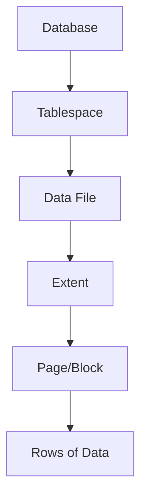

# SQL Physical Design

## Introduction

SQL Physical Design is a crucial phase in database development that focuses on how data is actually stored, accessed, and managed at the hardware level. While logical database design deals with the conceptual structure of your database (tables, relationships, etc.), physical design addresses how these structures are implemented in a specific database management system (DBMS).

Think of logical design as the architect's blueprint for a house, and physical design as the actual construction plans that determine what materials to use and how to build it efficiently. Physical design choices directly impact your database's performance, storage requirements, and scalability.

In this guide, we'll explore the key elements of SQL physical design and how to optimize them for better database performance.

## Storage Structures

### Tablespaces and Files

At the most basic level, databases store data in files on disk. Different DBMS products organize these files differently:

- **Tablespaces**: Logical storage units that group related tables, indexes, and other database objects
- **Data Files**: Physical files that contain the actual data
- **Control Files**: Files that track the physical structure of the database

```sql
-- Example: Creating a tablespace in Oracle
CREATE TABLESPACE users_data
  DATAFILE 'users01.dbf' SIZE 100M
  AUTOEXTEND ON NEXT 10M MAXSIZE 500M;
```

In this example, we're creating a tablespace named `users_data` with an initial size of 100MB that can automatically grow in 10MB increments up to 500MB.

### Pages and Extents

Most relational databases organize data in fixed-size blocks called **pages** (typically 4KB or 8KB). Pages are the smallest unit of I/O between disk and memory. Pages are further grouped into **extents**, which are contiguous blocks of pages.



### Row vs. Column Storage

Two fundamental approaches exist for storing table data:

- **Row-oriented storage**: Stores all columns of a row together (traditional approach)
- **Column-oriented storage**: Stores values of each column together (often used in analytics)

Row storage is optimized for transactional workloads where entire rows are frequently accessed together. Column storage excels at analytical queries that process large amounts of data from a few columns.

## Indexing Strategies

Indexes are special data structures that improve the speed of data retrieval operations. They're similar to a book's index - instead of scanning the entire book, you can quickly find specific topics.

### Types of Indexes

#### B-Tree Indexes

The most common type of index, B-tree (Balanced Tree) indexes are well-suited for equality and range queries.

```sql
-- Creating a B-tree index
CREATE INDEX idx_customer_last_name 
ON customers(last_name);
```

This creates an index on the `last_name` column of the `customers` table, which will speed up queries that filter or sort by last name.

#### Hash Indexes

Hash indexes use a hash function to map keys to index entries. They're excellent for equality comparisons but don't support range queries.

```sql
-- MySQL example of creating a hash index
CREATE TABLE products (
    id INT PRIMARY KEY,
    name VARCHAR(100),
    price DECIMAL(10,2),
    INDEX USING HASH (name)
) ENGINE=MEMORY;
```

#### Bitmap Indexes

Bitmap indexes work well for columns with low cardinality (few distinct values) and are common in data warehousing.

```sql
-- Oracle example of creating a bitmap index
CREATE BITMAP INDEX idx_product_category 
ON products(category_id);
```

#### Full-Text Indexes

Full-text indexes optimize searching within text content.

```sql
-- Creating a full-text index in MySQL
CREATE FULLTEXT INDEX idx_article_content 
ON articles(content);
```

### Index Design Considerations

When designing indexes, consider:

1. **Selectivity**: Columns with many distinct values make good index candidates
2. **Query patterns**: Index columns that appear frequently in WHERE, JOIN, or ORDER BY clauses
3. **Update frequency**: Indexes slow down INSERT, UPDATE, and DELETE operations
4. **Composite indexes**: Indexes on multiple columns can be powerful but require careful ordering

```sql
-- Example: Creating a composite index
CREATE INDEX idx_first_last_name 
ON customers(first_name, last_name);
```

This composite index would help queries that filter by both first and last name, or just first name (leftmost prefix rule), but not queries that filter only by last name.

## Partitioning

Partitioning divides large tables into smaller, more manageable pieces called partitions, while still presenting them as a single logical table to applications.

### Types of Partitioning

#### Range Partitioning

Divides data based on ranges of values, such as dates.

```sql
-- Range partitioning example for orders by year
CREATE TABLE orders (
    order_id INT,
    order_date DATE,
    customer_id INT,
    amount DECIMAL(10,2)
) PARTITION BY RANGE (YEAR(order_date)) (
    PARTITION p_2021 VALUES LESS THAN (2022),
    PARTITION p_2022 VALUES LESS THAN (2023),
    PARTITION p_2023 VALUES LESS THAN (2024),
    PARTITION p_future VALUES LESS THAN MAXVALUE
);
```

#### List Partitioning

Partitions data based on discrete values, like regions or categories.

```sql
-- List partitioning example for customers by region
CREATE TABLE customers (
    customer_id INT,
    name VARCHAR(100),
    region VARCHAR(20)
) PARTITION BY LIST (region) (
    PARTITION p_east VALUES IN ('East', 'Northeast'),
    PARTITION p_west VALUES IN ('West', 'Northwest'),
    PARTITION p_south VALUES IN ('South', 'Southeast'),
    PARTITION p_other VALUES IN ('Central', 'Unknown')
);
```

#### Hash Partitioning

Distributes data evenly across partitions using a hash function.

```sql
-- Hash partitioning example
CREATE TABLE products (
    product_id INT,
    name VARCHAR(100),
    price DECIMAL(10,2)
) PARTITION BY HASH (product_id) PARTITIONS 4;
```

### Benefits of Partitioning

- **Improved query performance**: Queries can skip irrelevant partitions
- **Easier maintenance**: Operations like backup or purging can work on individual partitions
- **Distributed storage**: Partitions can be stored on different physical devices

## Physical Storage Parameters

Most database systems allow you to configure various physical storage parameters:

### Table Storage Parameters

```sql
-- PostgreSQL example with storage parameters
CREATE TABLE large_table (
    id SERIAL PRIMARY KEY,
    data TEXT
) WITH (
    fillfactor = 70,
    autovacuum_enabled = true
);
```

This example creates a table with a fillfactor of 70%, meaning it will leave 30% of each page free for future updates, reducing the need for page splits.

### Buffer Cache Configuration

The buffer cache is a memory area where the database stores recently accessed data pages to reduce disk I/O. Configuring an appropriate buffer cache size is critical for performance.

```sql
-- Example of setting buffer cache in PostgreSQL (postgresql.conf)
-- shared_buffers = 4GB
```

## Performance Tuning

### Statistics and the Query Optimizer

Database query optimizers rely on statistics about your data to create efficient execution plans.

```sql
-- Updating statistics in SQL Server
UPDATE STATISTICS dbo.customers;

-- Analyzing a table in PostgreSQL
ANALYZE customers;
```

### Monitoring Tools

Most database systems provide tools to monitor physical storage usage and performance:

- **PostgreSQL**: pg_stat_statements, EXPLAIN ANALYZE
- **MySQL**: Performance Schema, EXPLAIN
- **SQL Server**: Dynamic Management Views (DMVs), execution plans
- **Oracle**: Automatic Workload Repository (AWR), EXPLAIN PLAN

```sql
-- Example: Using EXPLAIN to analyze query execution
EXPLAIN SELECT * FROM customers 
WHERE last_name = 'Smith' AND city = 'Chicago';
```

This command shows the execution plan the database would use, including which indexes it would utilize.

## Real-World Example: E-commerce Database Optimization

Let's walk through a practical example of physical design decisions for an e-commerce database.

### Scenario

Our e-commerce database has grown to millions of orders and customers, and queries are becoming slow. Here's how we might approach physical design optimization:

1. **Identify hot tables**: We notice the `orders` and `order_items` tables are most frequently accessed.

2. **Add appropriate indexes**:

```sql
-- Add index for order lookups by customer
CREATE INDEX idx_orders_customer_id ON orders(customer_id);

-- Add index for order status filtering (low cardinality - good candidate for bitmap)
CREATE BITMAP INDEX idx_orders_status ON orders(status);

-- Add composite index for product sales reporting
CREATE INDEX idx_order_items_product_date ON order_items(product_id, order_date);
```

3. **Implement partitioning for historical data**:

```sql
-- Partition orders by quarter
ALTER TABLE orders 
PARTITION BY RANGE (order_date) (
    PARTITION orders_2022_q1 VALUES LESS THAN ('2022-04-01'),
    PARTITION orders_2022_q2 VALUES LESS THAN ('2022-07-01'),
    PARTITION orders_2022_q3 VALUES LESS THAN ('2022-10-01'),
    PARTITION orders_2022_q4 VALUES LESS THAN ('2023-01-01'),
    PARTITION orders_current VALUES LESS THAN (MAXVALUE)
);
```

4. **Configure storage parameters**:

```sql
-- Set appropriate fillfactor for frequently updated tables
ALTER TABLE products SET (fillfactor = 75);
```

5. **Archive rarely accessed data**:

```sql
-- Create archive tablespace on slower, cheaper storage
CREATE TABLESPACE archive_data
  DATAFILE 'archive01.dbf' SIZE 500M;

-- Move old data to archive
ALTER TABLE orders_2020
  MOVE TABLESPACE archive_data;
```

With these optimizations, our database might see significant performance improvements, especially for common queries like order lookups, product sales reports, and customer purchase history.

## Summary

SQL Physical Design is the process of implementing logical database structures in an efficient, performant way. Key aspects include:

- **Storage structures**: How data is organized on disk
- **Indexing**: Creating data structures to speed up data retrieval
- **Partitioning**: Dividing large tables into manageable chunks
- **Storage parameters**: Configuring how data is stored and cached
- **Performance monitoring**: Tracking and optimizing database performance

Making good physical design choices requires understanding your data, query patterns, and workload characteristics. While logical design focuses on correctness and data integrity, physical design balances performance, storage efficiency, and maintenance complexity.

## Practice Exercises

1. Consider a `students` table with columns for student_id, name, enrollment_date, graduation_date, and major. Design an appropriate indexing strategy.

2. For a large table containing temperature readings with columns sensor_id, reading_time, temperature, and location, design a partitioning scheme.

3. Analyze the execution plan for a query in your database system and identify potential indexing improvements.

## Additional Resources

- [PostgreSQL Documentation: Indexes](https://www.postgresql.org/docs/current/indexes.html)
- [MySQL Documentation: Optimization](https://dev.mysql.com/doc/refman/8.0/en/optimization.html)
- [SQL Server: Database Engine Tuning Advisor](https://learn.microsoft.com/en-us/sql/relational-databases/performance/database-engine-tuning-advisor)
- [Oracle Database: Performance Tuning Guide](https://docs.oracle.com/en/database/oracle/oracle-database/19/tgdba/index.html)
- Book: "Database System Concepts" by Silberschatz, Korth, and Sudarshan

Remember that physical design is an iterative process. As your data grows and query patterns evolve, you'll need to revisit and refine your physical design decisions to maintain optimal performance.