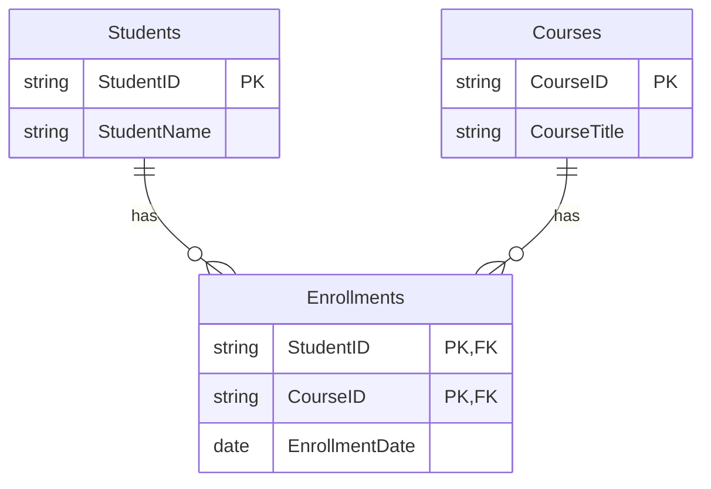

# SQL Second Normal Form (2NF)

## Introduction

Database normalization is a systematic approach to organizing data in a relational database. It involves dividing larger tables into smaller ones and defining relationships between them to minimize redundancy and improve data integrity. The Second Normal Form (2NF) is an important step in this process.

In this tutorial, we'll explore the Second Normal Form (2NF), understand why it's important, and learn how to apply it to your database design.

## Prerequisites

Before diving into 2NF, you should be familiar with:
- Basic SQL concepts
- Primary keys and foreign keys
- First Normal Form (1NF)

## What is Second Normal Form (2NF)?

A table is in Second Normal Form (2NF) if:

1. It is already in First Normal Form (1NF)
2. All non-key attributes are fully functionally dependent on the entire primary key

In simpler terms, a table is in 2NF when it's in 1NF and all columns that are not part of the primary key depend on the entire primary key, not just a portion of it.

> **Note:** 2NF is only relevant when you have composite primary keys (primary keys consisting of two or more columns). If your table has a single-column primary key, and it's already in 1NF, then it automatically satisfies 2NF.

## Understanding Partial Dependencies

The key concept in 2NF is eliminating **partial dependencies**. A partial dependency occurs when a non-key attribute depends on only part of a composite primary key.

Let's understand this with an example:

### Example of a Table Not in 2NF

Consider a table that tracks student enrollments in courses:

| StudentID | CourseID | EnrollmentDate | StudentName | CourseTitle |
|-----------|----------|----------------|-------------|-------------|
| S1        | C1       | 2023-01-15     | John Smith  | Database Design |
| S1        | C2       | 2023-01-20     | John Smith  | Web Development |
| S2        | C1       | 2023-01-10     | Emma Davis  | Database Design |
| S3        | C3       | 2023-01-25     | Michael Lee | Python Programming |

In this table:
- The composite primary key is (StudentID, CourseID)
- EnrollmentDate depends on both StudentID and CourseID (the full primary key)
- StudentName depends only on StudentID (partial dependency)
- CourseTitle depends only on CourseID (partial dependency)

This table violates 2NF because StudentName and CourseTitle don't depend on the entire primary key.

## Converting to 2NF

To convert a table to 2NF, we need to:

1. Identify all partial dependencies
2. Create separate tables for each part of the composite key with its dependent attributes
3. Maintain relationships between these tables using foreign keys

Let's convert our example to 2NF:

### Step 1: Create a Students table

```sql
CREATE TABLE Students (
    StudentID VARCHAR(10) PRIMARY KEY,
    StudentName VARCHAR(100) NOT NULL
);

INSERT INTO Students (StudentID, StudentName) VALUES
('S1', 'John Smith'),
('S2', 'Emma Davis'),
('S3', 'Michael Lee');
```

### Step 2: Create a Courses table

```sql
CREATE TABLE Courses (
    CourseID VARCHAR(10) PRIMARY KEY,
    CourseTitle VARCHAR(100) NOT NULL
);

INSERT INTO Courses (CourseID, CourseTitle) VALUES
('C1', 'Database Design'),
('C2', 'Web Development'),
('C3', 'Python Programming');
```

### Step 3: Create an Enrollments table with foreign keys

```sql
CREATE TABLE Enrollments (
    StudentID VARCHAR(10),
    CourseID VARCHAR(10),
    EnrollmentDate DATE NOT NULL,
    PRIMARY KEY (StudentID, CourseID),
    FOREIGN KEY (StudentID) REFERENCES Students(StudentID),
    FOREIGN KEY (CourseID) REFERENCES Courses(CourseID)
);

INSERT INTO Enrollments (StudentID, CourseID, EnrollmentDate) VALUES
('S1', 'C1', '2023-01-15'),
('S1', 'C2', '2023-01-20'),
('S2', 'C1', '2023-01-10'),
('S3', 'C3', '2023-01-25');
```

Now, our database is in 2NF. We've removed the partial dependencies and created separate tables for each entity.

## Visualizing the 2NF Structure

Here's a diagram showing our 2NF database structure:



## Real-world Application: E-commerce Order System

Let's look at a practical example of applying 2NF in an e-commerce order system:

### Non-2NF Design (problematic)

```sql
CREATE TABLE OrderDetails (
    OrderID INT,
    ProductID INT,
    Quantity INT,
    UnitPrice DECIMAL(10,2),
    OrderDate DATE,
    CustomerName VARCHAR(100),
    ProductName VARCHAR(100),
    PRIMARY KEY (OrderID, ProductID)
);
```

Problems with this design:
- OrderDate and CustomerName depend only on OrderID
- ProductName depends only on ProductID
- We'd have redundant data (CustomerName repeated for each product in an order)

### 2NF Design (improved)

```sql
-- Customers table
CREATE TABLE Customers (
    CustomerID INT PRIMARY KEY,
    CustomerName VARCHAR(100)
);

-- Products table
CREATE TABLE Products (
    ProductID INT PRIMARY KEY,
    ProductName VARCHAR(100),
    UnitPrice DECIMAL(10,2)
);

-- Orders table
CREATE TABLE Orders (
    OrderID INT PRIMARY KEY,
    CustomerID INT,
    OrderDate DATE,
    FOREIGN KEY (CustomerID) REFERENCES Customers(CustomerID)
);

-- OrderItems table
CREATE TABLE OrderItems (
    OrderID INT,
    ProductID INT,
    Quantity INT,
    PRIMARY KEY (OrderID, ProductID),
    FOREIGN KEY (OrderID) REFERENCES Orders(OrderID),
    FOREIGN KEY (ProductID) REFERENCES Products(ProductID)
);
```

Benefits of this 2NF design:
- No data redundancy
- Improved data integrity
- Easier data maintenance
- More flexible querying options

## Benefits of Second Normal Form

Converting your database to 2NF offers several advantages:

1. **Reduced data redundancy**: Each piece of information is stored in only one place
2. **Improved data integrity**: Changes to data need to be made in only one place
3. **Smaller storage requirements**: Less redundant data means less storage needed
4. **Simpler updates**: Updates are less prone to errors as data is modified in one place
5. **More flexible database design**: Easier to extend and maintain the database

## Common 2NF Violations

Here are some common scenarios that violate 2NF:

1. **Order detail tables with order header information**: Order date, shipping address, or customer info repeated in each line item
2. **Student enrollment tables with course details**: Course descriptions, instructor information, or room numbers repeated for each enrollment
3. **Employee project assignment tables with department information**: Department name or location repeated for each employee-project assignment

## How to Identify 2NF Violations

To identify 2NF violations, follow these steps:

1. Ensure the table is in 1NF
2. Identify tables with composite primary keys
3. For each attribute, determine whether it depends on the entire primary key or just part of it
4. If any attribute depends on only part of the primary key, the table violates 2NF

## Summary

Second Normal Form (2NF) is a crucial step in database normalization that helps eliminate partial dependencies. A table is in 2NF when it's in 1NF and all non-key attributes depend on the entire primary key.

Remember these key points:
- 2NF only applies to tables with composite primary keys
- Tables with single-column primary keys that are in 1NF automatically satisfy 2NF
- To achieve 2NF, remove partial dependencies by creating separate tables
- Proper 2NF design reduces data redundancy and improves data integrity

By following 2NF principles, you'll create more efficient, maintainable, and robust database designs.

## Exercises

1. Identify 2NF violations in the following table:
   ```
   InvoiceLineItems (InvoiceID, LineNumber, ProductID, Quantity, ProductName, Price, InvoiceDate, CustomerID)
   ```

2. Design a 2NF-compliant database for a library system that needs to track books, members, and book loans.

3. Convert the following table to 2NF:
   ```
   StudentCourseGrades (StudentID, CourseID, Semester, Grade, StudentName, CourseName, InstructorID, InstructorName)
   ```

## Additional Resources

- [Database Normalization: Explained](https://www.studytonight.com/dbms/database-normalization.php)
- [SQL Normalization with Examples](https://www.geeksforgeeks.org/normal-forms-in-dbms/)
- [Understanding Database Design](https://www.lucidchart.com/pages/database-diagram/database-design)