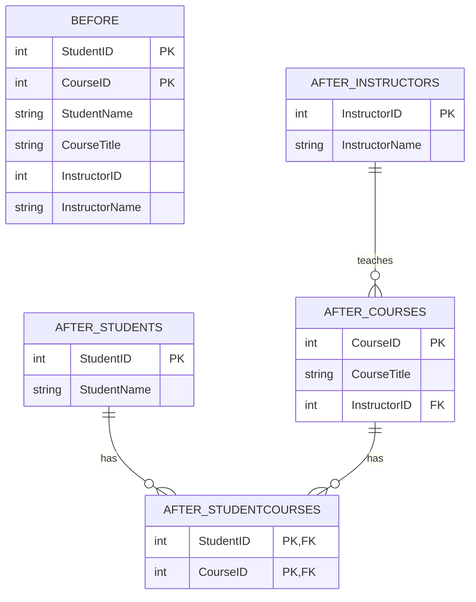

# SQL Third Normal Form (3NF)

## Introduction

The Third Normal Form (3NF) is a crucial concept in relational database design that helps create efficient, consistent, and maintainable databases. Building on the First Normal Form (1NF) and Second Normal Form (2NF), 3NF further refines your database structure by eliminating transitive dependencies.

In this tutorial, we'll explore:
- What 3NF is and why it matters
- The concept of transitive dependencies
- How to convert a 2NF table to 3NF
- Real-world examples and applications
- Common challenges and best practices

By the end, you'll have a solid understanding of 3NF and be able to apply it to your own database designs.

## Prerequisites

Before diving into 3NF, you should be familiar with:
- Basic SQL concepts
- Primary keys and foreign keys
- First Normal Form (1NF)
- Second Normal Form (2NF)

## What is Third Normal Form?

A table is in Third Normal Form (3NF) if it meets the following criteria:
1. It is already in Second Normal Form (2NF)
2. It contains no transitive dependencies

Let's break down what this means:

### Transitive Dependencies Explained

A transitive dependency occurs when a non-key attribute (column) depends on another non-key attribute, rather than depending directly on the primary key.

More formally, if:
- A → B (attribute A determines attribute B)
- B → C (attribute B determines attribute C)
- Then A → C is a transitive dependency

In a 3NF database, all attributes must depend on "the key, the whole key, and nothing but the key."

## Identifying Violations of 3NF

Let's look at a common example of a 2NF table that violates 3NF:

```sql
CREATE TABLE StudentCourses (
    StudentID INT,
    CourseID INT,
    StudentName VARCHAR(100),
    CourseTitle VARCHAR(100),
    InstructorID INT,
    InstructorName VARCHAR(100),
    PRIMARY KEY (StudentID, CourseID)
);
```

In this table:
- StudentID and CourseID together form the primary key
- StudentName depends only on StudentID (not the full primary key)
- CourseTitle depends only on CourseID (not the full primary key)
- InstructorName depends on InstructorID, not directly on the primary key

The last dependency (InstructorID → InstructorName) is a transitive dependency that violates 3NF.

## Converting to Third Normal Form

To convert a table to 3NF, we need to:
1. Identify all transitive dependencies
2. Create separate tables for each transitive dependency
3. Link the tables using foreign keys

Let's normalize our StudentCourses table:

```sql
-- Students table (holds student information)
CREATE TABLE Students (
    StudentID INT PRIMARY KEY,
    StudentName VARCHAR(100)
);

-- Courses table (holds course information)
CREATE TABLE Courses (
    CourseID INT PRIMARY KEY,
    CourseTitle VARCHAR(100),
    InstructorID INT,
    FOREIGN KEY (InstructorID) REFERENCES Instructors(InstructorID)
);

-- Instructors table (holds instructor information)
CREATE TABLE Instructors (
    InstructorID INT PRIMARY KEY,
    InstructorName VARCHAR(100)
);

-- StudentCourses junction table (represents the many-to-many relationship)
CREATE TABLE StudentCourses (
    StudentID INT,
    CourseID INT,
    PRIMARY KEY (StudentID, CourseID),
    FOREIGN KEY (StudentID) REFERENCES Students(StudentID),
    FOREIGN KEY (CourseID) REFERENCES Courses(CourseID)
);
```

This normalized design eliminates all transitive dependencies and is now in 3NF.

## Visualizing the Normalization Process

Here's a visual representation of the normalization process:



## Real-World Example: E-Commerce Database

Let's apply 3NF to a real-world e-commerce scenario. Consider a table that tracks orders:

```sql
-- Non-normalized table (violates 3NF)
CREATE TABLE Orders (
    OrderID INT PRIMARY KEY,
    CustomerID INT,
    CustomerName VARCHAR(100),
    CustomerEmail VARCHAR(100),
    ProductID INT,
    ProductName VARCHAR(100),
    ProductPrice DECIMAL(10,2),
    CategoryID INT,
    CategoryName VARCHAR(50),
    OrderDate DATE,
    Quantity INT
);
```

This table has multiple transitive dependencies:
- CustomerID → CustomerName, CustomerEmail
- ProductID → ProductName, ProductPrice, CategoryID
- CategoryID → CategoryName

Here's how we'd normalize it to 3NF:

```sql
-- Customers table
CREATE TABLE Customers (
    CustomerID INT PRIMARY KEY,
    CustomerName VARCHAR(100),
    CustomerEmail VARCHAR(100)
);

-- Categories table
CREATE TABLE Categories (
    CategoryID INT PRIMARY KEY,
    CategoryName VARCHAR(50)
);

-- Products table
CREATE TABLE Products (
    ProductID INT PRIMARY KEY,
    ProductName VARCHAR(100),
    ProductPrice DECIMAL(10,2),
    CategoryID INT,
    FOREIGN KEY (CategoryID) REFERENCES Categories(CategoryID)
);

-- Orders table
CREATE TABLE Orders (
    OrderID INT PRIMARY KEY,
    CustomerID INT,
    OrderDate DATE,
    FOREIGN KEY (CustomerID) REFERENCES Customers(CustomerID)
);

-- OrderDetails table (junction table between Orders and Products)
CREATE TABLE OrderDetails (
    OrderID INT,
    ProductID INT,
    Quantity INT,
    PRIMARY KEY (OrderID, ProductID),
    FOREIGN KEY (OrderID) REFERENCES Orders(OrderID),
    FOREIGN KEY (ProductID) REFERENCES Products(ProductID)
);
```

This normalized design:
1. Eliminates data redundancy
2. Improves data integrity
3. Makes the database more flexible for future changes

## Advantages of 3NF

Implementing 3NF in your database design offers several benefits:

1. **Reduced data redundancy**: By eliminating transitive dependencies, data is stored in only one place.

2. **Improved data integrity**: Updates, inserts, and deletes are less likely to create inconsistencies.

3. **Smaller storage requirements**: Less duplicated data means smaller database size.

4. **Better query performance**: In many cases, normalized databases perform better for complex queries.

5. **More flexible schema**: Adding or modifying data structures is easier when dependencies are minimized.

## When to Consider Denormalization

While 3NF is generally best practice, there are situations where intentionally denormalizing (breaking normalization rules) might be beneficial:

1. **Performance optimization**: For read-heavy applications, denormalization can reduce the need for complex joins.

2. **Reporting databases**: Analytical databases often denormalize data for faster reporting queries.

3. **Data warehousing**: Star or snowflake schemas intentionally denormalize data for analytical purposes.

Always consider the specific needs of your application when deciding how strictly to adhere to normalization principles.

## Common Pitfalls and Misconceptions

1. **Normalization doesn't always improve performance**: While normalization reduces redundancy, it can sometimes lead to more complex queries requiring multiple joins.

2. **Over-normalization**: Breaking tables down too much can make the database overly complex and difficult to work with.

3. **Confusing correlation with dependency**: Just because two columns often contain related values doesn't necessarily mean there's a functional dependency.

## Practical Exercise: Converting a Table to 3NF

Let's walk through converting a table to 3NF step by step:

**Original table:**

| OrderID | Product     | Category  | SupplierName    | SupplierCountry |
|---------|------------|-----------|-----------------|-----------------|
| 1001    | iPhone 13  | Electronics | Apple Inc.      | USA             |
| 1002    | Galaxy S22 | Electronics | Samsung Corp.   | South Korea     |
| 1003    | MacBook    | Electronics | Apple Inc.      | USA             |

**Functional dependencies:**
- OrderID → Product, Category
- Product → SupplierName
- SupplierName → SupplierCountry

**Transitive dependency:**
- OrderID → Product → SupplierName → SupplierCountry

**3NF solution:**

Table 1: Orders
```sql
CREATE TABLE Orders (
    OrderID INT PRIMARY KEY,
    Product VARCHAR(100),
    Category VARCHAR(50),
    SupplierName VARCHAR(100),
    FOREIGN KEY (SupplierName) REFERENCES Suppliers(SupplierName)
);
```

Table 2: Suppliers
```sql
CREATE TABLE Suppliers (
    SupplierName VARCHAR(100) PRIMARY KEY,
    SupplierCountry VARCHAR(50)
);
```

**Sample data after normalization:**

Orders table:
| OrderID | Product     | Category     | SupplierName   |
|---------|------------|-------------|----------------|
| 1001    | iPhone 13  | Electronics | Apple Inc.     |
| 1002    | Galaxy S22 | Electronics | Samsung Corp.  |
| 1003    | MacBook    | Electronics | Apple Inc.     |

Suppliers table:
| SupplierName   | SupplierCountry |
|----------------|-----------------|
| Apple Inc.     | USA             |
| Samsung Corp.  | South Korea     |

## Summary

The Third Normal Form (3NF) is an important concept in database normalization that helps eliminate transitive dependencies. By ensuring that non-key attributes depend only on the primary key, 3NF reduces redundancy, improves data integrity, and creates a more maintainable database structure.

Key points to remember about 3NF:
- It builds on 1NF and 2NF
- It eliminates transitive dependencies
- It separates related data into multiple tables
- It generally results in a more efficient database design

While strictly adhering to 3NF is a good practice for most transactional databases, remember that some situations might call for strategic denormalization, especially in data warehousing and reporting contexts.

## Additional Resources and Exercises

### Additional Resources
- [Database Normalization on Wikipedia](https://en.wikipedia.org/wiki/Database_normalization)
- [SQL Design Patterns](https://www.amazon.com/SQL-Design-Patterns-Programming-Developers/dp/0977671542)
- [Stanford Database Course](https://online.stanford.edu/courses/soe-ydatabases-databases)

### Exercises

1. **Exercise 1**: Identify 3NF violations in the following table:
   ```
   LibraryBooks(BookID, Title, AuthorID, AuthorName, AuthorBirthdate, PublisherID, PublisherName, PublisherAddress)
   ```

2. **Exercise 2**: Convert the following table to 3NF:
   ```
   Movies(MovieID, Title, DirectorName, DirectorBirthdate, GenreName, GenreDescription)
   ```

3. **Exercise 3**: Design a 3NF database schema for a simple blog system with users, posts, comments, and categories.

4. **Challenge**: Review a real-world database schema (open source projects often have their schemas available) and identify any violations of 3NF. What would you change to bring it into compliance?

Remember, normalization is as much an art as it is a science. The goal is to create a database structure that balances theoretical correctness with practical usability.