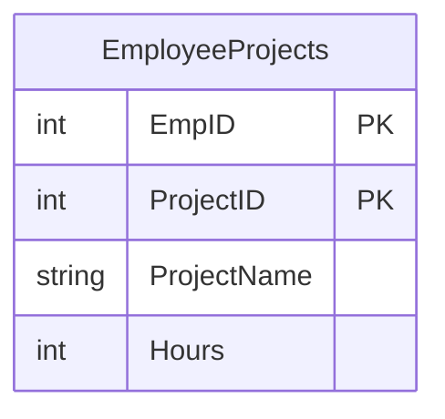
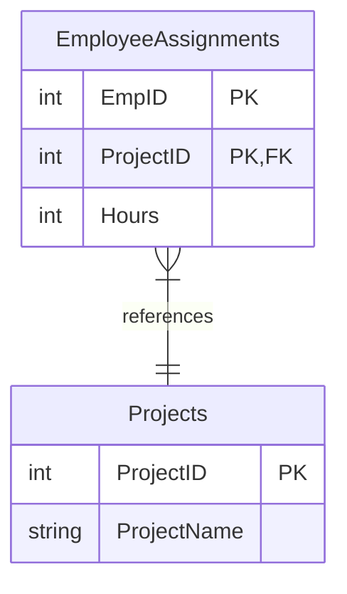

# SQL Boyce-Codd Normal Form

## Introduction

Database design is a critical aspect of building efficient and error-free applications. Normalization is the process of structuring your database to minimize redundancy and dependency issues. Boyce-Codd Normal Form (BCNF) is an important level of normalization that helps ensure your database maintains data integrity and avoids update anomalies.

Named after Raymond F. Boyce and Edgar F. Codd, BCNF is a stricter version of the Third Normal Form (3NF). While it might seem complex at first, understanding BCNF will help you design more robust databases that can reliably store and manage your data.

In this tutorial, we'll explore what BCNF is, why it matters, and how to apply it to your database designs.

## Prerequisites

Before diving into BCNF, you should be familiar with:
- Basic SQL concepts
- Primary keys and foreign keys
- Functional dependencies
- First, Second, and Third Normal Forms

## Understanding Functional Dependencies

To understand BCNF, we first need to grasp the concept of functional dependencies.

A functional dependency exists when one attribute determines another attribute. We write this as X → Y, which means "X functionally determines Y" or "Y is functionally dependent on X."

For example, if knowing a `StudentID` always tells you the `StudentName`, then `StudentID → StudentName`.

### Types of Attributes in Dependencies

- **Determinant**: The attribute on the left side of a functional dependency (X in X → Y)
- **Dependent**: The attribute on the right side (Y in X → Y)

## What is Boyce-Codd Normal Form?

**Definition**: A relation is in BCNF if and only if, for every non-trivial functional dependency X → Y, X is a superkey.

In simpler terms:
- Every determinant must be a candidate key (a minimal superkey)
- All functional dependencies are either trivial (Y is a subset of X) or have a superkey as their determinant

## BCNF vs. 3NF

BCNF is a stronger form of 3NF. The difference is:

- **3NF**: For every non-trivial functional dependency X → Y, either X is a superkey or Y is part of some candidate key.
- **BCNF**: For every non-trivial functional dependency X → Y, X must be a superkey.

This means BCNF eliminates all transitive and partial dependencies, even those involving candidate keys.

## Identifying BCNF Violations

A table violates BCNF when:
1. There is a non-trivial functional dependency X → Y
2. X is not a superkey

Let's look at an example to make this clearer.

## Example 1: Student Courses

Consider a table tracking students and the courses they are taking, along with the course instructor:

```sql
CREATE TABLE StudentCourses (
    StudentID INT,
    CourseID INT,
    Instructor VARCHAR(100),
    PRIMARY KEY (StudentID, CourseID)
);
```

This table has the following functional dependencies:
- `(StudentID, CourseID) → Instructor` (The primary key determines the instructor)
- `CourseID → Instructor` (Each course has only one instructor)

Is this table in BCNF? Let's check:

The dependency `CourseID → Instructor` violates BCNF because:
- `CourseID` is a determinant
- `CourseID` is not a superkey (it doesn't uniquely identify a row)

### Normalizing to BCNF

To bring this table to BCNF, we split it into two tables:

```sql
-- New table for course information
CREATE TABLE Courses (
    CourseID INT PRIMARY KEY,
    Instructor VARCHAR(100)
);

-- Modified student courses table
CREATE TABLE StudentCourses (
    StudentID INT,
    CourseID INT,
    PRIMARY KEY (StudentID, CourseID),
    FOREIGN KEY (CourseID) REFERENCES Courses(CourseID)
);
```

Now both tables are in BCNF because all determinants are superkeys.

## Example 2: Employee Projects

Let's examine a more complex example. Suppose we have an `EmployeeProjects` table:

```sql
CREATE TABLE EmployeeProjects (
    EmpID INT,
    ProjectID INT,
    ProjectName VARCHAR(100),
    Hours INT,
    PRIMARY KEY (EmpID, ProjectID)
);
```

Functional dependencies:
- `(EmpID, ProjectID) → Hours` (Primary key determines hours worked)
- `(EmpID, ProjectID) → ProjectName` (Primary key determines project name)
- `ProjectID → ProjectName` (Each project has only one name)

The dependency `ProjectID → ProjectName` violates BCNF because `ProjectID` is not a superkey.

### Normalizing to BCNF

We need to split this into two tables:

```sql
-- Projects table
CREATE TABLE Projects (
    ProjectID INT PRIMARY KEY,
    ProjectName VARCHAR(100)
);

-- Employee assignments table
CREATE TABLE EmployeeAssignments (
    EmpID INT,
    ProjectID INT,
    Hours INT,
    PRIMARY KEY (EmpID, ProjectID),
    FOREIGN KEY (ProjectID) REFERENCES Projects(ProjectID)
);
```

Both tables now satisfy BCNF.

## Visualizing BCNF Transformation

Let's visualize the transformation from our original `EmployeeProjects` table to the normalized BCNF structure:



After normalization:



## Real-World Example: University Database

Let's consider a more complex real-world example of a university database tracking professors, students, and courses.

Original table:

```sql
CREATE TABLE CourseEnrollments (
    StudentID INT,
    CourseCode VARCHAR(10),
    ProfessorID INT,
    ProfessorOffice VARCHAR(10),
    CourseTitle VARCHAR(100),
    EnrollmentDate DATE,
    PRIMARY KEY (StudentID, CourseCode)
);
```

This table has the following functional dependencies:
- `(StudentID, CourseCode) → EnrollmentDate`
- `(StudentID, CourseCode) → ProfessorID`
- `CourseCode → CourseTitle`
- `CourseCode → ProfessorID`
- `ProfessorID → ProfessorOffice`

The BCNF violations here are:
- `CourseCode → CourseTitle` (CourseCode is not a superkey)
- `CourseCode → ProfessorID` (CourseCode is not a superkey)
- `ProfessorID → ProfessorOffice` (ProfessorID is not a superkey)

### BCNF Normalization

To achieve BCNF, we split this into multiple tables:

```sql
-- Professors information
CREATE TABLE Professors (
    ProfessorID INT PRIMARY KEY,
    ProfessorOffice VARCHAR(10)
);

-- Course information
CREATE TABLE Courses (
    CourseCode VARCHAR(10) PRIMARY KEY,
    CourseTitle VARCHAR(100),
    ProfessorID INT,
    FOREIGN KEY (ProfessorID) REFERENCES Professors(ProfessorID)
);

-- Student enrollments
CREATE TABLE Enrollments (
    StudentID INT,
    CourseCode VARCHAR(10),
    EnrollmentDate DATE,
    PRIMARY KEY (StudentID, CourseCode),
    FOREIGN KEY (CourseCode) REFERENCES Courses(CourseCode)
);
```

Now all tables are in BCNF.

## How to Normalize to BCNF

Here's a step-by-step process to normalize a table to BCNF:

1. Identify all functional dependencies in your table
2. Find the candidate keys
3. Check if any functional dependency violates BCNF (determinant is not a superkey)
4. For each violation, decompose the table by:
   - Creating a new table with the determinant and its dependent attributes
   - Keeping the determinant in the original table to maintain a relationship
5. Repeat until all tables are in BCNF

## When to Use BCNF

BCNF is ideal for:
- Transactional databases where data integrity is critical
- Systems where data will be frequently updated
- Databases that need to avoid anomalies and inconsistencies

However, sometimes you might deliberately denormalize (move away from BCNF) for performance reasons, especially in data warehousing or reporting systems where read performance is prioritized over update integrity.

## Pros and Cons of BCNF

### Advantages
- Eliminates redundant data and reduces storage needs
- Prevents update anomalies (insertion, deletion, and modification anomalies)
- Improves data integrity and consistency
- Makes the database schema more flexible for future changes

### Disadvantages
- Can lead to more complex queries requiring joins
- May slightly reduce query performance for read-heavy operations
- Increases the number of tables to manage

## Practical Implementation Tips

When implementing BCNF in your database:

1. **Document functional dependencies**: Keep track of all dependencies to help identify normalization issues
2. **Use foreign keys**: Always implement proper foreign key constraints
3. **Balance with performance**: Consider query performance when deciding whether to fully normalize
4. **Test thoroughly**: Verify that your normalized design supports all required operations

## Example: Implementing BCNF in a Library Database

Let's implement BCNF in a library database scenario.

Original problematic table:

```sql
CREATE TABLE BookLoans (
    MemberID INT,
    ISBN VARCHAR(13),
    Title VARCHAR(200),
    Author VARCHAR(100),
    CheckoutDate DATE,
    DueDate DATE,
    PRIMARY KEY (MemberID, ISBN, CheckoutDate)
);
```

Functional dependencies:
- `(MemberID, ISBN, CheckoutDate) → DueDate`
- `ISBN → Title`
- `ISBN → Author`

BCNF violations:
- `ISBN → Title` (ISBN is not a superkey)
- `ISBN → Author` (ISBN is not a superkey)

Normalized tables:

```sql
-- Books table
CREATE TABLE Books (
    ISBN VARCHAR(13) PRIMARY KEY,
    Title VARCHAR(200),
    Author VARCHAR(100)
);

-- Loans table
CREATE TABLE Loans (
    MemberID INT,
    ISBN VARCHAR(13),
    CheckoutDate DATE,
    DueDate DATE,
    PRIMARY KEY (MemberID, ISBN, CheckoutDate),
    FOREIGN KEY (ISBN) REFERENCES Books(ISBN)
);
```

## Common Pitfalls and Mistakes

When applying BCNF, watch out for these common issues:

1. **Missing functional dependencies**: Failing to identify all dependencies
2. **Circular dependencies**: Creating circular references between tables
3. **Over-normalization**: Breaking tables down too much, making queries overly complex
4. **Under-normalization**: Not addressing all BCNF violations

## Summary

Boyce-Codd Normal Form (BCNF) is a powerful database normalization technique that helps maintain data integrity by ensuring that all non-trivial functional dependencies have superkeys as determinants. By applying BCNF:

- You eliminate redundant data storage
- You prevent update anomalies
- You create a more maintainable database structure

While BCNF requires more tables and joins than unnormalized designs, the benefits of data integrity and consistency usually outweigh the minor performance impact, especially in transactional databases.

## Exercises

1. Identify BCNF violations in the following table:
   ```sql
   CREATE TABLE Certifications (
       EmployeeID INT,
       CertID VARCHAR(10),
       CertName VARCHAR(100),
       IssuerID INT,
       IssuerName VARCHAR(100),
       ExpiryDate DATE,
       PRIMARY KEY (EmployeeID, CertID)
   );
   ```

2. Normalize the following table to BCNF:
   ```sql
   CREATE TABLE MovieActors (
       MovieID INT,
       ActorID INT,
       MovieTitle VARCHAR(200),
       Director VARCHAR(100),
       ActorName VARCHAR(100),
       Role VARCHAR(100),
       PRIMARY KEY (MovieID, ActorID)
   );
   ```

3. Design a BCNF-compliant schema for a hospital system that tracks:
   - Patients
   - Doctors
   - Appointments
   - Medications
   - Prescriptions

## Additional Resources

- [Database Design and Relational Theory](https://www.oreilly.com/library/view/database-design-and/9781449330187/) by C.J. Date
- [SQL and Relational Theory](https://www.oreilly.com/library/view/sql-and-relational/9781449317720/) by C.J. Date
- [Database Normalization Basics](https://www.essentialsql.com/get-ready-to-learn-sql-database-normalization-explained-in-simple-english/)
- [Stanford's Database Course](https://lagunita.stanford.edu/courses/DB/2014/SelfPaced/about)

Remember that database design is both an art and a science. While BCNF provides a formal framework, real-world implementation often requires balancing theoretical correctness with practical considerations.

Happy database designing!