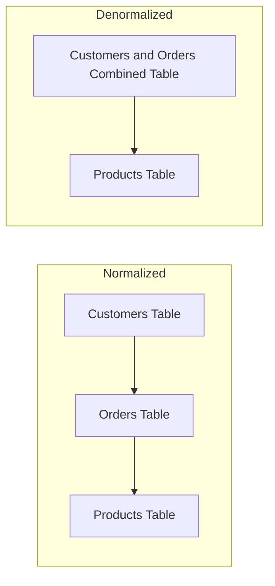

# SQL Denormalization

## Introduction

Database normalization is a process we often hear about when learning SQL - it helps us organize data efficiently and reduce redundancy. But there's a complementary technique that's equally important to understand: **denormalization**.

Denormalization is the process of intentionally introducing redundancy into a database design to improve read performance. While normalization focuses on data integrity and reducing duplication, denormalization prioritizes query performance and reporting efficiency.

In this article, we'll explore:
- What denormalization is and how it differs from normalization
- When and why you might choose to denormalize your database
- Common denormalization techniques with examples
- The tradeoffs involved in denormalization decisions

## Normalization vs. Denormalization

Before diving into denormalization, let's briefly revisit normalization:

**Normalization** is the process of structuring a database to:
- Reduce data redundancy
- Ensure data integrity
- Organize data logically
- Minimize modification anomalies

For example, a normalized database might have separate tables for customers, orders, and products, with relationships between them.

**Denormalization**, by contrast:
- Intentionally adds redundant data
- Reduces the number of joins needed for queries
- Improves read performance
- May sacrifice some write performance and data integrity

Let's visualize the difference with a simple diagram:



## When to Consider Denormalization

Denormalization isn't always the right choice. Here are situations where it makes sense:

1. **Read-heavy applications**: When your application performs many more reads than writes
2. **Reporting and analytics**: When complex reports require joining multiple tables
3. **Performance bottlenecks**: When joins are causing significant slowdowns
4. **Predictable queries**: When you know exactly which queries will be run frequently

## Common Denormalization Techniques

Let's explore some practical denormalization techniques with examples:

### 1. Redundant Columns

Adding redundant data to avoid joins is the most basic form of denormalization.

#### Example: Adding Customer Name to Orders Table

**Normalized Structure:**

```sql
-- Customers table
CREATE TABLE customers (
  customer_id INT PRIMARY KEY,
  first_name VARCHAR(50),
  last_name VARCHAR(50),
  email VARCHAR(100)
);

-- Orders table
CREATE TABLE orders (
  order_id INT PRIMARY KEY,
  customer_id INT,
  order_date DATE,
  total_amount DECIMAL(10,2),
  FOREIGN KEY (customer_id) REFERENCES customers(customer_id)
);
```

To retrieve order information with customer names, you'd need a join:

```sql
SELECT o.order_id, o.order_date, o.total_amount, 
       c.first_name, c.last_name
FROM orders o
JOIN customers c ON o.customer_id = c.customer_id;
```

**Denormalized Structure:**

```sql
CREATE TABLE orders (
  order_id INT PRIMARY KEY,
  customer_id INT,
  customer_first_name VARCHAR(50),
  customer_last_name VARCHAR(50),
  order_date DATE,
  total_amount DECIMAL(10,2),
  FOREIGN KEY (customer_id) REFERENCES customers(customer_id)
);
```

Now you can get the same information without a join:

```sql
SELECT order_id, order_date, total_amount, 
       customer_first_name, customer_last_name
FROM orders;
```

### 2. Derived Columns

Storing calculated values that would otherwise need to be computed repeatedly.

#### Example: Order Summary

**Normalized Approach:**
```sql
-- Orders table
CREATE TABLE orders (
  order_id INT PRIMARY KEY,
  customer_id INT,
  order_date DATE
);

-- Order Items table
CREATE TABLE order_items (
  item_id INT PRIMARY KEY,
  order_id INT,
  product_id INT,
  quantity INT,
  price DECIMAL(10,2),
  FOREIGN KEY (order_id) REFERENCES orders(order_id)
);
```

To get the total amount of an order:

```sql
SELECT order_id, SUM(quantity * price) as total_amount
FROM order_items
GROUP BY order_id;
```

**Denormalized Approach:**
```sql
CREATE TABLE orders (
  order_id INT PRIMARY KEY,
  customer_id INT,
  order_date DATE,
  total_amount DECIMAL(10,2),
  item_count INT
);
```

The `total_amount` and `item_count` are derived fields updated whenever an item is added to the order.

### 3. Pre-Joined Tables

Creating a new table that contains the pre-joined data from multiple tables.

#### Example: Product Sales Report Table

**Normalized Structure:**
```sql
-- Separate tables for products, orders, and order_items
```

To generate a product sales report, you'd need complex joins:

```sql
SELECT p.product_name, p.category, 
       SUM(oi.quantity) as total_quantity,
       SUM(oi.quantity * oi.price) as total_sales
FROM products p
JOIN order_items oi ON p.product_id = oi.product_id
JOIN orders o ON oi.order_id = o.order_id
WHERE o.order_date BETWEEN '2023-01-01' AND '2023-12-31'
GROUP BY p.product_id, p.product_name, p.category;
```

**Denormalized Approach:**
```sql
CREATE TABLE product_sales_summary (
  product_id INT,
  product_name VARCHAR(100),
  category VARCHAR(50),
  year INT,
  month INT,
  total_quantity INT,
  total_sales DECIMAL(12,2),
  PRIMARY KEY (product_id, year, month)
);
```

This table can be updated periodically with aggregated data, making report generation much faster.

### 4. Materialized Views

Some database systems support materialized views, which are pre-computed query results stored as tables.

```sql
CREATE MATERIALIZED VIEW monthly_sales AS
SELECT 
  p.category,
  EXTRACT(YEAR FROM o.order_date) as year,
  EXTRACT(MONTH FROM o.order_date) as month,
  SUM(oi.quantity * oi.price) as total_sales
FROM products p
JOIN order_items oi ON p.product_id = oi.product_id
JOIN orders o ON oi.order_id = o.order_id
GROUP BY p.category, EXTRACT(YEAR FROM o.order_date), EXTRACT(MONTH FROM o.order_date);
```

Materialized views need to be refreshed periodically:

```sql
REFRESH MATERIALIZED VIEW monthly_sales;
```

## Tradeoffs of Denormalization

Denormalization doesn't come for free. Here are important tradeoffs to consider:

### Advantages
- **Improved read performance**: Fewer joins mean faster queries
- **Simpler queries**: No need for complex joins in many cases
- **Better reporting capabilities**: Data is structured for easier reporting

### Disadvantages
- **Increased storage requirements**: Redundant data takes more space
- **Write performance impact**: Updates need to modify data in multiple places
- **Data consistency challenges**: Redundant data might become inconsistent
- **More complex update logic**: Need to maintain denormalized data

## Real-World Example: E-commerce Database

Let's look at a practical example of denormalization in an e-commerce context:

### Scenario
An online store needs to show product listings with:
- Product details
- Current inventory
- Average rating from reviews
- Category information

### Normalized Approach (5 tables)

```sql
CREATE TABLE products (
  product_id INT PRIMARY KEY,
  name VARCHAR(100),
  description TEXT,
  price DECIMAL(10,2),
  category_id INT
);

CREATE TABLE categories (
  category_id INT PRIMARY KEY,
  name VARCHAR(50),
  parent_category_id INT
);

CREATE TABLE inventory (
  inventory_id INT PRIMARY KEY,
  product_id INT,
  quantity_available INT,
  last_updated TIMESTAMP
);

CREATE TABLE reviews (
  review_id INT PRIMARY KEY,
  product_id INT,
  customer_id INT,
  rating INT,
  comment TEXT,
  review_date TIMESTAMP
);
```

The query to get product listings would be:

```sql
SELECT p.product_id, p.name, p.description, p.price,
       c.name as category_name,
       i.quantity_available,
       AVG(r.rating) as average_rating,
       COUNT(r.review_id) as review_count
FROM products p
JOIN categories c ON p.category_id = c.category_id
JOIN inventory i ON p.product_id = i.product_id
LEFT JOIN reviews r ON p.product_id = r.product_id
GROUP BY p.product_id, p.name, p.description, p.price, c.name, i.quantity_available;
```

### Denormalized Approach (Product Listings Table)

```sql
CREATE TABLE product_listings (
  product_id INT PRIMARY KEY,
  name VARCHAR(100),
  description TEXT,
  price DECIMAL(10,2),
  category_id INT,
  category_name VARCHAR(50),
  quantity_available INT,
  average_rating DECIMAL(3,2),
  review_count INT,
  last_updated TIMESTAMP
);
```

Now the query is simply:

```sql
SELECT * FROM product_listings;
```

While this makes reads very fast, we need triggers or application logic to keep this table updated when products, inventory, or reviews change.

## When to Avoid Denormalization

Denormalization isn't always the right solution. Avoid it when:

1. **Data integrity is critical**: For financial or medical systems
2. **Write operations are frequent**: High-volume transaction processing
3. **Storage costs are a concern**: When database size matters
4. **Your application needs are likely to change**: Denormalized designs can be less flexible

## Implementation Best Practices

If you decide to denormalize, follow these best practices:

1. **Start normalized**: Begin with a properly normalized database
2. **Identify bottlenecks**: Use performance testing to find actual issues
3. **Denormalize incrementally**: Make small changes and test
4. **Document everything**: Track your denormalization decisions
5. **Consider triggers or procedures**: Maintain data consistency automatically
6. **Validate data periodically**: Check for inconsistencies

## Summary

Denormalization is a powerful technique to improve database read performance by strategically introducing redundancy. While normalization focuses on data integrity and reducing duplication, denormalization prioritizes query performance, especially for read-heavy applications.

Key denormalization techniques include:
- Adding redundant columns to avoid joins
- Creating derived columns to avoid calculations
- Using pre-joined tables for reporting
- Implementing materialized views for complex aggregations

Remember that denormalization comes with tradeoffs, including increased storage requirements and more complex update logic. Always start with a normalized design and only denormalize when necessary, based on actual performance needs.

## Exercises

1. Take a normalized database with Customer, Order, and Product tables and identify three ways you could denormalize it.
2. Create a reporting table that would combine data from multiple sources for a monthly sales report.
3. For an existing database you work with, identify queries that might benefit from denormalization and explain why.
4. Implement a trigger that would keep denormalized data consistent when the source data changes.

## Additional Resources

- [Database Normalization and Denormalization Explained](https://www.guru99.com/database-normalization.html)
- [SQL Performance Explained](https://use-the-index-luke.com/)
- [Designing Data-Intensive Applications](https://dataintensive.net/) by Martin Kleppmann
- [PostgreSQL Documentation on Materialized Views](https://www.postgresql.org/docs/current/rules-materializedviews.html)