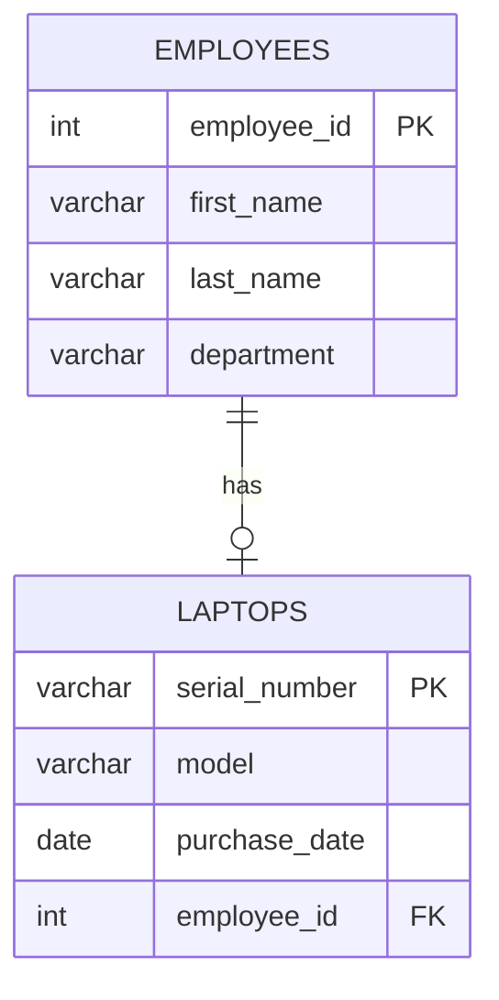
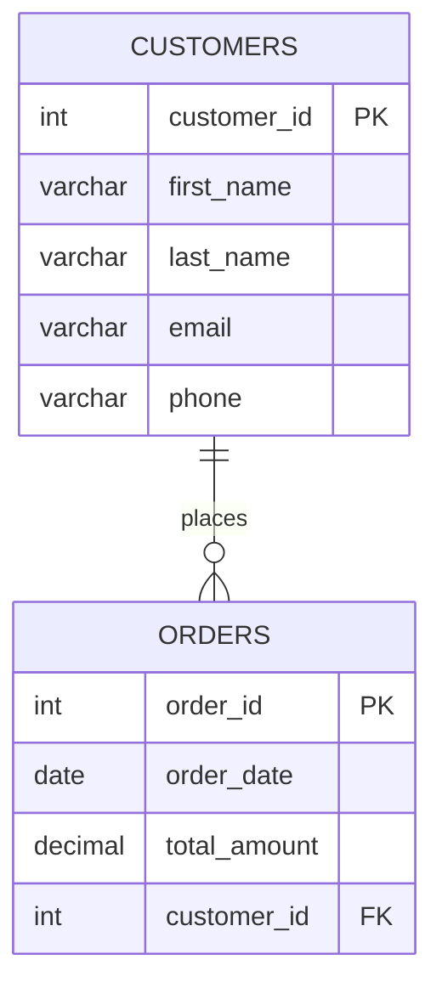
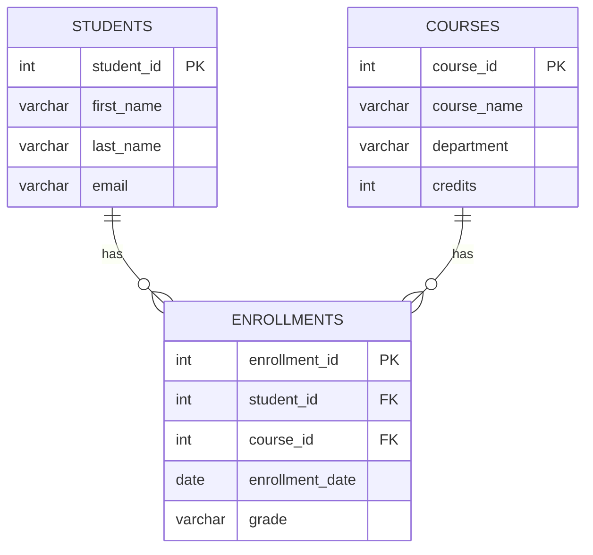
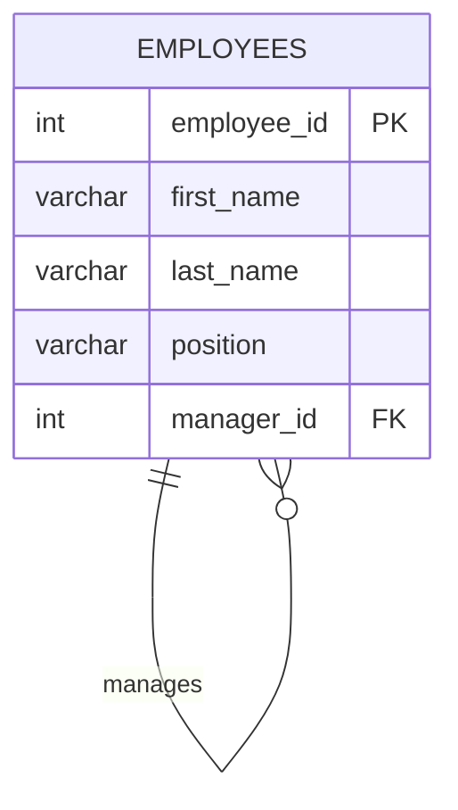
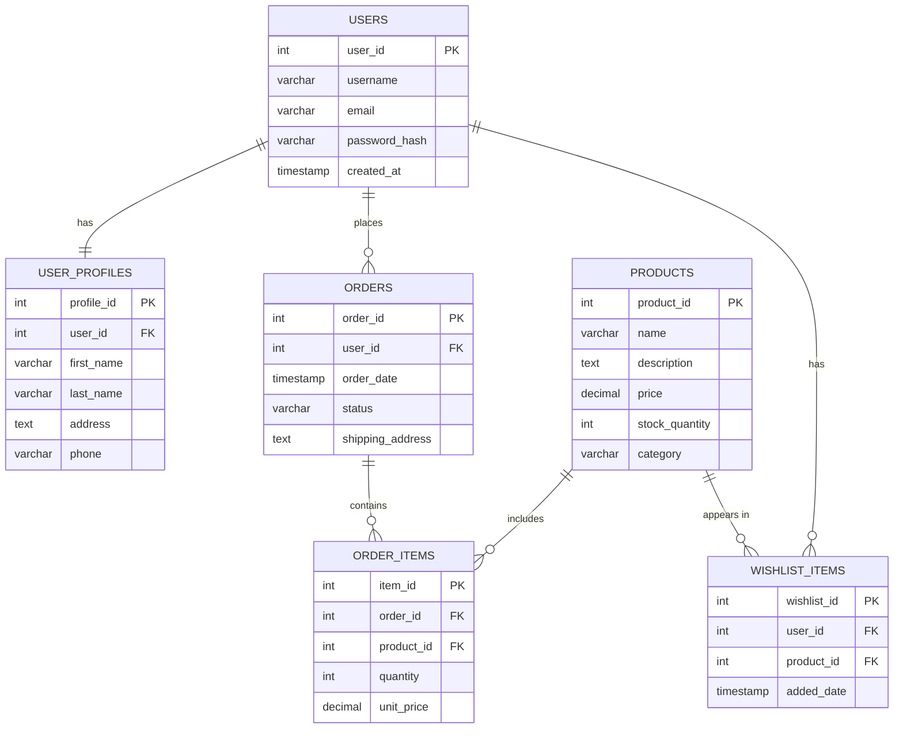

# SQL Entity Relationships

## Introduction

When designing databases, understanding how different data entities relate to each other is fundamental. Entity relationships define how tables in a database connect to each other, establishing the structure of your data model. This concept is central to creating efficient, normalized databases that accurately represent real-world data interactions.

In this guide, we'll explore the different types of entity relationships in SQL databases, how to implement them, and their practical applications. By the end, you'll be able to identify and create appropriate relationships for your database designs.

## What Are Entity Relationships?

Entity relationships describe how different entities (tables) in a database relate to each other. These relationships are implemented using primary and foreign keys, which create references between tables. Understanding these relationships is crucial for:

- Organizing data efficiently
- Preventing data redundancy
- Maintaining data integrity
- Enabling complex queries across related data

## Types of Entity Relationships

There are three primary types of relationships between entities in a database:

1. One-to-One (1:1)
2. One-to-Many (1:N)
3. Many-to-Many (N:M)

Let's explore each type in detail.

### One-to-One (1:1) Relationships

In a one-to-one relationship, each record in the first table is related to exactly one record in the second table, and vice versa.

#### Example Scenario

Consider a database for a company where each employee has at most one company-issued laptop. We can represent this using two tables: `employees` and `laptops`.

#### Implementation

```sql
-- Create employees table
CREATE TABLE employees (
    employee_id INT PRIMARY KEY,
    first_name VARCHAR(50),
    last_name VARCHAR(50),
    department VARCHAR(50)
);

-- Create laptops table with a one-to-one relationship to employees
CREATE TABLE laptops (
    serial_number VARCHAR(50) PRIMARY KEY,
    model VARCHAR(50),
    purchase_date DATE,
    employee_id INT UNIQUE,
    FOREIGN KEY (employee_id) REFERENCES employees(employee_id)
);
```

In this example, the `UNIQUE` constraint on `employee_id` in the `laptops` table ensures that each employee can be associated with at most one laptop.

#### Diagram



#### When to Use

One-to-one relationships are less common but useful when:
- You want to split a table with many columns
- Some fields are optional or apply only to certain records
- You need to isolate part of a table for security reasons
- You're storing large data objects that aren't always needed

### One-to-Many (1:N) Relationships

In a one-to-many relationship, each record in the first table can be related to multiple records in the second table, but each record in the second table is related to only one record in the first table.

#### Example Scenario

A typical example is the relationship between `customers` and `orders`. One customer can place many orders, but each order belongs to exactly one customer.

#### Implementation

```sql
-- Create customers table
CREATE TABLE customers (
    customer_id INT PRIMARY KEY,
    first_name VARCHAR(50),
    last_name VARCHAR(50),
    email VARCHAR(100) UNIQUE,
    phone VARCHAR(20)
);

-- Create orders table with a one-to-many relationship to customers
CREATE TABLE orders (
    order_id INT PRIMARY KEY,
    order_date DATE,
    total_amount DECIMAL(10, 2),
    customer_id INT,
    FOREIGN KEY (customer_id) REFERENCES customers(customer_id)
);
```

In this example, the `customer_id` foreign key in the `orders` table creates a relationship back to the `customers` table.

#### Diagram



#### Querying Related Data

To retrieve all orders for a specific customer:

```sql
SELECT 
    c.customer_id,
    c.first_name,
    c.last_name,
    o.order_id,
    o.order_date,
    o.total_amount
FROM 
    customers c
JOIN 
    orders o ON c.customer_id = o.customer_id
WHERE 
    c.customer_id = 101;
```

#### When to Use

One-to-many relationships are the most common type in database design. Use them when:
- A parent record can have multiple related child records
- The child entity depends on the parent entity
- You want to enforce referential integrity

### Many-to-Many (N:M) Relationships

In a many-to-many relationship, each record in the first table can relate to multiple records in the second table, and vice versa.

#### Example Scenario

Consider a database for a school where students can enroll in multiple courses, and each course can have multiple students.

#### Implementation

Many-to-many relationships require a junction (or bridge) table that contains foreign keys to both related tables:

```sql
-- Create students table
CREATE TABLE students (
    student_id INT PRIMARY KEY,
    first_name VARCHAR(50),
    last_name VARCHAR(50),
    email VARCHAR(100) UNIQUE
);

-- Create courses table
CREATE TABLE courses (
    course_id INT PRIMARY KEY,
    course_name VARCHAR(100),
    department VARCHAR(50),
    credits INT
);

-- Create enrollments junction table for the many-to-many relationship
CREATE TABLE enrollments (
    enrollment_id INT PRIMARY KEY,
    student_id INT,
    course_id INT,
    enrollment_date DATE,
    grade VARCHAR(2),
    FOREIGN KEY (student_id) REFERENCES students(student_id),
    FOREIGN KEY (course_id) REFERENCES courses(course_id),
    -- Ensure a student can't enroll in the same course twice
    UNIQUE (student_id, course_id)
);
```

The `enrollments` table serves as the junction table that connects students and courses, creating a many-to-many relationship.

#### Diagram



#### Querying Related Data

To find all courses a student is enrolled in:

```sql
SELECT 
    s.student_id,
    s.first_name,
    s.last_name,
    c.course_id,
    c.course_name,
    e.enrollment_date,
    e.grade
FROM 
    students s
JOIN 
    enrollments e ON s.student_id = e.student_id
JOIN 
    courses c ON e.course_id = c.course_id
WHERE 
    s.student_id = 1001;
```

#### When to Use

Many-to-many relationships are used when:
- Records in both tables can relate to multiple records in the other table
- You need to store additional information about the relationship itself
- You want to enforce complex constraints between related entities

## Implementing Relationships with Foreign Keys

All SQL relationship types rely on foreign keys. A foreign key is a column or set of columns in one table that references the primary key of another table.

### Foreign Key Constraints

When defining foreign keys, you can specify constraints that determine how the database behaves when related records are updated or deleted:

- `ON DELETE CASCADE`: When a parent record is deleted, all related child records are also deleted
- `ON DELETE SET NULL`: When a parent record is deleted, the foreign key in child records is set to NULL
- `ON DELETE NO ACTION` (default): Prevents deletion of a parent record if child records exist
- `ON UPDATE CASCADE`: When a parent key is updated, the change is propagated to related foreign keys

Example with constraints:

```sql
CREATE TABLE orders (
    order_id INT PRIMARY KEY,
    order_date DATE,
    total_amount DECIMAL(10, 2),
    customer_id INT,
    FOREIGN KEY (customer_id) 
        REFERENCES customers(customer_id)
        ON DELETE SET NULL
        ON UPDATE CASCADE
);
```

## Self-Referencing Relationships

Sometimes an entity may have a relationship with itself. For example, in an employees table, each employee might have a manager who is also an employee.

```sql
CREATE TABLE employees (
    employee_id INT PRIMARY KEY,
    first_name VARCHAR(50),
    last_name VARCHAR(50),
    position VARCHAR(50),
    manager_id INT,
    FOREIGN KEY (manager_id) REFERENCES employees(employee_id)
);
```

This creates a self-referencing relationship where `manager_id` points to another record in the same table.

## Diagram



## Real-World Application: E-Commerce Database

Let's design a simplified e-commerce database schema showing multiple relationship types:

```sql
-- Users table
CREATE TABLE users (
    user_id INT PRIMARY KEY,
    username VARCHAR(50) UNIQUE,
    email VARCHAR(100) UNIQUE,
    password_hash VARCHAR(255),
    created_at TIMESTAMP DEFAULT CURRENT_TIMESTAMP
);

-- User profiles (one-to-one with users)
CREATE TABLE user_profiles (
    profile_id INT PRIMARY KEY,
    user_id INT UNIQUE,
    first_name VARCHAR(50),
    last_name VARCHAR(50),
    address TEXT,
    phone VARCHAR(20),
    FOREIGN KEY (user_id) REFERENCES users(user_id) ON DELETE CASCADE
);

-- Products table
CREATE TABLE products (
    product_id INT PRIMARY KEY,
    name VARCHAR(100),
    description TEXT,
    price DECIMAL(10, 2),
    stock_quantity INT,
    category VARCHAR(50)
);

-- Orders table (one-to-many with users)
CREATE TABLE orders (
    order_id INT PRIMARY KEY,
    user_id INT,
    order_date TIMESTAMP DEFAULT CURRENT_TIMESTAMP,
    status VARCHAR(20),
    shipping_address TEXT,
    FOREIGN KEY (user_id) REFERENCES users(user_id)
);

-- Order items (junction table for many-to-many between orders and products)
CREATE TABLE order_items (
    item_id INT PRIMARY KEY,
    order_id INT,
    product_id INT,
    quantity INT,
    unit_price DECIMAL(10, 2),
    FOREIGN KEY (order_id) REFERENCES orders(order_id) ON DELETE CASCADE,
    FOREIGN KEY (product_id) REFERENCES products(product_id)
);

-- Wishlist (many-to-many between users and products)
CREATE TABLE wishlist_items (
    wishlist_id INT PRIMARY KEY,
    user_id INT,
    product_id INT,
    added_date TIMESTAMP DEFAULT CURRENT_TIMESTAMP,
    FOREIGN KEY (user_id) REFERENCES users(user_id) ON DELETE CASCADE,
    FOREIGN KEY (product_id) REFERENCES products(product_id) ON DELETE CASCADE,
    UNIQUE (user_id, product_id)
);
```

### Diagram



This e-commerce database demonstrates:
- One-to-one relationship between users and user profiles
- One-to-many relationship between users and orders
- Many-to-many relationship between orders and products (via order_items)
- Many-to-many relationship between users and products (via wishlist_items)

## Best Practices for Entity Relationships

1. **Follow normalization principles** to minimize data redundancy
2. **Choose appropriate primary keys** (consider using surrogate keys like auto-incrementing integers)
3. **Define proper constraints** to maintain data integrity
4. **Use indexes** on foreign key columns to improve join performance
5. **Document your relationships** with entity-relationship diagrams
6. **Consider the impact of constraints** on insert, update, and delete operations
7. **Use junction tables** for many-to-many relationships with meaningful attributes
8. **Name your tables and columns consistently** to make relationships clear

## Common Issues and Their Solutions

### Orphaned Records

Problem: Child records exist without a parent record.
Solution: Use foreign key constraints and proper cascading rules.

### Redundant Relationships

Problem: Creating direct relationships when there's already an indirect path.
Solution: Carefully analyze your data model to avoid unnecessary relationships.

### Performance Issues with Joins

Problem: Complex joins across many relationships slowing down queries.
Solution: Index foreign keys, denormalize when appropriate, and optimize query patterns.

## Summary

Entity relationships are the foundation of relational database design. By understanding the different types of relationships (one-to-one, one-to-many, and many-to-many) and how to implement them using primary and foreign keys, you can create database schemas that accurately represent real-world data relationships.

When designing your database:
1. Identify the entities in your domain
2. Determine how they relate to each other
3. Choose the appropriate relationship types
4. Implement them using primary and foreign keys
5. Add constraints to maintain data integrity

By following these principles, you'll create databases that are efficient, maintainable, and accurately reflect your data model.

## Exercises

1. Design a database schema for a library system with entities for books, authors, patrons, and loans. Identify and implement the appropriate relationships.

2. Modify the e-commerce example to add a product reviews system. What tables would you create, and what relationships would they have?

3. Create a self-referencing relationship for a family tree database where each person can have two parents and multiple children.

4. Design a database for a social media platform where users can follow other users, create posts, and like/comment on posts.

## Additional Resources

- [Database Normalization Explained](https://www.essentialsql.com/get-ready-to-learn-sql-database-normalization-explained-in-simple-english/)
- [Understanding SQL Foreign Keys](https://www.sqlshack.com/understanding-sql-server-foreign-keys/)
- [Entity-Relationship Modeling](https://www.lucidchart.com/pages/er-diagrams)
- [SQL Indexing Best Practices](https://use-the-index-luke.com/)
- [SQL Antipatterns by Bill Karwin](https://pragprog.com/titles/bksqla/sql-antipatterns/) - A book about common database design mistakes