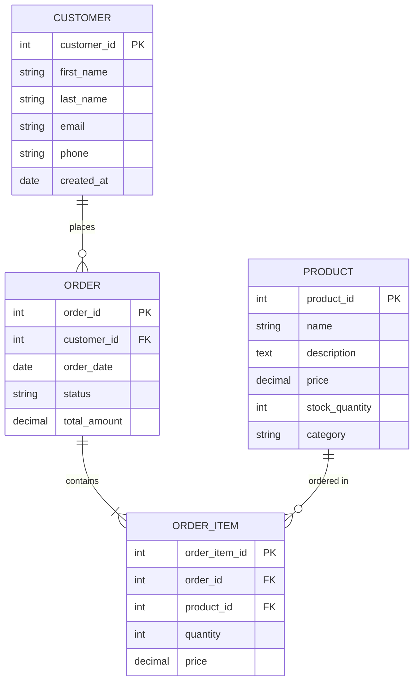

# SQL Database Schemas

## Introduction

A database schema is the blueprint of a database—it defines the structure, organization, and relationships between tables in your database. Think of it as the architectural plan that outlines how your data will be stored and accessed. In SQL databases, schemas help maintain data integrity, improve security, and organize database objects logically.

In this tutorial, we'll explore what database schemas are, why they're important, and how to create and manage them effectively. By the end, you'll understand how schemas fit into your overall database design strategy.

## What is a Database Schema?

A database schema consists of:

1. **Tables** - The structures that hold your data
2. **Fields/Columns** - The specific attributes in each table
3. **Data types** - The kind of data each field can store
4. **Primary and foreign keys** - Fields that establish relationships between tables
5. **Constraints** - Rules that maintain data integrity
6. **Indexes** - Structures that improve query performance

Schemas can be represented visually through entity-relationship diagrams (ERDs) or described textually using SQL Data Definition Language (DDL) statements.

## Types of Database Schemas

In SQL databases, we commonly work with three types of schemas:

### 1. Physical Schema

The physical schema describes how data is stored physically on the storage system, including file structures, indexes, and access methods. Database administrators (DBAs) typically manage this level.

### 2. Logical Schema

The logical schema focuses on the tables, views, relationships, and constraints. This is what developers most commonly work with when designing database applications.

### 3. View Schema

The view schema defines what different users can see and access within the database. It's a crucial component for implementing security measures.

## Creating a Schema in SQL

Different database systems have slightly different syntax for creating schemas. Here are examples for some popular database systems:

### MySQL

In MySQL, a schema is essentially synonymous with a database:

```sql
-- Create a new schema (database)
CREATE DATABASE bookstore;

-- Use the schema
USE bookstore;

-- Create a table within the schema
CREATE TABLE books (
    book_id INT PRIMARY KEY AUTO_INCREMENT,
    title VARCHAR(100) NOT NULL,
    author VARCHAR(50) NOT NULL,
    publication_year INT,
    price DECIMAL(6,2)
);
```

### PostgreSQL

PostgreSQL supports explicit schema creation within databases:

```sql
-- Create a new schema
CREATE SCHEMA bookstore;

-- Create a table within the schema
CREATE TABLE bookstore.books (
    book_id SERIAL PRIMARY KEY,
    title VARCHAR(100) NOT NULL,
    author VARCHAR(50) NOT NULL,
    publication_year INT,
    price DECIMAL(6,2)
);
```

### SQL Server

SQL Server also supports explicit schema creation:

```sql
-- Create a new schema
CREATE SCHEMA bookstore;
GO

-- Create a table within the schema
CREATE TABLE bookstore.books (
    book_id INT PRIMARY KEY IDENTITY(1,1),
    title NVARCHAR(100) NOT NULL,
    author NVARCHAR(50) NOT NULL,
    publication_year INT,
    price DECIMAL(6,2)
);
```

## Schema Design Best Practices

When designing your database schema, follow these best practices:

### 1. Normalize Your Data

Normalize your database to eliminate redundancy and improve data integrity. While there are formal normalization forms (1NF, 2NF, 3NF, etc.), here are some practical guidelines:

- Each table should represent one entity or concept
- Break down complex attributes into simpler ones
- Avoid storing calculated data that can be derived from other fields
- Use foreign keys to establish relationships between tables

### 2. Use Appropriate Data Types

Choose the most appropriate data type for each column:

```sql
CREATE TABLE products (
    product_id INT PRIMARY KEY AUTO_INCREMENT,
    name VARCHAR(100) NOT NULL,
    description TEXT,
    price DECIMAL(10,2) NOT NULL,  -- Precise for currency
    weight FLOAT,                  -- Approximate for physical measurements
    created_at TIMESTAMP DEFAULT CURRENT_TIMESTAMP,
    is_available BOOLEAN DEFAULT TRUE
);
```

### 3. Implement Constraints

Use constraints to maintain data integrity:

```sql
CREATE TABLE orders (
    order_id INT PRIMARY KEY AUTO_INCREMENT,
    customer_id INT NOT NULL,
    order_date DATE NOT NULL DEFAULT CURRENT_DATE,
    status VARCHAR(20) CHECK (status IN ('pending', 'shipped', 'delivered', 'cancelled')),
    total DECIMAL(10,2) NOT NULL CHECK (total >= 0),
    FOREIGN KEY (customer_id) REFERENCES customers(customer_id)
        ON UPDATE CASCADE
        ON DELETE RESTRICT
);
```

### 4. Use Naming Conventions

Adopt consistent naming conventions:

- Use singular nouns for table names (e.g., `customer` not `customers`)
- Use snake_case or camelCase consistently
- Prefix primary keys with the table name (e.g., `customer_id`)
- Be descriptive with names (e.g., `first_name` not just `name`)

## Real-World Example: E-commerce Database Schema

Let's design a simplified schema for an e-commerce application:



The corresponding SQL to create this schema would be:

```sql
-- Create database/schema
CREATE DATABASE ecommerce;
USE ecommerce;

-- Create tables
CREATE TABLE customer (
    customer_id INT PRIMARY KEY AUTO_INCREMENT,
    first_name VARCHAR(50) NOT NULL,
    last_name VARCHAR(50) NOT NULL,
    email VARCHAR(100) UNIQUE NOT NULL,
    phone VARCHAR(15),
    created_at TIMESTAMP DEFAULT CURRENT_TIMESTAMP
);

CREATE TABLE product (
    product_id INT PRIMARY KEY AUTO_INCREMENT,
    name VARCHAR(100) NOT NULL,
    description TEXT,
    price DECIMAL(10,2) NOT NULL CHECK (price >= 0),
    stock_quantity INT NOT NULL DEFAULT 0 CHECK (stock_quantity >= 0),
    category VARCHAR(50)
);

CREATE TABLE order_table (  -- Using order_table since 'order' is often a reserved word
    order_id INT PRIMARY KEY AUTO_INCREMENT,
    customer_id INT NOT NULL,
    order_date TIMESTAMP DEFAULT CURRENT_TIMESTAMP,
    status VARCHAR(20) NOT NULL DEFAULT 'pending' 
        CHECK (status IN ('pending', 'processing', 'shipped', 'delivered', 'cancelled')),
    total_amount DECIMAL(10,2) NOT NULL DEFAULT 0 CHECK (total_amount >= 0),
    FOREIGN KEY (customer_id) REFERENCES customer(customer_id)
        ON UPDATE CASCADE
        ON DELETE RESTRICT
);

CREATE TABLE order_item (
    order_item_id INT PRIMARY KEY AUTO_INCREMENT,
    order_id INT NOT NULL,
    product_id INT NOT NULL,
    quantity INT NOT NULL CHECK (quantity > 0),
    price DECIMAL(10,2) NOT NULL CHECK (price >= 0),
    FOREIGN KEY (order_id) REFERENCES order_table(order_id)
        ON UPDATE CASCADE
        ON DELETE CASCADE,
    FOREIGN KEY (product_id) REFERENCES product(product_id)
        ON UPDATE CASCADE
        ON DELETE RESTRICT
);
```

## Managing Schemas

As your application evolves, you'll need to modify your schema. Here are some common operations:

### Altering Tables

```sql
-- Add a new column
ALTER TABLE customer ADD address VARCHAR(200);

-- Modify a column's data type
ALTER TABLE product MODIFY name VARCHAR(150) NOT NULL;

-- Add a constraint
ALTER TABLE order_item ADD CONSTRAINT unique_order_product 
    UNIQUE (order_id, product_id);
```

### Dropping Schema Objects

```sql
-- Drop a table
DROP TABLE order_item;

-- Drop a schema/database
DROP DATABASE ecommerce;
```

### Creating Indexes

Indexes improve query performance but add overhead to data modifications:

```sql
-- Create an index on frequently queried columns
CREATE INDEX idx_product_category ON product(category);

-- Create a unique index
CREATE UNIQUE INDEX idx_customer_email ON customer(email);
```

## Schema Documentation

Documenting your schema is crucial for maintainability. Here's a simple template:

```
Table: [table_name]
Description: [what this table represents]
Primary Key: [primary key column(s)]
Foreign Keys:
- [column_name] references [table_name]([column_name])

Columns:
- [column_name]: [data type] [constraints] - [description]
...
```

Several tools can generate documentation automatically from your database, such as SchemaSpy, MySQL Workbench, and pgAdmin.

## Summary

Database schemas are fundamental building blocks in SQL database design. A well-designed schema:

- Organizes data logically
- Enforces data integrity through constraints
- Establishes clear relationships between entities
- Improves performance through proper indexing
- Enhances security by controlling access

When designing schemas, remember to normalize your data, use appropriate data types, implement constraints, and follow consistent naming conventions. As your application grows, you'll need to evolve your schema carefully to ensure data integrity.

## Exercises

1. Design a schema for a blog application with users, posts, comments, and categories.
2. Create the SQL statements to implement your blog schema.
3. Write queries to answer these questions:
   - List all posts by a specific user
   - Find the most commented post
   - Get all posts in a specific category

## Additional Resources

- [Database Design for Mere Mortals](https://www.pearson.com/us/higher-education/program/Hernandez-Database-Design-for-Mere-Mortals-A-Hands-On-Guide-to-Relational-Database-Design-3rd-Edition/PGM334619.html) by Michael J. Hernandez
- [SQL Antipatterns](https://pragprog.com/titles/bksqla/sql-antipatterns/) by Bill Karwin
- [PostgreSQL Documentation on Schemas](https://www.postgresql.org/docs/current/ddl-schemas.html)
- [MySQL Documentation on Database Design](https://dev.mysql.com/doc/refman/8.0/en/database-design.html)