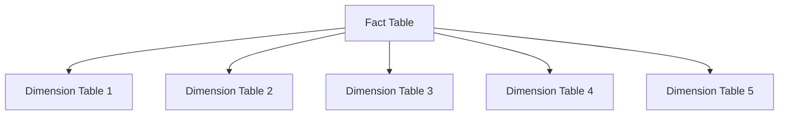
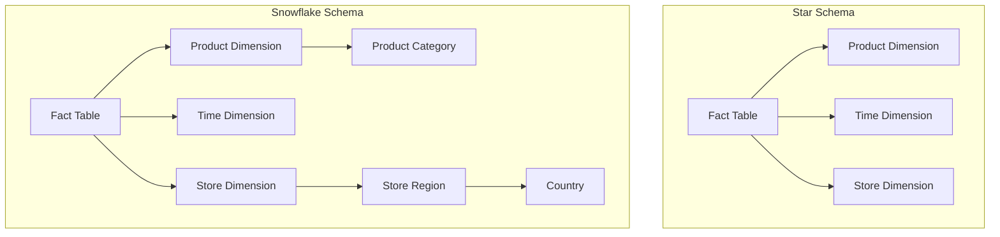

# SQL Star Schema

## Introduction

A star schema is a specialized database design pattern widely used in data warehousing. Named for its star-like structure when visualized, this design organizes data into a central fact table surrounded by dimension tables. The star schema is particularly valuable for data analysis, reporting, and business intelligence applications due to its simplicity and query performance.

In this article, we'll explore what a star schema is, why it's used, its key components, how to implement it, and practical examples to help solidify your understanding.

## What is a Star Schema?

A star schema is a relational database design that consists of:

1. A central **fact table** containing business measurements or metrics
2. Multiple **dimension tables** connected to the fact table via foreign keys

When visualized, the fact table sits in the center with dimension tables radiating outward like points of a star, hence the name "star schema."



## Key Components of a Star Schema

### Fact Table

The fact table is the primary table in a star schema that contains:

- **Business metrics** (also called measures or facts) such as sales amount, quantity sold, or profit
- **Foreign keys** to dimension tables that provide context for the metrics
- Few or no textual descriptions (those belong in dimension tables)

Fact tables tend to be long (many rows) but narrow (fewer columns).

### Dimension Tables

Dimension tables provide the context for the facts and contain:

- A **primary key** that connects to the fact table
- **Descriptive attributes** related to the dimension
- Typically denormalized (not in higher normal forms)

Dimension tables are usually wide (many columns) but short (fewer rows compared to fact tables).

Common dimension types include:
- Time dimensions (date, month, quarter, year)
- Product dimensions (product ID, name, category)
- Customer dimensions (customer ID, name, demographics)
- Location dimensions (store, city, region, country)

## Why Use a Star Schema?

Star schemas offer several advantages:

1. **Simplified queries**: Joins are straightforward, typically involving the fact table and a few dimension tables
2. **Improved performance**: Optimized for read-heavy analytical workloads
3. **Intuitive structure**: Business users can understand the model more easily
4. **Predictable query response times**: Consistent performance for reporting
5. **Compatibility with BI tools**: Most business intelligence tools are designed to work well with star schemas

## Example: Retail Sales Star Schema

Let's create a practical example of a star schema for a retail business tracking sales.

### Creating the Dimension Tables

First, let's create our dimension tables:

```sql
-- Time Dimension
CREATE TABLE dim_time (
    time_key INT PRIMARY KEY,
    date DATE NOT NULL,
    day_of_week VARCHAR(10),
    day_of_month INT,
    month INT,
    month_name VARCHAR(10),
    quarter INT,
    year INT
);

-- Product Dimension
CREATE TABLE dim_product (
    product_key INT PRIMARY KEY,
    product_id VARCHAR(20) NOT NULL,
    product_name VARCHAR(100),
    description TEXT,
    category VARCHAR(50),
    subcategory VARCHAR(50),
    brand VARCHAR(50),
    unit_price DECIMAL(10,2),
    unit_cost DECIMAL(10,2)
);

-- Store Dimension
CREATE TABLE dim_store (
    store_key INT PRIMARY KEY,
    store_id VARCHAR(20) NOT NULL,
    store_name VARCHAR(100),
    address VARCHAR(255),
    city VARCHAR(50),
    state VARCHAR(50),
    country VARCHAR(50),
    postal_code VARCHAR(20),
    manager VARCHAR(100),
    open_date DATE
);

-- Customer Dimension
CREATE TABLE dim_customer (
    customer_key INT PRIMARY KEY,
    customer_id VARCHAR(20) NOT NULL,
    first_name VARCHAR(50),
    last_name VARCHAR(50),
    email VARCHAR(100),
    phone VARCHAR(20),
    address VARCHAR(255),
    city VARCHAR(50),
    state VARCHAR(50),
    country VARCHAR(50),
    postal_code VARCHAR(20),
    loyalty_segment VARCHAR(20)
);
```

### Creating the Fact Table

Now, let's create our fact table that links to all dimension tables:

```sql
CREATE TABLE fact_sales (
    sale_key INT PRIMARY KEY,
    time_key INT,
    product_key INT,
    store_key INT,
    customer_key INT,
    quantity INT,
    unit_price DECIMAL(10,2),
    discount_amount DECIMAL(10,2),
    sales_amount DECIMAL(10,2),
    profit DECIMAL(10,2),
    FOREIGN KEY (time_key) REFERENCES dim_time(time_key),
    FOREIGN KEY (product_key) REFERENCES dim_product(product_key),
    FOREIGN KEY (store_key) REFERENCES dim_store(store_key),
    FOREIGN KEY (customer_key) REFERENCES dim_customer(customer_key)
);
```

### Populating with Sample Data

Here's how we might populate our dimension tables with sample data:

```sql
-- Insert sample data into dim_time
INSERT INTO dim_time VALUES 
(1, '2023-01-01', 'Sunday', 1, 1, 'January', 1, 2023),
(2, '2023-01-02', 'Monday', 2, 1, 'January', 1, 2023),
(3, '2023-01-03', 'Tuesday', 3, 1, 'January', 1, 2023);

-- Insert sample data into dim_product
INSERT INTO dim_product VALUES
(1, 'P001', 'Basic T-Shirt', 'Cotton T-shirt', 'Clothing', 'Shirts', 'BrandA', 19.99, 8.50),
(2, 'P002', 'Designer Jeans', 'Slim fit jeans', 'Clothing', 'Pants', 'BrandB', 59.99, 25.00),
(3, 'P003', 'Wireless Headphones', 'Bluetooth headphones', 'Electronics', 'Audio', 'BrandC', 89.99, 45.00);

-- Insert sample data into dim_store
INSERT INTO dim_store VALUES
(1, 'S001', 'Downtown Store', '123 Main St', 'Chicago', 'IL', 'USA', '60601', 'John Smith', '2020-01-15'),
(2, 'S002', 'Mall Location', '456 Market Ave', 'New York', 'NY', 'USA', '10001', 'Jane Doe', '2019-06-20');

-- Insert sample data into dim_customer
INSERT INTO dim_customer VALUES
(1, 'C001', 'Michael', 'Johnson', 'michael.j@email.com', '555-123-4567', '789 Oak Dr', 'Chicago', 'IL', 'USA', '60607', 'Gold'),
(2, 'C002', 'Emily', 'Williams', 'emily.w@email.com', '555-987-6543', '321 Pine St', 'Boston', 'MA', 'USA', '02108', 'Silver');
```

And then our fact table:

```sql
-- Insert sample data into fact_sales
INSERT INTO fact_sales VALUES
(1, 1, 1, 1, 1, 2, 19.99, 0.00, 39.98, 22.98),
(2, 1, 3, 1, 1, 1, 89.99, 10.00, 79.99, 34.99),
(3, 2, 2, 2, 2, 1, 59.99, 5.00, 54.99, 29.99),
(4, 3, 1, 2, 2, 3, 19.99, 5.00, 54.97, 29.47);
```

## Querying a Star Schema

One of the main benefits of a star schema is how straightforward queries become. Let's see some examples:

### Example 1: Total Sales by Product Category

```sql
SELECT 
    p.category,
    SUM(f.sales_amount) as total_sales
FROM 
    fact_sales f
JOIN 
    dim_product p ON f.product_key = p.product_key
GROUP BY 
    p.category
ORDER BY 
    total_sales DESC;
```

Output:
```
+------------+-------------+
| category   | total_sales |
+------------+-------------+
| Electronics| 79.99       |
| Clothing   | 94.95       |
+------------+-------------+
```

### Example 2: Sales Analysis by Time, Store, and Product

```sql
SELECT 
    t.month_name,
    t.year,
    s.store_name,
    p.product_name,
    SUM(f.quantity) as units_sold,
    SUM(f.sales_amount) as total_sales,
    SUM(f.profit) as total_profit
FROM 
    fact_sales f
JOIN 
    dim_time t ON f.time_key = t.time_key
JOIN 
    dim_store s ON f.store_key = s.store_key
JOIN 
    dim_product p ON f.product_key = p.product_key
GROUP BY 
    t.month_name, t.year, s.store_name, p.product_name
ORDER BY 
    t.year, t.month, s.store_name, total_sales DESC;
```

Output:
```
+-----------+------+---------------+--------------------+------------+-------------+--------------+
| month_name| year | store_name    | product_name       | units_sold | total_sales | total_profit |
+-----------+------+---------------+--------------------+------------+-------------+--------------+
| January   | 2023 | Downtown Store| Wireless Headphones| 1          | 79.99       | 34.99        |
| January   | 2023 | Downtown Store| Basic T-Shirt      | 2          | 39.98       | 22.98        |
| January   | 2023 | Mall Location | Designer Jeans     | 1          | 54.99       | 29.99        |
| January   | 2023 | Mall Location | Basic T-Shirt      | 3          | 54.97       | 29.47        |
+-----------+------+---------------+--------------------+------------+-------------+--------------+
```

## Designing an Effective Star Schema

When designing your own star schema, follow these best practices:

1. **Identify the business process** you want to analyze (sales, inventory, customer service)
2. **Determine the grain** of your fact table (the level of detail for each row)
3. **Identify your dimensions** (who, what, when, where, why)
4. **Identify your facts** (metrics you want to analyze)
5. **Create surrogate keys** for dimension tables 
6. **Denormalize your dimensions** for simplified querying

## Star Schema vs. Snowflake Schema

A variation of the star schema is the snowflake schema, where dimension tables are normalized into multiple related tables. Here's a quick comparison:



| Star Schema | Snowflake Schema |
|-------------|------------------|
| Denormalized dimensions | Normalized dimensions |
| Simpler queries | More complex queries |
| More storage space | Less storage space |
| Better query performance | Slower query performance |
| Easier for business users | More complex for business users |

## Practical Use Cases

Star schemas are particularly useful for:

1. **Sales Analysis**: Track sales performance across products, regions, and time
2. **Financial Reporting**: Analyze financial metrics across different dimensions
3. **Inventory Management**: Monitor stock levels and movements
4. **Marketing Campaign Analysis**: Evaluate campaign performance across channels and customer segments
5. **Website Analytics**: Analyze user behavior across different pages and user types

## Summary

The star schema is a powerful database design pattern for analytical processing and data warehousing. Its simple structure—a central fact table connected to dimensional tables—makes it easy to understand and efficient for complex queries. 

Key takeaways:
- Fact tables store metrics and measurements
- Dimension tables provide context and descriptive attributes
- Star schemas optimize read performance for analytical queries
- They're simpler to understand than normalized schemas
- They're ideal for business intelligence and reporting applications

By understanding and implementing star schemas, you can create efficient data warehouses that allow for fast and flexible analysis of your business data.

## Additional Resources and Exercises

### Resources for Further Learning

1. "The Data Warehouse Toolkit" by Ralph Kimball (the pioneer of dimensional modeling)
2. Online database design courses on platforms like Coursera, Udemy, or edX
3. Your database vendor's documentation on data warehousing best practices

### Exercises

1. **Design a Star Schema**: Create a star schema for tracking student performance in a university with dimensions for students, courses, professors, and time.

2. **Implement and Query**: Using the sample code provided, implement the retail star schema in your own database and write queries to answer:
   - Which product category is most profitable?
   - Which store has the highest sales in January?
   - What's the sales trend by day of week?

3. **Extend the Schema**: Add a payment method dimension to the retail example and modify the fact table to include this dimension.

4. **Compare Approaches**: Take a normalized OLTP database design and convert it to a star schema. Compare the query complexity for analytical questions using both designs.