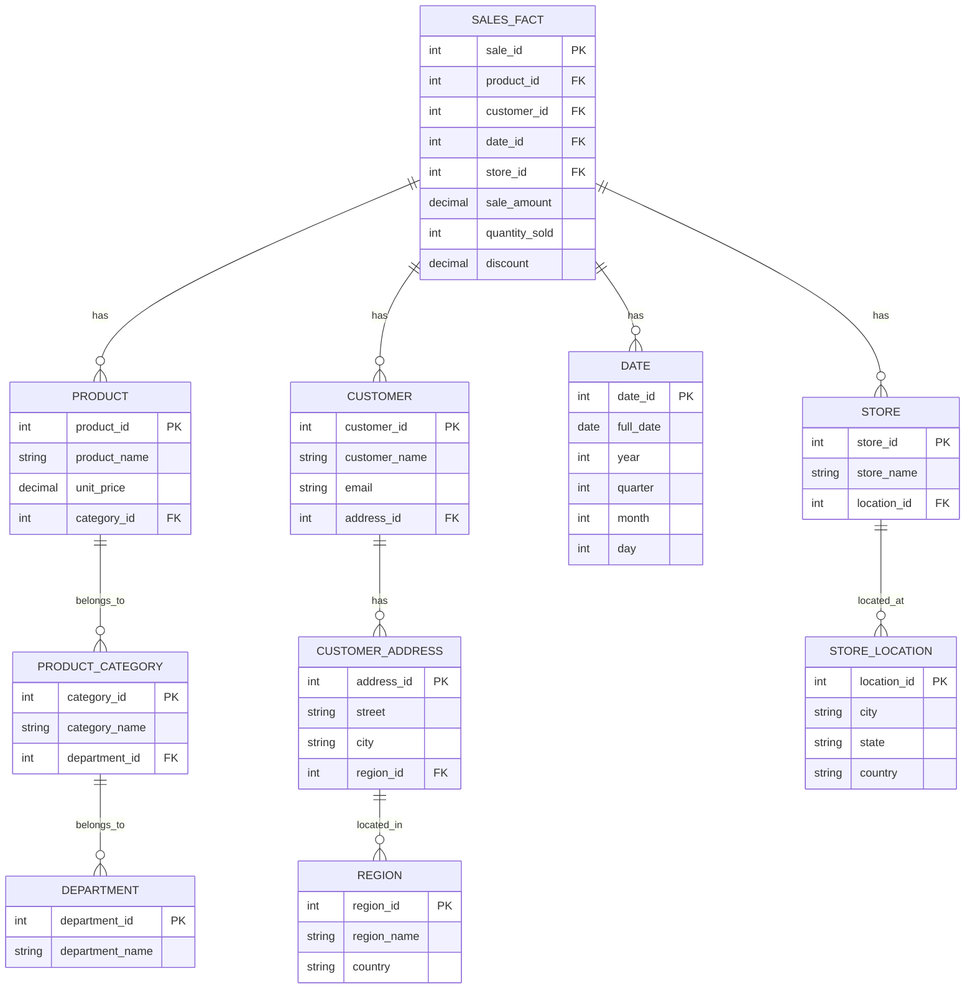

# SQL Snowflake Schema

## Introduction

A Snowflake Schema is an important database design pattern commonly used in data warehousing. It's called a "snowflake" because when visualized, the diagram resembles a snowflake with a central fact table connected to dimension tables, which are further connected to other dimension tables.

If you're building a data warehouse or working with business intelligence systems, understanding the Snowflake Schema will help you organize complex data in a way that's optimized for analytical queries while maintaining data integrity.

## What is a Snowflake Schema?

A Snowflake Schema is a logical arrangement of tables in a relational database where:

1. A central **fact table** contains business measurements or metrics (like sales quantities, amounts, etc.)
2. The fact table connects to multiple **dimension tables** (like Product, Customer, Date)
3. These dimension tables are **normalized** (broken down into multiple related tables)

This creates a structure where dimension tables branch out from the fact table, and those dimension tables may branch out further, creating a snowflake-like appearance.

## Snowflake vs. Star Schema

Before diving deeper, it's important to understand the difference between Snowflake and Star schemas:

- **Star Schema**: Fact table connected directly to denormalized dimension tables (simpler, faster queries)
- **Snowflake Schema**: Fact table connected to normalized dimension tables which connect to other dimension tables (more complex, better data integrity)

## Visualizing a Snowflake Schema

Here's a visual representation of a typical Snowflake Schema for a retail sales database:



In this diagram, you can see how the SALES_FACT table connects to first-level dimension tables (PRODUCT, CUSTOMER, DATE, STORE), and these dimension tables connect to second-level dimension tables (PRODUCT_CATEGORY, CUSTOMER_ADDRESS, STORE_LOCATION), which may connect to third-level dimension tables (DEPARTMENT, REGION).

## Building a Snowflake Schema

Let's walk through creating a simplified Snowflake Schema for a retail business step by step:

### 1. Create the Fact Table

```sql
CREATE TABLE sales_fact (
    sale_id INT PRIMARY KEY,
    product_id INT,
    customer_id INT,
    date_id INT,
    store_id INT,
    sale_amount DECIMAL(10,2),
    quantity_sold INT,
    discount DECIMAL(5,2)
);
```

### 2. Create First-Level Dimension Tables

```sql
-- Product dimension (first level)
CREATE TABLE product (
    product_id INT PRIMARY KEY,
    product_name VARCHAR(100),
    unit_price DECIMAL(10,2),
    category_id INT
);

-- Customer dimension (first level)
CREATE TABLE customer (
    customer_id INT PRIMARY KEY,
    customer_name VARCHAR(100),
    email VARCHAR(100),
    address_id INT
);

-- Date dimension
CREATE TABLE date_dim (
    date_id INT PRIMARY KEY,
    full_date DATE,
    year INT,
    quarter INT,
    month INT,
    day INT
);

-- Store dimension (first level)
CREATE TABLE store (
    store_id INT PRIMARY KEY,
    store_name VARCHAR(100),
    location_id INT
);
```

### 3. Create Second-Level Dimension Tables

```sql
-- Product Category dimension (second level)
CREATE TABLE product_category (
    category_id INT PRIMARY KEY,
    category_name VARCHAR(100),
    department_id INT
);

-- Customer Address dimension (second level)
CREATE TABLE customer_address (
    address_id INT PRIMARY KEY,
    street VARCHAR(200),
    city VARCHAR(100),
    region_id INT
);

-- Store Location dimension (second level)
CREATE TABLE store_location (
    location_id INT PRIMARY KEY,
    city VARCHAR(100),
    state VARCHAR(100),
    country VARCHAR(100)
);
```

### 4. Create Third-Level Dimension Tables

```sql
-- Department dimension (third level)
CREATE TABLE department (
    department_id INT PRIMARY KEY,
    department_name VARCHAR(100)
);

-- Region dimension (third level)
CREATE TABLE region (
    region_id INT PRIMARY KEY,
    region_name VARCHAR(100),
    country VARCHAR(100)
);
```

### 5. Set Up Foreign Key Relationships

```sql
-- Add foreign keys to fact table
ALTER TABLE sales_fact 
ADD CONSTRAINT fk_product FOREIGN KEY (product_id) REFERENCES product(product_id),
ADD CONSTRAINT fk_customer FOREIGN KEY (customer_id) REFERENCES customer(customer_id),
ADD CONSTRAINT fk_date FOREIGN KEY (date_id) REFERENCES date_dim(date_id),
ADD CONSTRAINT fk_store FOREIGN KEY (store_id) REFERENCES store(store_id);

-- Add foreign keys to first-level dimension tables
ALTER TABLE product
ADD CONSTRAINT fk_category FOREIGN KEY (category_id) REFERENCES product_category(category_id);

ALTER TABLE customer
ADD CONSTRAINT fk_address FOREIGN KEY (address_id) REFERENCES customer_address(address_id);

ALTER TABLE store
ADD CONSTRAINT fk_location FOREIGN KEY (location_id) REFERENCES store_location(location_id);

-- Add foreign keys to second-level dimension tables
ALTER TABLE product_category
ADD CONSTRAINT fk_department FOREIGN KEY (department_id) REFERENCES department(department_id);

ALTER TABLE customer_address
ADD CONSTRAINT fk_region FOREIGN KEY (region_id) REFERENCES region(region_id);
```

## Querying a Snowflake Schema

Let's look at some example queries to show how to work with a Snowflake Schema. These demonstrate how you'd need to join multiple tables to get complete information.

### Example 1: Total Sales by Department

```sql
SELECT 
    d.department_name,
    SUM(sf.sale_amount) as total_sales
FROM 
    sales_fact sf
    JOIN product p ON sf.product_id = p.product_id
    JOIN product_category pc ON p.category_id = pc.category_id
    JOIN department d ON pc.department_id = d.department_id
GROUP BY 
    d.department_name
ORDER BY 
    total_sales DESC;
```

**Output example:**
```
| department_name | total_sales  |
|-----------------|--------------|
| Electronics     | 1245789.50   |
| Clothing        | 876543.25    |
| Home Goods      | 567890.75    |
| Groceries       | 345678.90    |
```

### Example 2: Sales by Region and Product Category

```sql
SELECT 
    r.region_name,
    pc.category_name,
    SUM(sf.sale_amount) as total_sales,
    COUNT(sf.sale_id) as num_transactions
FROM 
    sales_fact sf
    JOIN customer c ON sf.customer_id = c.customer_id
    JOIN customer_address ca ON c.address_id = ca.address_id
    JOIN region r ON ca.region_id = r.region_id
    JOIN product p ON sf.product_id = p.product_id
    JOIN product_category pc ON p.category_id = pc.category_id
GROUP BY 
    r.region_name, pc.category_name
ORDER BY 
    r.region_name, total_sales DESC;
```

**Output example:**
```
| region_name  | category_name  | total_sales | num_transactions |
|--------------|----------------|-------------|------------------|
| East         | Smartphones    | 456789.50   | 1234             |
| East         | Laptops        | 345678.90   | 876              |
| East         | T-shirts       | 123456.78   | 543              |
| West         | Televisions    | 567890.25   | 987              |
| West         | Jeans          | 234567.80   | 654              |
| South        | Home Decor     | 178945.60   | 432              |
```

## Advantages of Snowflake Schema

1. **Reduced Data Redundancy**: The normalized structure minimizes duplicate data.
2. **Data Integrity**: The normalized structure enforces data consistency.
3. **Storage Efficiency**: Due to normalization, storage requirements are typically reduced.
4. **Flexibility**: Easier to add new dimension attributes or modify existing ones.
5. **Dimensional Hierarchies**: Explicitly models hierarchical relationships.

## Disadvantages of Snowflake Schema

1. **Query Complexity**: Requires more table joins, increasing query complexity.
2. **Performance Impact**: Multiple joins can slow down query performance.
3. **Maintenance Overhead**: More tables mean more maintenance effort.
4. **ETL Complexity**: Loading data becomes more complex due to multiple related tables.

## When to Use a Snowflake Schema

A Snowflake Schema is particularly beneficial when:

1. **Storage is a concern**: Your database needs to minimize storage requirements.
2. **Dimension hierarchies are complex**: You have deeply nested hierarchical data.
3. **Data consistency is critical**: Your system requires strict data integrity.
4. **Dimensions change frequently**: Your dimensions are volatile and require frequent updates.

However, if query performance is your top priority and you're working with a data warehouse where reporting speed is essential, a Star Schema might be more appropriate.

## Real-World Example: Retail Analytics

A retail company wants to analyze sales patterns across different geographic regions, product categories, and time periods. They have a complex organizational structure with departments, categories, and products, as well as a geographic hierarchy with countries, regions, and cities.

Using a Snowflake Schema allows them to:

1. Maintain detailed hierarchical information about products and locations
2. Generate reports at various levels of granularity (sales by department, category, or specific product)
3. Efficiently update dimension attributes (e.g., when a product changes category)
4. Support complex analytical queries like "What were the Q2 sales of electronics in the Northeast region, broken down by city?"

## Summary

The Snowflake Schema is a powerful database design pattern for data warehousing that normalizes dimension tables to create a structure resembling a snowflake. While it requires more complex queries due to additional joins, it offers benefits in terms of data integrity, storage efficiency, and flexible dimension hierarchies.

When deciding between a Snowflake and Star Schema, consider your specific needs regarding query performance, storage constraints, data integrity, and the complexity of your dimensional hierarchies.

## Exercises

1. Design a Snowflake Schema for a university database that tracks student enrollment in courses. Include dimensions for students, courses, professors, departments, and time.

2. Write a SQL query that would list the total enrollment counts by department and year in your university Snowflake Schema.

3. Convert the retail Snowflake Schema shown in this tutorial into a Star Schema. What tables would you merge? What would be the advantages and disadvantages of this conversion?

4. For a Snowflake Schema with a sales fact table, write a query that would show monthly sales trends by product category and customer region.

## Additional Resources

1. [Kimball Group - Dimensional Modeling Techniques](https://www.kimballgroup.com/data-warehouse-business-intelligence-resources/kimball-techniques/)
2. [Data Warehouse Toolkit](https://www.amazon.com/Data-Warehouse-Toolkit-Definitive-Dimensional/dp/1118530802) by Ralph Kimball and Margy Ross
3. [Snowflake Schema vs. Star Schema](https://www.vertabelo.com/blog/data-warehouse-modeling-star-schema-vs-snowflake-schema/)
4. [Database Design for Analytics](https://www.coursera.org/learn/database-design-and-basic-sql-in-postgresql) (Coursera course)